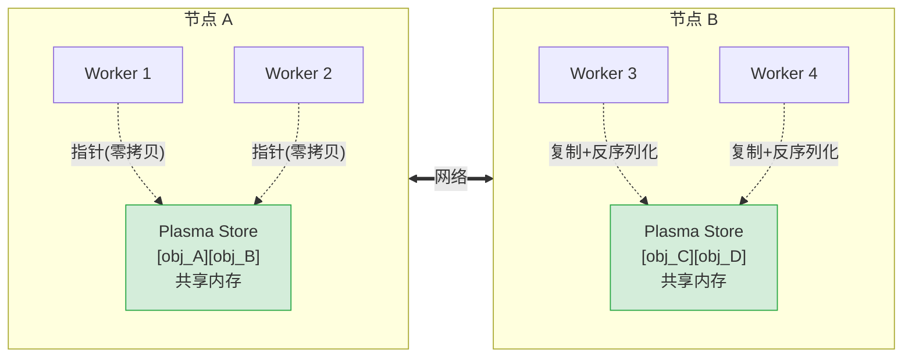

# 远程对象 Object

## 提出问题

Task 和 Actor 解决了**计算**的分布问题。但**数据**呢？Task A 的结果要给 Task B 用，而它们可能在不同机器上。直接用网络传输每次都要序列化/反序列化，效率极低。有没有一种方式让数据"放在那里、大家都能访问"？

## 核心原理

Ray 的第三个核心原语——**Object（远程对象）**——就是一种**不可变的、存储在分布式共享内存中的数据块**。你可以把它理解为：

> **类比**：Object Store 就像是公司的**公告栏**。你把一份文档贴上去（`ray.put()`），所有路过的同事都能看见（`ray.get()`）。不需要给每个人复印一份——大家看的是同一份原件。而且，同一个楼层（节点）的人甚至不需要走动，一伸手就能拿到（零拷贝）。

## 基本用法

### ray.put() — 把数据放到"公告栏"

```python
import ray
import numpy as np
ray.init()

# 本地有一个大数组
big_array = np.random.randn(10000, 10000)  # 约 800MB

# put 到分布式对象存储中
data_ref = ray.put(big_array)

print(data_ref)  # ObjectRef(00ffffffffffffffffffffffffffffffffffffff...)
```

`ray.put()` 做的事情：
1. 把数据序列化
2. 存入本地 Plasma Store（共享内存）
3. 返回一个 **ObjectRef**（可以理解为"取件码"或"URL"）
4. 后续任何 Task/Actor 都可以用这个 ObjectRef 来获取数据

### ray.get() — 通过"取件码"拿数据

```python
# 任何地方（同节点、跨节点）都可以 get
retrieved = ray.get(data_ref)
print(retrieved.shape)  # (10000, 10000)

# 也可以用 list 批量获取
ref1 = ray.put([1, 2, 3])
ref2 = ray.put({"a": 1})
results = ray.get([ref1, ref2])  # [[1,2,3], {"a":1}]
```

### ray.wait() — 非阻塞等待

```python
# 提交 100 个任务
refs = [some_task.remote(i) for i in range(100)]

# 等待任意一个完成
ready_refs, remaining_refs = ray.wait(refs, num_returns=1, timeout=5.0)

if ready_refs:
    result = ray.get(ready_refs[0])
    print(f"最早完成的结果: {result}")
```

`ray.wait()` 实现的是**"谁先回来取谁"**——像早餐摊，不按顺序等，哪锅包子先熟先卖哪锅。

## 深入机制：对象存储原理

### Plasma Store 架构



### 同节点零拷贝

当一个 Task 生成的结果与消费它的 Task 在**同一节点**时，传递的是共享内存指针——完全不需要序列化。这就是为什么 Ray 尤其适合 GPU 推理这种"大结果、近消费"的场景。

### 小对象内联存储

Ray 把对象分两个层级存储：

| 大小 | 存储位置 | 原因 |
|------|----------|------|
| < 100KB | Worker 进程内的 MemoryStore | 避免 Plasma 的 IPC 开销 |
| ≥ 100KB | Plasma Store（共享内存） | 大对象需要跨进程共享 |

### 对象是不可变的

对象一旦 `put` 或由 Task 返回，就不能修改。如果"需要改"，需要生成一个新对象：

```python
# ❌ 不能修改已存在的对象
# ray.get(ref)[0] = 999  # 这会修改你 get 到的本地副本，不影响 Plasma 中的

# ✅ 正确：生成新对象
@ray.remote
def modify_array(ref):
    arr = ray.get(ref)
    arr[0] = 999
    return arr  # 返回新对象

new_ref = modify_array.remote(old_ref)
```

### 对象溢出 (Spilling)

当 Plasma Store 内存不足时，Ray 会自动将不常用的对象**溢出到磁盘**：

```python
ray.init(
    object_store_memory=2 * 1024**3,  # 2GB 对象存储
    object_spilling_config={
        "type": "filesystem",
        "params": {"directory_path": "/tmp/ray_spill"}
    }
)
```

溢出是 LRU 策略：最近最少使用的对象先被踢到磁盘。需要时再加载回来。

> **类比**：Plasma Store 像一台共享冰箱，放不下了就把不太常用的食材转移到冷库（磁盘），需要时再取回来——比重新采购（重新计算）快得多。

## ObjectRef 的本质

ObjectRef 内部包含：

```
ObjectRef {
    object_id: 20字节唯一ID
    owner_address: 对象的"所有者"地址（用于引用计数）
    plasma_location: 对象在 Plasma Store 中的位置
}
```

ObjectRef 极小（几十字节），可以在 Task 之间**高效传递**——传递的不是数据本身，而是一张"提货券"。

## 常见陷阱

### 1. ObjectRef 不是数据本身

```python
ref = ray.put([1, 2, 3])
# ref + [4]  # ❌ 不能直接当 list 用
ray.get(ref) + [4]  # ✅ 先 get
```

### 2. 大对象直接当 Task 参数会被复制

```python
# ❌ 每次调用都序列化 big_data
futures = [process.remote(big_data) for _ in range(100)]

# ✅ 先 put，传 ObjectRef（只传几十字节的引用）
ref = ray.put(big_data)
futures = [process.remote(ref) for _ in range(100)]
```

### 3. ray.get() 会阻塞

```python
# ❌ 可能等很久
result = ray.get(slow_task.remote())

# ✅ 用 ray.wait() 做超时
ready, not_ready = ray.wait([slow_task.remote()], timeout=5.0)
```

### 4. 对象泄漏

```python
# 不断 put 新对象但不消费旧对象，Plasma Store 会被撑爆
for i in range(1_000_000):
    ref = ray.put(large_array)  # 旧 ref 无人引用但未释放
```

解决：用 `del ref` 显式释放，或让对象自然超出作用域。

## 小结

- `ray.put()` 把数据放入分布式共享内存，返回 ObjectRef（取件码）
- `ray.get()` 通过 ObjectRef 获取数据，同节点零拷贝
- `ray.wait()` 实现非阻塞等待，先完成的先取
- Plasma Store 是同节点 Worker 间共享数据的高效机制
- 对象不可变，大对象传引用不传值
- 内存不够时自动溢出到磁盘
