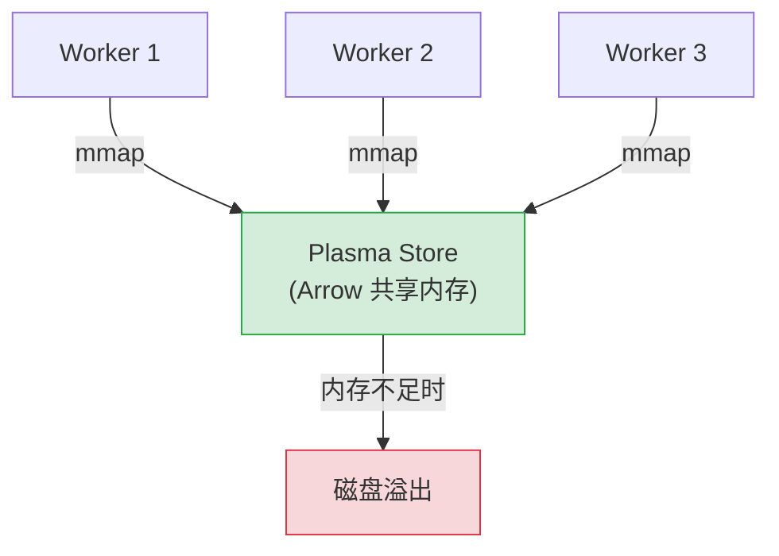

# Plasma 对象存储原理

## 提出问题

分布式计算中，数据传递是最大的性能瓶颈之一。Task A 的结果要给 Task B、C、D 用，如果每次都要序列化-网络传输-反序列化，延迟和带宽都会成为噩梦。Ray 怎么解决这个问题？

答案是一个专门为 ML 工作负载设计的**分布式共享内存对象存储**——Plasma。

## 核心原理

Plasma 是 Ray 的分布式对象存储层，基于 **Apache Arrow** 构建。它的核心思想很简单：

> **数据尽量不动，让计算去追数据**。

> **类比**：Plasma Store 像是每个工位旁边配的**共享储物柜**。你把计算结果放进去，贴个标签（Object ID），其他同事需要时直接来拿。同一间办公室（节点）的同事甚至不需要复印——直接从柜子里取原件。

## Plasma 架构



每个 Worker 进程通过 **mmap** 与 Plasma Store 共享同一块物理内存，实现零拷贝访问。

## 为什么用 Apache Arrow

Arrow 不仅仅是一种序列化格式——它是一种**跨语言的列式内存格式**：

### 传统序列化 vs Arrow

```
传统方式 (Pickle/JSON):
  Python对象 → 序列化(字节流) → 反序列化 → Python对象
  每次传递都要做完整的编码/解码，开销随数据大小增长

Arrow:
  数据始终以 Arrow 格式躺在共享内存里
  不同进程/语言看到的是"同一份数据的不同视角"
  不需要序列化/反序列化
```

### 列式布局的优势

```python
# 假设这是一批 ML 的特征数据
data = {
    "age": [25, 30, 35, 40],       # 列式存储：[25,30,35,40] 紧挨着
    "income": [50, 60, 70, 80],
    "score": [0.8, 0.9, 0.7, 0.85]
}
```

Arrow 列式布局：
- 同列数据在内存中连续存放 → SIMD 向量化友好
- 零拷贝切片：取 `data["age"][1:3]` 不需要复制
- 跨语言零开销：Python/C++/Java/Rust 可以用同一套内存布局

> **类比**：传统序列化像是把一个乐高城堡拆成零件、装进箱子、运到目的地再拼起来。Arrow 则是整个城堡放在一个透明玻璃柜里，大家从不同角度观看——不需要反复拆装。

## Plasma 的内部机制

### 对象分配

```
创建对象流程：
1. Worker 请求分配内存
2. Plasma 在共享内存中分配空间
3. Worker 将数据直接写入共享内存（mmap 映射）
4. Plasma 记录 ObjectID → 内存地址的映射
5. 对象创建完成，标记为 sealed（不可变）
```

### 对象定位

```
读取对象流程：
1. Worker 持有 ObjectRef（包含 ObjectID + 位置提示）
2. 检查本地 Plasma Store → 如果有，mmap 直接读
3. 如果没有 → 向 owner 节点请求传输
4. Owner 节点将对象发过来，存入本地 Plasma Store
5. 返回本地引用
```

### 小对象的内联优化

```python
# 小于 100KB 的对象不放入 Plasma，而是存在 Worker 进程内的 MemoryStore
small_obj = [1, 2, 3]  # 几十字节，内联存储
big_obj = np.random.randn(10000, 10000)  # 800MB，存入 Plasma
```

阈值在 Ray 内部定义为 `RAY_CONFIG(uint64_t, min_spilling_size, 100 * 1024)`。小于它的对象直接通过进程间消息传递，避免 Plasma IPC 的开销。

## 对象溢出机制 (Spilling)

当 Plasma Store 内存不够时，Ray 自动触发**对象溢出**（Object Spilling）：

```python
import ray
ray.init(object_store_memory=10**9)  # 1GB

# 不断 put 大对象
refs = []
for i in range(100):
    refs.append(ray.put(np.random.randn(5000, 5000)))  # 每个约 200MB
    # Ray 自动将不常用的对象溢出到磁盘
```

### 溢出策略

```
Plasma Store (满了)
    │
    ▼
LRU 选一个最少使用的对象
    │
    ▼
序列化 → 写入磁盘 (/tmp/ray/session_xxx/plasma/...)
    │
    ▼
释放 Plasma 中的该对象空间
    │
    ▼ (当该对象后来被访问时)
从磁盘加载 → 恢复到 Plasma Store → 返回给请求者
```

> **类比**：Plasma 是工作台上的**热区**（放常用工具），磁盘是身后的**工具柜**。热区满了就把不太用的工具放回柜子，需要时再取出来——比重新买一把（重新计算）划算。

### 自定义溢出目标

```python
# 溢出到本地磁盘
ray.init(_system_config={
    "object_spilling_config": json.dumps({
        "type": "filesystem",
        "params": {"directory_path": "/fast_ssd/ray_spill"}
    })
})

# 溢出到云存储（S3/GCS）
ray.init(_system_config={
    "object_spilling_config": json.dumps({
        "type": "filesystem",
        "params": {"directory_path": "s3://my-bucket/ray-spill"}
    })
})
```

## 分布式对象目录

Ray 需要知道"哪个对象在哪个节点上"。这些信息由 **GCS（Global Control Store）** 维护：

```
GCS 中的对象元数据：
{
    object_id_1: {
        owner: "worker_A",
        locations: ["node_1", "node_3"],  # 对象的副本所在节点
        size: 1048576,
        created_at: 1234567890
    },
    ...
}
```

当 Worker 请求一个不在本地的对象时：
1. 查询 GCS → 得知对象在 node_1 和 node_3
2. 选择最近的节点请求传输
3. 接收对象副本，存入本地 Plasma

## 与 Spark/Dask 的对比

| 特性 | Ray Plasma | Spark | Dask |
|------|-----------|-------|------|
| 共享内存 | ✅ 零拷贝 mmap | ❌ 磁盘/网络为主 | ❌ 网络传输 |
| 溢出到磁盘 | ✅ 自动 | ✅ RDD 天然在磁盘 | ✅ 手动控制 |
| 列式格式 | ✅ Apache Arrow | ✅ Spark SQL 列式 | ❌ 行式为主 |
| 同节点传递 | 零拷贝指针 | 序列化（同JVM内零拷贝） | 序列化 |
| 小对象优化 | ✅ <100KB 内联 | N/A | N/A |

## 常见陷阱

### 1. 对象泄漏

```python
# ❌ 不断 put 新数据但不消费
for _ in range(100000):
    ref = ray.put(big_data)  # 对象不断堆积

# ✅ 要么定期 del ref，要么放进函数作用域让它自然销毁
def process():
    ref = ray.put(big_data)  # 函数结束引用释放
    return work.remote(ref)
```

### 2. 对象太大导致 OOM

```python
# ❌ 一个对象 5GB，超过 Plasma Store 容量
huge = ray.put(enormous_array)

# ✅ 分块
chunks = np.array_split(enormous_array, 50)
refs = [ray.put(chunk) for chunk in chunks]
```

### 3. 跨节点频繁访问大对象

如果多个 Worker 在不同节点频繁 `ray.get()` 同一个大对象，会产生大量网络传输。解决方案：在需要的节点上提前**复制**：

```python
# 对象会被"拉"到发任务的那个节点
ray.get(big_ref)  # 第一次慢，之后同节点快
```

## 小结

- Plasma 是 Ray 的分布式共享内存对象存储，基于 Apache Arrow
- 同节点 Worker 通过 mmap 零拷贝访问，跨节点自动网络传输
- 小对象（<100KB）内联在进程内，大对象存 Plasma
- 内存不足时自动 LRU 溢出到磁盘/云存储
- Arrow 列式格式实现跨语言零拷贝，特别适合 ML 张量数据
