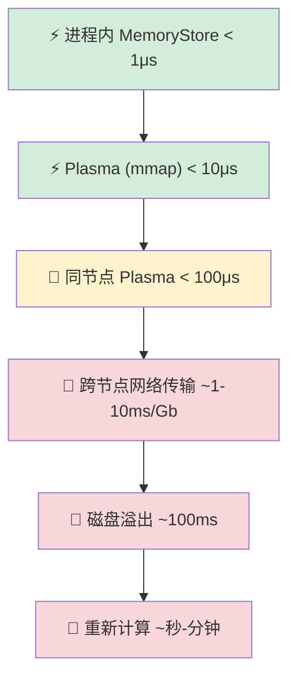
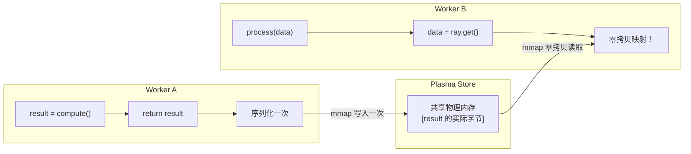
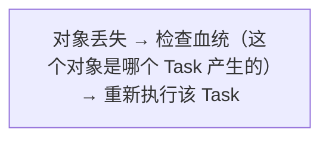
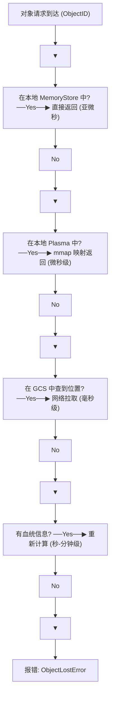

# 零拷贝与内存层级

## 提出问题

在分布式系统中，数据搬运是隐藏的杀手。如果把一个 1GB 的 NumPy 数组传给 10 个并行的 Task，用传统方式（序列化 → 网络 → 反序列化），总传输量是 **10GB**，耗时可能比计算本身还长。Ray 如何用"零拷贝"把这个开销降到几乎是 0？

## 核心原理

Ray 的内存体系是一个**多层级缓存系统**，数据和计算靠得越近，访问成本越低：



> **类比**：这就像你在厨房做菜——最常用的调料放在灶台边（进程内），次常用的在头顶橱柜（Plasma），隔壁储藏室（跨节点）有点远但能拿到，冷库（磁盘溢出）最慢。Ray 的调度器像是个聪明的厨师，尽量把所有东西放在手边。

## 同节点零拷贝详解

### mmap 的工作原理

```python
# 传统方式：数据需要序列化-传输-反序列化
@ray.remote
def worker_a():
    result = compute()          # 生成大结果
    return result               # 序列化 → 放入 Plasma

@ray.remote
def worker_b(data):
    return process(data)        # 反序列化 ← 从 Plasma 取

ref = worker_a.remote()
worker_b.remote(ref)  # 序列化开销 × 1
```

在 Ray 的同节点优化下：



Worker B 的 `ray.get()` 直接通过 mmap 映射到同一块物理内存——数据的字节从 CPU 直接映射到 Worker B 的进程地址空间，中间没有序列化、没有拷贝、没有 IPC。

### 何时零拷贝生效

| 场景 | 是否零拷贝 | 说明 |
|------|------------|------|
| 同节点 Worker A → Worker B | ✅ | 通过 mmap 共享 Plasma 页面 |
| 同 Worker 两次 ray.get(同一个 ref) | ✅ | 进程内缓存 |
| 跨节点 Worker A → Worker B | ❌ | 必须网络传输 |
| 跨语言（Python → Java） | ✅ | Arrow 的跨语言零拷贝 |

### Arrow 的零拷贝基础

```python
import pyarrow as pa
import numpy as np

# NumPy → Arrow：零拷贝
arr = np.random.randn(1000, 1000)
table = pa.table({"data": arr})  # 不复制，共享底层 buffer

# Arrow → NumPy：零拷贝
back = table.column("data").to_numpy()  # 同一个 buffer
assert back.base is arr  # True！同一个内存
```

Ray 存储 NumPy/Pandas/Arrow 数据时可以直接利用这些零拷贝特性。

## 内存层级策略

### Level 1: 进程内 MemoryStore（热缓存）

小于 100KB 的对象直接存在 Worker 进程内：

```python
# 这些小结果不会进 Plasma，直接走进程内消息
small_result = ray.get(task.remote())  # int, str, small list
```

### Level 2: Plasma Store（温缓存）

大对象存在 Plasma Store，同节点共享：

```python
big = ray.put(np.random.randn(5000, 5000))  # ~200MB → Plasma
```

### Level 3: 网络传输（冷缓存）

跨节点访问对象时通过网络拉取。Ray 做了几项优化：

1. **对象拉取 (Pull-based)**：不是推送，而是接收方需要时才拉
2. **并发流式传输**：大对象分块并行传输
3. **多副本选择**：如果有多个副本，选网络最近的那个

### Level 4: 磁盘溢出

Plasma 内存不足时自动溢出：

```python
# Ray 自动管理，一般来说你不需要手动干预
# 但可以用 object_store_memory 控制容量
ray.init(object_store_memory=10 * 1024**3)  # 10GB 上限
```

### Level 5: 血统重建（Lineage Reconstruction）

最坏的情况——对象丢失且没有副本——Ray 会重新执行产生该对象的 Task：



这是最后的保底方案，代价是重新计算的时间。

## 内存层级决策树

Ray 在运行时的决策逻辑：



## 性能优化实践

### 1. 数据本地性

尽量让消费 Task 和产生 Task 调度到同一节点：

```python
# Ray 会尽量把 Task 调度到数据所在的节点
ref = ray.put(data)  # 数据在节点 X

@ray.remote
def process(ref):
    return heavy_compute(ray.get(ref))  # Ray 倾向于也调度到节点 X

process.remote(ref)  # 零拷贝！
```

### 2. 避免大对象重复序列化

```python
# ❌ 序列化 100 次
futures = [worker.remote(big_data) for _ in range(100)]

# ✅ 序列化 1 次
ref = ray.put(big_data)
futures = [worker.remote(ref) for _ in range(100)]  # 都传 ref
```

### 3. 小批量合并

```python
# ❌ 10000 个微小 Task，调度开销 > 计算开销
many_small = [small_task.remote(i) for i in range(10000)]

# ✅ 合并成大 Task
@ray.remote
def batch_task(items):
    return [process(i) for i in items]

batch_task.remote(list(range(10000)))
```

## 小结

- 同节点数据传递是零拷贝的（mmap），这是 Ray 相比其他框架的核心性能优势
- 内存层级从进程内到磁盘溢出共 5 级，Ray 自动管理
- Arrow 列式格式是零拷贝的基础，尤其对 NumPy/Pandas 友好
- 性能优化的第一原则：**让数据少动**
- `ray.put()` 用于一次序列化、多次共享
