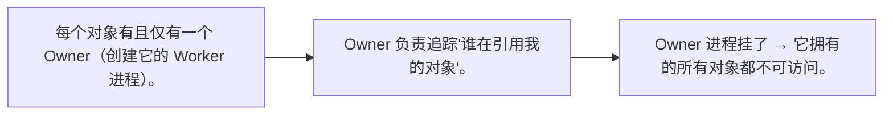
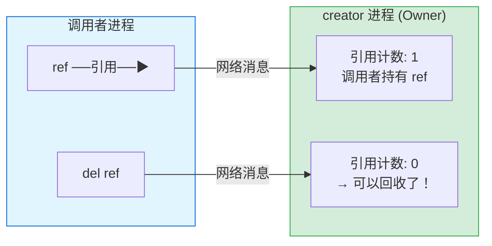
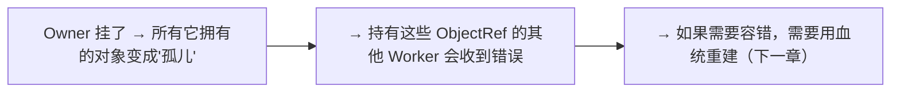
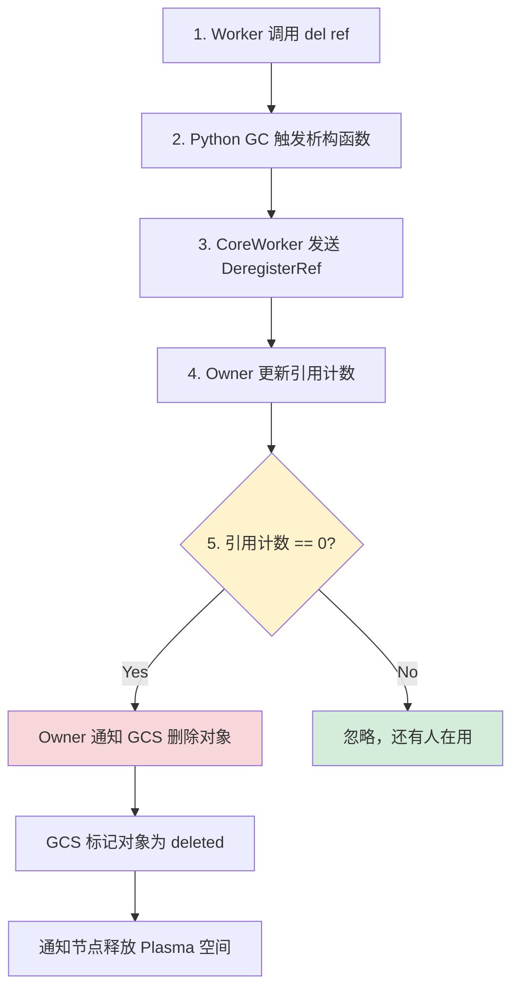

# 引用计数与分布式垃圾回收

## 提出问题

在单机 Python 中，垃圾回收很简单——引用计数归零就释放内存。但在分布式系统中，"谁还在用这个对象"是一个全局信息。Worker A 可能持有 ObjectRef，Worker B 可能也在用它，而 GCS 还不知道。怎么在不引入全局锁的情况下，精准知道一个对象什么时候可以安全删除？

Ray 的答案是**分布式引用计数**（Distributed Reference Counting）。

## 核心原理

> **类比**：想象一个公司的共享文档系统。每份文档（Object）有一个记录——谁在引用它。新员工入职打开文档时在记录上 +1，关掉时 -1。归零时系统自动归档删除。Ray 的引用计数就是这种机制，只不过是在分布式集群上运行。

## 所有权模型 (Owner Model)

Ray 的对象引用系统建立在 **Owner（所有者）** 模型上：



### Owner 的作用

```python
@ray.remote
def creator():
    return [1, 2, 3]    # creator 是这个对象的 Owner

ref = creator.remote()
# ref 是调用者手中的 ObjectRef
# creator Worker 是 Owner，负责追踪 ref 的引用计数
```



## 引用计数的传播

### 场景 1：Task 参数传递

```python
@ray.remote
def f(x):
    return x

ref_a = ray.put([1, 2, 3])   # 调用者持有 ref_a；Owner = 调用者
ref_b = f.remote(ref_a)      # f 的参数中有 ref_a
# 此时 ref_a 的引用计数 = 2（调用者 + f 的任务）
# f 完成 → 引用计数 -1 = 1（只剩调用者）
del ref_a                    # 引用计数 0 → 回收
```

### 场景 2：嵌套对象

```python
@ray.remote
def outer():
    inner = ray.put([1, 2, 3])    # outer 是 inner 的 Owner
    return inner                   # 返回 inner 的 ref

ref = outer.remote()
# inner 的 Owner 是 outer 进程
# 如果 outer 进程挂了，inner 不可访问，即使数据还在 Plasma 里
```

### 场景 3：Actor 持有 ObjectRef

```python
@ray.remote
class Collector:
    def __init__(self):
        self.refs = []

    def add(self, ref):
        self.refs.append(ref)      # Actor 持有 ref
        # ref 的引用计数 +1

    def clear(self):
        self.refs = []             # 释放所有引用
        # ref 的引用计数 -len(old_refs)

collector = Collector.remote()
data_ref = ray.put([1, 2, 3])
collector.add.remote(data_ref)     # ref 引用计数 +1 (Actor 持有)
del data_ref                        # 调用者释放，但 Actor 还持有着
# ref 不会被回收！因为 Actor 还持有一个引用
```

## 引用计数的实现细节

### 协议：Owner 维护引用计数表

```
Owner 进程内部维护：
{
    object_id_abc123: {
        ref_count: 3,
        borrowers: [Worker_A, Worker_B, Actor_C]
    },
    object_id_def456: {
        ref_count: 1,
        borrowers: [Worker_D]
    }
}
```

每当 `ref_count` 归零，Owner 就通知 GCS 该对象可以被删除了。

### 网络消息类型

| 消息 | 触发条件 | 效果 |
|------|----------|------|
| **RegisterRef** | Worker 新持有一个 ObjectRef | ref_count += 1 |
| **DeregisterRef** | Worker 释放一个 ObjectRef | ref_count -= 1 |
| **ObjectExists** | 确认对象还存在 | 心跳 + 保活 |
| **DeleteObject** | ref_count 归零 | Plasma 删除 + GCS 清理 |

### 引用计数与故障处理

Owner 进程崩溃是最麻烦的情况：



## 内存回收的完整流程



## 常见陷阱

### 1. Actor 持有 ObjectRef 不释放

```python
# ❌ Actor 的缓存可能无限增长
@ray.remote
class Cache:
    def __init__(self):
        self.cache = {}  # 永远不清理

    def add(self, key, value_ref):
        self.cache[key] = value_ref  # 引用一直持有！

# Plasma Store 总会满——对象虽然在 cache 里不可达，但引用计数不为 0
```

**修复**：给 Actor 加 LRU 淘汰或定期清理。

### 2. 循环引用

```python
# ❌ 分布式循环引用无法自动检测
@ray.remote
class Node:
    def __init__(self):
        self.next = None

    def set_next(self, node):
        self.next = node

a = Node.remote()
b = Node.remote()
a.set_next.remote(b)
b.set_next.remote(a)  # 循环引用！永远不会被 GC
```

Ray 的引用计数是**纯引用计数**（没有标记-清除），无法处理循环引用。需要显式断开：

```python
# ✅ 手动断开
a.set_next.remote(None)
```

### 3. Owner 进程生命周期

```python
@ray.remote
def create_and_return():
    inner = ray.put(large_data)        # Owner = create_and_return
    return inner

ref = create_and_return.remote()       # create_and_return Task 完成后即退出
# ⚠️ inner 的 Owner 已经没了！
# Ray 会将所有权转移给 create_and_return 的调用者
```

Ray 会自动处理这种**所有权转移**（Ownership Transfer），但你需要注意：如果 `create_and_return` 被杀死（crash），它还没返回的对象就丢了。

## 监控引用状态

通过 Ray Dashboard 可以看到对象存储的使用情况：

- **Object Store Memory**：当前 Plasma 使用量 / 总量
- **Object References**：活跃的 ObjectRef 数量
- **Spilled Objects**：溢出到磁盘的对象数量

## 小结

- Ray 使用**分布式引用计数**管理对象生命周期
- 每个对象有一个 Owner，负责追踪所有引用者
- `ref_count` 归零时对象被自动回收
- 分布式循环引用无法自动检测，需手动避免
- Actor 持有 ObjectRef 会让引用计数一直不为零
- Owner 进程崩溃后对象丢失（除非有血统重建）
