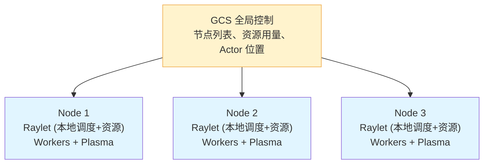
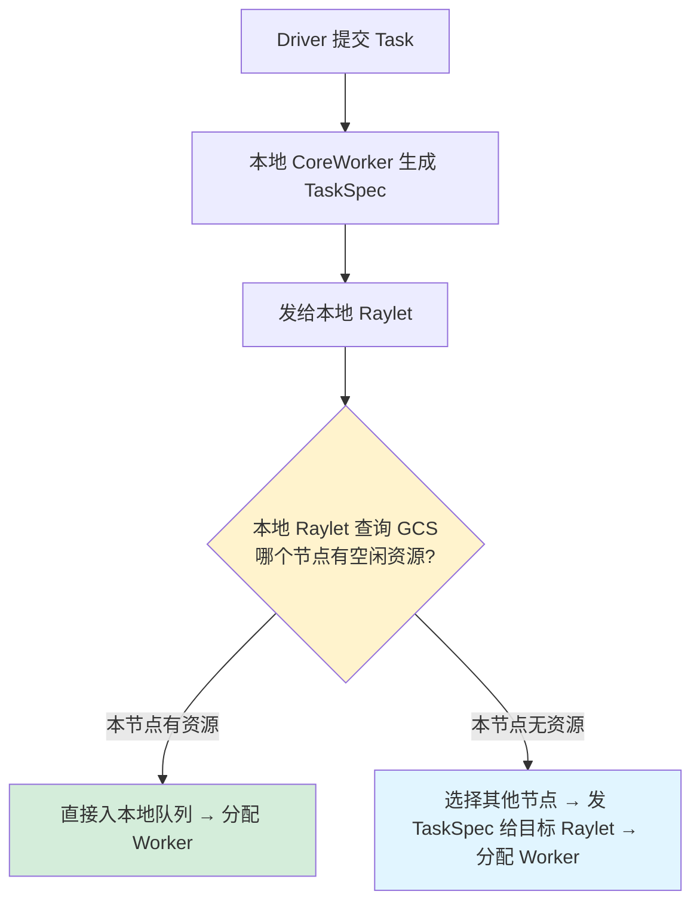

# 两级调度架构

## 提出问题

分布式系统调度有两种极端：**中心化调度**（一个大脑决定一切，瓶颈明显）和**完全去中心化**（每个节点自己决策，难以做全局最优）。Ray 需要在毫秒级延迟下调度数百万个 Task，还要考虑数据本地性、异构资源，单靠全局调度器会成瓶颈。怎么兼顾**速度**和**全局视野**？

答案：**两级调度**（Two-Level Scheduling）。

## 核心原理

> **类比**：想象滴滴的派单系统——
> - **全局调度器**像滴滴的中央调度系统，知道全城所有司机的位置和状态，决定把订单派往哪个区域
> - **本地调度器**像区域内的车队队长，决定区域里具体哪个司机接单、什么时候去
>
> 这样中央不用管"司机张三在哪个路口拐弯"，只管"这单发往朝阳区"。

## 两层架构



### 第一层：全局调度（GCS + Head Node Raylet）

全局调度器负责**节点级决策**：

1. 收到一个新 Task，看它需要什么资源（CPU、GPU、自定义资源）
2. 从 GCS 获取所有节点的当前可用资源
3. 选一个满足条件的节点
4. 将 Task 发给该节点的 Raylet
5. 之后的事由本地调度接管

### 第二层：本地调度（Node Raylet）

本地调度器负责**进程级决策**：

1. 维护一个 Task 队列（来自全局调度 + 本地提交）
2. 管理本节点的 Worker 进程池
3. 做**任务排序**——不是 FIFO，而是考虑数据本地性、资源利用率
4. 分配 Task 给空闲 Worker
5. 当资源不够时，可以**溢出**回全局调度

## 任务提交流程



## 调度策略 (Scheduling Strategy)

Ray 提供几种调度策略，在提交 Task 时指定：

```python
# SPREAD：均匀分散（默认），适合无状态的 map 操作
@ray.remote(scheduling_strategy="SPREAD")
def map_task(x):
    return process(x)

# DEFAULT：Ray 自行决定，信息更丰富时的混合策略
@ray.remote  # 等价于 DEFAULT
def auto_task(x):
    return process(x)
```

### SPREAD vs DEFAULT

```
SPREAD:
  Node1: [■■■□□□□□□□]  33%
  Node2: [■■■□□□□□□□]  33%
  Node3: [■■■□□□□□□□]  33%
  → 新 Task 优先去负载最低的节点

DEFAULT:
  优先考虑：数据本地性 > 资源可用性 > 负载均衡
  新 Task 优先调度到参数（ObjectRef）所在的节点
```

### 节点亲和性（Node Affinity）

```python
# 指定在特定节点执行
@ray.remote(scheduling_strategy=ray.util.scheduling_strategies.NodeAffinitySchedulingStrategy(
    node_id="node_abc123",
    soft=False  # True=尽量满足，False=必须满足
))
def node_specific_task():
    ...
```

## 数据本地性感知

这是两级设计的精髓：全局调度知道"数据在哪"，本地调度知道"哪还有空位"。

```python
# 场景：data_ref 在 node_3 上
data_ref = ray.put(huge_dataset)  # 假设被调度到 node_3

@ray.remote
def process(data):
    return heavy_compute(ray.get(data))

# Ray 的调度决策：
# DEFAULT 策略 → 尽量把 process 也放到 node_3 → 零拷贝访问 data_ref
# SPREAD 策略 → 可能跨节点，但有更好的负载均衡
process.remote(data_ref)
```

> **类比**：全局调度是**总参谋部**，看地图（GCS）决定部队部署在哪些省份。本地调度是**连排长**，决定士兵站哪个哨位、几点换岗。总参不需要知道每个士兵的精确位置，但需要知道各省兵力是否充足。

## Worker 池管理

每个节点的 Raylet 维护一个 **Worker 池**：

```
节点 Worker 池 (以 CPU worker 为例)
┌────────────────────────────────────────┐
│                                        │
│  [idle]  [idle]  [busy]  [idle]  [busy]│
│                                        │
│  空闲 Worker 数量: 3                   │
│  总 Worker 数量: 5                     │
│                                        │
├────────────────────────────────────────┤
│  新 Task 到达：                         │
│  if 有空闲 Worker → 立即分配            │
│  elif Worker < num_cpus → 启动新 Worker │
│  else → 进入等待队列                    │
└────────────────────────────────────────┘
```

Worker 进程是**按需启动**的，不是预分配。这避免了空转浪费。

### Worker 类型

| Worker 类型 | 资源要求 | 典型用途 |
|-------------|----------|----------|
| CPU Worker | 1 CPU | 普通 Python 计算 |
| GPU Worker | 1 GPU | CUDA 计算 |
| 多 CPU Worker | N CPUs | 多线程计算 |
| 分数 GPU Worker | 0.5 GPU | MPS（多进程共享一张 GPU） |

## 调度延迟分析

Ray 的调度延迟在不同场景下：

| 场景 | 延迟 | 说明 |
|------|------|------|
| 同节点、有空闲 Worker | ~200μs | 跳过全局调度，直接本地分配 |
| 跨节点、有空闲 Worker | ~1ms | 需要查询 GCS + 网络转发 |
| 任何节点、无空闲 Worker | ~10ms+ | 需要启动新 Worker 进程 |
| 无节点满足资源 | 任务排队 | 等待其他任务释放资源 |

> Ray 可以在**亚毫秒**级完成同节点调度，这是它能支持百万级 Task 的基础。

## 调度溢流 (Spillback)

当本地 Raylet 的队列过长时，会把 Task **回溢**给全局调度：

```
本地 Raylet：
  队列中等待的任务 > 阈值
    → 将后来的 Task 退回全局调度
    → 全局调度尝试发给其他节点
    → 类似 TCP 的拥塞控制——不让热点成为瓶颈
```

## 常见陷阱

### 1. Task 太小导致调度开销占主导

每个 Task 约 0.2-1ms 调度开销。如果 Task 只执行 1ms，调度开销占比 50%：

```python
# ❌ 每个 Task 太轻
futures = [tiny_task.remote(i) for i in range(1000000)]

# ✅ 合理粒度：每个 Task 执行 > 100ms
futures = [batch_task.remote(chunk) for chunk in chunks_of_1000]
```

### 2. GPU Task 竞争

提交 GPU Task 数量 > GPU 数量时，多余的会排队。Ray 不会自动做 MPS（多进程共享 GPU），需要显式设置 `num_gpus=0.5`。

### 3. 没有考虑数据本地性导致跨节点流量

```python
# ❌ 每个 Task 都把数据从 node_1 拉到不同节点
ref = ray.put(big_data)  # 假设在 node_1
futures = [process.remote(ref) for _ in range(100)]  # SPREAD 策略

# ✅ 用 DEFAULT 策略，Task 会自动调度到 node_1
```

## 小结

- Ray 采用**两级调度**：全局（节点级）+ 本地（进程级）
- 全局调度看资源+数据位置，本地调度做 Task 排序+Worker 分配
- SPREAD 追求负载均衡，DEFAULT 追求数据本地性
- Worker 按需启动，减少空转
- 同节点调度延迟 ~200μs，支持百万级 Task
- 调度溢流机制防止单节点过热
