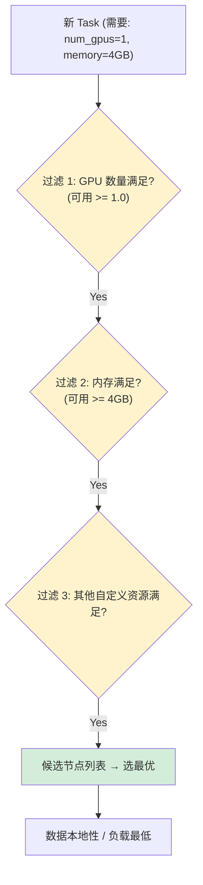

# 资源抽象与管理

## 提出问题

ML 工作负载的资源配置远不止"这个程序要多少内存"：

- 训练需要 4 张 GPU，推理可能只要 0.5 张 GPU
- 有些库需要指定"GPU 0 不能动，用 GPU 1-3"
- 数据加载器可能只要 CPU，但必须是"内存大于 32GB 的节点"
- 自定义硬件（TPU、FPGA、NPU）需要表达"这个设备有 2 个 NPU"

一般的资源管理系统（K8s 的 CPU/Memory 就够了）无法处理这种**异构、分数、自定义**的资源需求。Ray 怎么做？

## 核心原理

Ray 将资源抽象为**键值对**（`{"name": quantity}`），每种资源以浮点数表达用量。这个设计极其灵活——CPU、GPU、TPU、甚至"许可证"都可以统一管理。

> **类比**：传统资源管理像你租房——房东说"这个房子有 2 间卧室"（很固定）。Ray 的资源管理像是在自助餐厅——每种菜（资源）你取的量可以精确到克，还可以自己带菜（自定义资源）。系统确保不会有人取超了。

## 预定义资源

### CPU

```python
@ray.remote(num_cpus=4)
def cpu_heavy_task():
    # 需要 4 个 CPU 核心，Ray 保证调度到满足条件的节点
    ...

@ray.remote(num_cpus=0.01)  # 极轻量任务，100 个可共享 1 CPU
def light_task():
    ...
```

默认每个 Task 的 `num_cpus=1`。

### GPU

```python
@ray.remote(num_gpus=1)     # 独占 1 张 GPU
def gpu_task():
    model = load_model().cuda()
    ...

@ray.remote(num_gpus=0.5)   # 半张 GPU（两个任务共享一张）
def inference():
    model = load_model().cuda()
    ...

@ray.remote(num_gpus=2)     # 需要 2 张 GPU（如张量并行）
def large_model_task():
    ...
```

### 内存

```python
@ray.remote(memory=4 * 1024**3)  # 需要 4GB 内存
def memory_heavy():
    ...

# 对象存储内存是集群级的
ray.init(object_store_memory=10 * 1024**3)  # 10GB Plasma
```

### 默认资源量

Ray 启动时自动检测：

```python
ray.init()
# 自动检测：
# num_cpus = os.cpu_count()
# num_gpus = 检测到的 GPU 数量
# memory = 系统可用内存
```

## 自定义资源

### 声明自定义资源

```python
# 启动 Ray 时声明自定义资源
ray.init(resources={"TPU": 4, "special_hardware": 2})

@ray.remote(resources={"TPU": 1})
def tpu_task():
    ...

@ray.remote(resources={"special_hardware": 1})
def special_task():
    ...
```

### 自定义资源的妙用

1. **逻辑分区**：

```python
# 把节点 A 标记为 "training"，节点 B 标记为 "serving"
ray.init(resources={"training_slot": 8})     # 节点 A
ray.init(resources={"serving_slot": 4})      # 节点 B

@ray.remote(resources={"training_slot": 1})
def train(): ...     # 只会调度到节点 A

@ray.remote(resources={"serving_slot": 1})
def serve(): ...     # 只会调度到节点 B
```

2. **许可证/限额控制**：

```python
# 限制同时运行的"需要商业许可的库"的 Task 数量
ray.init(resources={"commercial_license": 3})  # 只有 3 个授权

@ray.remote(resources={"commercial_license": 1})
def licensed_task():
    use_commercial_library()
```

## 资源调度算法

### 资源匹配漏斗



### 资源预留

当一个 Task 被调度到某节点，其声明的资源会从可用池中**立即扣除**（即使 Task 还没开始跑）：

```
节点可用资源: {CPU: 8, GPU: 2}
  → Task A 调度来 (num_gpus=1): {CPU: 8, GPU: 1}  ← 立即扣除
  → Task B 调度来 (num_gpus=1): {CPU: 8, GPU: 0}  ← 剩余 GPU 不够
  → Task C 需要 1 GPU → 等待
```

## 资源感知调度实例

### 异构节点集群

```python
# 集群中有 3 种节点
# 节点 1-2: 8 CPU + 1 GPU (推理节点)
# 节点 3-4: 64 CPU + 8 GPU (训练节点)
# 节点 5-6: 32 CPU + 0 GPU (数据处理节点)

@ray.remote(num_gpus=4)
def train_batch(batch):
    ...  # 只会调度到节点 3-4，因为只有它们有 4 GPU

@ray.remote(num_gpus=0.5)
def inference(batch):
    ...  # 可以在节点 1-4 中任选

@ray.remote(num_cpus=4)
def process_data(chunk):
    ...  # 所有节点都满足，调度到负载最低的
```

### 避免 GPU 竞争

```python
# 场景：有 2 张 GPU，跑 10 个推理 Task

# ❌ 全部用 num_gpus=1，一次只能跑 2 个
@ray.remote(num_gpus=1)
def inference_single(data):
    return model(data)

# ✅ 用 num_gpus=0.5，一次跑 4 个
@ray.remote(num_gpus=0.5)
def inference_shared(data):
    return model(data)
```

> **注意**：`num_gpus=0.5` 意味着两个 Task 可以同时在一张 GPU 上——对推理足够，对训练通常不够（显存竞争）。

## 资源配置最佳实践

### Task 资源粒度经验值

| Task 类型 | 推荐资源配置 | 原因 |
|-----------|-------------|------|
| CPU 数据处理 | `num_cpus=1` | 默认值，够用 |
| 多线程 NumPy | `num_cpus=4` | 利用 BLAS 多线程 |
| GPU 推理（小模型） | `num_gpus=0.25-0.5` | 多任务共享 GPU |
| GPU 推理（大模型） | `num_gpus=1` | 独占显存 |
| GPU 训练 | `num_gpus=1-8` | 看模型和并行策略 |
| IO 密集型 | `num_cpus=0.1` | 大部分时间在等 IO |

### Actor 的资源声明

```python
@ray.remote(num_gpus=1)
class ModelServer:
    def __init__(self):
        self.model = load_model().cuda()  # 加载到 GPU
    ...

# Actor 创建时申请资源，生命周期内一直持有
server = ModelServer.remote()  # 占用 1 GPU
# ...
ray.kill(server)  # 释放 GPU
```

## Ray 的资源管理 vs K8s

| 维度 | Ray 资源管理 | K8s 资源管理 |
|------|-------------|-------------|
| 资源类型 | 任意键值对，浮点数量 | CPU/Memory/GPU（整数） |
| 分数资源 | ✅ `num_gpus=0.5` | ❌ 不支持分数 GPU |
| 自定义资源 | ✅ 任意字符串 | ⚠️ 扩展资源（有限） |
| 动态调整 | ✅ 运行时变化 | ❌ 需要重启 Pod |
| 适用粒度 | Task 级别 | Pod 级别 |
| 调度单元 | 单个 Task | 整个 Pod |

在 KubeRay 部署中，两者配合：K8s 管理 Pod 生命周期，Ray 管理 Pod 内的 Task 调度。

## 常见陷阱

### 1. 声明了资源但没用

```python
# ❌ 声明 num_gpus=1 但函数里没用到 GPU
@ray.remote(num_gpus=1)
def task():
    return 1 + 1  # 不需要 GPU！浪费了 GPU 资源

# ✅ 声明与实际使用一致
```

### 2. 资源碎片

如果集群中有 (CPU:2, GPU:1) × 4 个节点，但你提交的是 `num_cpus=4` 的 Task，它会被**卡住**——每个节点都不满足 4 CPU：

```python
# ❌ 需要 4 个 CPU 在一块
@ray.remote(num_cpus=4)
def big_task(): ...

# 解决：使用 Placement Group 预留跨节点资源（下一节）
```

### 3. 分数 GPU 不支持训练

`num_gpus=0.5` 意味着两个 Task 共享一张 GPU。对训练来说，显存通常不够。分数 GPU 只适合推理。

## 小结

- Ray 用键值对抽象资源：`{"CPU": 4, "GPU": 1, "custom": 2}`
- 支持分数资源（如 `num_gpus=0.5`），适合多任务共享 GPU/TPU
- 自定义资源可以用于逻辑分区、许可证控制等场景
- 资源在 Task 提交时即被扣除（预留），防止超额分配
- 资源配置应与实际使用匹配，避免浪费或不足
