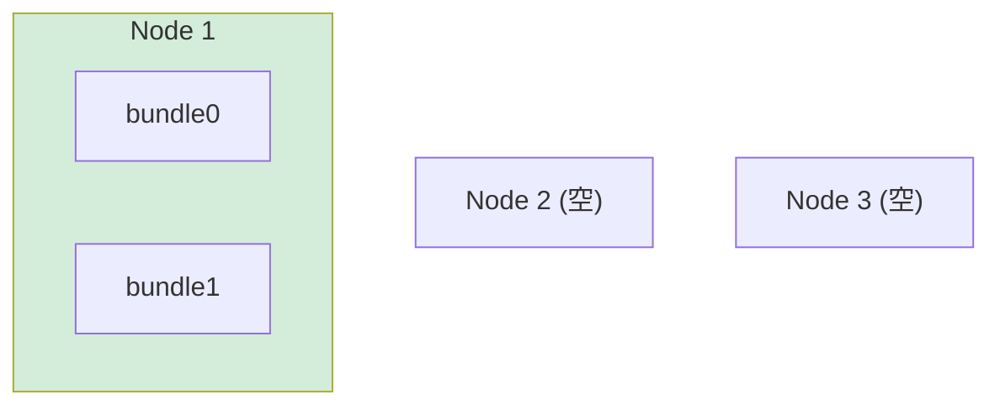
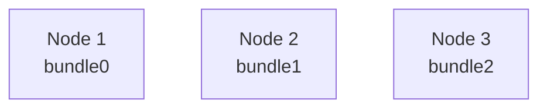
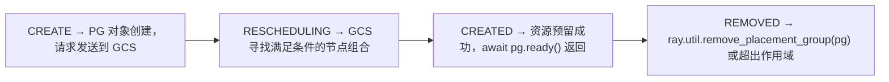
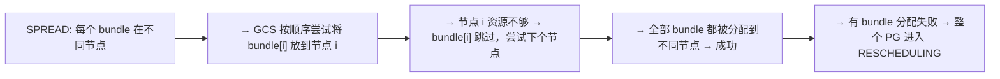

# 放置组策略 (Placement Groups)

## 提出问题

有时你需要**原子性地预留一组资源**，这些资源可能分布在多个节点上。比如：

- 一个分布式训练需要 4 张 GPU，必须**同时可用**才能启动
- 参数服务器架构：1 个 PS + 4 个 Learner，它们应该尽量靠近，延迟才低
- GPU 推理流水线：预处理 → GPU 推理 → 后处理，几个 Task 最好在同一节点

单个 `@ray.remote(num_gpus=...)` 无法表达这种"一组资源的原子预留"需求。这就是 Placement Group（放置组）存在的意义。

## 核心原理

Placement Group 是一种**多资源原子预留机制**。你声明"我需要 N 个 bundle（资源包），每个 bundle 有 X CPU + Y GPU"，Ray 要么一起满足，要么都不给。

> **类比**：这就像在餐厅订**包间**——你告诉餐厅"我要一个 10 人桌，3 点半到"。餐厅要么给你留好，要么告诉你没有。不会出现"我给你留了 6 个座位在 3 个不同桌子"的尴尬。单个 Task 的 `@ray.remote` 相当于散客排队——有位就坐。

## 创建 Placement Group

```python
from ray.util.placement_group import placement_group, placement_group_table

# 创建包含 2 个 bundle 的放置组
pg = placement_group([
    {"CPU": 4, "GPU": 1},   # bundle 0: 4 CPU + 1 GPU
    {"CPU": 4, "GPU": 1},   # bundle 1: 4 CPU + 1 GPU
], strategy="PACK")

# 等待 Placement Group 就绪（资源预留完成）
ray.get(pg.ready())
```

### 三种策略

```python
# 1. PACK：所有 bundle 尽量塞到同一个节点（延迟最低）
placement_group(bundles, strategy="PACK")
```



```python
# 2. SPREAD：每个 bundle 在不同节点（容错最好）
placement_group(bundles, strategy="SPREAD")
```



```python
# 3. STRICT_SPREAD：每个 bundle 必须在不同节点，且不能与其他 PG 共享节点
placement_group(bundles, strategy="STRICT_SPREAD")
```

```
STRICT_SPREAD：和 SPREAD 类似，但独占节点
同一节点不能有两个不同的 Placement Group
适合需要隔离的敏感工作负载
```

### 策略选择指南

| 策略 | 网络延迟 | 容错性 | 资源利用率 | 适用场景 |
|------|----------|--------|------------|----------|
| PACK | 最低（同机） | 最差 | 可能有碎片 | GPU 通信密集的训练 |
| SPREAD | 较高（跨机） | 最好 | 好 | 参数服务器、数据并行 |
| STRICT_SPREAD | 较高 | 最好 | 低（独占节点） | 安全隔离需求 |

## 使用 Placement Group

创建好后，将 Task/Actor 绑定到 bundle：

```python
@ray.remote(num_gpus=1)
class Trainer:
    def __init__(self):
        self.model = create_model().cuda()

@ray.remote(num_cpus=2)
def preprocess(data):
    return transform(data)

# 把 Task/Actor 放到指定 bundle 上
trainer = Trainer.options(
    scheduling_strategy=PlacementGroupSchedulingStrategy(
        placement_group=pg,
        placement_group_bundle_index=0,  # 放到 bundle 0
    )
).remote()

preprocessor = preprocess.options(
    scheduling_strategy=PlacementGroupSchedulingStrategy(
        placement_group=pg,
        placement_group_bundle_index=1,  # 放到 bundle 1
    )
).remote(data_ref)
```

## 完整示例：分布式训练

### 参数服务器模式

```python
from ray.util.placement_group import (
    placement_group,
    PlacementGroupSchedulingStrategy
)
import ray

ray.init()

# 创建 Placement Group：1 个 PS + 4 个 Trainer
pg = placement_group([
    {"CPU": 8},           # bundle 0: 参数服务器
    {"CPU": 4, "GPU": 1}, # bundle 1-4: 4 个训练节点
    {"CPU": 4, "GPU": 1},
    {"CPU": 4, "GPU": 1},
    {"CPU": 4, "GPU": 1},
], strategy="SPREAD")  # 分散放置，提高容错

ray.get(pg.ready())

@ray.remote(num_cpus=8)
class ParameterServer:
    def __init__(self):
        self.params = init_params()
    def push(self, grads):
        self.params = update(self.params, grads)
    def pull(self):
        return self.params

@ray.remote(num_gpus=1)
class Learner:
    def __init__(self, ps_handle):
        self.ps = ps_handle
        self.model = create_model().cuda()
    def step(self, batch_ref):
        batch = ray.get(batch_ref)
        params = ray.get(self.ps.pull.remote())
        self.model.load_state_dict(params)
        grads = compute_grads(self.model, batch)
        self.ps.push.remote(grads)

# 绑定到 Placement Group
ps = ParameterServer.options(
    scheduling_strategy=PlacementGroupSchedulingStrategy(
        placement_group=pg, placement_group_bundle_index=0
    )
).remote()

learners = [
    Learner.options(
        scheduling_strategy=PlacementGroupSchedulingStrategy(
            placement_group=pg, placement_group_bundle_index=i+1
        )
    ).remote(ps)
    for i in range(4)
]

# 训练循环
data_ref = ray.put(training_data)
for epoch in range(10):
    futures = [l.step.remote(data_ref) for l in learners]
    ray.get(futures)
```

## Placement Group 的生命周期



```python
# 检查状态
from ray.util.placement_group import placement_group_table
print(placement_group_table(pg))
# {
#     "placement_group_id": "xxx",
#     "state": "CREATED",
#     "bundles": {...}
# }

# 显式删除（释放资源）
ray.util.remove_placement_group(pg)
```

## 调度细节

### PACK 策略的内部逻辑


### SPREAD 策略的内部逻辑



### 部分分配与等待

Placement Group 是**原子性**的——要么全分配，要么全不分配。如果当前集群资源不够，PG 会一直等待：

```python
pg = placement_group([
    {"GPU": 8},  # 需要一个节点有 8 张 GPU
], strategy="PACK")

# 如果集群中没有任何节点有 8 张 GPU，
# pg.ready() 永远不会 resolve
# 需要用 timeout：
try:
    ray.get(pg.ready(), timeout=60)  # 60 秒超时
except ray.exceptions.GetTimeoutError:
    print("无法在规定时间内创建 Placement Group")
```

## 常见陷阱

### 1. 忘记 await pg.ready()

```python
# ❌ 创建后立即使用
pg = placement_group([{"GPU": 4}])
task.options(scheduling_strategy=...).remote()  # 可能 PG 还没 ready！

# ✅ 等待就绪
pg = placement_group([{"GPU": 4}])
ray.get(pg.ready())  # 阻塞直到资源分配完成
task.options(scheduling_strategy=...).remote()
```

### 2. Placement Group 泄漏

```python
# ❌ 创建后忘记释放
for _ in range(100):
    pg = placement_group([{"GPU": 1}])  # 资源一直被占用
    ...

# ✅ 用完释放
pg = placement_group([{"GPU": 1}])
ray.get(pg.ready())
# ... 使用 ...
ray.util.remove_placement_group(pg)
```

### 3. PACK 策略但 bundle 太多

如果一个节点放不下所有 bundle，PACK 会退化为"尽量少的节点"。如果希望严格单节点，需要确认单个节点有足够资源。

## 小结

- Placement Group 原子预留**一组**资源，适合多节点协作的 ML 工作负载
- 三种策略：PACK（低延迟）、SPREAD（高容错）、STRICT_SPREAD（隔离）
- 用 `PlacementGroupSchedulingStrategy` 将 Task/Actor 绑定到 bundle
- 必须 `ray.get(pg.ready())` 等待资源分配完成
- 用完后 `ray.util.remove_placement_group(pg)` 释放资源
