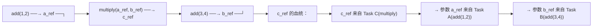
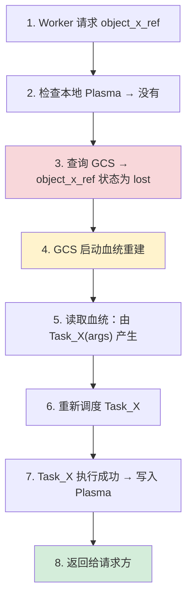
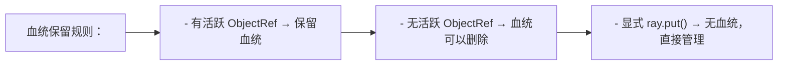

# 血统重建容错 (Lineage Reconstruction)

## 提出问题

分布式系统中，节点挂掉是常态。在 Spark 中，RDD 的血统（Lineage）可以重放——中间结果丢了没关系，从源头再算就行。Ray 的 Task 和 Object 是否也有类似的容错机制？它与 Spark 的血统有什么不同？

## 核心原理

Ray 的**血统重建（Lineage Reconstruction）**是一种**惰性、按需的对象恢复机制**。当一个对象丢失时，Ray 不是立即重建，而是等到**有人需要它**时才检查血统，重新执行生成它的 Task。

> **类比**：就像你用 Git 管理代码。如果不小心删了一个 commit 中的文件，`git reflog` 记录了所有历史操作——你可以"重放"历史来恢复文件。Ray 的血统就是分布式计算的 `reflog`——每个对象都记得"我是怎么产生的"（哪个 Task + 什么参数），丢了就照方抓药重新算一遍。

## 什么是血统

### 血统 = Task 的执行记录

```python
@ray.remote
def add(a, b):
    return a + b

@ray.remote
def multiply(x, y):
    return x * y

a_ref = add.remote(1, 2)        # Task A: 1+2 → 3
b_ref = add.remote(3, 4)        # Task B: 3+4 → 7
c_ref = multiply.remote(a_ref, b_ref)  # Task C: 3*7 → 21
```

血统图：



### 血统存储在 GCS 中

GCS 中维护着每个对象和 Task 的血统元数据：

```
GCS 血统表：
{
    object_c_ref: {
        created_by: Task_C,
        task_spec: "multiply(a_ref, b_ref)",
        status: "available" | "lost"
    },
    object_a_ref: {
        created_by: Task_A,
        task_spec: "add(1, 2)",
        status: "available"
    }
}
```

## 重建过程

### 完整流程



### 代码示例

```python
import ray
import os
import signal

ray.init()

@ray.remote
def create_important_data():
    return ["important"] * 1000000

@ray.remote
def process(ref):
    data = ray.get(ref)
    return len(data)

# 创建一个重要的对象
ref = create_important_data.remote()
print(ray.get(ref)[:5])  # ['important', 'important', 'important', 'important', 'important']

# 模拟：杀死产生 ref 的 Worker 进程
# （实际中 Ray 会自动重建）

# 在另一个 Task 中使用这个 ref
result = process.remote(ref)
print(ray.get(result))  # 即使原 Worker 挂了，血统重建也能得到 1000000
```

> **注意**：这个例子在单机 Ray 中不太容易触发血统重建（因为 Plasma 还在），但在多节点集群中，当持有对象的节点宕机时，血统重建会自动触发。

## 血统重建的边界

### 什么可以重建

| 来源 | 可重建？ | 条件 |
|------|----------|------|
| Task 返回的对象 | ✅ | 血统信息还在 GCS 中 |
| `ray.put()` 的对象 | ❌ | 没有"创建 Task"，无法重建 |
| Actor 方法返回的对象 | ❌ | Actor 内部有状态，不能简单重放 |
| 确定性 Task 产生的对象 | ✅ | 重新执行结果相同 |
| 非确定性 Task 产生的对象 | ⚠️ | 重建结果可能不同 |

### ray.put() 的对象不可重建

```python
# ❌ ray.put() 没有血统
data = load_from_database()    # 从外部加载
ref = ray.put(data)            # 直接放入 Plasma
# 如果 ref 丢失 → 无法重建！因为没有"创建 Task"可重放

# ✅ 让 Task 来创建，这样有血统
@ray.remote
def load_data():
    return load_from_database()  # Task 内部加载

ref = load_data.remote()  # 有血统
```

> **类比**：`ray.put()` 像你把一份纸质文档放到共享柜里——如果文档丢了，除非你有原件，否则找不回来。Task 产出则像**打印文档**——只要你还记得打印指令（血统），随时可以重印。

### 非确定性 Task

```python
import random

@ray.remote
def random_data():
    return random.random()  # 每次执行结果不同！

ref = random_data.remote()
first_result = ray.get(ref)

# 如果 ref 丢失，血统重建会重新执行 random_data()
# 产生的结果可能与 first_result 不同！
```

Ray 对这种情况的处理：**允许重建出不同的值**。如果你的计算依赖确定性，需要使用 `ray.put()` 或 Actor。

## Spark 血统 vs Ray 血统

| 特性 | Spark RDD Lineage | Ray Lineage |
|------|-------------------|-------------|
| 重建触发 | 惰性（Lazy）— 只在 Action 时计算 | 惰性 — 只在 ray.get() 时检查 |
| 存储位置 | Driver 内存中 | GCS 中（独立于 Driver） |
| 细粒度 | Stage 级别（粗） | 单个 Object 级别（细） |
| 检查点 | 手动 `.cache()` / `.persist()` | 不需要检查点（Plasma 自然缓存） |
| 重建对象 | RDD 分区（一组记录） | 单个 Python 对象 |
| 确定性要求 | 推荐确定性 | 非确定性允许（结果可能不同） |

## 血统的 GC

血统信息也占用 GCS 内存。Ray 会定期清理**不再被引用的对象的血统**：



如果你 `del ref`，对象引用计数归零后，血统也会被清理。但如果此时还有其他 Worker 持有该对象的副本，Plasma 中的副本可以保留（没有血统也能活）。

## 容错策略选择

```python
# 场景 1：纯计算，可以重算 → 依赖血统
@ray.remote
def compute(data):
    return heavy_math(data)
# 血统自动容错，无需额外配置

# 场景 2：从外部加载，不可重算 → ray.put
data = load_from_s3("s3://bucket/data")
ref = ray.put(data)  # 没有血统，但外部存储是最终数据源

# 场景 3：核心中间结果，重算代价大 → 手动 checkpoints
@ray.remote
def expensive_task():
    result = days_of_computation()
    # 存到外部存储做 checkpoints
    save_to_s3("checkpoint.pt", result)
    return result
```

## 常见陷阱

### 1. 用 ray.put() 存重要数据且不保留原始来源

```python
# ❌ 如果工作节点挂了，数据就丢了
data = load_from_db()  # 原始来源在内存中
ref = ray.put(data)    # 放入 Plasma
del data               # 删了原始数据
# ref 丢失 → 无法重建！
```

### 2. 血统链太长

```python
# 100 步的流水线，每一步都依赖前一步
ref = step1.remote(data)
for _ in range(99):
    ref = next_step.remote(ref)

# 如果最后一步的血统链回退到第 1 步 → 重算 99 步！
# 解决：中间插入 checkpoints
```

### 3. 假设血统重建是瞬时的

血统重建本质是**重新计算**——耗时等于原来的 Task 执行时间。对秒级 Task 可以接受，对小时级 Task 需要用外部 checkpoints。

## 小结

- 血统重建是 Ray 的**惰性容错**机制——对象丢失时按血统重算
- 每个对象有血统记录（哪个 Task + 什么参数产生我）
- `ray.put()` 的对象无血统，Task 返回的对象有血统
- 非确定性 Task 重建结果可能不同
- 血统链太长建议手动 checkpoints（外部存储）
- 与 Spark 的区别：更细粒度（对象级 vs Stage 级）、更灵活的触发
