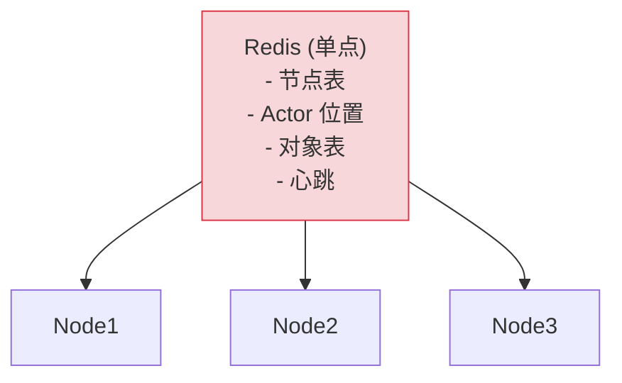
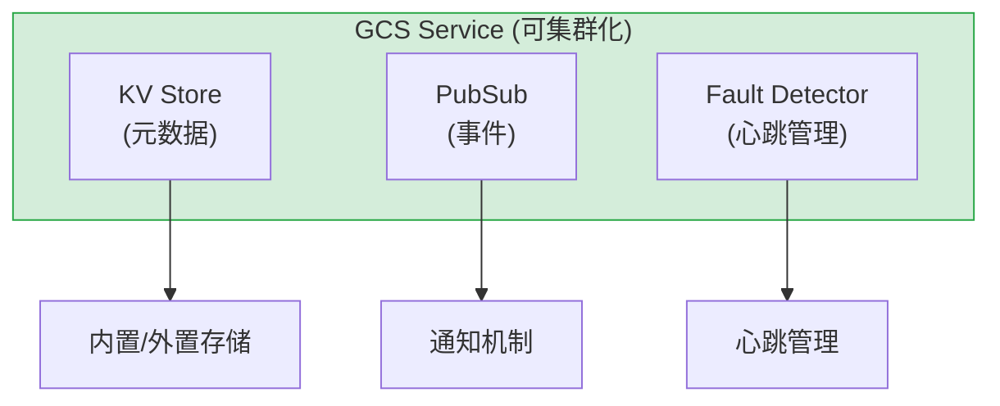
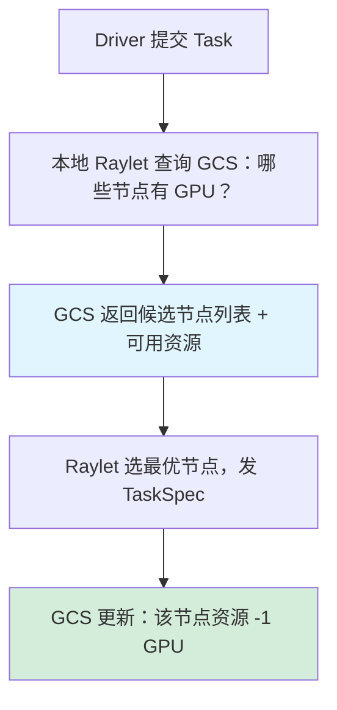
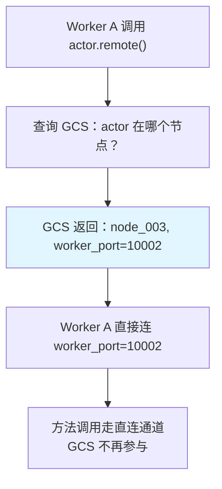
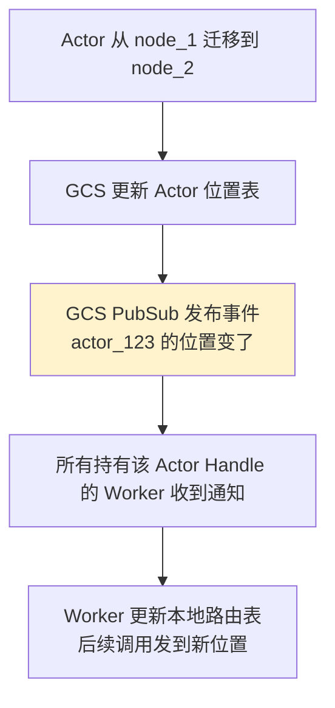

# GCS 全局控制存储

## 提出问题

一个 Ray 集群可能有数百个节点、数万个 Task 和 Actor、数百万个 Object。所有的元数据——哪个 Actor 在哪个节点、哪些对象被谁引用、集群有多少可用资源——这些信息怎么管理？如果存在某个单点上，挂了整个集群就瞎了。

Ray 的 GCS（Global Control Store）就是要解决这个问题：**集群的"大脑"**。

## 核心原理

GCS 是 Ray 集群的**全局元数据管理中心**。它存储所有需要跨节点共享的状态信息，但并不参与数据的传输（数据走 Plasma）。

> **类比**：GCS 像是公司**前台 + 公告板**的结合体——
> - 前台知道每个员工在哪个工位（Actor 位置）
> - 公告板上贴着谁在用哪间会议室（资源分配）
> - 访客登记簿记录着谁来过（对象元数据）
> - 但前台不帮你搬东西（数据走 Plasma 直连）

## GCS 存储的内容

### 集群拓扑

```
GCS 中的节点注册表：
{
    "node_001": {
        "address": "192.168.1.10:6379",
        "resources": {"CPU": 16, "GPU": 4, "memory": 64GB},
        "status": "ALIVE",
        "heartbeat": 1234567890
    },
    "node_002": {
        "address": "192.168.1.11:6379",
        "resources": {"CPU": 8, "GPU": 2, "memory": 32GB},
        "status": "ALIVE",
        "heartbeat": 1234567891
    }
}
```

### Actor 位置

```
GCS 中的 Actor 注册表：
{
    "actor_abc": {
        "class": "Trainer",
        "location": "node_002",
        "worker_id": "worker_123",
        "status": "RUNNING",
        "resources": {"GPU": 1}
    }
}
```

当任何 Worker 调用 `actor.method.remote()` 时，会先查 GCS → 找到 Actor 在 node_002 → 发请求到 node_002 的对应 Worker。

### 对象元数据

```
GCS 中的对象表：
{
    "object_xyz": {
        "owner": "worker_A@node_001",
        "locations": ["node_001", "node_003"],  // 副本位置
        "size": 1048576,
        "created_at": 1234567890,
        "ref_count": 3,
        "lineage": "Task_B(123, 456)"
    }
}
```

### 作业与 Task 状态

```
GCS 中的作业表：
{
    "job_001": {
        "driver": "192.168.1.100:10001",
        "entrypoint": "train.py",
        "status": "RUNNING",
        "submitted_at": 1234567890
    }
}
```

## GCS 的架构演进

### 早期（Ray < 1.0）：Redis 单点



问题：Redis 单点瓶颈和单点故障。

### 现在（Ray 2.x+）：分布式 GCS



- **KV Store**：存储所有键值对元数据，可选用内置存储或 Redis
- **PubSub**：发布/订阅机制，当 Actor 位置变化时通知订阅者
- **Fault Detector**：心跳管理，检测节点/Actor 存活

### GCS 的容错

```
GCS 容错策略：
  - 内置存储模式：GCS 数据持久化到磁盘 (RocksDB)
  - 外置 Redis 模式：Redis 做主从 + 哨兵
  - GCS 挂了：新 Task 无法调度，但已运行的 Task/Actor 继续工作
  - GCS 恢复后：拉取当前集群状态，恢复服务
```

## GCS 与系统交互

### Task 调度时的 GCS 角色



### Actor 调用时的 GCS 角色



**关键设计**：GCS 只存位置信息，数据面和调用面不经过 GCS。这避免了 GCS 成为性能瓶颈。

## GCS 的 PubSub 机制

当 Actor 状态变化时，GCS 通过 PubSub 通知相关方：



## GCS 一致性保证

GCS 是**最终一致性**的，不是强一致性：

```
强一致性 (Ray 不保证):
  写入后立即读取一定能读到最新值
  → 性能代价太大，不适合毫秒级调度

最终一致性 (Ray 的做法):
  写入后稍等就能读到最新值
  → 在调度场景中可接受
  → 节点宕机 → 心跳超时 → GCS 标记节点 DEAD → 可能有数秒延迟

实际影响：
  - 资源统计可能有短暂不准确（秒级）
  - Actor 挂了到被检测到有延迟（心跳超时）
  - 但不会出现"数据丢了"的情况
```

## 访问 GCS 信息

### 通过 Ray API

```python
# 获取集群节点信息
nodes = ray.nodes()
for node in nodes:
    print(f"Node: {node['NodeManagerAddress']}, "
          f"Resources: {node['Resources']}, "
          f"Alive: {node['Alive']}")

# 获取集群资源
print(ray.cluster_resources())   # 总资源
print(ray.available_resources()) # 可用资源

# 获取 Actor 信息
actors = ray.util.list_named_actors()
# (需要给 Actor 命名)
```

### 通过 Dashboard

`http://127.0.0.1:8265/#/actors` 可以查看所有 Actor 的状态和位置。

## GCS 故障场景

### 场景 1：GCS 短暂不可用

```
影响：
  - 新 Task 无法调度（等待 GCS 恢复）
  - 正在运行的 Task 不受影响
  - Actor 调用可以继续（直连通道）
  - ray.get() 已就绪的对象不受影响
```

### 场景 2：GCS 数据丢失

```
影响：
  - 节点注册信息丢失 → 重新注册
  - Actor 位置丢失 → Actor 调用失败
  - 对象血统丢失 → 无法血统重建
  - 已有对象在 Plasma 不受影响
```

## 常见问题

### GCS 性能瓶颈

默认单进程 GCS 可以支持 ~200 节点。超过后，可以启用外置 Redis 或水平扩展。

### GCS 内存占用

GCS 主要存元数据，对于百万级对象大约是几 GB 内存。如果对象元数据过多（每个 Task 都产生小对象），可以调整元数据 GC 策略。

## 小结

- GCS 是 Ray 的**全局元数据中心**，类似分布式系统的 etcd/ ZooKeeper
- 存储：节点信息、Actor 位置、对象元数据、心跳
- **控制面走 GCS，数据面走直连**——这是 Ray 性能的关键设计
- 采用最终一致性，不是强一致性（秒级延迟可接受）
- GCS 短暂不可用不影响已运行任务，但影响新任务调度
- 现代 GCS 基于 RocksDB，支持内置和外置 Redis 两种模式
