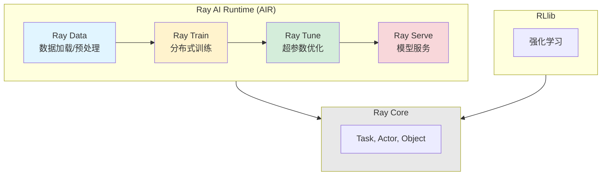

# Ray AI 库生态全景

## 问题

你已经掌握了 Ray Core（Task、Actor、Object）。但要跑一个真实的 ML 项目——从数据加载、训练、调参到部署——你需要自己用 Core 原语搭一套框架。这太吃力了。

Ray 提供了五个专门的 AI 库，每个解决一个阶段的特定问题。它们都建立在 Core 之上，共享调度、对象存储和容错能力。

## 全景图



> **类比**：如果 Ray Core 是**城市的公路网**（Task=卡车、Actor=仓库、Object=货物），那么 AI 库就是建立在公路网上的**专业物流公司**——有的专做冷链（Data）、有的专做重货运输（Train）、有的做配送调度（Serve）。每家公司都利用了同一套公路，但提供了更专业的服务。

## 五大库一览

### Ray Data：数据加载与预处理

```
                    ┌──────────┐
  S3 / HDFS / DB →  │ Ray Data │ → Ray Train
  Parquet / CSV  →  │          │ → Ray Tune
  Arrow / Pandas →  │ (分布式) │ → 自定义 Task
                    └──────────┘
```

**一句话**：把数据从任何地方读进来，分布式预处理，Pipeline 输出给训练或推理。

**关键特点**：
- 支持流式执行（边读边处理，不等全量加载）
- GPU 加速预处理（在数据传输过程中用 GPU decode/transform）
- 与 PyTorch/TensorFlow 数据集互操作

### Ray Train：分布式训练

```
┌──────────────────────────────────────┐
│  Ray Train                          │
│                                     │
│  Trainer("torch")  ← 选择框架       │
│  scaling_config: {                   │
│    num_workers: 4,                   │
│    use_gpu: true                     │
│  }                                  │
│                                     │
│  → 自动：                            │
│    - 多 GPU / 多节点 数据并行        │
│    - 模型 checkpoint                 │
│    - 故障恢复                        │
└──────────────────────────────────────┘
```

**一句话**：几行代码把 PyTorch/TensorFlow 训练扩展到多 GPU 多节点。

### Ray Tune：超参数优化

```
┌──────────────────────────────────────┐
│  Ray Tune                           │
│                                     │
│  tuner = Tuner(                      │
│      train_fn,                       │
│      param_space={                   │
│          "lr": tune.loguniform(      │
│              1e-4, 1e-1),           │
│          "batch_size": tune.choice(  │
│              [16, 32, 64]),          │
│      }                              │
│  )                                  │
│  → 自动并行探索 100 组参数           │
│  → ASHA 早停（不好的试验提前干掉）    │
└──────────────────────────────────────┘
```

**一句话**：并行跑 N 组超参数，用早停算法淘汰差的，快速找到最优配置。

### Ray Serve：模型服务

```
┌──────────────────────────────────────┐
│  Ray Serve                          │
│                                     │
│  @serve.deployment(                  │
│      autoscaling_config={            │
│          min_replicas: 1,            │
│          max_replicas: 10,           │
│          target_ongoing_requests: 100│
│      }                              │
│  )                                  │
│  class ModelServer: ...             │
│                                     │
│  → 自动扩缩容                        │
│  → 零停机滚动更新                    │
│  → 模型组合编排                      │
└──────────────────────────────────────┘
```

**一句话**：把训练好的模型部署成在线服务，自动扩缩 + 滚动更新。

### RLlib：强化学习

```
┌──────────────────────────────────────┐
│  RLlib                              │
│                                     │
│  支持算法：PPO, SAC, DQN, A3C, ...  │
│  支持环境：Gym, Unity, 自定义        │
│  分布式：多 Rollout Worker + 1 Learner│
│                                     │
│  → 工业级规模的 RL 训练              │
└──────────────────────────────────────┘
```

**一句话**：在大规模集群上跑强化学习，自动管理 rollout worker 和 learner。

## 库之间的协作

### 典型流水线

```python
import ray
from ray import train, tune, serve
from ray.data import read_parquet

# 1. Ray Data 加载和预处理
dataset = read_parquet("s3://bucket/training_data")
dataset = dataset.map_batches(preprocess_fn)

# 2. Ray Train 分布式训练
def train_func(config):
    # config 是 Tune 传入的超参数
    train_loader = train.torch.prepare_data_loader(dataset)
    model = MyModel()
    # 训练循环...

# 3. Ray Tune 调优
tuner = tune.Tuner(
    train_func,
    param_space={"lr": tune.loguniform(1e-4, 1e-1), "batch_size": tune.choice([16, 32])}
)
results = tuner.fit()
best_checkpoint = results.get_best_result().checkpoint

# 4. Ray Serve 部署
@serve.deployment
class ServedModel:
    def __init__(self):
        self.model = MyModel.from_checkpoint(best_checkpoint)
    async def __call__(self, request):
        return self.model(request)

serve.run(ServedModel.bind())
```

> **类比**：这是一条完整的汽车生产线——Data 是供应商送原料，Train 是组装车间，Tune 是质检调参数，Serve 是 4S 店交付给客户。都在同一个厂区（Ray 集群），物流不用出去再进来。

## 选择指南

| 你的需求 | 用什么 | 不用什么 |
|----------|--------|----------|
| 只想并行处理大数据 | Ray Data | 不需要 Train/Serve |
| 单节点训练，想调参 | Ray Tune | 可能不需要 Data |
| 已经有模型，只想部署 | Ray Serve | 不需要 Data/Train |
| 从零做 ML 项目 | Data → Train → Tune → Serve | 全流程 |
| 强化学习 | RLlib | 用自己的 RL 算法 |
| 自定义分布式逻辑 | Ray Core | AI 库可能太重 |

## 各库之间的关系

```
Ray Data ──→ 产出 Dataset ──→ Ray Train
                                │
                                ├──→ 产出 Model Checkpoint ──→ Ray Serve
                                │
                                └──→ 中间跟 Ray Tune 交互（调参）

RLlib 是独立的垂直方案（不用 Data/Train/Tune/Serve 管线）
但 RLlib 内部用了 Ray Core 和 Ray Tune
```

## 小结

- 五个 AI 库建立在 Ray Core 之上，共享调度、存储、容错
- **Ray Data** = 数据加载/预处理，**Ray Train** = 分布式训练
- **Ray Tune** = 超参数优化，**Ray Serve** = 模型在线服务
- **RLlib** = 强化学习框架
- 它们可以组合成完整的 ML Pipeline（Data → Train → Tune → Serve）
- 也可以用其中一个（比如只用 Tune 调参、只用 Serve 部署）
