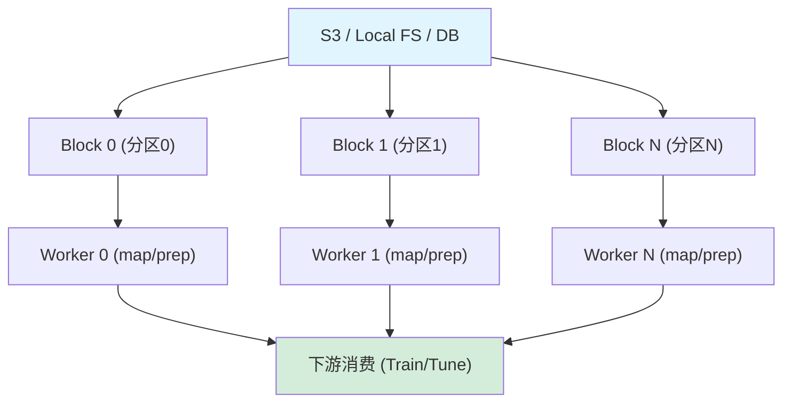

# Ray Data 数据处理

## 提出问题

ML 训练的第一步永远是数据准备。数据可能在 S3、HDFS、本地磁盘上，格式是 Parquet、CSV、图片文件——你需要读进来、预处理、分 batch、喂给训练循环。单机 Pandas 在大数据量下 OOM，Spark 太重且不支持 GPU 预处理。Ray Data 怎么解决？

## 核心原理

Ray Data 是一个**分布式数据加载和预处理引擎**，它把大数据集拆分成多个 **Block**，每个 Block 在不同 Worker 上并行处理，输入输出都可以是流式（不等全部读完就开始处理）。

> **类比**：Ray Data 像是**流水线的供料系统**——大仓库里的原材料（S3 中的数据）被拆成小批次，由传送带分发给不同的加工站（Worker），边输送边加工，而不是先把整个仓库搬过来。

## 架构



## 基本用法

### 读取数据

```python
import ray
from ray.data import read_parquet, read_csv, read_images

# 从本地或云存储读取
ds = read_parquet("s3://my-bucket/data/*.parquet")
ds = read_csv("/local/path/*.csv")
ds = read_images("s3://bucket/images/")

# 从 Python 对象创建
import pandas as pd
df = pd.DataFrame({"a": range(1000), "b": range(1000)})
ds = ray.data.from_pandas(df)

# 从 Arrow 创建
import pyarrow as pa
table = pa.table({"a": range(1000)})
ds = ray.data.from_arrow(table)
```

### 数据处理

```python
# map_batches：批量处理（推荐，减少调度开销）
ds = ray.data.read_parquet("s3://bucket/data")
ds = ds.map_batches(lambda batch: batch * 2)  # 批处理

# 链式操作
result = (
    ray.data.read_parquet("s3://bucket/raw")
    .filter(lambda row: row["score"] > 0.8)
    .map_batches(preprocess_batch)
    .random_shuffle()
    .map_batches(augment_batch)
)
```

### 输出

```python
# 写入存储
ds.write_parquet("s3://bucket/processed/")
ds.write_csv("/local/output/")

# 转成其他格式
df = ds.to_pandas()     # → Pandas DataFrame
table = ds.to_arrow()   # → Arrow Table
tf_ds = ds.to_tf()      # → TensorFlow Dataset
torch_ds = ds.to_torch() # → PyTorch IterableDataset

# 直接迭代
for batch in ds.iter_batches(batch_size=64):
    train_step(batch)
```

## 流式执行 vs 批量执行

### 批量模式（默认）

```python
# 全部读完 → 全部处理 → 全部写出
ds = read_parquet("s3://data")
ds = ds.map_batches(heavy_transform)
ds.write_parquet("s3://output")
# 所有数据全部处理完才算完成
```

### 流式模式

```python
# 边读边处理边写
ds = read_parquet("s3://data")
ds = ds.map_batches(heavy_transform)
ds = ds.streaming_map_batches(light_transform)  # 流式处理
ds.write_parquet("s3://output")
# 数据流式通过，不需要等全部读完
```

**什么时候用流式**：
- 数据量 > 集群总内存
- 处理是逐条独立的
- 需要边处理边输出

## GPU 加速预处理

```python
# GPU 批处理：在数据传输到 GPU 的过程中顺便做预处理
ds = read_parquet("s3://images_metadata")

def gpu_preprocess(batch):
    # batch 已经是 GPU tensor
    import torch
    images = torch.stack([decode_image(b) for b in batch["bytes"]])
    return {"tensor": images.cuda()}

# 指定用 GPU 资源做预处理
ds = ds.map_batches(
    gpu_preprocess,
    batch_size=256,
    num_gpus=1,           # 每个 Worker 用 1 GPU
    compute="actors"       # 用 Actor（持久进程）执行
)
```

> **类比**：传统的"先 CPU 预处理再搬上 GPU"像是先在一楼拆箱再搬上二楼。GPU 预处理像是把货梯直接开到二楼，边搬边拆——省了中间搬运。

## 与 PyTorch/TensorFlow 集成

### PyTorch

```python
import ray.train.torch

ds = read_parquet("s3://training_data")
ds = ds.map_batches(preprocess)

# 变成 PyTorch DataLoader（分布式感知）
train_dataloader = ds.to_torch(
    label_column="label",
    batch_size=64
)

# 在 Ray Train 中使用
def train_func():
    dataloader = ray.train.torch.prepare_data_loader(train_dataloader)
    for batch in dataloader:
        ...
```

### TensorFlow

```python
import ray.train.tensorflow

tf_dataset = ds.to_tf(
    feature_columns=["x1", "x2"],
    label_column="label",
    batch_size=64
)

def train_func():
    dataset = ray.train.tensorflow.prepare_dataset(tf_dataset)
    model.fit(dataset)
```

## 与 Spark/Dask 对比

| 特性 | Ray Data | Spark | Dask |
|------|----------|-------|------|
| GPU 预处理 | ✅ 原生支持 | ❌ | ❌ |
| 流式执行 | ✅ | ✅ Structured Streaming | ❌ 以批量为主 |
| PyTorch/TF 集成 | ✅ 原生 | ⚠️ 需要额外转换 | ⚠️ 需要额外转换 |
| ML Pipeline | ✅ Data→Train→Tune→Serve | ❌ 主要是 ETL | ❌ 主要是 ETL |
| 调度延迟 | 低（亚毫秒） | 高（Stage 边界） | 中 |
| Python 生态 | 深度集成 | JVM 为主 | Python 为主 |

## 性能优化建议

### 1. 选择合适的分区数

```python
# 分区太多 → 调度开销大
# 分区太少 → 并行度不够
ds = read_parquet("s3://data", parallelism=200)
# 一般原则：分区数 ≈ 集群 CPU 核心总数的 2-4 倍
```

### 2. 大 batch 优于小 batch

```python
# ❌ 每个元素一个 Task
ds.map(lambda row: process(row))

# ✅ 批量处理
ds.map_batches(lambda batch: [process(r) for r in batch], batch_size=1000)
```

### 3. 提前过滤

```python
# ❌ 处理全部数据再过滤
ds = (ds
    .map_batches(expensive_op)
    .filter(condition)  # 浪费了 expensive_op 的计算
)

# ✅ 先过滤再处理
ds = (ds
    .filter(condition)   # 先减数据量
    .map_batches(expensive_op)
)
```

## 常见陷阱

### 1. 把整个 Dataset 转成 Pandas

```python
# ❌ 1TB 数据 to_pandas() → OOM
df = large_ds.to_pandas()

# ✅ 分批迭代
for batch in large_ds.iter_batches(batch_size=1024):
    process(batch)
```

### 2. 在 map 中访问外部状态

```python
# ❌ 每个 Task 都初始化一次（性能差）
def process(batch):
    model = load_model()  # 每个 batch 都 load 一次
    return model(batch)

# ✅ 用 Actor 保持状态
@ray.remote
class Processor:
    def __init__(self):
        self.model = load_model()
    def __call__(self, batch):
        return self.model(batch)
```

## 小结

- Ray Data 是分布式数据加载引擎，专为 ML 工作流设计
- 支持流式和批量两种执行模式
- GPU 加速预处理是其特色（不同于 Spark/Dask 的关键优势）
- 与 PyTorch/TensorFlow 原生集成，无需手动转换
- 操作链：`read → filter → map_batches → write / 送入训练`
- 性能关键是合理分区 + 批量处理 + 提前过滤
