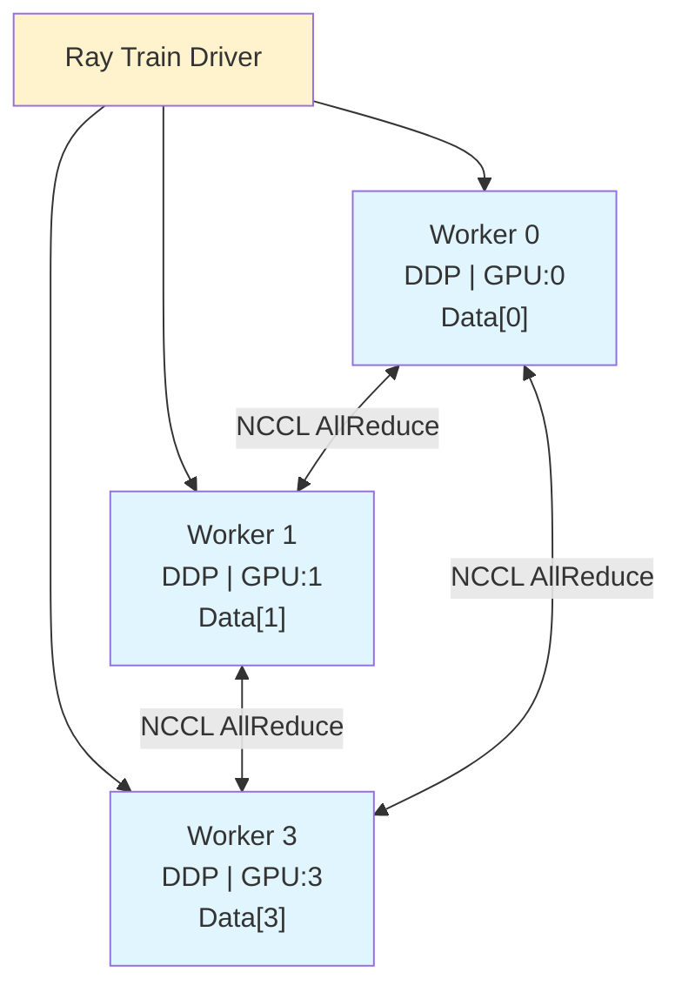

# Ray Train 分布式训练入门

## 提出问题

单 GPU 训练太慢。老板给了 8 张 GPU，但你怎么把它们用起来？PyTorch DDP 能多 GPU，但多节点配置复杂、checkpoint 自己管、挂了要手动恢复。Ray Train 的目标是：**让多 GPU 多节点训练像单机训练一样简单**。

## 核心原理

Ray Train 将训练封装为 **Trainer**，你只需要提供训练函数和资源配置，Ray Train 自动处理：

1. 创建 N 个 Worker（每个 Worker = 一个训练进程）
2. 初始化分布式通信后端（NCCL/GLOO）
3. 分配数据（每个 Worker 拿不同分片）
4. 协调梯度同步（AllReduce）
5. 管理 Checkpoint 和故障恢复

> **类比**：如果单 GPU 训练是**一个人砌墙**，Ray Train 就是**一个施工队**——队长（Trainer）负责分工：你砌这面、我砌那面（数据并行），每砌完一层大家对一下水平线（梯度同步），有工友累了换一个（故障恢复），最后合影存进度（checkpoint）。

## 快速开始

### 最简单的分布式训练

```python
import ray
from ray.train.torch import TorchTrainer
from ray.train import ScalingConfig

# 1. 定义训练函数（单 Worker 逻辑）
def train_func(config):
    # 这部分代码在每个 Worker 中独立运行
    from ray.train.torch import prepare_model, prepare_data_loader

    model = MyModel()
    model = prepare_model(model)              # 包装为 DDP
    dataloader = prepare_data_loader(loader)   # 分布式数据加载

    for epoch in range(10):
        for batch in dataloader:
            loss = model(batch)
            loss.backward()
            optimizer.step()

# 2. 配置训练规模
scaling_config = ScalingConfig(
    num_workers=4,     # 4 个 Worker
    use_gpu=True       # 每个 Worker 用 1 GPU
)

# 3. 启动训练
trainer = TorchTrainer(
    train_loop_per_worker=train_func,
    scaling_config=scaling_config
)
result = trainer.fit()
```

关键变化只有一行：`prepare_model(model)` 替代了手写 DDP 的所有样板代码。

## 训练 Worker 模型



每个 Worker：
- 有一份模型的完整副本（相同的初始权重）
- 拿到不同的数据分片
- 独立前向+反向传播
- 梯度通过 NCCL AllReduce 在所有 Worker 间平均
- 所有 Worker 的模型权重保持一致

## 与 Ray Data 集成

```python
from ray.data import read_parquet

# Ray Data 处理数据
dataset = read_parquet("s3://data").map_batches(preprocess)

def train_func(config):
    dataloader = ray.train.torch.prepare_data_loader(
        dataset.to_torch(batch_size=64)
    )
    # ... 训练 ...

trainer = TorchTrainer(
    train_loop_per_worker=train_func,
    datasets={"train": dataset},  # Ray 自动分片
    scaling_config=ScalingConfig(num_workers=4, use_gpu=True)
)
```

Ray Train 会自动将 Dataset 分片——每个 Worker 拿不同的分片，不需要手动切数据。

## Checkpoint 与恢复

```python
from ray.train import Checkpoint
import tempfile
import torch

def train_func(config):
    model = prepare_model(MyModel())
    optimizer = torch.optim.Adam(model.parameters())

    # 恢复最近的 checkpoint
    checkpoint = ray.train.get_checkpoint()
    if checkpoint:
        with checkpoint.as_directory() as tmpdir:
            model.load_state_dict(torch.load(f"{tmpdir}/model.pt"))

    for epoch in range(100):
        # 训练逻辑...

        # 定期保存 checkpoint
        if epoch % 10 == 0:
            with tempfile.TemporaryDirectory() as tmpdir:
                torch.save(model.state_dict(), f"{tmpdir}/model.pt")
                ray.train.report(
                    {"loss": loss.item()},
                    checkpoint=Checkpoint.from_directory(tmpdir)
                )
```

### 故障恢复

```python
from ray.train import FailureConfig, RunConfig

trainer = TorchTrainer(
    train_loop_per_worker=train_func,
    scaling_config=ScalingConfig(num_workers=4, use_gpu=True),
    run_config=RunConfig(
        failure_config=FailureConfig(max_failures=3)  # 最多容忍 3 次 Worker 故障
    )
)
# Worker 挂了 → Ray Train 自动重启 + 从 checkpoint 恢复
```

## 多框架支持

```python
# PyTorch
from ray.train.torch import TorchTrainer
trainer = TorchTrainer(train_func, scaling_config=scaling_config)

# TensorFlow
from ray.train.tensorflow import TensorflowTrainer
trainer = TensorflowTrainer(train_func, scaling_config=scaling_config)

# 通用（自定义框架）
from ray.train import DataParallelTrainer
trainer = DataParallelTrainer(train_func, scaling_config=scaling_config)
```

## 分布式通信配置

```python
from ray.train import ScalingConfig

# 单节点多 GPU
ScalingConfig(num_workers=4, use_gpu=True)
# → 4 个 Worker，都在同一个节点

# 多节点多 GPU
ScalingConfig(num_workers=16, use_gpu=True)
# → 16 个 Worker，分布到不同节点（每个节点若干 GPU）

# 每个 Worker 多个 GPU
ScalingConfig(num_workers=2, use_gpu=True, resources_per_worker={"GPU": 4})
# → 2 个 Worker，每个用 4 GPU（适合模型并行）
```

## Batch 大小计算

数据并行中，有效 batch size = per_worker_batch_size × num_workers：

```python
# 代码中 batch_size=64, num_workers=4
dataloader = DataLoader(dataset, batch_size=64)
# → 有效 batch size = 64 × 4 = 256

# Learning Rate 缩放（Linear Scaling Rule）
# 如果单 GPU 用 lr=0.001, batch=64
# 4 GPU 用 lr=0.004, 有效 batch=256
```

## Ray Train vs PyTorch DDP vs Horovod

| 特性 | Ray Train | PyTorch DDP | Horovod |
|------|-----------|-------------|---------|
| 多节点部署 | 几行配置 | 需要手动设置环境变量、hostfile | 需要 horovodrun |
| 数据加载 | 自动分片 Ray Dataset | 需要 DistributedSampler | 需要手动分片 |
| Checkpoint | 内置（自动保存/恢复） | 自己写 | 自己写 |
| 故障恢复 | 内置 Worker 重启 | ❌ 挂了全停 | ❌ 挂了全停 |
| 多框架 | PyTorch/TF/自定义 | 仅 PyTorch | PyTorch/TF/Keras |
| 与调参联动 | 原生 Tune 集成 | 需要额外集成 | 需要额外集成 |

## 常见陷阱

### 1. 忘记 prepare_model

```python
# ❌ 没用 prepare_model → 没有 DDP 包装，梯度不同步
model = MyModel().cuda()

# ✅
from ray.train.torch import prepare_model
model = prepare_model(MyModel())
```

### 2. 在每个 Worker 上用了相同的随机种子

```python
# ✅ Ray Train 自动加不同 seed，一般不需要手动设
# 如果需要可复现性：
def train_func(config):
    from ray.train.torch import get_device
    torch.manual_seed(42 + get_device().index)  # 每个 Worker 不同 seed
```

### 3. Checkpoint 太频繁

```python
# ❌ 每个 epoch 都 checkpoint → IO 成为瓶颈
# ✅ 根据训练速度：通常每 10-30 分钟一个 checkpoint
```

## 小结

- Ray Train 用 `prepare_model` + `prepare_data_loader` 替代手写 DDP
- `ScalingConfig(num_workers=N, use_gpu=True)` 控制规模
- 与 Ray Data 集成后自动处理数据分片
- 内置 Checkpoint 管理 + 故障恢复
- 有效 batch size = per_worker_batch × num_workers，lr 需相应缩放
