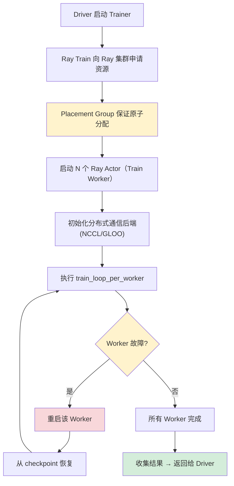
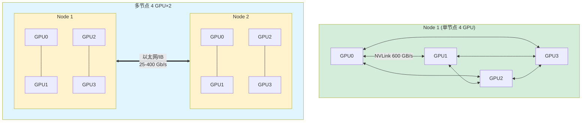
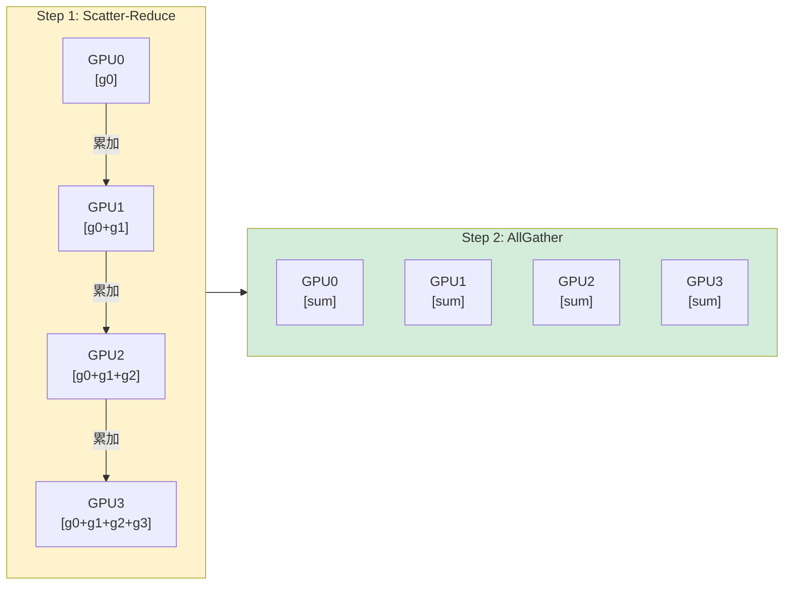
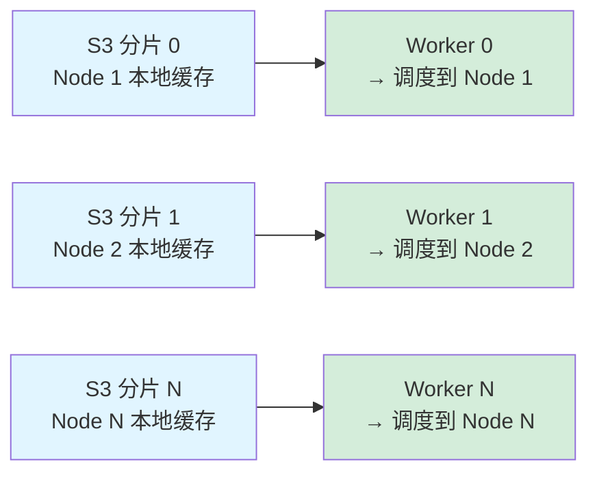
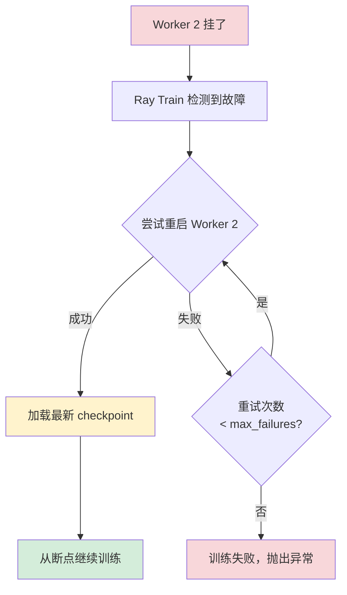

# Ray Train 深度

## 提出问题

上一节我们快速上手了 Ray Train。但要跑生产级训练，你需要理解：Ray Train 内部怎么协调多个 Worker？NCCL 是怎么集成的？大模型（超出单 GPU 显存）怎么训？训练中节点挂了怎么自动恢复？

## 训练生命周期



> **类比**：Ray Train 的启动过程像是**组建一支施工队**——先预定 N 个工位（Placement Group），然后招工人（启动 Actor）、发对讲机（初始化 NCCL）、给他们分工（train_loop_per_worker）。中间有人请假就找人替班（故障恢复）。

## NCCL 分布式通信详解

### NCCL 初始化

```python
def train_func(config):
    from ray.train.torch import prepare_model

    model = prepare_model(MyModel())
    # 内部发生了什么：
    # 1. 获取当前 Worker 的 rank 和 world_size
    # 2. 设置 MASTER_ADDR 和 MASTER_PORT（Ray 自动管理）
    # 3. torch.distributed.init_process_group(backend="nccl")
    # 4. model = DistributedDataParallel(model)
```

### 通信拓扑


  节点内：NVLink (600 GB/s)，全互联，高带宽
  节点间：以太网/IB (25-400 Gb/s)

### AllReduce 过程


  环状传递，每步累加 — 最终每个 GPU 都有相同的 sum(g0,g1,g2,g3)

## 分布式数据加载

### 自动分片

```python
def train_func(config):
    # Ray Train 自动处理数据分片
    dataloader = ray.train.torch.prepare_data_loader(
        DataLoader(dataset, batch_size=64)
    )
    # 内部自动为每个 Worker 创建 DistributedSampler
    # Worker 0: 取索引 [0, 4, 8, ...]
    # Worker 1: 取索引 [1, 5, 9, ...]
    # Worker 2: 取索引 [2, 6, 10, ...]
    # Worker 3: 取索引 [3, 7, 11, ...]
```

### 与 Ray Dataset 集成

```python
from ray.data import read_parquet
from ray.train.torch import TorchTrainer

# 大数据集：Ray Data 负责分布式读取+预处理
dataset = read_parquet("s3://huge_dataset/")
    .map_batches(preprocess)
    .random_shuffle()

trainer = TorchTrainer(
    train_loop_per_worker=train_func,
    datasets={"train": dataset},
    scaling_config=ScalingConfig(num_workers=8, use_gpu=True)
)
# dataset 自动被 8 个 Worker 分片
# 每个 Worker 只加载自己的分片，不需要全量读入内存
```

### 数据本地性优化



## 容错与弹性训练

### Worker 级容错

```python
from ray.train import ScalingConfig, RunConfig, FailureConfig

trainer = TorchTrainer(
    train_loop_per_worker=train_func,
    scaling_config=ScalingConfig(num_workers=4),
    run_config=RunConfig(
        failure_config=FailureConfig(
            max_failures=3,         # 允许 3 次 Worker 故障
            fail_fast=False         # False=尝试恢复, True=立即失败
        )
    )
)
```

### 故障恢复流程



### 弹性训练（Elastic Training）

当节点数量变化时（新节点加入或节点退出），Ray Train 可以动态调整 Worker 数量：

```python
scaling_config = ScalingConfig(
    num_workers=4,
    use_gpu=True,
    placement_strategy="SPREAD"  # 分散到不同节点
)
# 如果集群自动扩缩容，Worker 数量可以弹性变化
# 需要训练函数支持动态 world_size
```

## 报告与跟踪

### 内置指标报告

```python
from ray.air import session

def train_func(config):
    for epoch in range(100):
        loss = train_one_epoch()
        accuracy = evaluate()

        # 报告指标（会显示在 Dashboard 上）
        session.report({
            "epoch": epoch,
            "loss": loss,
            "accuracy": accuracy
        })
```

### 与 MLflow/TensorBoard 集成

```python
from ray.train import RunConfig

trainer = TorchTrainer(
    train_loop_per_worker=train_func,
    run_config=RunConfig(
        name="my_experiment",
        storage_path="s3://my-checkpoints",
        # 自动上传到 S3，兼容 MLflow
    )
)
```

## 混合精度训练

```python
def train_func(config):
    model = prepare_model(MyModel())

    # 自动混合精度（AMP）
    scaler = torch.cuda.amp.GradScaler()

    for batch in dataloader:
        with torch.cuda.amp.autocast():  # 前向用 FP16
            loss = model(batch)
        scaler.scale(loss).backward()     # 反向 scale
        scaler.step(optimizer)
        scaler.update()
```

混合精度在 Ray Train 中不需要特殊处理——跟单机写法一样。

## 大模型训练策略

### FSDP（全分片数据并行）

当模型太大，单 GPU 放不下完整副本时：

```python
from torch.distributed.fsdp import FullyShardedDataParallel
from ray.train.torch import prepare_model

# FSDP：模型参数分片到不同 GPU
# 每个 GPU 只持有部分参数，需要时再 gather
model = FullyShardedDataParallel(MyLargeModel())
model = prepare_model(model)
```

### 张量并行 + 数据并行

```python
# 2D 并行：8 GPU = 2 个张量并行组 × 4 个数据并行组
# 这需要更底层的设置，通常用 Megatron-LM 或 DeepSpeed 配合 Ray
```

## 常见陷阱

### 1. DataLoader 的 num_workers 冲突

```python
# ❌ DataLoader 的 num_workers > 0 可能与 Ray Worker 竞争资源
DataLoader(dataset, batch_size=64, num_workers=8)

# ✅ 在 Ray Worker 内部，num_workers 通常设为 0 或小区值
DataLoader(dataset, batch_size=64, num_workers=2)
```

### 2. 不同 Worker 的随机种子相同

```python
# ✅ 每个 Worker 用不同 seed
def train_func(config):
    rank = ray.train.get_context().get_world_rank()
    torch.manual_seed(42 + rank * 1000)
```

### 3. checkpoint 包含不必要的状态

```python
# ❌ checkpoint 太大
torch.save({
    "model": model.state_dict(),
    "optimizer": optimizer.state_dict(),
    "all_predictions": huge_prediction_cache  # 不需要！
}, path)

# ✅ 只保存必要状态
torch.save({
    "model": model.state_dict(),
    "optimizer": optimizer.state_dict(),
    "epoch": epoch
}, path)
```

## 小结

- Ray Train 内部用 Placement Group 预留资源，启动多个 Actor 作为 Worker
- NCCL 通信层由 Ray 自动初始化和管理
- 数据自动分片，Worker 优先调度到数据所在节点
- 内置 Worker 级容错：自动重启 + 从 checkpoint 恢复
- 混合精度、FSDP 等高级训练技术跟单机写法一致
- 指标报告会自动显示在 Dashboard，支持 MLflow/TensorBoard 集成
