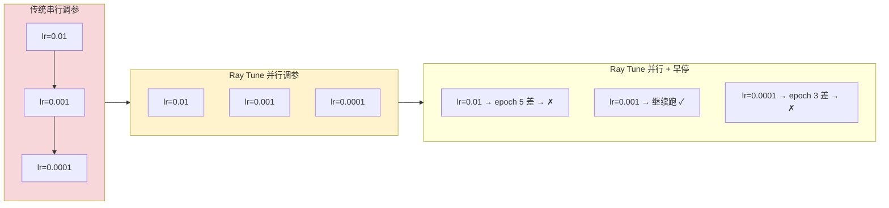
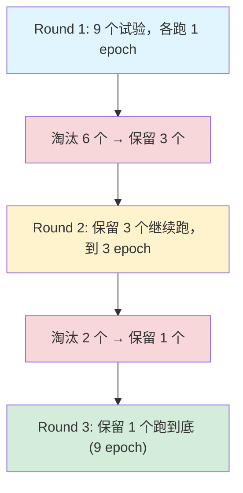

# Ray Tune 超参数优化

## 提出问题

选哪个 learning rate？batch size 多大？几层网络？这些超参数的选择直接影响模型效果。手动试 10 组组合要跑 10 次、等 10 倍时间。可你手里有 8 张 GPU，为什么不能**并行**探索？

Ray Tune 就是做这件事的——**并行超参数搜索 + 智能早停**。

## 核心原理

> **类比**：跑超参数实验像是**用不同配方做蛋糕**——普通做法是一个一个试（串行）。Tune 的做法是同时开 8 个烤箱（并行），而且每隔几分钟尝一下半成品——不好的直接倒掉（早停），不再浪费时间和材料。最后你只保留最好的那个成品。


  传统串行：3 × T | 并行：1 × T | 并行+早停：< 1 × T（省了失败的试验）

## 基本用法

### 最简单的 Tune

```python
from ray import tune

def trainable(config):
    """训练函数：config 里是待搜索的超参数"""
    lr = config["lr"]
    batch_size = config["batch_size"]

    model = create_model()
    optimizer = torch.optim.Adam(model.parameters(), lr=lr)

    for epoch in range(10):
        loss = train_one_epoch(model, optimizer, batch_size)
        tune.report({"loss": loss})  # 报告当前指标

# 定义搜索空间
param_space = {
    "lr": tune.loguniform(1e-4, 1e-1),        # 对数均匀采样
    "batch_size": tune.choice([16, 32, 64]),   # 离散选择
    "num_layers": tune.randint(2, 8),          # 整数采样
}

# 创建 Tuner
tuner = tune.Tuner(
    trainable,
    param_space=param_space,
    tune_config=tune.TuneConfig(
        num_samples=20,         # 总共尝试 20 组
        metric="loss",          # 优化目标
        mode="min",             # 最小化 loss
    )
)
results = tuner.fit()
best = results.get_best_result()
print(f"最佳配置: {best.config}, 最佳 loss: {best.metrics['loss']}")
```

## 搜索算法

### 随机搜索

```python
tune_config = tune.TuneConfig(
    num_samples=50,
    search_alg=None  # 默认随机搜索
)
```

### 贝叶斯优化（推荐）

```python
from ray.tune.search.bayesopt import BayesOptSearch

tune_config = tune.TuneConfig(
    num_samples=50,
    search_alg=BayesOptSearch(
        metric="loss",
        mode="min"
    )
)
# 优点：利用历史结果指导下一次采样，"越搜越聪明"
```

### HyperBand/ASHA 早停

```python
from ray.tune.schedulers import ASHAScheduler

tune_config = tune.TuneConfig(
    num_samples=50,
    scheduler=ASHAScheduler(
        metric="loss",
        mode="min",
        max_t=10,                 # 最多 10 个 epoch
        grace_period=2,           # 至少跑 2 个 epoch 才考虑干掉
        reduction_factor=3,       # 每次淘汰保留前 1/3
    )
)
```

### ASHA 的工作方式


  实际跑的 epoch 总数 ≈ 9×1 + 3×2 + 1×9 = 24
  如果全部跑完：9×9 = 81 epochs → 节省了 70% 的计算量！

> **类比**：ASHA 像是**选秀节目的晋级赛**——初赛所有人唱 1 分钟，评委砍掉差的。晋级的人唱 3 分钟，再砍一批。只有最强的几个能唱满全场。差的早点淘汰，不占用舞台时间。

## 搜索空间定义

```python
from ray import tune

param_space = {
    # 连续分布
    "lr": tune.loguniform(1e-5, 1e-1),        # 对数均匀
    "dropout": tune.uniform(0.0, 0.5),         # 均匀分布
    "weight_decay": tune.qloguniform(1e-5, 1e-2, 1e-5),  # 量化对数均匀

    # 离散分布
    "batch_size": tune.choice([16, 32, 64, 128]),
    "activation": tune.choice(["relu", "gelu", "swish"]),
    "num_layers": tune.randint(2, 12),

    # 嵌套搜索（搜索模型架构）
    "model": tune.choice([
        {"type": "mlp", "hidden": tune.choice([128, 256, 512])},
        {"type": "cnn", "filters": tune.randint(16, 64)},
    ]),

    # 条件依赖
    "optimizer": tune.choice(["adam", "sgd"]),
    "momentum": tune.sample_from(
        lambda spec: tune.uniform(0.8, 0.99)  # 如果 optimizer 是 sgd 才需要 momentum
        if spec.config.optimizer == "sgd" else 0.0
    ),
}
```

## 资源分配

### 为每个 Trial 分配资源

```python
# 每个 Trial 用 1 GPU
tuner = tune.Tuner(
    tune.with_resources(trainable, {"GPU": 1}),
    param_space=param_space,
    tune_config=tune.TuneConfig(num_samples=20),
)

# 每个 Trial 用 2 GPU（大模型）
tuner = tune.Tuner(
    tune.with_resources(trainable, {"GPU": 2}),
    param_space=param_space,
    tune_config=tune.TuneConfig(num_samples=20),
)
```

Tune 自动根据可用资源并行调度 Trial——有 8 GPU 时，每个 Trial 要 1 GPU → 同时跑 8 个。

## 与 Ray Train 集成

```python
from ray.train.torch import TorchTrainer
from ray import tune
from ray.tune import Tuner

def train_func(config):
    model = prepare_model(MyModel(
        num_layers=config["num_layers"],
        hidden_size=config["hidden_size"],
    ))
    optimizer = torch.optim.Adam(model.parameters(), lr=config["lr"])
    # ... 训练 ...

trainer = TorchTrainer(
    train_loop_per_worker=train_func,
    scaling_config=ScalingConfig(num_workers=2, use_gpu=True),
)

# 调参 + 分布式训练
tuner = Tuner(
    trainer,
    param_space={
        "train_loop_config": {
            "lr": tune.loguniform(1e-4, 1e-1),
            "num_layers": tune.choice([3, 6, 9]),
            "hidden_size": tune.choice([256, 512, 1024]),
        }
    },
    tune_config=tune.TuneConfig(num_samples=20),
)
results = tuner.fit()
```

每个 Trial 就是一次完整的多 Worker 训练。Tune 负责在不同 Trial 之间调度资源。

## 结果分析

```python
results = tuner.fit()

# 获取最佳结果
best = results.get_best_result()
print(f"最佳配置: {best.config}")
print(f"最佳 loss: {best.metrics['loss']}")

# 获取所有结果的 DataFrame
df = results.get_dataframe()
print(df[["config/lr", "config/batch_size", "loss"]])

# 查看特定 Trial
for result in results:
    if result.metrics.get("accuracy", 0) > 0.9:
        print(f"高准确率 Trial: {result.config}, acc={result.metrics['accuracy']}")

# 恢复 checkpoint
best_checkpoint = best.checkpoint
```

## 高级用法

### 自定义早停

```python
from ray.tune.stopper import Stopper

class MyStopper(Stopper):
    def __call__(self, trial_id, result):
        # 如果 loss 在 3 个 epoch 内不下降超过 1%，停止
        return result.get("loss_variance", 0) < 0.01

    def stop_all(self):
        # 如果最佳 loss < 0.001，停止所有实验
        return False
```

### 多目标优化

```python
# 同时优化准确率和推理延迟
tune_config = tune.TuneConfig(
    metric="accuracy",    # 主目标
    mode="max",
)

def trainable(config):
    for epoch in range(10):
        tune.report({
            "accuracy": acc,
            "latency_ms": latency    # 次要指标（用于筛选/分析）
        })
```

### 分布式调参 + 挂载存储

```python
tuner = tune.Tuner(
    trainable,
    run_config=ray.train.RunConfig(
        storage_path="s3://my-checkpoints",  # Checkpoint 存 S3
        name="hyperparameter_search_v2",
    ),
    param_space=param_space,
    tune_config=tune.TuneConfig(num_samples=100),
)
# Trial 之间可以共享 checkpoint 存储
# 不同节点上的 Trial 都能访问 S3
```

## Ray Tune vs Optuna vs HyperOpt

| 特性 | Ray Tune | Optuna | HyperOpt |
|------|----------|--------|----------|
| 分布式并行 | ✅ 原生 | ⚠️ 需要额外设置 | ⚠️ 需要 MongoDB |
| 早停 | ✅ ASHA/HyperBand/PBT | ✅ Median/Threshold | ❌ |
| 多 GPU Trial | ✅ 原生 | ⚠️ 手动管理 | ❌ |
| 与训练集成 | ✅ Ray Train 原生 | ❌ 需要胶水代码 | ❌ |
| 搜索算法 | 随机/Bayes/HEBO/Nevergrad 等 | TPE/CMA-ES/随机 | TPE/随机 |
| Checkpoint | ✅ 自动 | ⚠️ 手动 | ❌ |

## 常见陷阱

### 1. 搜索空间太大

```python
# ❌ 5 个参数，总共 20 个 Trial → 太稀疏，找不到好的
# ✅ 先用少量 Trial（10-20）粗搜，找到大致区域再细搜
```

### 2. 不以 val_loss 为指标

```python
# ❌ 用 train_loss 做早停 → 过拟合
# ✅ 用 val_loss 或 val_accuracy
```

### 3. Trial 间共享 mutable 状态

```python
# ❌ 全局变量被 Trial 修改
GLOBAL_CACHE = {}

def trainable(config):
    GLOBAL_CACHE[config["key"]] = ...  # 不同 Trial 可能冲突

# ✅ 每个 Trial 独立
def trainable(config):
    cache = {}
    cache[config["key"]] = ...
```

## 小结

- Ray Tune 并发执行超参数搜索 Trial，充分利用集群资源
- 搜索算法：随机 → 贝叶斯优化 → 梯度优化（按需求递进）
- ASHA 等早停调度器淘汰差 Trial，节省 70%+ 计算
- 与 Ray Train 无缝集成：每个 Trial = 一次分布式训练
- 搜索空间支持连续、离散、嵌套、条件依赖
- 结果分析和 checkpoint 恢复内置支持
