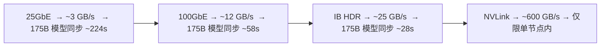
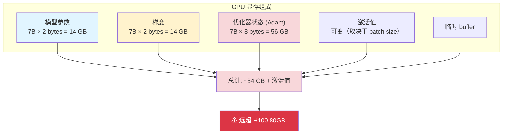

# 大规模训练最佳实践

## 提出问题

8 张 GPU 能跑了，但 64 张 GPU、多节点、几 TB 的训练数据呢？规模一大，之前不用操心的问题全冒出来：通信瓶颈、IO 瓶颈、内存瓶颈、成本爆炸。这节讲的就是**当你把规模推到极限时该怎么做**。

## 规模分级

| 规模 | GPU 数 | 典型挑战 |
|------|--------|----------|
| 小规模 | 1-8 | 单节点，主要是代码正确性 |
| 中规模 | 8-32 | 扩展到多节点，通信开始有影响 |
| 大规模 | 32-256 | 通信成为瓶颈，IO 和 checkpoint 不可忽视 |
| 超大规模 | 256+ | 容错成为必须，成本优化是核心 |

> **类比**：开一家餐馆（小规模）只要关注菜好不好吃。开连锁店（中规模）要管供应链了。全国连锁（大规模）和全球连锁（超大规模）的核心问题变成了物流（通信）、品控（容错）、成本，菜的口味反倒不是最难的事了。

## 通信优化

### 问题：多节点训练时梯度同步很慢

```
梯度同步时间 ≈ 模型参数量 × 每参数字节数 / 节点间带宽

例：175B 参数模型（FP32），8 节点，25GbE
  = 175G × 4 bytes / 3.125 GB/s
  = 224 秒 ← 每个 step 224 秒浪费在同步上！
```

### 解决方案 1：梯度累积

```python
def train_func(config):
    model = prepare_model(MyModel())
    accumulation_steps = 4  # 4 步才同步一次梯度

    for i, batch in enumerate(dataloader):
        loss = model(batch) / accumulation_steps
        loss.backward()

        if (i + 1) % accumulation_steps == 0:
            optimizer.step()      # 此时触发 AllReduce
            optimizer.zero_grad()

# 效果：通信频率降为 1/4
# 代价：有效 batch size 增为 4×，可能影响收敛
```

### 解决方案 2：使用更高带宽网络



建议：超过 2 个节点时，至少用 100GbE。

### 解决方案 3：通信与计算重叠

```python
# PyTorch 自带 overlap，只要用好 DDP
model = torch.nn.parallel.DistributedDataParallel(
    model,
    gradient_as_bucket_view=True  # 梯度分桶，边算边传
)
```

## 内存优化

### GPU 显存占用分析



### 解决方案

**混合精度训练**（必用）：

```python
scaler = torch.cuda.amp.GradScaler()

for batch in dataloader:
    with torch.cuda.amp.autocast(dtype=torch.float16):
        loss = model(batch)
    scaler.scale(loss).backward()
    scaler.step(optimizer)
    scaler.update()
# 参数/激活 = FP16（省一半），关键计算 = FP32（保持精度）
```

**梯度检查点 (Gradient Checkpointing)**：

```python
# 不存中间激活值，反向传播时重新计算
model = torch.utils.checkpoint.checkpoint_sequential(model, segments=4)
# 激活值显存降为 ~1/segment，但训练速度慢 20-30%
```

**FSDP（全分片数据并行）**：

```python
from torch.distributed.fsdp import FullyShardedDataParallel

model = FullyShardedDataParallel(
    model,
    cpu_offload=CPUOffload(offload_params=True)  # 参数卸载到 CPU
)
# 参数分片到所有 GPU，需要时 gather
# 4 GPU × 80GB → 可用 ~300GB（有重叠和开销）
```

**DeepSpeed ZeRO 集成**：

```python
# Ray Train + DeepSpeed
from ray.train import ScalingConfig
scaling_config = ScalingConfig(
    num_workers=8,
    use_gpu=True,
    resources_per_worker={"GPU": 8}  # 每个 Worker 8 GPU
)
```

## IO 优化

### 数据加载瓶颈


### Ray Data 流式加载

```python
# 流式加载：不需要等全部数据读完
ds = read_parquet("s3://data")
    .streaming_map_batches(preprocess)  # 流式！边读边处理
    .to_torch(batch_size=64)

# 配合 Ray Train 的预取
def train_func(config):
    dataloader = prepare_data_loader(
        ds.to_torch(batch_size=64),
        prefetch_factor=4  # 预取 4 个 batch
    )
```

### Checkpoint 优化

```python
# ❌ 每个 epoch 都 checkpoint → IO 成为瓶颈
# ✅ 间隔合理

import ray.train
from ray.train import Checkpoint

def train_func(config):
    for epoch in range(100):
        # 训练...

        # 每 10 个 epoch 或 每 30 分钟 checkpoint
        if epoch % 10 == 0:
            with tempfile.TemporaryDirectory() as tmpdir:
                torch.save(model.state_dict(), f"{tmpdir}/model.pt")
                ray.train.report(
                    {"loss": loss},
                    checkpoint=Checkpoint.from_directory(tmpdir)
                )

# Checkpoint 自动上传到 storage_path（S3/NFS）
trainer = TorchTrainer(
    train_func,
    run_config=RunConfig(
        storage_path="s3://my-checkpoints",  # 云端持久化
    )
)
```

## 成本优化

### 使用竞价/抢占实例

```python
# Ray Train 的故障恢复对竞价实例友好
trainer = TorchTrainer(
    train_func,
    run_config=RunConfig(
        failure_config=FailureConfig(
            max_failures=10,  # 允许多次节点被回收
            fail_fast=False
        )
    )
)
# 集群自动扩缩容 → 节点被回收 → 自动重启 Worker → 从 checkpoint 继续
```

### 训练前验证

```python
# 避免在完整数据集上训练才发现 bug

# Step 1: 小规模快速验证（1 GPU, 1% 数据, 3 epochs）
trainer = TorchTrainer(
    train_func,
    scaling_config=ScalingConfig(num_workers=1, use_gpu=True),
)
results = trainer.fit()

# Step 2: 中规模验证（4 GPU, 10% 数据）
# Step 3: 全规模训练（64 GPU, 100% 数据）
```

### 资源利用率监控

```
Dashboard 关注指标：
  - GPU 利用率 > 90%：健康
  - GPU 利用率 50-80%：可能是 IO 瓶颈
  - GPU 利用率 < 50%：严重浪费

  - GPU 显存利用率 > 90%：可能需要更大的 batch 或更少的模型参数
  - GPU 显存利用率 < 50%：batch size 太小，资源浪费
```

## 最佳实践 Checklist

| 类别 | 实践 | 适用规模 |
|------|------|----------|
| 训练 | 混合精度 (AMP) | 所有 GPU 训练 |
| 训练 | 梯度累积减少通信 | 多节点 |
| 内存 | 梯度检查点 | 模型 > 10B |
| 内存 | FSDP/DeepSpeed | 模型 > 单 GPU 显存 |
| IO | 流式数据加载 | 数据集 > 集群内存 |
| IO | Checkpoint 间隔 ≥ 30min | 所有 |
| 容错 | `max_failures ≥ 3` | 多节点 |
| 成本 | 竞价实例 + 自动恢复 | 大规模 |
| 调试 | 小规模验证 → 全规模 | 所有 |

## 常见陷阱

### 1. Batch Size 和 Learning Rate

```python
# 有效 batch size = per_worker_batch × num_workers × accumulation_steps
# lr 需要缩放：lr_new = lr_base × sqrt(num_workers)

# 4096 的有效 batch size 用 0.001 的 lr 可能太小
```

### 2. Checkpoint 包含不必要的数据

```python
# ❌ checkpoint 几百 GB（包含了所有预测缓存）
torch.save({
    "model": model.state_dict(),
    "optimizer": optimizer.state_dict(),
    "predictions": all_predictions  # 不要！
}, path)

# ✅ checkpoint 只含必要状态
```

### 3. NCCL 超时

```python
# 大模型同步时间超长 → NCCL 默认超时不够
import os
os.environ["NCCL_TIMEOUT"] = "3600"  # 1 小时
```

## 小结

- 通信优化：梯度累积、高速网络、通信计算重叠
- 内存优化：混合精度（必用）+ 梯度检查点 + FSDP/DeepSpeed
- IO 优化：流式数据加载、合理 checkpoint 间隔
- 成本：竞价实例 + 故障恢复 + 小规模验证
- 核心原则：**先在小规模上验证正确性，再推到全规模**
