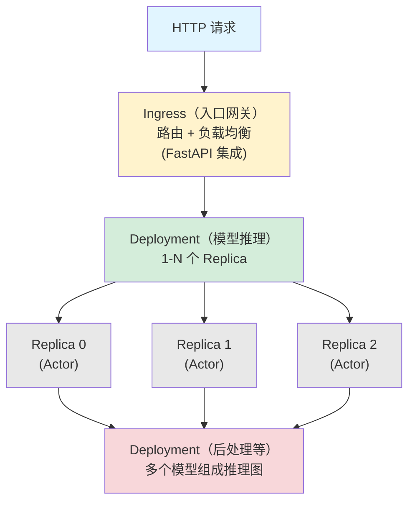
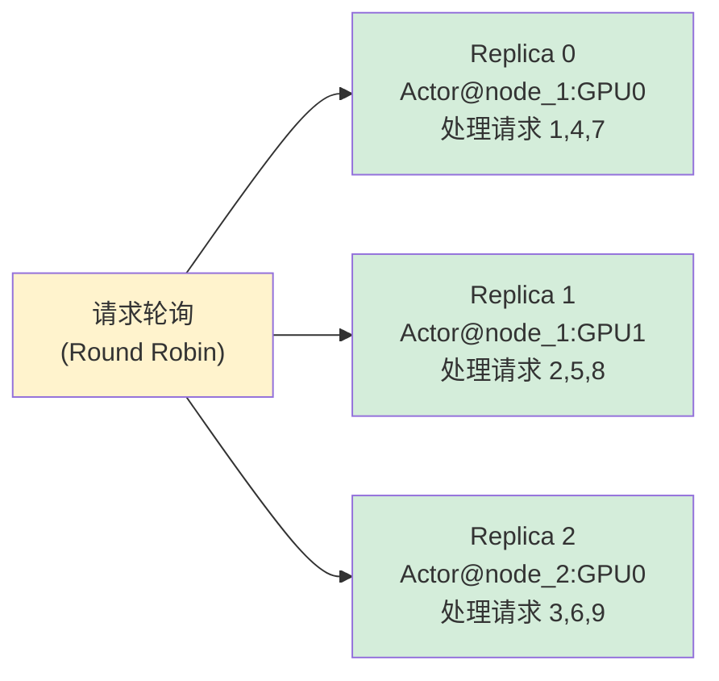

# Ray Serve 核心概念

## 提出问题

训练好的模型如果不能高效地上线服务，它就是一块砖。部署模型服务面临几个经典问题：

- **延迟**：请求过来要多久返回？
- **吞吐**：一秒能处理多少请求？
- **扩缩**：流量大了能不能自动加实例？小了能不能缩回去省成本？
- **更新**：发新版模型能不能不中断服务？

Ray Serve 就是专门解决这些问题的模型服务框架。

## 核心原理

Ray Serve 把模型服务抽象为三层：



> **类比**：Ray Serve 部署模型像是一家餐厅——
> - **Ingress** = 门口的迎宾员，把客人引到合适的位置
> - **Deployment** = 后厨（一个后厨可以有多个厨师 = Replica）
> - **Replica** = 单个厨师，按菜单（模型）做菜
> - **自动扩缩** = 客人多时加厨师，客人少时减厨师

## 快速开始

### 最简单的服务

```python
from ray import serve
from starlette.requests import Request

# 1. 定义 Deployment
@serve.deployment
class SimpleModel:
    def __init__(self):
        self.model = load_model()  # 初始化时加载模型

    async def __call__(self, request: Request):
        data = await request.json()
        prediction = self.model(data["input"])
        return {"prediction": prediction}

# 2. 部署
serve.run(SimpleModel.bind())

# 3. 调用
# curl http://127.0.0.1:8000/ -d '{"input": [1, 2, 3]}'
```

关键点：`@serve.deployment` 把一个 Python 类变成可水平扩展的服务。

### Deployment 配置

```python
@serve.deployment(
    name="my_model",           # 服务名
    num_replicas=4,            # 启动 4 个实例
    ray_actor_options={
        "num_gpus": 1,         # 每个实例 1 GPU
        "num_cpus": 2,         # 每个实例 2 CPU
    },
    max_ongoing_requests=10,   # 每个实例最多同时处理 10 个请求
)
class MyModel:
    ...
```

## 核心概念详解

### Deployment（部署单元）

Deployment 是一个可以独立扩缩的模型服务单元：

```python
@serve.deployment(name="text_classifier", num_replicas=2)
class TextClassifier:
    def __init__(self):
        self.model = load_classifier()

    async def __call__(self, request):
        text = await request.json()
        return self.model(text)
```

一个 Deployment = 一组相同的 Replica。

### Replica（副本）

每个 Replica 是一个 Ray Actor，运行在集群中的某个节点上：



### Ingress（入口）

Serve 默认在 `http://127.0.0.1:8000` 启动一个 HTTP 服务器，支持 FastAPI 集成：

```python
from fastapi import FastAPI
from ray.serve.handle import DeploymentHandle

app = FastAPI()

@serve.deployment
@serve.ingress(app)  # 绑定 FastAPI
class Gateway:
    def __init__(self, model_handle):
        self.model = model_handle

    @app.post("/classify")
    async def classify(self, request: Request):
        result = await self.model.remote(request)  # 调用下游 Deployment
        return result

model = TextClassifier.bind()
gateway = Gateway.bind(model)
serve.run(gateway)
```

### DeploymentHandle（服务调用）

一个 Deployment 可以调用另一个 Deployment：

```python
@serve.deployment
class Preprocessor:
    async def __call__(self, text: str):
        return tokenize(text)

@serve.deployment
class Model:
    def __init__(self, preprocessor_handle):
        self.preprocessor = preprocessor_handle

    async def __call__(self, request):
        text = await request.json()
        tokens = await self.preprocessor.remote(text)  # 调用 Preprocessor
        return self.model(tokens)

# 绑定依赖
prep = Preprocessor.bind()
model = Model.bind(prep)
serve.run(model)
```

> 注意：`.remote()` 调用自动通过 Ray 网络路由，不经过 HTTP。

## 与 FastAPI 原生集成

```python
from fastapi import FastAPI
from pydantic import BaseModel

app = FastAPI()

class RequestBody(BaseModel):
    text: str

@serve.deployment
@serve.ingress(app)
class TextService:
    def __init__(self):
        self.model = load_model()

    @app.get("/health")
    async def health(self):
        return {"status": "ok"}

    @app.post("/predict")
    async def predict(self, body: RequestBody):
        result = self.model(body.text)
        return {"label": result}

    @app.post("/batch_predict")
    async def batch_predict(self, body: list[RequestBody]):
        results = [self.model(b.text) for b in body]
        return {"labels": results}
```

## gRPC 支持

```python
# Serve 也支持 gRPC（性能更高，适合内部服务间调用）
@serve.deployment(grpc_servicer_funcs=[add_servicer])
class GrpcModel:
    ...
```

## 请求处理模型

### 同步模式

```python
@serve.deployment
class SyncModel:
    def __call__(self, request):
        return self.model(process(request))
# 每个 Replica 串行处理请求，适合 GPU 推理（GPU 本身是串行的）
```

### 异步模式（推荐）

```python
@serve.deployment
class AsyncModel:
    async def __call__(self, request):
        data = await request.json()
        # 可以用 asyncio.gather 并行处理
        results = await asyncio.gather(
            self.model_a(data),
            self.model_b(data),
        )
        return combine(results)
# 支持请求间的高并发，适合 CPU 推理或 IO 密集型
```

### 批处理模式

```python
@serve.deployment
class BatchedModel:
    @serve.batch(max_batch_size=32, batch_wait_timeout_s=0.1)
    async def __call__(self, inputs: list[str]):
        # inputs 是聚集的请求 batch
        # GPU 一次推理整个 batch，比逐条推理快得多
        return self.model.batch_predict(inputs)
```

> **类比**：批处理像是快递员攒够了一车包裹再出发——而不是来一个包裹就跑一趟。GPU 推理也是：32 条一次推理可能只比 1 条慢 1.5 倍，而不是 32 倍。

## Ray Serve vs 其他方案

| 特性 | Ray Serve | TorchServe | Triton | FastAPI |
|------|-----------|------------|--------|---------|
| Python 原生 | ✅ | ✅ | ❌ (C++) | ✅ |
| 多模型编排 | ✅ 原生 | ⚠️ | ✅ ensemble | ❌ |
| 自动扩缩 | ✅ 内置 | ⚠️ K8s | ✅ | ❌ |
| GPU 批处理 | ✅ @serve.batch | ✅ | ✅ dynamic batching | ❌ |
| 分布式推理图 | ✅ Deployment Handle | ❌ | ✅ | ❌ |
| FastAPI 集成 | ✅ | ❌ | ❌ | ✅ 本身 |
| 零停机部署 | ✅ 滚动更新 | ⚠️ | ⚠️ | ❌ |

## 常见陷阱

### 1. __init__ 太重导致启动慢

```python
# ❌ __init__ 中加载 10GB 模型 → Replica 启动可能需要几十秒
# ✅ 预热（Warmup）：部署时提前启动
@serve.deployment(num_replicas=2)
class HeavyModel:
    def __init__(self):
        self.model = load_big_model()  # 久是正常的，给足时间
```

### 2. GPU 推理用 async 但 GPU 是串行的

```python
# ❌ async 方法但 GPU 操作是同步的 → GPU 利用率不提高
# ✅ 用 @serve.batch 做批量推理，或增加 num_replicas
```

### 3. Deployment Handle 调用忘加 await

```python
# ❌ deployment_handle.remote(data) 返回 coroutine 但不 await
result = await deployment_handle.remote(data)  # ✅
```

## 小结

- `@serve.deployment` 把类变成可扩缩的服务单元
- Deployment = 1-N 个 Replica（每个是 Ray Actor）
- DeploymentHandle 实现 Deployment 之间的直接调用
- FastAPI 集成提供 HTTP API + 自动文档
- `@serve.batch` 实现 GPU 推理批处理
- `@serve.ingress` 绑定 FastAPI 路由
