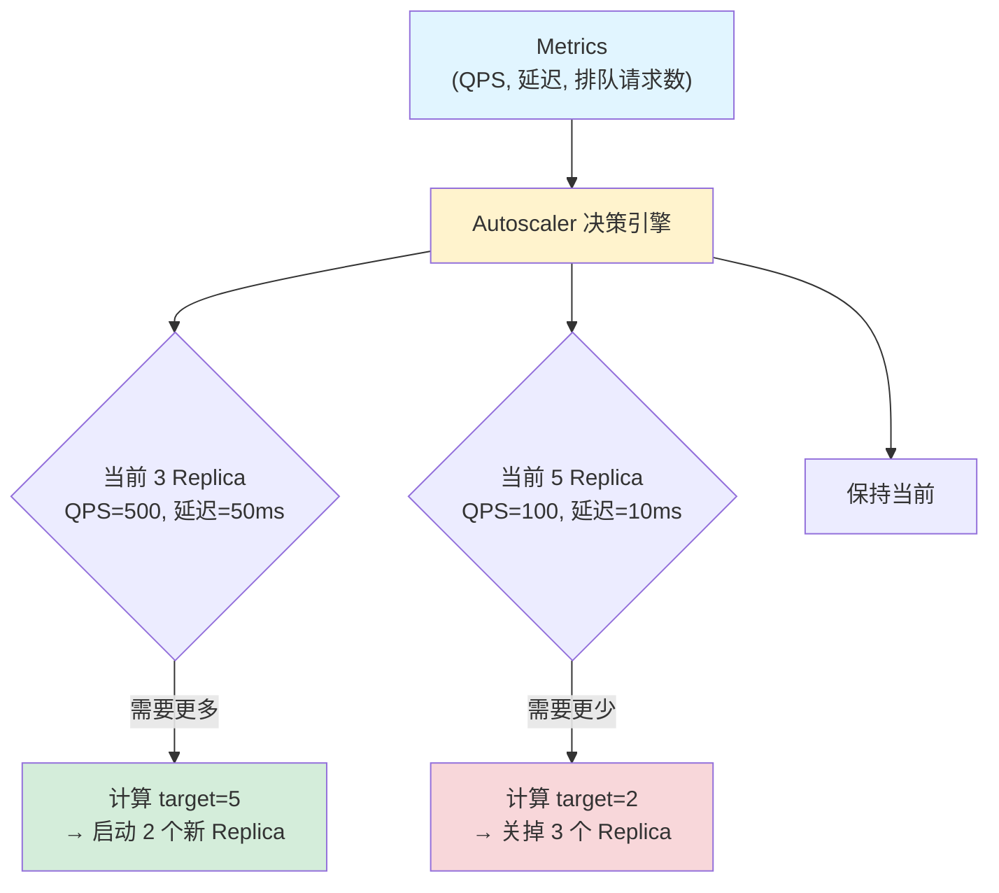
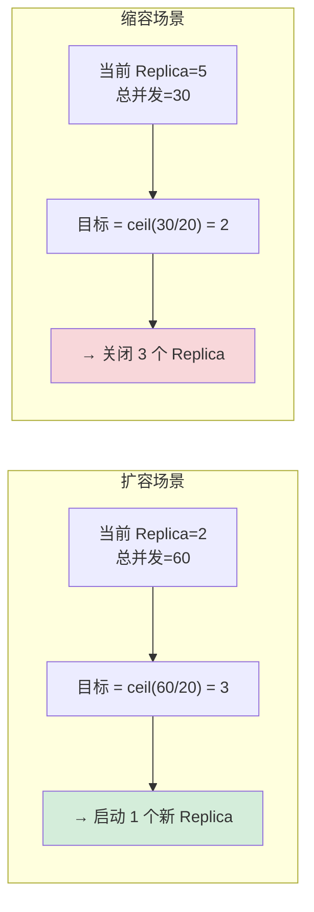
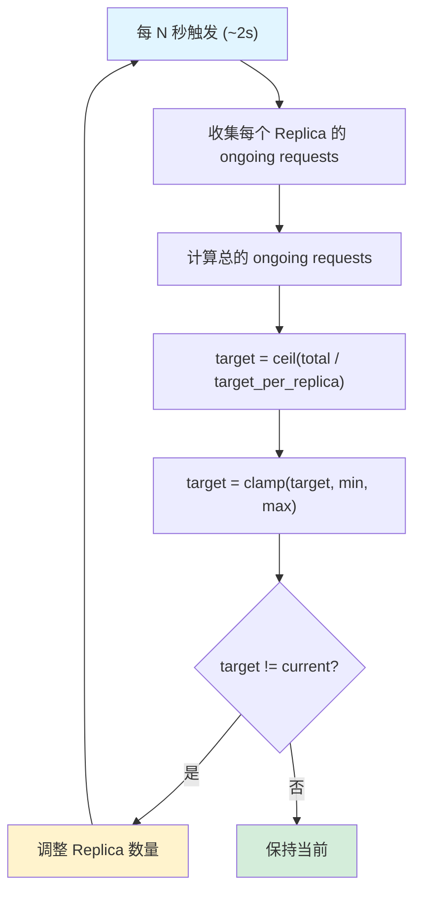
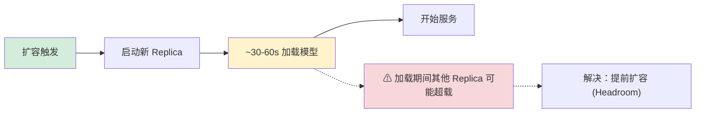
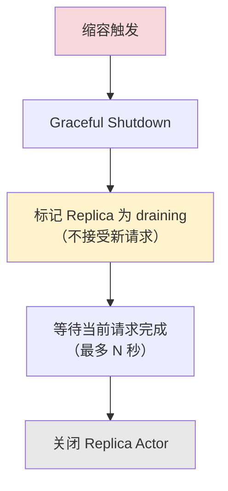

# 自动扩缩容原理

## 提出问题

模型上线后，流量不是固定的——白天高峰每秒 1000 请求，夜里低谷可能只有 10 请求。如果部署固定数量的 Replica：

- 部署少了 → 高峰期请求排队、延迟飙升、用户投诉
- 部署多了 → 低峰期 GPU 空转、浪费钱

自动扩缩容就是让 Replica 数量**跟着流量动态变化**。

## 核心原理

Ray Serve 的自动扩缩容是一个**控制回路**：监控指标 → 计算需要的 Replica 数 → 调整。



> **类比**：自动扩缩容像是商场空调的**智能温控**——人多了（QPS 高）自动加大冷气（加 Replica），人少了关小（减 Replica）。你不会手动一会调大一会调小——系统自动保持最舒适的温度。

## 基本配置

```python
from ray import serve

@serve.deployment(
    autoscaling_config={
        # 方式 1: 基于并发请求数
        "target_ongoing_requests": 10,  # 每个 Replica 处理 10 个并发请求
        "min_replicas": 1,              # 最少 1 个
        "max_replicas": 10,             # 最多 10 个
    }
)
class AutoScaleModel:
    async def __call__(self, request):
        return self.model(await request.json())
```

## 扩缩指标详解

### 1. 基于并发请求数

```python
autoscaling_config={
    "target_ongoing_requests": 20,  # 每个 Replica 目标并发 20
    "min_replicas": 2,
    "max_replicas": 20,
}
```



### 2. 基于 QPS（需外部提供）

```python
# Serve 本身不直接暴露 QPS metric，但可以自定义
autoscaling_config={
    "target_ongoing_requests": 100,
    # = 100 并发 ≈ 你希望的 QPS × 平均延迟
    # 例如：目标 QPS=1000, 平均延迟=0.1s → target=100
}
```

### 3. 基于 CPU/GPU 利用率

```python
@serve.deployment(
    autoscaling_config={
        "target_ongoing_requests": 5,
        "min_replicas": 1,
        "max_replicas": 8,
    },
    ray_actor_options={"num_gpus": 1}
)
class GpuModel:
    ...
```

GPU 场景建议用 `target_ongoing_requests` 较小值（GPU 推理是串行的，并发太多排队）。

## 扩缩决策算法

### 决策周期



### 平滑处理

```python
autoscaling_config={
    "target_ongoing_requests": 10,
    "min_replicas": 1,
    "max_replicas": 20,
    "upscale_delay_s": 1.0,          # 扩容延迟（快速反应）
    "downscale_delay_s": 60.0,        # 缩容延迟（防止抖动，等 60 秒确认）
    "smoothing_factor": 0.5,          # 指数平滑因子
}
```

### 为什么缩容比扩容慢

> **类比**：餐馆客人突然多了，你可以马上从后厨多调一个厨师来（扩容快）。但客人少了，你不会马上炒掉厨师——可能只是暂时的，等下波客人来了还得重新招人（缩容慢，避免抖动）。

## 启动与冷却

### 冷启动问题

新 Replica 启动需要时间（加载模型、初始化），期间无法处理请求：



```python
autoscaling_config={
    # ... 基础配置 ...
    "initial_replicas": 2,  # 启动时就创建 2 个（避免冷启动）
}
```

### 优雅缩容

关闭 Replica 前，先让正在处理的请求跑完：



## 监控扩缩状态

### 通过 Dashboard

在 `http://127.0.0.1:8265/#/serve` 可以看到：
- 每个 Deployment 的 Replica 数量
- 当前 ongoing requests
- 扩缩历史

### 通过 API

```python
# 获取 Deployment 状态
status = serve.status()
deployment_status = status.get_deployment_status("my_model")
print(f"Replicas: {deployment_status.num_replicas}")
print(f"Target: {deployment_status.target_num_replicas}")
```

## 多模型联合扩缩

当多个 Deployment 组成推理图时：

```python
@serve.deployment(autoscaling_config={"target_ongoing_requests": 50})
class Preprocessor:
    ...

@serve.deployment(autoscaling_config={"target_ongoing_requests": 10})
class GpuModel:  # GPU 瓶颈
    ...

@serve.deployment(autoscaling_config={"target_ongoing_requests": 100})
class Postprocessor:
    ...

# Preprocessor → GpuModel → Postprocessor
# 每个 Deployment 独立扩缩
# GpuModel 通常是瓶颈（最贵、最慢），其他两个跟着扩但步调更小
```

> **经验**：以链条中最慢的环节为基准配置 `target_ongoing_requests`。如果 `GpuModel` 平均延迟 100ms，`Preprocessor` 平均 5ms，那后者的 `target` 可以设大很多。

## 扩缩配置调优

### 如何选 target_ongoing_requests

```
步骤：
1. 固定 1 个 Replica
2. 逐步加压直到延迟开始显著增长
3. 记录此时的并发请求数 → 这就是合适的 target
4. 例如：1 Replica 在 15 并发时延迟从 50ms 涨到 200ms
   → target_ongoing_requests = 10-12（留 20% buffer）
```

### 如何选 min_replicas

```
min_replicas = 基础负载时的并发 / target_ongoing_requests
四舍五入 + 1（留冗余）

例如：基础负载 = 20 并发, target = 10
  min_replicas = ceil(20/10) + 1 = 3
```

### 如何选 max_replicas

```
max_replicas = min(
    高峰期需要的最大 Replica 数,
    可用 GPU 数量,
    预算上限
)
```

## 常见陷阱

### 1. target 设太大导致扩缩迟钝

```python
# ❌ target=100, 平时 QPS 只有 200
# → 只需 2 Replica，但系统不会扩容直到超过 100 并发/Replica
# → 实际高峰可能打爆单 Replica

# ✅ 设小一点，让系统更敏感
autoscaling_config={"target_ongoing_requests": 20}
```

### 2. min_replicas=0

```python
# ❌ 缩到 0 → 再来请求时需要冷启动（慢！）
# ✅ min_replicas 至少 1
autoscaling_config={"min_replicas": 1}
```

### 3. max_replicas 超过 GPU 数量

```python
# ❌ 集群只有 4 GPU，max_replicas=10
# → 6 个 Replica 永远在等待资源，请求超时

# ✅ max_replicas ≤ 可用 GPU 数
```

## 小结

- 自动扩缩容 = `target_ongoing_requests` + `min/max_replicas`
- 扩容快（秒级）、缩容慢（分钟级）——避免抖动
- `target` 要通过压测确定，不是拍脑袋
- `min_replicas` 至少 1（避免冷启动）
- 多个 Deployment 独立扩缩，以瓶颈环节为基准配置
- Dashboard 可以实时查看扩缩状态
