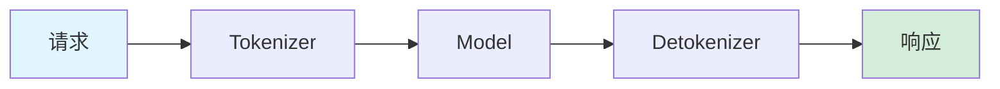
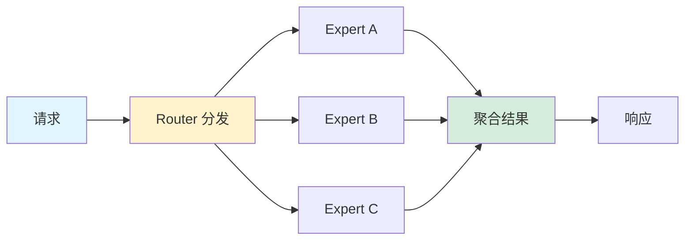
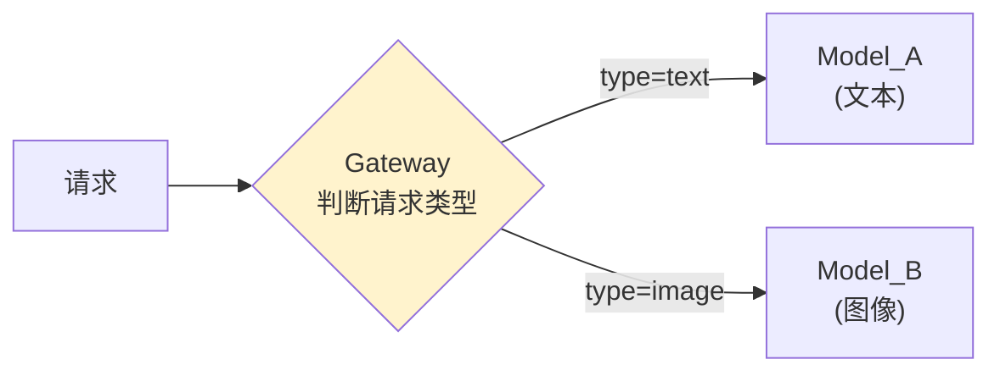
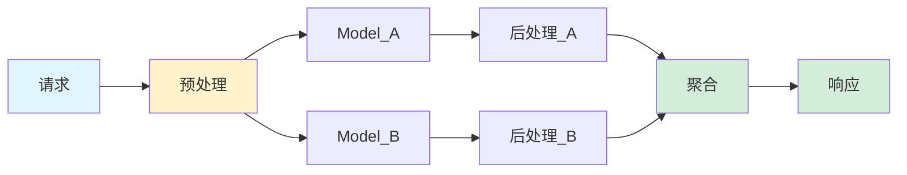
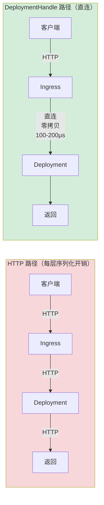

# 多模型编排与流水线

## 提出问题

真实的推理场景很少只有一个模型。常见的是：

- **预处理** → 模型 A → 模型 B → **后处理**（流水线）
- 请求来了，根据内容**路由**到模型 A 或 B（条件分发）
- 同时调多个模型，**聚合**结果（集成推理）

Ray Serve 的 DeploymentHandle 让这些模式变得简单。

## 模式 1：线性流水线 (Pipeline)



```python
from ray import serve
from ray.serve.handle import DeploymentHandle

@serve.deployment
class Tokenizer:
    def __init__(self):
        self.tokenizer = load_tokenizer()

    async def tokenize(self, text: str) -> list[int]:
        return self.tokenizer.encode(text)

@serve.deployment
class Model:
    def __init__(self, tokenizer_handle):
        self.tokenizer = tokenizer_handle
        self.model = load_model()

    async def __call__(self, request):
        text = (await request.json())["text"]
        tokens = await self.tokenizer.tokenize.remote(text)
        output = self.model.generate(tokens)
        return output

@serve.deployment
class Detokenizer:
    async def detokenize(self, ids: list[int]) -> str:
        return tokenizer.decode(ids)

# 组装
tokenizer = Tokenizer.bind()
model = Model.bind(tokenizer)
detokenizer = Detokenizer.bind()

serve.run(model)
```

> **类比**：这是工厂流水线——工序 1 产出直接进工序 2，没有中间仓库。Tokenize 的输出直接作为 Model 的输入，延迟 = 串行各步延迟之和。

## 模式 2：广播-聚合 (Fan-out / Fan-in)



```python
@serve.deployment
class Router:
    def __init__(self, expert_a, expert_b, expert_c):
        self.experts = [expert_a, expert_b, expert_c]

    async def __call__(self, request):
        data = await request.json()

        # Fan-out: 并行调用所有专家
        results = await asyncio.gather(*[
            expert.handle_request.remote(data)
            for expert in self.experts
        ])

        # Fan-in: 聚合结果（加权投票）
        return aggregate(results)

@serve.deployment
class Expert:
    def __init__(self, model_path):
        self.model = load_model(model_path)

    async def handle_request(self, data):
        return self.model(data["input"])

expert_a = Expert.bind("model_a.pt")
expert_b = Expert.bind("model_b.pt")
expert_c = Expert.bind("model_c.pt")
router = Router.bind(expert_a, expert_b, expert_c)

serve.run(router)
```

总体延迟 = max(各 Expert 延迟) + 聚合时间，而不是 sum。

> **类比**：这像是**招标**——你把需求发给三家供应商（Fan-out），等他们都报价回来（并行），选最好的（Fan-in）。你在等最慢的那个，而不是等三个加在一起。

## 模式 3：条件路由



```python
@serve.deployment
class Gateway:
    def __init__(self, text_model, image_model):
        self.text_model = text_model
        self.image_model = image_model

    async def __call__(self, request):
        data = await request.json()

        if data["type"] == "text":
            return await self.text_model.remote(data["content"])
        elif data["type"] == "image":
            return await self.image_model.remote(data["content"])
```

## 模式 4：多阶段流水线 + 并行分支



```python
@serve.deployment
class Orchestrator:
    def __init__(self, preprocessor, model_a, model_b, aggregator):
        self.preprocessor = preprocessor
        self.model_a = model_a
        self.model_b = model_b
        self.aggregator = aggregator

    async def __call__(self, request):
        data = await request.json()

        # 阶段 1: 预处理
        features = await self.preprocessor.process.remote(data)

        # 阶段 2: 并行推理
        result_a, result_b = await asyncio.gather(
            self.model_a.predict.remote(features),
            self.model_b.predict.remote(features),
        )

        # 阶段 3: 聚合
        final = await self.aggregator.combine.remote(result_a, result_b)
        return final
```

## 模式 5：流式响应

对于 LLM 等需要 token-by-token 输出的场景：

```python
from ray.serve.handle import DeploymentHandle

@serve.deployment
class StreamingLLM:
    async def generate(self, prompt: str):
        tokens = self.tokenizer.encode(prompt)

        for token in self.model.generate_stream(tokens):
            yield f"data: {token}\n\n"  # SSE 格式

@serve.deployment
@serve.ingress(app)
class Gateway:
    def __init__(self, llm_handle):
        self.llm = llm_handle

    @app.post("/chat")
    async def chat(self, request: Request):
        prompt = await request.json()

        generator = self.llm.generate.options(
            stream=True  # 流式调用
        ).remote(prompt["text"])

        # 边生成边返回给客户端
        async for chunk in generator:
            yield chunk

llm = StreamingLLM.bind()
serve.run(Gateway.bind(llm))
```

## DeploymentHandle 的性能特性

### 直连调用 vs HTTP



DeploymentHandle 的内部通信延迟约 **100-200μs**（同节点），基本没有序列化开销（零拷贝）。

### 批量调用

```python
# 一次远程调用传一批数据（推荐）
results = await model_handle.process_batch.remote(large_batch)

# 而不是循环调用
results = []
for item in batch:
    results.append(await model_handle.process.remote(item))  # ❌ N 次调用
```

## 处理回压 (Backpressure)

当上游比下游快时，需要回压防止下游被打爆：

```python
@serve.deployment(
    max_ongoing_requests=10  # 每个 Replica 最多同时处理 10 个
)
class SlowModel:
    async def __call__(self, request):
        # 处理慢
        return await heavy_compute(request)
# 当 ongoing requests > 10 时，新请求排队 → 自然形成回压
```

## 常见陷阱

### 1. 循环依赖

```python
# ❌ A 依赖 B，B 也依赖 A → 死锁
a = A.bind(b)
b = B.bind(a)
```

### 2. 串行调用瓶颈

```python
# ❌ 串行调用多个独立模型
result_a = await model_a.remote(data)
result_b = await model_b.remote(data)  # 白白等了 model_a 的时间

# ✅ 并行调用
result_a, result_b = await asyncio.gather(
    model_a.remote(data),
    model_b.remote(data),
)
```

### 3. 忘记 await

```python
# ❌ 没 await → 返回 coroutine，不是结果
result = model.remote(data)
return {"result": result}  # result 是 coroutine！

# ✅ 
result = await model.remote(data)
return {"result": result}
```

## 小结

- 线性流水线：Deployment 串行调用（latency = sum）
- 广播聚合：`asyncio.gather` 并行调用（latency = max）
- 条件路由：Gateway 根据请求内容分发
- DeploymentHandle 内部直连比 HTTP 快得多（零拷贝 + 低延迟）
- 流式响应支持 SSE，适合 LLM token-by-token 输出
- 回压通过 `max_ongoing_requests` 自然形成
