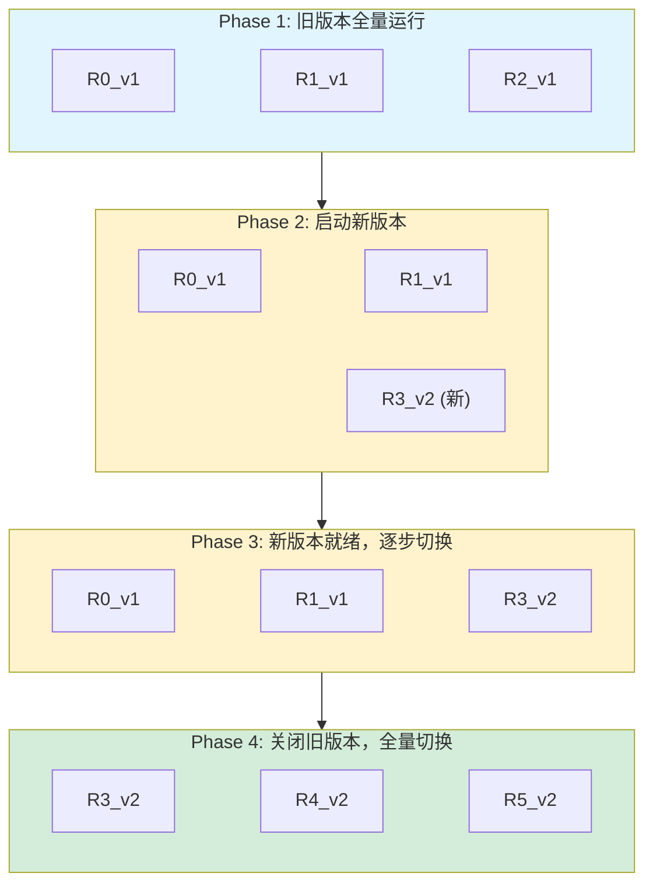

# 高级部署模式

## 提出问题

模型服务不只是"把模型部署上去"。生产环境中你需要：

- 发新版模型时不中断服务（零停机部署）
- 新版本只给 5% 流量测试（金丝雀发布）
- 同时跑两个版本对比效果（A/B 测试）
- 新版本有问题时秒级回滚

Ray Serve 怎么支持这些高级部署模式？

## 零停机滚动更新

### 原理


  整个过程中，**服务从不中断**。

整个过程中，**服务从不中断**。

> **类比**：这像是高速公路施工换路面——不是封路施工，而是先建好新车道（启动新 Replica）、车流切过去（路由切换）、最后拆旧车道（关旧 Replica）。司机全程无感知。

### 实现

```python
# 只需重新 run 新的配置，Serve 自动做滚动更新
@serve.deployment(name="model", num_replicas=4)
class ModelV2:
    def __init__(self):
        self.model = load_model_v2()  # 新模型
    ...

serve.run(ModelV2.bind())
# Serve 检测到 name="model" 的 Deployment 已有 v1
# → 启动 v2 Replica
# → 新 Replica 就绪后，旧 Replica 优雅关闭
# → 完成
```

### 控制滚动更新行为

```python
@serve.deployment(
    name="critical_service",
    num_replicas=4,
    max_ongoing_requests=10,
    health_check_period_s=10,       # 健康检查间隔
    health_check_timeout_s=30,       # 健康检查超时
    graceful_shutdown_timeout_s=60,  # 优雅关闭等待时间
)
class CriticalModel:
    ...
```

## 金丝雀发布 (Canary Deployment)

```python
# 不通过 Serve 内置机制，而是通过 Ingress 控制流量比例

@serve.deployment(name="model_v1")
class ModelV1:
    ...

@serve.deployment(name="model_v2")
class ModelV2:
    ...

@serve.deployment
@serve.ingress(app)
class CanaryGateway:
    def __init__(self, v1_handle, v2_handle, canary_percent=5):
        self.v1 = v1_handle
        self.v2 = v2_handle
        self.canary_percent = canary_percent

    @app.post("/predict")
    async def predict(self, request):
        import random
        # 5% 流量到 v2, 95% 到 v1
        if random.random() * 100 < self.canary_percent:
            return await self.v2.remote(request)
        else:
            return await self.v1.remote(request)

v1 = ModelV1.bind()
v2 = ModelV2.bind()
serve.run(CanaryGateway.bind(v1, v2, canary_percent=5))
```

```python
# 逐步增加金丝雀比例
serve.run(CanaryGateway.bind(v1, v2, canary_percent=25))
# → 观察 v2 效果
serve.run(CanaryGateway.bind(v1, v2, canary_percent=50))
# → 继续观察
serve.run(CanaryGateway.bind(v1, v2, canary_percent=100))
# → 全量 v2，可以下线 v1
```

> **类比**：金丝雀发布得名于矿工带金丝雀下井——如果金丝雀死了（新版本有问题），矿工会立刻撤出。你放 5% 真实流量进新版本，如果有问题只影响 5% 的用户而且能及时发现。

## A/B 测试

```python
@serve.deployment
@serve.ingress(app)
class ABGateway:
    def __init__(self, model_a, model_b):
        self.a = model_a
        self.b = model_b

    @app.post("/recommend")
    async def recommend(self, request):
        user_id = request.headers.get("X-User-ID", "")

        # 根据用户 ID 确定性分流（保证同一用户总是走同一模型）
        bucket = hash(user_id) % 100

        if bucket < 50:
            result = await self.a.remote(request)
            return {**result, "experiment": "A"}
        else:
            result = await self.b.remote(request)
            return {**result, "experiment": "B"}

# 50% 用户看 Model A，50% 看 Model B
# 分析指标 → 哪个效果更好 → 全量推胜者
```

## 影子流量 (Shadow Traffic)

```python
@serve.deployment
@serve.ingress(app)
class ShadowGateway:
    def __init__(self, production_model, shadow_model):
        self.prod = production_model
        self.shadow = shadow_model

    @app.post("/predict")
    async def predict(self, request):
        # 主流量走生产模型
        result = await self.prod.remote(request)

        # 影子流量：同时发给新模型，但不关心响应（fire and forget）
        asyncio.create_task(self.shadow.remote(request))

        return result
# 新模型接收真实流量但结果不返回给用户
# 用于验证新模型在生产数据上的表现
```

## 多模型版本共存

```python
# 场景：10 个租户，每个有自己的模型版本
@serve.deployment
@serve.ingress(app)
class MultiTenantGateway:
    def __init__(self):
        self.models = {}  # tenant_id → DeploymentHandle

    async def get_or_create_model(self, tenant_id: str):
        if tenant_id not in self.models:
            # 动态为租户部署模型
            ModelDeployment = serve.deployment(
                name=f"model_tenant_{tenant_id}",
                num_replicas=1
            )(TenantModel)
            serve.run(ModelDeployment.bind(tenant_id))
            self.models[tenant_id] = serve.get_deployment_handle(
                f"model_tenant_{tenant_id}"
            )
        return self.models[tenant_id]

    @app.post("/predict")
    async def predict(self, request):
        tenant_id = request.headers["X-Tenant-ID"]
        model = await self.get_or_create_model(tenant_id)
        return await model.remote(request)
```

## 部署策略对比

| 策略 | 风险 | 复杂度 | 适用场景 |
|------|------|--------|----------|
| 滚动更新 | 低 | 低 | 日常更新 |
| 金丝雀 | 极低 | 中 | 大版本升级 |
| A/B 测试 | 低 | 中 | 需要对比实验 |
| 蓝绿部署 | 低 | 高 | 核心服务 |
| 影子流量 | 极低 | 中 | 模型验证 |

## 监控与告警

### 关键指标

```python
# 通过 FastAPI 暴露指标
from prometheus_client import Counter, Histogram

predict_counter = Counter('predictions_total', 'Total predictions')
predict_latency = Histogram('predict_latency_seconds', 'Prediction latency')

@serve.deployment
@serve.ingress(app)
class MonitoredModel:
    @app.post("/predict")
    async def predict(self, request):
        predict_counter.inc()
        with predict_latency.time():
            result = await self.model.remote(request)
        return result
```

### 部署后检查

```
金丝雀发布检查清单：
  □ 新版本错误率 ≤ 旧版本
  □ 新版本 P99 延迟 ≤ 旧版本 的 1.1 倍
  □ 新版本 GPU 利用率正常（不 OOM）
  □ 持续观察 30 分钟无异常
  □ 慢慢增加流量百分比
```

## 常见陷阱

### 1. 新版本加载慢导致请求超时

```python
# ❌ 一个 10GB 模型启动要 2 分钟
# → 启动期间旧 Replica 压力大，可能超时

# ✅ 增加旧版本 buffer：更新时临时增加 num_replicas
@serve.deployment(num_replicas=5)  # 正常用 3，更新时手动提到 5
```

### 2. 不兼容的接口变更

```python
# ❌ v1 返回 {"score": 0.9}，v2 返回 {"probability": 0.9}
# → 下游崩溃

# ✅ 保持接口兼容，或做中间层转换
```

### 3. 回滚等于"重新 deploy 旧版本"

```python
# 没有内置回滚按钮！
# 回滚 = 用旧配置重新 serve.run(OldModel.bind())
# 所以需要保留旧版本的代码/配置/模型文件
```

## 小结

- 滚动更新 = `serve.run()` 自动行为，零停机
- 金丝雀发布 = Ingress 控制流量比例
- A/B 测试 = 基于用户 ID 的确定性分流
- 影子流量 = asyncio 创建独立 task，结果不返回给用户
- 关键是要保留旧版本的代码和模型，支持快速回滚
- 发布后观察错误率、延迟、资源使用，逐步加流量
