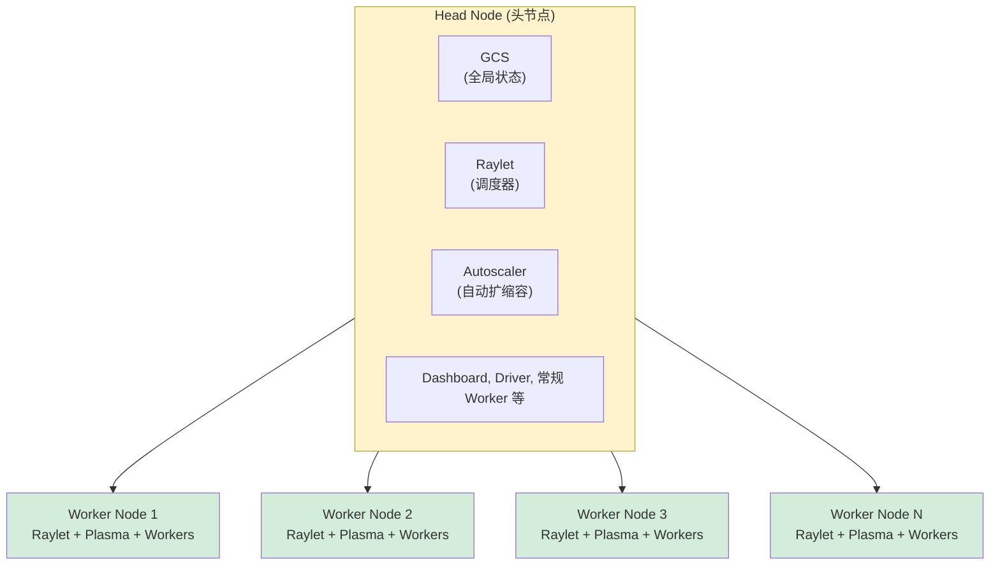
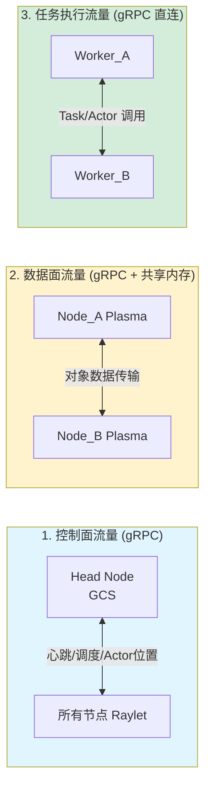
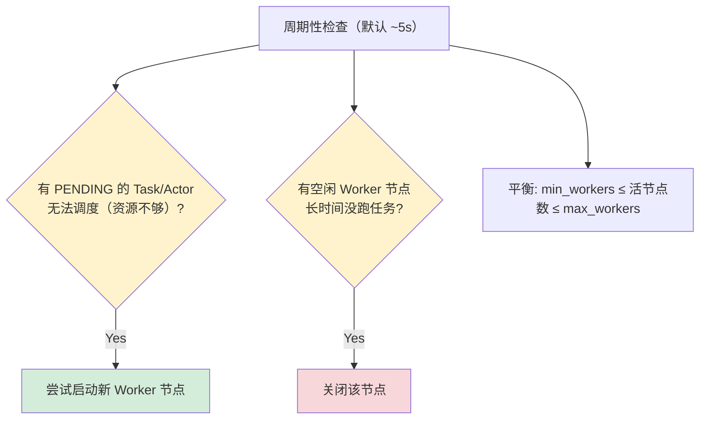
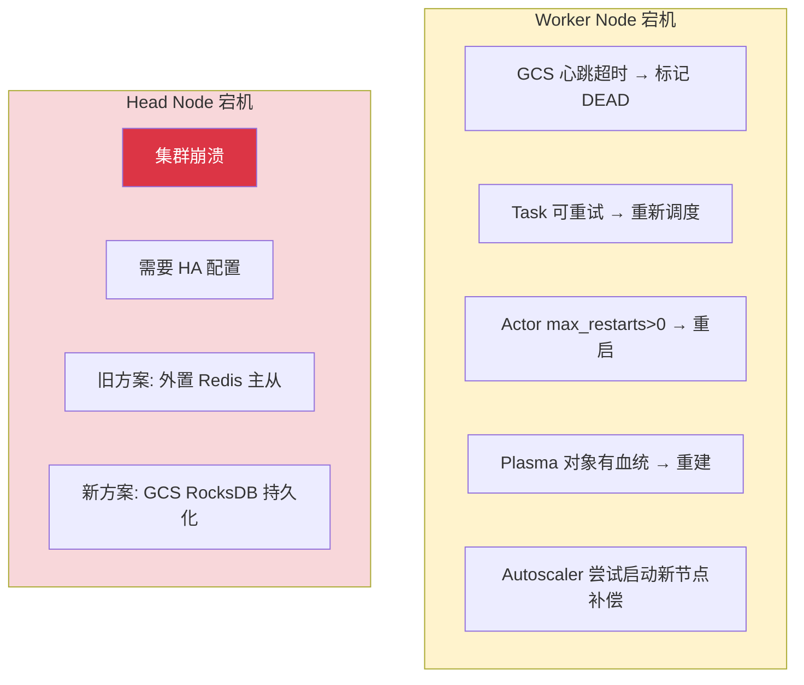

# 集群架构详解

## 提出问题

到目前为止我们都在"单机模式"下用 Ray（`ray.init()` 自动启动本地集群）。但生产环境中，Ray 集群可能跨数十个节点。理解集群架构是生产部署的基础。

## 集群拓扑



> **类比**：Head Node 是**工地指挥部**——GCS 是总工的记事本（记录一切）、Raylet 是调度室（派活）、Autoscaler 是人力资源（根据工作量增减工人）。Worker Node 是**施工队**，有自己小调度（Raylet）、共享工具房（Plasma）、几个干活的人（Worker 进程）。

## Head Node vs Worker Node

| 组件 | Head Node | Worker Node |
|------|-----------|-------------|
| GCS | ✅ 必需 | ❌ |
| Autoscaler | ✅ 必需 | ❌ |
| Dashboard | ✅ 必需 | ❌ |
| Raylet | ✅ | ✅ |
| Plasma Store | ✅ | ✅ |
| Worker 进程 | ✅ | ✅ |
| Driver（用户程序） | ✅ 通常在这 | ⚠️ 也可以 |

## 集群启动方式

### 方式 1：手动启动（适合静态集群）

```bash
# 在 Head Node 上
ray start --head \
    --port=6379 \
    --dashboard-host=0.0.0.0 \
    --dashboard-port=8265 \
    --num-gpus=4

# 在 Worker Node 上
ray start --address='192.168.1.10:6379' \
    --num-gpus=4

# 检查集群状态
ray status

# Python 程序中连接
import ray
ray.init(address="ray://192.168.1.10:10001")
# 或者
ray.init(address="192.168.1.10:6379")  # 旧版，兼容
```

### 方式 2：Ray Cluster Launcher（YAML 配置）

```yaml
# cluster.yaml
cluster_name: my-ray-cluster

max_workers: 10

provider:
  type: aws
  region: us-west-2

available_node_types:
  ray.head.default:
    resources: {"CPU": 8}
    node_config:
      InstanceType: m5.2xlarge
      ImageId: ami-xxx  # 包含 Ray 的镜像

  ray.worker.default:
    min_workers: 2
    max_workers: 10
    resources: {"CPU": 8, "GPU": 1}
    node_config:
      InstanceType: p3.2xlarge
      ImageId: ami-xxx
```

```bash
# 启动集群
ray up cluster.yaml

# 提交作业
ray submit cluster.yaml train.py

# 查看 Dashboard
ray dashboard cluster.yaml

# 销毁集群
ray down cluster.yaml
```

### 方式 3：KubeRay（Kubernetes，下一节详讲）

## 集群内部通信



### 端口总览

| 端口 | 用途 | 组件 |
|------|------|------|
| 6379 | 旧版 GCS（Redis 端口） | GCS |
| 8265 | Dashboard HTTP | Dashboard |
| 10001 | Ray Client Server | Head Node |
| 8076 | Metrics Export | 所有节点 |
| 动态分配 | Worker 间通信 | Worker |

## Autoscaler（自动扩缩容器）

### 工作原理



### 配置

```yaml
# cluster.yaml 中的 autoscaler 配置
autoscaler:
  idle_timeout_minutes: 5      # 空闲 5 分钟后回收节点
  upscaling_speed: 1.0         # 扩容激进程度
  max_launch_bucket: 200       # 一次最多启动 200 个节点
```

```python
# 代码中触发的扩容需求
@ray.remote(num_gpus=8)  # 需要 8 GPU → 如果没节点满足，触发 autoscaler
def big_task():
    ...
```

## 集群故障处理

### 节点故障



### Head 节点高可用

```bash
# 使用外部 Redis（多副本）作为 GCS 后端
ray start --head \
    --redis-password=xxx \
    --redis-shard-addresses=redis1:6379,redis2:6379,redis3:6379
```

## 集群状态检查

```python
# Python API
import ray
ray.init(address="ray://head-node:10001")

print(ray.nodes())              # 所有节点
print(ray.cluster_resources())  # 总资源
print(ray.available_resources())# 可用资源
```

```bash
# CLI
ray status                    # 集群概览
ray status --verbose          # 详细信息（每个节点的 Task/Actor）

# 输出示例：
# ======== Autoscaler status: 2026-05-10 ========
# Node status
# -------------------------------------------------------
# Active:
#  1 node_xxx (head)
#  4 node_yyy (worker)
# Pending:
#  (no pending nodes)
# Recent failures:
#  (no failures)
#
# Resources
# -------------------------------------------------------
# Total: 40.0 CPU, 8.0 GPU
# Available: 12.0 CPU, 4.0 GPU
# Used: 28.0 CPU, 4.0 GPU
```

## 常见陷阱

### 1. 网络策略阻拦端口

```
集群节点之间需要的端口是动态分配的（Worker 之间），
不能用严格的固定端口防火墙策略。
→ 确保集群内部网络是开放的（如 K8s 的 flat network）
```

### 2. Head 节点成为单点瓶颈

```
GCS 在高负载（>200 节点）可能成为瓶颈
→ 启用 Redis sharding
→ 减少不必要的 GCS 查询（减少 node info 轮询）
```

### 3. Autoscaler 过于激进或保守

```yaml
# 缩容太快 → 节点一直被创建和销毁
idle_timeout_minutes: 1  # 太短

# 缩容太慢 → 浪费钱
idle_timeout_minutes: 60  # 太长

# 建议 5-10 分钟
idle_timeout_minutes: 5
```

## 小结

- 集群 = Head Node（GCS + Autoscaler + Dashboard） + N 个 Worker Node
- 三种启动方式：手动 CLI、YAML Cluster Launcher、KubeRay
- 控制面走 GCS，数据面走直连
- Autoscaler 根据待调度任务自动增减节点
- Head 节点是单点，生产需要 HA 配置
- 集群内节点间网络需要全通（Worker 端口动态分配）
