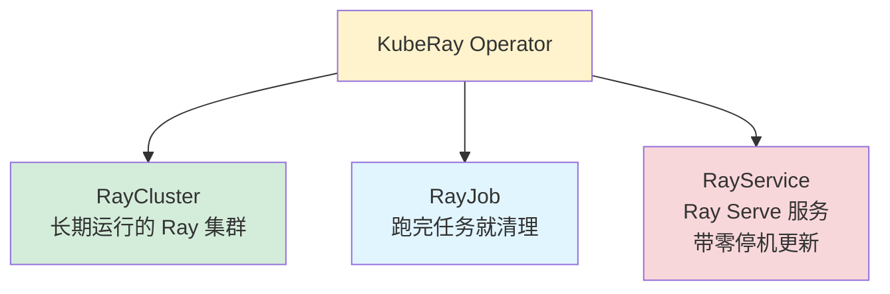
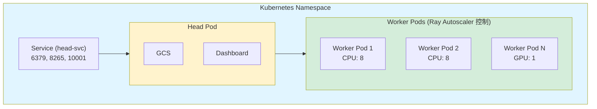
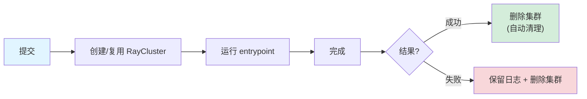
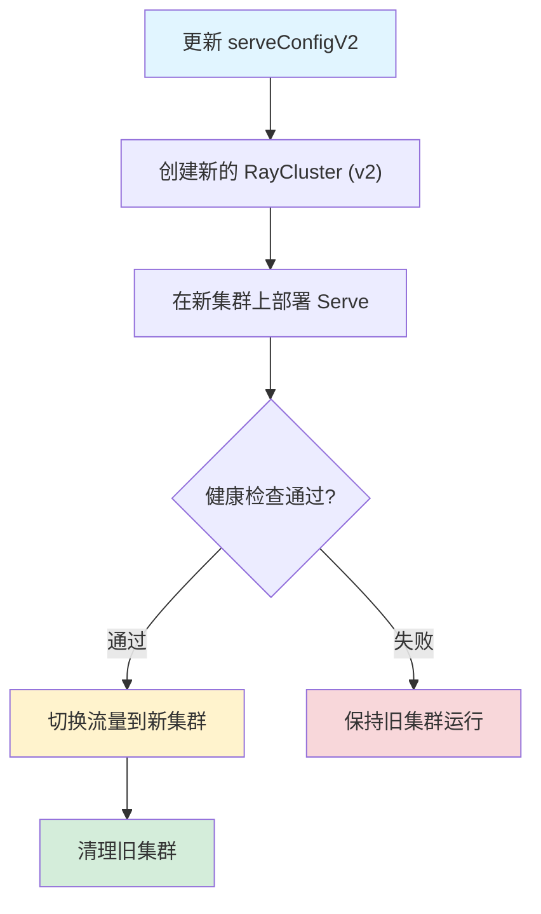
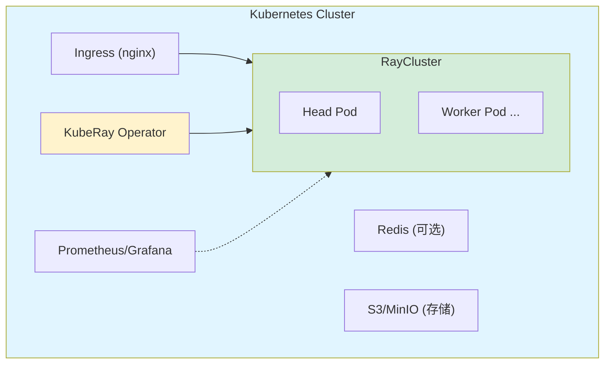
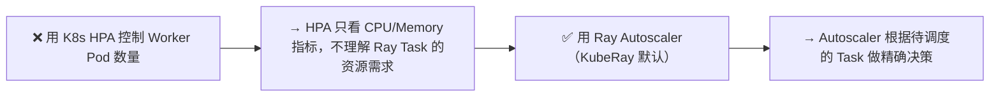

# KubeRay 与云原生部署

## 提出问题

生产环境中，Ray 通常不是孤立的——它旁边跑着 Kafka、数据库、其他微服务。这些都在 Kubernetes (K8s) 上管理。Ray 怎么融入这个 K8s 生态？怎么管理 Ray 集群的生命周期？

答案就是 **KubeRay**——Ray 的 Kubernetes Operator。

## 核心原理

KubeRay 是一个 K8s Operator（遵循 Kubernetes Operator Pattern），它在 K8s 中管理 Ray 集群。它定义了三种自定义资源（CRD）：



> **类比**：KubeRay 是 Ray 集群在 K8s 上的"物业管理系统"——
> - RayCluster = 买一栋楼（长期持有的集群）
> - RayJob = 租一个短期工位（用完就走）
> - RayService = 开一家连锁店（在线服务，要一直可用）

## RayCluster

### 基本定义

```yaml
apiVersion: ray.io/v1
kind: RayCluster
metadata:
  name: my-ray-cluster
spec:
  rayVersion: '2.40.0'

  # Head 节点 Pod 模板
  headGroupSpec:
    rayStartParams:
      dashboard-host: '0.0.0.0'
    template:
      spec:
        containers:
          - name: ray-head
            image: rayproject/ray:2.40.0
            resources:
              limits:
                cpu: "8"
                memory: "16Gi"
            ports:
              - containerPort: 6379
                name: gcs
              - containerPort: 8265
                name: dashboard
              - containerPort: 10001
                name: client

  # Worker 节点 Pod 模板
  workerGroupSpecs:
    - groupName: cpu-workers
      replicas: 3
      minReplicas: 1
      maxReplicas: 10
      rayStartParams: {}
      template:
        spec:
          containers:
            - name: ray-worker
              image: rayproject/ray:2.40.0
              resources:
                limits:
                  cpu: "8"
                  memory: "32Gi"

    - groupName: gpu-workers
      replicas: 2
      minReplicas: 1
      maxReplicas: 4
      rayStartParams: {}
      template:
        spec:
          containers:
            - name: ray-worker
              image: rayproject/ray:2.40.0-gpu
              resources:
                limits:
                  cpu: "16"
                  memory: "64Gi"
                  nvidia.com/gpu: "1"
```

```bash
# 部署
kubectl apply -f raycluster.yaml

# 查看状态
kubectl get raycluster
kubectl get pods -l ray.io/cluster=my-ray-cluster

# 访问 Dashboard
kubectl port-forward service/my-ray-cluster-head-svc 8265:8265
# 打开 http://localhost:8265

# 从外部连接
import ray
ray.init(address="ray://my-ray-cluster-head-svc:10001")
```

### RayCluster 内部结构



**重要**：Ray 的 Autoscaler 负责增减 Worker Pod，不是 K8s HPA。这是因为 Ray 需要感知 Task 级资源需求来做决策。

## RayJob

```yaml
apiVersion: ray.io/v1
kind: RayJob
metadata:
  name: train-job
spec:
  # 任务完成后自动清理
  submissionMode: InteractiveMode  # 或 HTTPMode

  # 入口脚本
  entrypoint: python /scripts/train.py

  # 使用已有的 RayCluster（或自动创建）
  # clusterSelector:
  #   matchLabels:
  #     app: my-cluster

  # 或者内嵌集群定义
  rayClusterSpec:
    headGroupSpec:
      # ... 同上 ...
    workerGroupSpecs:
      # ... 同上 ...

  # 运行时环境
  runtimeEnvYAML: |
    pip:
      - torch==2.1.0
      - transformers
    env_vars:
      MODEL_PATH: /data/models
```

```bash
# 提交作业
kubectl apply -f rayjob.yaml

# 查看作业状态
kubectl get rayjob
kubectl logs -l ray.io/job=train-job --tail=100
```

### RayJob 生命周期



## RayService

```yaml
apiVersion: ray.io/v1
kind: RayService
metadata:
  name: llm-service
spec:
  # Serve 配置
  serveConfigV2: |
    applications:
      - name: llm
        route_prefix: /llm
        import_path: serve_entry:app
        deployments:
          - name: Model
            num_replicas: 2

  # 集群配置
  rayClusterConfig:
    headGroupSpec:
      # ...
    workerGroupSpecs:
      - groupName: gpu
        replicas: 2
        rayStartParams: {}
        template:
          spec:
            containers:
              - name: ray-worker
                image: rayproject/ray:2.40.0-gpu
                resources:
                  limits:
                    nvidia.com/gpu: "1"
```

```bash
# 部署服务
kubectl apply -f rayservice.yaml

# 查看状态
kubectl get rayservice

# 访问服务
kubectl port-forward service/llm-service-serve-svc 8000:8000
curl http://localhost:8000/llm/
```

### RayService 的更新


  = 蓝绿部署在 Ray 服务层面的自动化

## 生产部署架构

### 推荐架构



### 生产 Checklist

| 类别 | 检查项 |
|------|--------|
| 镜像 | 使用固定版本的 `rayproject/ray`（不要 `latest`） |
| 资源 | 为每个 Container 设置 `resources.limits` 和 `requests` |
| GPU | 安装 NVIDIA Device Plugin + GPU Operator |
| 存储 | Head 节点的 GCS 数据挂载持久卷（PV） |
| 网络 | 确保 Pod 间网络全通（K8s CNI） |
| 监控 | 部署 ServiceMonitor 集成 Prometheus |
| 日志 | 使用 Loki/ELK 收集 Ray 日志 |
| 安全 | 限制 Dashboard 端口的公网暴露 |

## KubeRay vs 手动部署 vs Anyscale

| 特性 | KubeRay | 手动 deploy | Anyscale |
|------|---------|-------------|----------|
| 学习成本 | 需了解 K8s + Operator | 需了解网络/SSH/脚本 | 低（托管） |
| 灵活性 | 高 | 最高 | 中 |
| 运维成本 | 中（K8s 运维） | 高 | 低 |
| 集成 | 原生 K8s 生态 | 任意环境 | Anyscale 云 |
| Auto-scaling | ✅ Ray + K8s | ✅ Ray | ✅ |
| 多租户 | 通过 K8s RBAC | 手动 | ✅ |
| 成本 | 基础设施成本 | 基础设施成本 | 基础设施 + 服务费 |

## 常见陷阱

### 1. Worker Pod 被 K8s OOM Killer 杀死

```yaml
# ❌ memory limit 太小
resources:
  limits:
    memory: "4Gi"

# ✅ 给足内存，考虑 Plasma Store 也需要内存
resources:
  limits:
    memory: "32Gi"  # Worker + Plasma
```

### 2. 用 K8s HPA 而不是 Ray Autoscaler



### 3. Dashboard 暴露到公网

```yaml
# ❌ Dashboard 没有认证
# ✅ 用 Ingress + Basic Auth 或 VPN
```

## 小结

- KubeRay = K8s Operator，管理 Ray 集群的生命周期
- 三种 CRD：RayCluster（长期）、RayJob（短期任务）、RayService（在线服务）
- 用 Ray Autoscaler 而不是 K8s HPA 来控制 Worker 扩缩
- RayService 提供蓝绿部署级别的零停机更新
- 生产部署需要关注存储持久化、网络策略、监控集成
