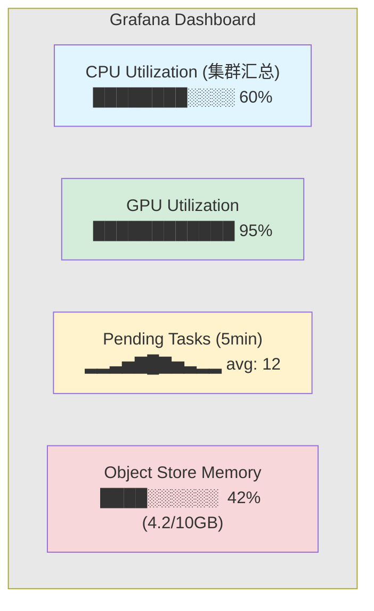
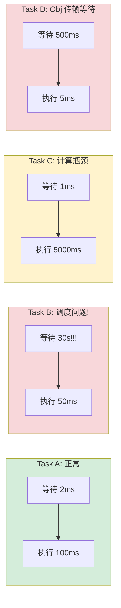

# 监控与可观测性

## 提出问题

分布式系统一旦出问题，排查非常困难——任务为什么慢？哪个节点 CPU 打满了？对象存储溢出了吗？谁 OOM 了？你需要看到集群内部的运行状态。

Ray 提供了三层可观测性：**Dashboard（实时 UI） + Prometheus Metrics（时序数据） + 日志（事件）**。

## Dashboard

### 访问

```bash
# 本地
http://127.0.0.1:8265

# 远程
kubectl port-forward svc/raycluster-head-svc 8265:8265
# http://localhost:8265
```

### Dashboard 关键页面

| 页面 | 内容 | 用途 |
|------|------|------|
| **Overview** | 集群概览、节点数、资源使用 | 一看看有没有异常 |
| **Jobs** | 作业列表、每个 Job 的 Task 状态 | 看训练跑完了没 |
| **Actors** | 所有 Actor 列表和日志 | 看 Actor 挂了没 |
| **Tasks** | Task 时间线、失败/等待 Task | 诊断调度问题 |
| **Events** | 集群事件流（启动、失败等） | 追踪历史事件 |
| **Metrics** | Grafana 风格的时序图 | 看趋势 |
| **Logs** | 聚合日志 | 看错误信息 |

### 重点监控指标

```
Job 页面:
  - STATUS: RUNNING/SUCCEEDED/FAILED
  - Duration: 运行时间
  - Tasks: 已完成/失败/等待

Actors 页面:
  - State: ALIVE/DEAD
  - Restarts: 重启次数（多 → 代码有问题）
  - Logs: 最近的错误日志

Cluster 页面:
  - Nodes: 活着的/死的
  - CPU/GPU Utilization: 利用率的百分比
  - Object Store Memory: 用了多少/总共多少
  - Disk Usage: 溢出占用
```

## Prometheus Metrics

### 启用的 Metrics 导出

Ray 自动在 `http://<node_ip>:8080` 导出 Prometheus 格式的指标。

### 核心指标

```
# 资源相关
ray_resources_total{type="CPU"}       # 总 CPU
ray_resources_available{type="CPU"}   # 可用 CPU
ray_resources_used{type="CPU"}        # 已用 CPU

# Task 相关
ray_tasks_total{state="PENDING"}      # 等待中的 Task
ray_tasks_total{state="RUNNING"}      # 运行中的 Task
ray_tasks_total{state="FINISHED"}     # 完成的 Task
ray_tasks_duration_seconds            # Task 执行时间分布

# Actor 相关
ray_actors_total{state="ALIVE"}       # 存活的 Actor 数

# 对象存储
ray_object_store_available_memory     # 可用
ray_object_store_used_memory          # 已用
ray_object_store_num_local_objects    # 本地对象数

# 调度
ray_scheduler_tasks{state="RECEIVED"} # 收到
ray_scheduler_tasks{state="SPILLBACK"}# 溢流次数
```

### Grafana Dashboard

```yaml
# prometheus-service-monitor.yaml
apiVersion: monitoring.coreos.com/v1
kind: ServiceMonitor
metadata:
  name: ray-cluster-monitor
spec:
  selector:
    matchLabels:
      ray.io/cluster: my-ray-cluster
  endpoints:
    - port: metrics  # 8080
      interval: 30s
```

在 Grafana 中导入 Ray 官方 Dashboard JSON，即可获得：



## 日志

### 日志位置

```
Head Node:
  /tmp/ray/session_latest/logs/
    ├── dashboard.log
    ├── gcs_server.out
    ├── raylet.out
    └── runtime_env_agent.log

Worker Node:
  /tmp/ray/session_latest/logs/
    ├── python-core-worker-<pid>.log  ← Worker 日志（你的代码）
    ├── raylet.out
    └── plasma_store.out
```

### 日志聚合

在 K8s 中，每个 Pod 的 stdout/stderr 自动被收集：

```bash
# Head 节点日志
kubectl logs raycluster-head-xxxxx

# 特定 Worker
kubectl logs raycluster-worker-cpu-xxxxx

# 查看某个 Actor 的日志
kubectl logs raycluster-worker-xxxxx | grep "Actor"
```

### 程序内部打日志

```python
import logging
import ray

logger = logging.getLogger("ray")

@ray.remote
def my_task():
    # 方式 1：print（会被 Ray 捕获到 Worker 日志）
    print("Processing started...")

    # 方式 2：logging（推荐）
    logger.info("Task started with args")
    try:
        result = process()
        logger.info(f"Task succeeded: {result}")
    except Exception as e:
        logger.error(f"Task failed: {e}")
        raise
```

## 告警规则

### 推荐的告警条件

```yaml
# Prometheus Alert Rules
groups:
  - name: ray-alerts
    rules:
      - alert: RayNodeDown
        expr: ray_nodes_total{state="DEAD"} > 0
        for: 2m
        annotations:
          summary: "Ray 节点宕机"

      - alert: RayObjectStoreNearFull
        expr: ray_object_store_used_memory / ray_object_store_available_memory > 0.9
        for: 5m
        annotations:
          summary: "Object Store 使用率 > 90%"

      - alert: RayPendingTasksHigh
        expr: ray_tasks_total{state="PENDING"} > 1000
        for: 10m
        annotations:
          summary: "超过 1000 个 Task 等待调度"

      - alert: RayActorRestartLoop
        expr: rate(ray_actors_restarts_total[5m]) > 0.1
        for: 5m
        annotations:
          summary: "Actor 频繁重启，可能陷入重启循环"
```

## 性能剖析 (Profiling)

### Ray Timeline

```python
# 启用 Task 时间线
import ray
ray.init(_tracing_startup_hook="ray/util/tracing_helper.py")

# 跑完任务后
# Dashboard → Tasks → Timeline view
# 可以看到每个 Task 的起止时间、等待时间、依赖关系
```

Timeline 的典型分析：



### Python Profiling

```python
@ray.remote
def profile_me():
    import cProfile
    cProfile.runctx("my_function()", globals(), locals(), "profile.out")
    # 然后查看 profile.out
```

## 常见诊断场景

### 场景 1：训练很慢

```
1. 看 Dashboard → GPU Utilization
   - GPU < 50% → 可能是 IO 瓶颈（数据加载慢）
     → 检查 DataLoader、网络带宽
   - GPU > 90% → GPU 本身是瓶颈，正常

2. 看 Timeline
   - 大量等待时间 → 调度问题或数据依赖
   - 执行时间长 → 计算本身慢，优化代码
```

### 场景 2：OOM

```
1. 看 Object Store Memory
   - 接近 100% → 对象泄漏或对象太大
   - 看 Spilled Objects → 很多溢出 → 调大 object_store_memory

2. 看 Worker 日志
   - "OutOfMemoryError" → 减少 batch size 或模型大小
```

### 场景 3：Actor 反复重启

```
1. Dashboard → Actors → Restarts 列
2. 点击 Actor → 查看日志 → 找到崩溃原因
3. 常见原因：
   - GPU OOM
   - 未捕获的异常
   - 外部依赖不可用
```

## 常见陷阱

### 1. Dashboard 内存泄漏

```
Dashboard 长时间运行可能占用大量内存
→ 定期重启 Dashboard（不是集群）
→ kubectl rollout restart deployment raycluster-head
```

### 2. Metrics 太多导致 Prometheus 内存爆炸

```
Ray 为每个 Task/Actor 都可能有指标标签
→ 在高 Task 吞吐场景下，限制 scrape interval
→ 使用 relabel_configs 过滤不需要的指标
```

### 3. 日志不滚动导致磁盘满

```bash
# Ray 默认日志文件会滚动，但需确认
# 检查 /tmp/ray 大小
du -sh /tmp/ray/session_latest/logs/
```

## 小结

- **Dashboard** 是实时查看集群状态的入口（8265 端口）
- **Prometheus Metrics** 用于时序监控和告警（8080 端口）
- **日志** 分头节点和 Worker 节点，K8s 中通过 `kubectl logs` 查看
- 推荐的告警：节点宕机、对象存储满、大量 Pending Task、Actor 频繁重启
- Timeline 是诊断调度问题最有力的工具
- 训练慢了先看 GPU 利用率；OOM 先看 Object Store；Actor 挂先看日志
