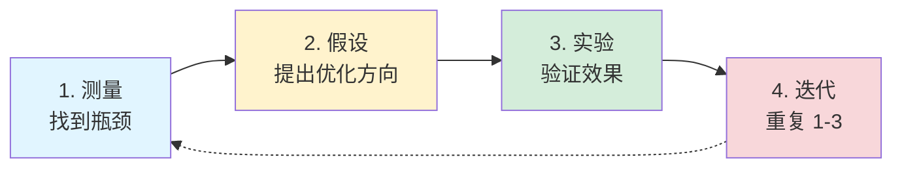
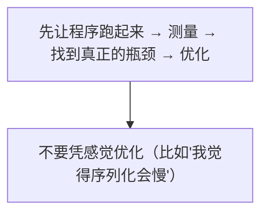
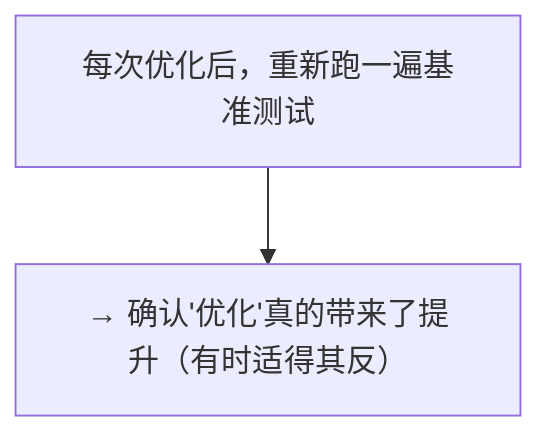
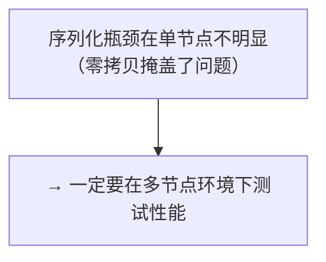

# 生产性能调优

## 提出问题

程序能跑了，但在生产环境中——资源利用率不够高、延迟不够低、成本不够低。性能调优不是玄学，而是一套系统化的方法。

## 调优方法论



> **类比**：调优像是看病——不是一上来就开刀，而是先量体温（测指标）、做检查（找瓶颈）、分析病因（假设）、开药（优化）、复查（验证）。

## 序列化优化

序列化/反序列化是分布式计算中**最容易被忽视的性能杀手**。

### 问题诊断

```python
# 看 Timeline：如果 Task 的 "等待" 时间长但 "调度等待" 短
# → 可能是对象传输/反序列化慢
```

### 优化手段

**1. 用 Arrow 格式代替 Pickle**

```python
# ❌ Pickle 序列化慢、体积大
data = {"features": np.random.randn(10000, 10000)}  # ~800MB
ref = ray.put(data)  # Pickle 序列化较慢

# ✅ 用 Arrow 兼容格式（NumPy array 直接映射，零拷贝）
import pyarrow as pa
data_array = np.random.randn(10000, 10000)
ref = ray.put(data_array)  # Arrow 格式，零拷贝
# Ray 对 NumPy, Pandas, Arrow 有优化路径
```

**2. 传引用，不传值**

```python
# ❌ 每个 Task 序列化一次
for _ in range(1000):
    task.remote(big_data)

# ✅ 序列化一次，传 ObjectRef
ref = ray.put(big_data)
for _ in range(1000):
    task.remote(ref)  # 传 20 字节的 ObjectRef
```

**3. 减少不必要的序列化字段**

```python
# ❌ 传整个 Pandas DataFrame（含 index、metadata）
df = pd.DataFrame(...)
ref = ray.put(df)  # 序列化整张表

# ✅ 只要用到的列用 Arrow table
table = pa.table({"x": df["x"].values, "y": df["y"].values})
ref = ray.put(table)  # 只序列化需要的列
```

## 批处理优化

### 合并小 Task

```python
# ❌ 10000 个小 Task（调度开销 10000×1ms = 10 秒纯开销）
futures = [small_task.remote(i) for i in range(10000)]

# ✅ 100 个批处理 Task（调度开销 100×1ms = 0.1 秒）
@ray.remote
def batch_task(indices):
    return [process(i) for i in indices]

chunks = [list(range(i, i+100)) for i in range(0, 10000, 100)]
futures = [batch_task.remote(chunk) for chunk in chunks]
```

### GPU 推理批处理

```python
# Serve 中的请求批处理（之前讲过）
@serve.deployment
class BatchedInference:
    @serve.batch(max_batch_size=32, batch_wait_timeout_s=0.05)
    async def __call__(self, inputs: list[str]):
        # 一次 GPU 推理 32 条 ≈ 单独推理 8 条的耗时
        # → 4× 吞吐提升
        return self.model.batch(inputs)
```

## 内存优化

### Object Store 调优

```python
# 场景：大量训练数据需要常驻
ray.init(
    object_store_memory=50 * 1024**3,  # 给 50GB
    _system_config={
        "object_spilling_config": json.dumps({
            "type": "filesystem",
            "params": {"directory_path": "/fast_ssd/ray_spill"}
        })
    }
)

# 监测使用率
import ray
resources = ray.available_resources()
print(f"Object store: {resources.get('object_store_memory', 0) / 1e9:.1f}GB available")
```

### 对象过早释放

```python
# ❌ 对象在使用完之前就被 GC
ref = ray.put(data)
result = process.remote(ref)
del ref  # process 还没开始！引用计数 -1

# ✅ 等用完再删
ref = ray.put(data)
result = ray.get(process.remote(ref))
del ref  # 安全
```

## 并行度调优

### 找到最佳并行度

```python
# 经验法则：
# CPU 密集型 Task → num_cpus=1, 并行度 = CPU 核数
# GPU 推理 → num_gpus=0.25-0.5, 并行度 = GPU 数 * 2-4
# GPU 训练 → num_gpus=1, 并行度 = GPU 数
# IO 密集型 → num_cpus=0.1, 并行度 = CPU 核数 * 10

# 验证：看 GPU/CPU 利用率
# 利用率 < 70% → 增加并行度
# 利用率 > 95% → 已经够好了
```

### Actor 数量的选择

```python
# Actor 内部串行，通过增加 Actor 数量增加并行度
# 合适的 Actor 数量 ≈ floor(可用资源 / 每个 Actor 需要的资源) * 0.9

# 例如：8 GPU，每个 Actor 用 1 GPU → 创建 7 个 Actor
# 留 1 GPU 做数据预处理等辅助工作
```

## 网络优化

### 对象传输

```python
# 大对象跨节点传输慢？
# 策略 1：让消费方去数据所在节点
@ray.remote
def consumer(data_ref):
    # DEFAULT 策略 → 自动调度到数据所在节点
    ...

# 策略 2：做对象复制（对频繁访问的热数据）
# 给 Ray 调度器提示，让它在该节点缓存一个副本
```

### NCCL 优化（GPU 训练）

```python
# 环境变量优化 NCCL
import os
os.environ["NCCL_NSOCKS_PERTHREAD"] = "4"
os.environ["NCCL_SOCKET_NTHREADS"] = "2"
os.environ["NCCL_BUFFSIZE"] = "2097152"

# Ray Train 会自动设置一部分，但可以根据网络环境微调
```

## 资源配置调优

### 正确声明资源

```python
# ❌ 声明了 2 CPU 但只用了 1 → 浪费，阻塞其他 Task
@ray.remote(num_cpus=2)
def light_task():
    time.sleep(1)  # 实际只用 1 CPU
    return 1

# ✅ 准确声明
@ray.remote(num_cpus=0.1)  # 大部分时间 sleep，只需要 0.1 CPU
def light_task():
    time.sleep(1)
    return 1
```

### 分数资源

```python
# 100 个 IO 等待的 Task，不需要每个都占用 1 CPU
@ray.remote(num_cpus=0.05)  # 20 个共享 1 CPU
def io_task():
    return requests.get("https://api.example.com")
```

## 调优检查清单

### 快速诊断


### 各阶段优化重点

| 阶段 | 最可能的瓶颈 | 优化方向 |
|------|-------------|----------|
| 数据加载 | IO | 增加并行读取、预取、流式处理 |
| 预处理 | CPU | 合并 Task、用 Ray Data GPU 预处理 |
| 训练 | GPU | 混合精度、梯度累积、FSDP |
| 推理 | GPU 利用率 | 批处理、分数 GPU、多 Replica |
| 全流程 | 序列化 | 用 Arrow、传 ObjectRef 不传值 |

## 常见陷阱

### 1. 过早优化



### 2. 改了代码没重新 benchmark



### 3. 只有单节点基准，没测多节点



## 小结

- 调优方法论：测量 → 找瓶颈 → 假设 → 优化 → 验证
- 序列化优化（传 ObjectRef 不传值，用 Arrow 格式）是最容易被忽略的
- 批处理提高 GPU 利用率，减少调度开销
- 并行度优化要看实际利用率（不是越多越好）
- 网络优化主要是 NCCL 和多节点对象传输
- 优化前先 Benchmark，优化后验证效果
