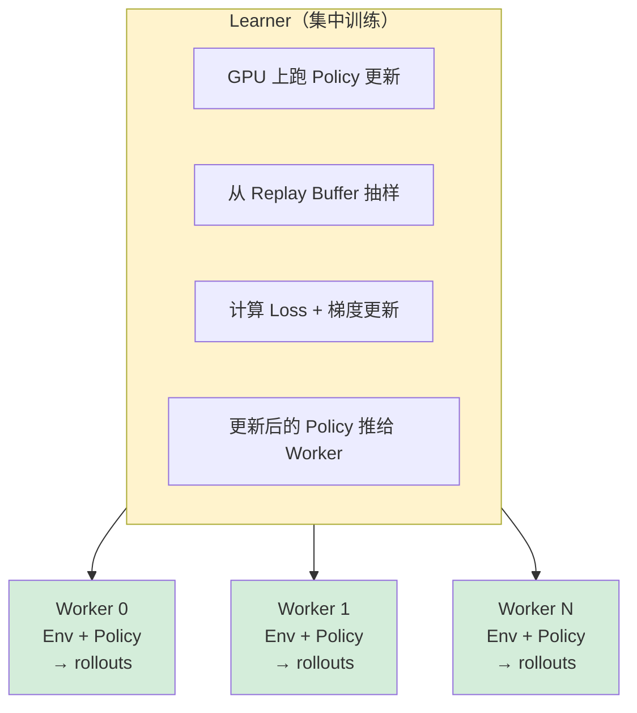
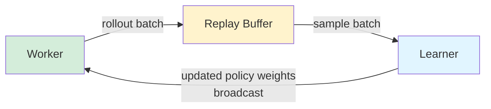

# RLlib 强化学习

## 提出问题

强化学习（Reinforcement Learning）是 ML 里对**分布式计算**需求最高的领域：
- 一个训练迭代需要：采集经验（Env 交互）→ 存 buffer → 抽样 → 训练 → 更新策略 → 再采集
- 每一步都可能需要成百上千的并行 Env Worker
- 算法种类多（PPO、SAC、DQN、IMPALA……）

RLlib 是 Ray 上的分布式强化学习库——专门解决 RL 的"并行经验采集 + 集中训练"问题。

## 核心原理

RLlib 将 RL 训练拆分为两层：



> **类比**：RLlib 像是**驾校的教练体系**——
> - **Learner** = 总教练（在 GPU 上分析所有人的驾驶数据，更新教学方法）
> - **Worker** = 学员（用自己的车在外面练，用最新的教学方法）
> - **Env** = 驾校练习场（模拟真实路况）
> - **Replay Buffer** = 行车记录仪存储（存着所有人的驾驶录像，供总教练分析）
> - **Rollout** = 学员出去开一圈回来交的行车录像

## 快速开始

### 最简单的 PPO 训练

```python
from ray.rllib.algorithms.ppo import PPOConfig

# 配置
config = (
    PPOConfig()
    .environment("CartPole-v1")              # Gym 环境
    .training(
        lr=0.0003,
        train_batch_size=4000,               # 每次训练的 batch 大小
        num_sgd_iter=10,
        model={"fcnet_hiddens": [256, 256]},
    )
    .resources(
        num_gpus=1,
        num_workers=8,                       # 8 个并行 Env Worker
        num_envs_per_worker=4,               # 每个 Worker 管 4 个 Env
    )
)

# 训练
algo = config.build()
for i in range(100):
    result = algo.train()
    print(f"Iter {i}: reward={result['episode_reward_mean']:.1f}")

# 保存
algo.save("/tmp/ppo_cartpole")

# 推理
from ray.rllib.algorithms.ppo import PPO
algo = PPO.from_checkpoint("/tmp/ppo_cartpole")
action = algo.compute_single_action(observation)
```

## RLlib 架构详解

### Rollout Worker

每个 Worker 负责与环境交互，采集经验（rollouts）：

```python
# Worker 内部的工作循环：
while True:
    # 1. 从 Learner 拉取最新 Policy
    policy = get_latest_policy()

    # 2. 跑 N 步环境交互
    for _ in range(rollout_fragment_length):
        action = policy.compute_action(obs)
        obs, reward, done = env.step(action)
        buffer.add(obs, action, reward, obs_next, done)

    # 3. 把采集的经验发给 Learner
    send_to_learner(buffer.get_samples())
```

### Learner

Learner 从所有 Worker 收集经验，集中训练：

```python
# Learner 内部：
for sgd_iter in range(num_sgd_iter):
    # 1. 从 Replay Buffer（或 Worker 直接发送）抽样
    batch = replay_buffer.sample(train_batch_size)

    # 2. 计算 PPO Loss
    loss = compute_ppo_loss(policy, batch)

    # 3. 反向传播（在 GPU 上）
    optimizer.zero_grad()
    loss.backward()
    optimizer.step()

# 4. 更新后的 Policy 推送给所有 Worker
broadcast_new_policy(workers, policy)
```

### 数据流



## 支持的算法

RLlib 内置 20+ 算法：

| 算法类型 | 算法 | 适用场景 |
|----------|------|----------|
| On-policy | PPO | 通用，稳定，适合连续动作 |
| Off-policy | DQN/Rainbow | 离散动作空间 |
| Off-policy | SAC | 连续动作，样本效率高 |
| Off-policy | TD3 | 连续动作，更稳定 |
| 分布式 Off-policy | APEX-DQN | 大规模分布式 DQN |
| 分布式 Off-policy | IMPALA | 大规模并行，异步 |
| 多智能体 | QMIX, MADDPG | 协作/竞争环境 |
| 离线 RL | CQL, MARWIL | 从固定数据集学 |

## 自定义环境

```python
import gymnasium as gym
from ray.rllib.algorithms.ppo import PPOConfig

class MyEnv(gym.Env):
    def __init__(self, env_config=None):
        self.observation_space = gym.spaces.Box(low=0, high=1, shape=(4,))
        self.action_space = gym.spaces.Discrete(2)
        self.state = None

    def reset(self, *, seed=None, options=None):
        self.state = self._random_state()
        return self.state, {}

    def step(self, action):
        self.state = self._transition(self.state, action)
        reward = self._compute_reward(self.state)
        terminated = self._is_done(self.state)
        return self.state, reward, terminated, False, {}

config = PPOConfig().environment(MyEnv)
algo = config.build()
algo.train()
```

## 多智能体 RL

```python
from ray.rllib.algorithms.ppo import PPOConfig
from ray.rllib.env.multi_agent_env import MultiAgentEnv

# 多智能体配置
config = (
    PPOConfig()
    .environment("PongNoFrameskip-v4")
    .multi_agent(
        policies={
            "policy_1": (None, obs_space, act_space, {"gamma": 0.99}),
            "policy_2": (None, obs_space, act_space, {"gamma": 0.95}),
        },
        policy_mapping_fn=lambda agent_id, *args, **kwargs:
            "policy_1" if agent_id % 2 == 0 else "policy_2",
    )
)
```

## 调优 RLlib

### Worker 数量

```python
# CPU Env（游戏、控制等）→ 多 Worker
config.resources(num_workers=32)

# GPU Env（3D 渲染）→ 少 Worker，因为 Env 自己吃 GPU
config.resources(num_workers=2, num_gpus_per_worker=0.5)
```

### Batch Size 调优

```python
# train_batch_size 越大 → 梯度估计越准 → 训练越稳定
# 但过大 → 慢（等 Worker 收集够数据）
config.training(train_batch_size=4000)  # 起点
# → 观察 reward 曲线，如果不稳定 → 增大
config.training(train_batch_size=32000)  # 更稳定
```

### 资源分配

```python
# 小规模（1 GPU, 8 CPU）
config.resources(num_gpus=1, num_workers=8)

# 中规模（4 GPU, 64 CPU）
config.resources(
    num_gpus=4,
    num_workers=64,
    num_gpus_per_worker=0,      # Worker 不用 GPU（只跑 Env）
    num_learner_workers=1,      # 1 个 Learner（使用主 GPU）
)

# 大规模（32 GPU, 512 CPU）
config.resources(
    num_gpus=32,
    num_workers=512,
    num_learner_workers=4,      # 4 个 GPU 做 Learner
)
```

## RLlib 与其他 RL 框架对比

| 特性 | RLlib | Stable-Baselines3 | CleanRL | Tianshou |
|------|-------|-------------------|---------|----------|
| 分布式 | ✅ 原生（Ray） | ❌ 单机 | ❌ 单机 | ⚠️ 有限 |
| 算法数量 | 20+ | 10+ | 10+ | 10+ |
| 多智能体 | ✅ 原生 | ❌ | ❌ | ⚠️ |
| 自定义算法 | 较复杂 | 简单 | 简单（单文件） | 中等 |
| 生产部署 | ✅ Ray Serve | ❌ | ❌ | ❌ |
| 适合场景 | 大规模生产 | 研究/入门 | 教学/理解 | 研究 |

## 常见陷阱

### 1. Env 初始化慢

```python
# ❌ 每个 Worker 的 __init__ 中加载大型资源
class SlowEnv(gym.Env):
    def __init__(self):
        self.simulator = HeavySimulator()  # 启动很慢

# ✅ 用 env_config 传配置，延迟加载
class FastEnv(gym.Env):
    def __init__(self, env_config):
        self.config = env_config
        self.simulator = None

    def reset(self):
        if self.simulator is None:
            self.simulator = HeavySimulator()
```

### 2. Worker 和 Learner 之间的 Policy 版本不一致

```
这个 RLlib 自动处理——定期 sync。
但如果你自定义了训练循环，要注意 sync 频率。
```

### 3. Replay Buffer 大小

```python
# 太小 → 样本不够，训练不稳定
config.training(replay_buffer_capacity=10000)  # 可能太小

# 太大 → 内存爆炸
config.training(replay_buffer_capacity=10_000_000)  # 需要足够内存
```

## 小结

- RLlib 将 RL 分解为 Worker（采集经验） + Learner（集中训练）
- 一个配置对象控制环境、训练、资源的全部参数
- 内置 20+ 算法，从 PPO/SAC 到分布式 APEX/IMPALA
- 多智能体 RL 原生支持
- 调优关键是 Worker 数量（并行度）和 Batch Size（稳定性）
