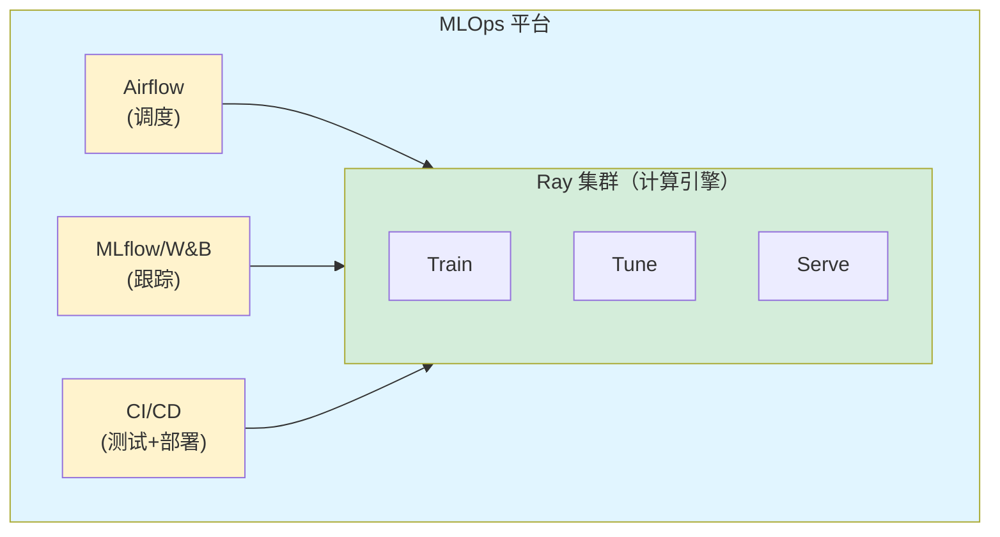

# Ray 与 MLOps

## 提出问题

模型训练不是孤立的——它需要数据管道（Airflow/Kafka 触发）、实验跟踪（MLflow/W&B）、模型注册（MLflow Model Registry）、CI/CD（GitHub Actions/Jenkins）、等等。Ray 怎么融入这个 MLOps 生态？

## Ray 在 MLOps 中的定位



> **类比**：Ray 在 MLOps 中的角色是**计算引擎**——Airflow 是"什么时候跑"（定时器），MLflow 是"跑了什么结果"（笔记本），Ray 是"怎么跑"（发动机）。三者各司其职。

## Airflow + Ray

### 触发 Ray Job

```python
# airflow_dag.py
from airflow import DAG
from airflow.providers.ray.operators.ray import SubmitRayJobOperator
from datetime import datetime

with DAG(
    "ml_pipeline",
    schedule="@daily",
    start_date=datetime(2026, 1, 1),
):
    # Step 1: 数据预处理
    preprocess = SubmitRayJobOperator(
        task_id="preprocess_data",
        ray_cluster_address="ray://ray-cluster:10001",
        entrypoint="python jobs/preprocess.py",
        runtime_env={
            "pip": ["pandas", "pyarrow"],
            "working_dir": "./jobs/"
        }
    )

    # Step 2: 训练（依赖 Step 1 成功）
    train = SubmitRayJobOperator(
        task_id="train_model",
        ray_cluster_address="ray://ray-cluster:10001",
        entrypoint="python jobs/train.py",
        runtime_env={
            "pip": ["torch", "transformers"],
            "working_dir": "./jobs/"
        },
        num_gpus=4
    )

    # Step 3: 评估 + 部署（依赖 Step 2）
    deploy = SubmitRayJobOperator(
        task_id="deploy_model",
        ray_cluster_address="ray://ray-cluster:10001",
        entrypoint="python jobs/deploy.py",
    )

    preprocess >> train >> deploy
```

### 使用 Ray 的 Job API

```python
# jobs/train.py
from ray.job_submission import JobSubmissionClient
import ray

# 在 Ray 集群中运行
ray.init(address="auto")

@ray.remote(num_gpus=1)
def train_on_gpu(data_path):
    model = load_model()
    data = load_data(data_path)
    model.train(data)
    model.save("/models/latest")

ray.get(train_on_gpu.remote("s3://data/latest"))
```

### 使用 KubeRay RayJob

```yaml
apiVersion: ray.io/v1
kind: RayJob
metadata:
  name: triggered-from-airflow
spec:
  entrypoint: python /scripts/train.py
  rayClusterSpec:
    # ... 集群配置 ...
```

Airflow 通过 K8s API 提交 RayJob：

```python
from kubernetes import client, config

def submit_ray_job(**context):
    config.load_incluster_config()
    api = client.CustomObjectsApi()
    api.create_namespaced_custom_object(
        group="ray.io",
        version="v1",
        namespace="ml",
        plural="rayjobs",
        body=rayjob_manifest
    )
```

## MLflow + Ray

### 实验跟踪

```python
import mlflow
from ray import tune

def trainable(config):
    mlflow.set_tracking_uri("http://mlflow-server:5000")
    mlflow.set_experiment("ray-tuning")

    with mlflow.start_run():
        # 记录超参数
        mlflow.log_params(config)

        for epoch in range(100):
            loss = train_epoch(config)
            mlflow.log_metric("loss", loss, step=epoch)

        # 保存模型
        mlflow.pytorch.log_model(model, "model")

tuner = tune.Tuner(
    trainable,
    param_space={"lr": tune.loguniform(1e-4, 1e-1)},
    tune_config=tune.TuneConfig(num_samples=20),
)
tuner.fit()
```

### 从 MLflow 加载模型并部署

```python
import mlflow
from ray import serve

@serve.deployment
class DeployedModel:
    def __init__(self, model_uri):
        self.model = mlflow.pytorch.load_model(model_uri)

    async def __call__(self, request):
        data = await request.json()
        return self.model(data)

# 从 MLflow Model Registry 加载生产版本
model_uri = "models:/my_model/Production"
serve.run(DeployedModel.bind(model_uri))
```

## Weights & Biases + Ray

```python
import wandb
from ray.air import session

def train_func(config):
    wandb.init(project="ray-training", config=config)

    for epoch in range(100):
        loss, accuracy = train_epoch()
        wandb.log({"loss": loss, "accuracy": accuracy})
        session.report({"loss": loss})

    wandb.finish()
```

## CI/CD 与 Ray

### 训练 Pipeline 的 CI

```yaml
# .github/workflows/train.yml
name: Train Model
on:
  push:
    branches: [main]
    paths:
      - 'training/**'
      - 'models/**'

jobs:
  train:
    runs-on: ubuntu-latest
    steps:
      - uses: actions/checkout@v3

      - name: Run small-scale test training
        run: |
          pip install ray[data,train]
          python -m pytest tests/training/  # 跑训练相关的单元测试
          python train.py --test-mode --epochs 1  # 跑 1 epoch 验证能跑通

      - name: Trigger full training on Ray cluster
        run: |
          ray job submit \
            --address ray://ray-cluster:10001 \
            --working-dir ./training \
            -- python train.py --full
```

### 模型部署的 CI/CD

```yaml
# .github/workflows/deploy.yml
name: Deploy Model
on:
  workflow_run:
    workflows: ["Train Model"]
    types: [completed]

jobs:
  deploy:
    runs-on: ubuntu-latest
    steps:
      - uses: actions/checkout@v3

      - name: Deploy to production
        run: |
          # 向 Ray Serve 发滚动更新请求
          curl -X POST http://serve-cluster:8265/api/serve/applications/ \
            -H "Content-Type: application/json" \
            -d @serve_config.json
```

## 特征存储集成

```python
# 用 Feast 特征存储 + Ray
from feast import FeatureStore
import ray

@ray.remote
def fetch_and_train(entity_ids):
    store = FeatureStore(repo_path="./feature_repo")

    # 从特征存储获取特征
    features = store.get_online_features(
        features=["user:age", "user:total_orders", "item:price"],
        entity_rows=[{"user_id": uid, "item_id": iid} for uid, iid in entity_ids]
    ).to_dict()

    # 用获取的特征训练
    train(features)
```

## 模型验证

```python
# 部署前验证模型
from ray import serve

@serve.deployment
class ModelWithGuardrails:
    def __init__(self, model):
        self.model = model

    async def __call__(self, request):
        data = await request.json()

        # 输入验证
        if not validate_input(data):
            return {"error": "Invalid input"}

        # 推理
        result = self.model(data)

        # 输出验证（漂移检测）
        if is_drift_detected(result):
            alert_oncall("Model drift detected!")
            # 仍然返回结果，但记录异常

        return result
```

## MLOps 工具集成矩阵

| MLOps 工具 | 与 Ray 的集成方式 | 典型用途 |
|------------|------------------|----------|
| Airflow | Ray Job API / KubeRay | 触发定时训练/推理 |
| MLflow | Python SDK（mlflow.log_*） | 实验跟踪、模型注册 |
| W&B | Python SDK（wandb.log） | 训练可视化 |
| Kubeflow | KubeRay | K8s 原生的 Pipeline |
| Feast | Python SDK | 特征获取 |
| Great Expectations | Python SDK | 数据质量验证 |
| Grafana | Prometheus Metrics | 集群监控 |
| Datadog | StatsD/DogStatsD | APM |

## 常见陷阱

### 1. 把 Airflow 用作计算引擎

```
❌ Airflow Worker 上跑训练 → OOM、没 GPU、慢
✅ Airflow 只做触发 → 计算交给 Ray 集群
```

### 2. MLOps 工具版本不兼容

```
Ray 更新快，确保 MLflow/Airflow 的集成版本与之匹配
→ 使用固定版本号，不要 latest
```

### 3. Secret 管理

```python
# ❌ 硬编码密钥
S3_KEY = "AKIAXXXX"

# ✅ 从环境变量/Secret Manager 读取
import os
S3_KEY = os.environ["S3_ACCESS_KEY"]
# Ray 的 runtime_env 支持 env_vars 注入
```

## 小结

- Ray 在 MLOps 中的定位是**计算引擎**——负责跑训练/调参/推理
- Airflow 触发 Ray Job（定时调度），Ray 负责实际计算
- MLflow/W&B 与 Ray Train/Tune 无缝集成（log metrics + params）
- CI/CD 中先小规模验证（1 GPU, 1 epoch）再全规模训练
- KubeRay 是 K8s 原生 MLOps 的最佳入口
- 特征存储（Feast）和模型注册（MLflow）与 Ray Serve 集成形成完整推理链路
