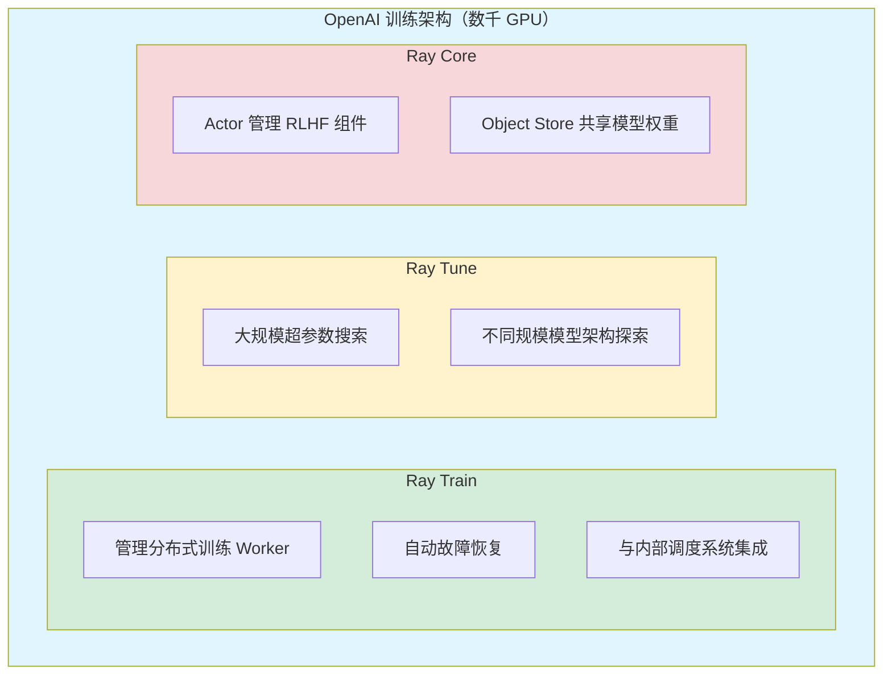
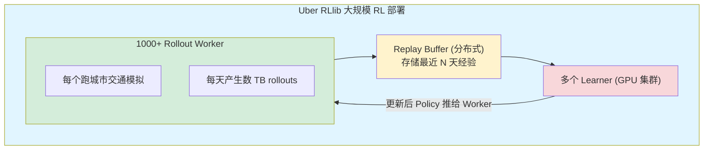
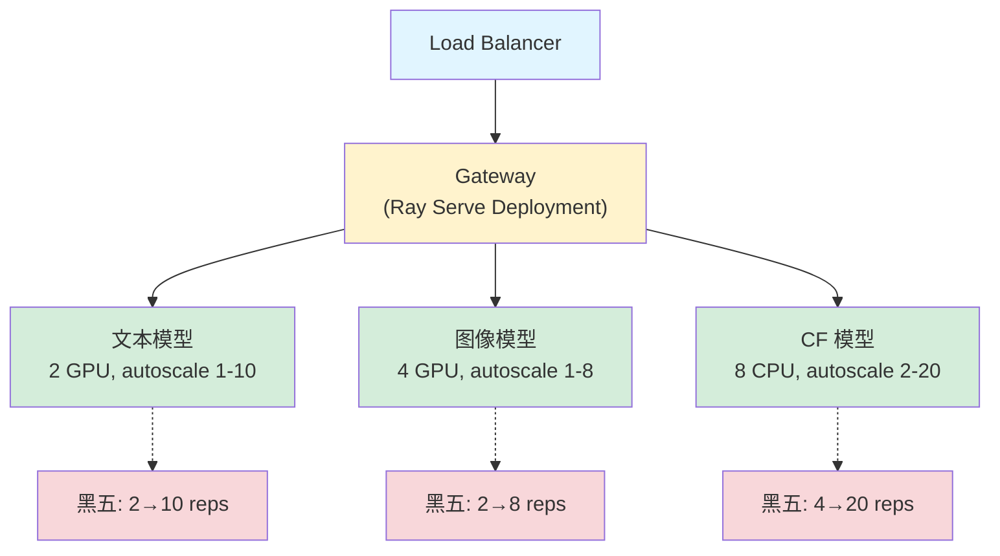
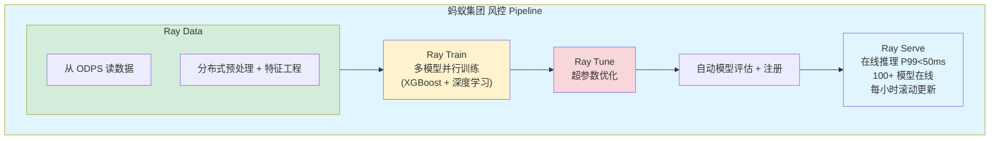
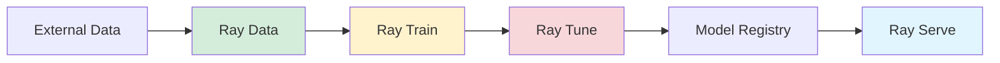
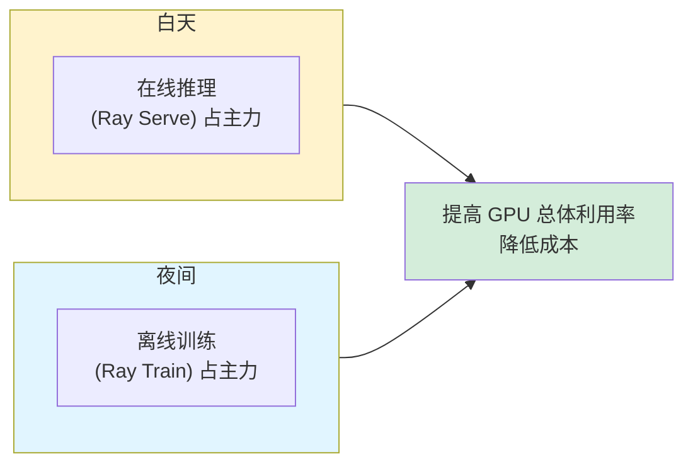

# 案例研究

## 提出问题

前面讲了 Ray 的各种机制和 API，这节我们看真实世界中大公司是怎么用 Ray 的，以及你能从中学到什么。

## 案例 1：OpenAI — ChatGPT 分布式训练

### 场景

训练 GPT 系列模型需要数千张 GPU 跨多个数据中心。挑战：
- 协调海量 Worker（预训练 + 微调 + RLHF）
- 节点故障是常态（每天有 1-2% 的 GPU 会出问题）
- 弹性扩缩（竞价实例随时可能被回收）

### Ray 的角色



### 关键收获

1. **故障恢复是刚需**：数千 GPU 集群上，node failure 是每天都要面对的。Ray 的自动 Worker 重启 + checkpoint 恢复让训练不被中断。
2. **竞价实例友好**：Ray Train 的 `max_failures` 配置 + 从 checkpoint 恢复 = 用竞价实例可以省 60%+ 成本。
3. **统一框架减少胶水代码**：从预训练到 RLHF 到评估，全部在同一个 Ray 集群上完成。

## 案例 2：Uber — 大规模强化学习

### 场景

Uber 用强化学习做动态定价、司机调度、ETA 预测。挑战：
- 需要数百万环境的并行交互（模拟各种城市、时段场景）
- 策略更新必须快（交通情况实时变化）
- 多智能体场景（司机和乘客是不同 Agent）

### 架构



### 关键收获

1. **分离采集和训练**：Worker 只管采数据，Learner 只管训练。互不阻塞。
2. **RLlib 的分布式 Replay Buffer**：能存储 PB 级别的经验，Learner 随时抽样。
3. **多智能体原生支持**：司机 Agent 和乘客 Agent 用不同的 Policy，但共享同样的资源管理。

## 案例 3：Shopify — 实时推荐系统

### 场景

Shopify 用 Ray Serve 部署推荐模型，每天处理数亿次请求。挑战：
- 需要低延迟（P99 < 100ms）
- 多种模型共存（文本、图像、协同过滤）
- 黑五等大促时流量暴涨 10 倍+

### 架构



### 关键收获

1. **多模型独立扩缩**：文本模型和图像模型的流量模式不同，各自独立自动扩缩，互不影响。
2. **Gateway 模式**：一个轻量 Gateway 做请求路由，实际推理由各专业模型处理。
3. **GPU 批处理**：`@serve.batch` 大幅提高 GPU 利用率，从 ~30% 提升到 ~85%。
4. **零停机部署**：大促前更新模型不需要停止服务。

## 案例 4：蚂蚁集团 — 风控模型

### 场景

蚂蚁集团用 Ray 做风控模型训练和推理。挑战：
- 数据量巨大（每日 PB 级交易数据）
- 模型需要频繁更新（新欺诈模式出现要快速响应）
- 高可靠性要求（漏过一个欺诈交易就可能是大损失）

### 架构



### 关键收获

1. **端到端 Pipeline**：Data → Train → Tune → Serve 整个流程在同一个 Ray 集群，数据不用来回复制。
2. **模型高频更新**：Ray Serve 的滚动更新每小时部署一次新模型，零停机。
3. **自定义数据源**：读 ODPS 的自定义 Ray Data Datasource 实现流式数据加载。

## 通用模式总结

从以上案例中可以提取几个通用模式：

### 模式 1：弹性训练

```
小规模验证 (1-4 GPU) → 中规模调优 (8-32 GPU) → 全规模训练 (64+ GPU)
每一步都可以用同一套 Ray 代码，只改 num_workers。
```

### 模式 2：独立扩缩的多模型服务

```
Gateway (路由) → 模型A (独立扩缩) + 模型B (独立扩缩) + ...
每个模型的 autoscaling 互不影响，资源利用率最高。
```

### 模式 3：端到端 Pipeline


  全部在同一个集群 — 减少数据搬运，降低延迟，简化运维。

### 模式 4：混合负载



## 小结

- **OpenAI**：大规模训练 + 故障恢复 + 竞价实例成本优化
- **Uber**：RLlib 做百万级环境并行的强化学习
- **Shopify**：Ray Serve 多模型独立扩缩，扛住黑五
- **蚂蚁**：Data → Train → Serve 端到端风控 Pipeline

共同点：**Ray Core 的统一抽象（Task/Actor/Object）让这些场景都可以用同一套原语表达，AI 库（Train/Tune/Serve/RLlib）在此基础上提供专用能力**。
