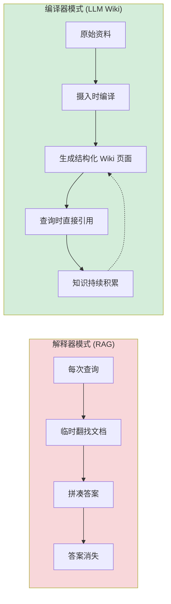
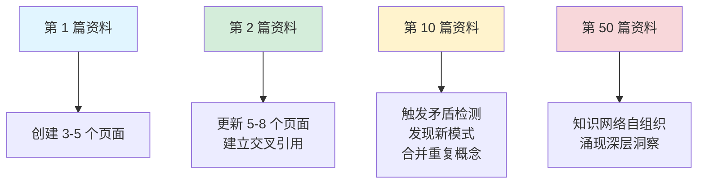
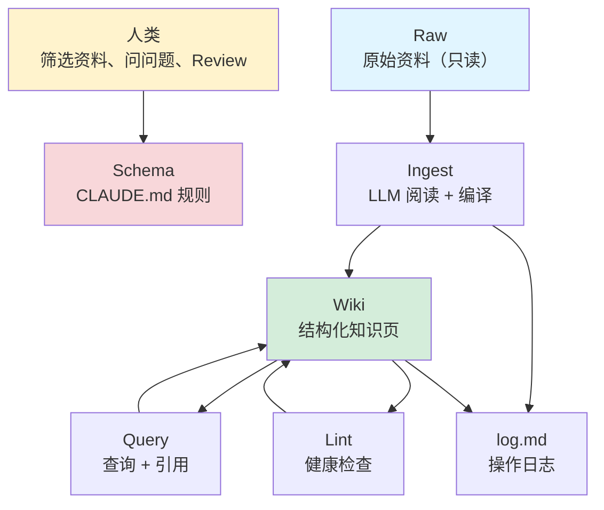

# LLM Wiki 核心思想

## 提出问题

你每天阅读大量文章、论文、技术博客。每次遇到新知识，你可能：

- 用 RAG 工具（如 NotebookLM、各类 AI 阅读器）丢进去问问题
- 手动在 Obsidian/Notion 里写笔记
- 存书签，以后再说

但几个问题始终存在：

- **RAG 没有知识积累**：每次查询都是临时翻文档拼凑答案，不会沉淀结构化知识
- **手动笔记维护成本极高**：写摘要、更新交叉引用、保持一致性——你坚持不了两周
- **知识无法复利增长**：第三篇文档和第十篇文档没有产生任何"化学反应"

2026 年 4 月，OpenAI 联合创始人 **Andrej Karpathy** 提出了 **LLM Wiki** 方法论来解决这个问题。

## 核心原理

### 编译器 vs 解释器

这是 LLM Wiki 最核心的类比：

> **类比**：RAG 像每次出门前**现翻字典**找单词拼写——查到、用完、忘掉。LLM Wiki 像把字典**背下来并建立知识网络**——知道单词的意思、同义词、反义词、词根、用法。每一次新学的单词都会和已有知识产生关联。

### 核心洞察

Karpathy 发现，维护知识库中最烦人的部分从来不是"阅读"或"思考"，而是**记账**：

- 更新交叉引用（A 页提到了 B，B 页有没有回链？）
- 保持摘要的时效性（这篇的结论有没有被更新的资料推翻？）
- 在数十个页面间保持一致性（术语、观点、结论）

**人类放弃 Wiki 是因为维护负担增速超过价值增速。LLM 没有这个问题——它不会厌倦、不会忘记、一次操作能触及 15 个文件。**

### 知识复利

每新增一份资料，不只增加新知识，还会**重新组织已有知识**。知识网络越密，新增资料的价值越大——这就是知识复利。

## LLM Wiki 是什么

LLM Wiki 是一个**方法论和工作流**，不是一款软件。核心要素：

| 要素 | 说明 |
|------|------|
| **存储** | 纯 Markdown 文件，放在文件夹里，用 Git 版本控制 |
| **维护者** | LLM（如 Claude Code）自动写页面、更新引用、做检查 |
| **规则** | `CLAUDE.md` 定义 Wiki 结构、命名约定、质量标准 |
| **原料** | `raw/` 目录存放原始资料（文章、论文、PDF），只读不修改 |
| **产物** | `wiki/` 目录存放结构化知识页面，持续演化 |

> **关键类比**：Obsidian 是 IDE，LLM 是程序员，Wiki 是代码库。你不会自己一个字一个字写代码，而是让 LLM 写——但你要 Review 代码、决定架构、引导方向。

## 工作流全景

## LLM Wiki 能做什么和不能做什么

### 适合的场景

- 深度、长期的研究课题（需要持续积累）
- 跨多篇文献的综合分析
- 追踪一个领域的发展脉络
- 构建个人的"第二大脑"

### 不适合的场景

- 一次性快速问答（用普通 LLM 对话即可）
- 海量文档的关键词搜索（传统搜索引擎更合适）
- 实时更新的新闻/动态信息

## 常见陷阱

### 1. 把 LLM Wiki 当成自动笔记工具

LLM Wiki 不是"丢文章进去自动出笔记"——你需要**参与对话**：引导方向、确认理解、标注重点。人类负责判断和方向，LLM 负责执行和记账。

### 2. 批量摄入导致质量下降

一次丢 20 篇文章进去，LLM 会"偷懒"——每篇只写寥寥几行。Karpathy 建议**一次摄入一篇，深度处理**，效果远好于批量。

### 3. 不设置 Schema 就开始

没有 `CLAUDE.md` 定义规则，LLM 生成的内容会越来越乱。Schema 是最关键的文件——它定义了 Wiki 的结构、命名约定、质量标准。

## 小结

- LLM Wiki 是 Karpathy 提出的知识管理方法论：**让 LLM 接管"记账"工作**
- 核心类比：**编译器模式替代解释器模式**——知识编译一次就沉淀，越积越厚
- 三层结构：**Raw（原料）→ Wiki（知识）→ Schema（规则）**
- 本质是**分工**：人类负责判断和方向，LLM 负责执行和维护
- 维护成本归零 → Wiki 真正可持续 → 知识产生复利效应
