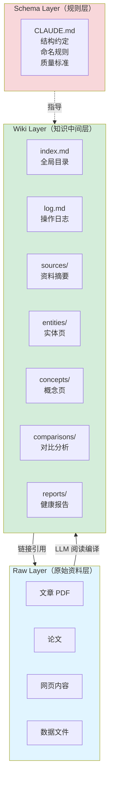
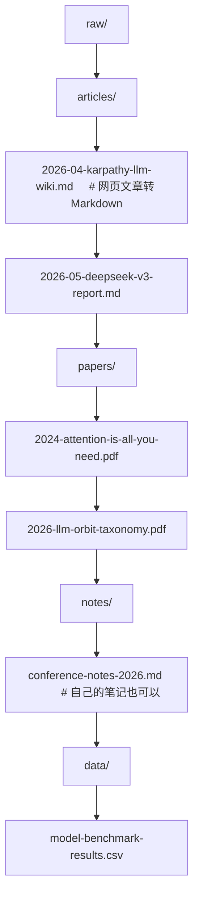
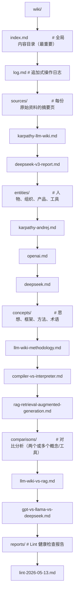

# 三层架构详解

## 提出问题

LLM Wiki 不是"一个 AI 帮你记笔记"，它有一个明确的三层架构。理解这三层，才能正确设置和维护 Wiki。

为什么要分层？因为**每层的所有权和责任不同**——人类拥有原始资料，LLM 维护知识页，规则层是双方的契约。

## 三层架构



> **类比**：这套三层架构像是**出版社的工作流**——
> - **Raw** = 原始手稿和采访录音（一字不改，永远存档）
> - **Wiki** = 编辑团队写的成书内容（摘要、人物介绍、概念解释、对比分析）
> - **Schema** = 出版社的编辑手册（格式标准、术语规范、章节结构）
> - 人类 = 主编，LLM = 编辑团队

## Layer 1: Raw（原始资料层）

### 职责

存放所有**原始输入**——文章、论文、网页、PDF、数据文件。**只读，永不修改**。

### 目录结构



### 规则

- **只读**：LLM 可以读、引用，但绝不修改 raw/ 下的文件
- **不可变**：一旦放入就不要改（如果发现原始资料有误，在 wiki 中标注）
- **命名约定**：`YYYY-MM-DD-简短描述.md` 格式，便于追溯

### 人类的责任

- 筛选什么资料值得摄入
- 标注资料的可信度（权威论文 > 个人博客）
- 维护 raw/ 的组织结构

## Layer 2: Wiki（知识中间层）

### 职责

LLM 维护的结构化知识页面。每篇都是完整的 Markdown 文件，包含**标题、摘要、正文、交叉引用、元数据**。

### 目录结构



### 页面模板

每篇 Wiki 页面应遵循统一结构：

```markdown
---
type: concept              # concept | entity | source | comparison | report
title: "编译器模式 vs 解释器模式"
created: 2026-05-13
updated: 2026-05-13
linked_from: [[llm-wiki-methodology]], [[rag]]
linked_to: [[karpathy-andrej]], [[retrieval-augmented-generation]]
aliases: [compiler-over-interpreter]
---

# 编译器模式 vs 解释器模式

## 一句话
[一句话讲清这个概念]

## 详细说明
[核心内容]

## 关键要点
- 要点 1
- 要点 2

## 相关页面
- [[llm-wiki-methodology]] — LLM Wiki 方法论总体介绍
- [[rag]] — 检索增强生成
```

### index.md — 最重要的文件

```markdown
# Wiki 索引

## 实体 (Entities)
- [[karpathy-andrej]] — Andrej Karpathy，OpenAI 联合创始人
- [[openai]] — OpenAI 公司
- [[deepseek]] — DeepSeek 公司及模型系列

## 概念 (Concepts)
- [[compiler-vs-interpreter]] — 编译器模式 vs 解释器模式
- [[llm-wiki-methodology]] — LLM Wiki 方法论
- [[knowledge-compounding]] — 知识复利效应

## 对比 (Comparisons)
- [[llm-wiki-vs-rag]] — LLM Wiki vs RAG 详细对比
- [[gpt-vs-llama-vs-deepseek]] — 主流模型横向对比

## 来源 (Sources)
- [[karpathy-llm-wiki]] — Andrej Karpathy: LLM Wiki (2026-04)
- [[deepseek-v3-report]] — DeepSeek-V3 Technical Report
```

**index.md 的关键作用**：LLM 查询时先读 index.md，定位相关页面，再深入阅读。它是 Wiki 的"入口地图"。

### log.md — 操作日志

```markdown
# 操作日志

## 2026-05-13
- [INGEST] 摄入 raw/papers/llm-orbit-taxonomy.pdf
  - 新增 sources/llm-orbit-taxonomy.md
  - 更新 entities/openai.md（补充组织信息）
  - 更新 concepts/scaling-laws.md（补充扩展律数据）
  - 更新 index.md
- [QUERY] "scaling laws 的最新数据?" → 引用 concepts/scaling-laws.md
- [LINT] 发现 2 处需更新的引用，已修复
```

### 人类的责任

- Review LLM 生成的内容（至少扫一眼标题和关键结论）
- 标注错误（如果 LLM 理解有偏差，告诉它修正）
- 决定什么时候做 Lint 检查

## Layer 3: Schema（规则层）

### 职责

Schema 是**人类和 LLM 之间的契约**——它定义了 Wiki 的结构、命名约定、质量标准。最关键的文件是 `CLAUDE.md`。

### CLAUDE.md 示例

```markdown
# LLM Wiki 工作规则

## 角色
你是一个知识库维护者。你的任务是维护 wiki/ 目录下的结构化知识页面。

## 目录约定
- raw/ — 原始资料，只读，绝不修改
- wiki/sources/ — 每份资料的摘要页，命名为 <source-slug>.md
- wiki/entities/ — 人物/组织/产品页面
- wiki/concepts/ — 概念/思想/方法页面
- wiki/comparisons/ — 两个或多个事物的对比分析
- wiki/reports/ — 健康检查报告

## 页面格式
- 必须包含 YAML frontmatter（type, title, created, updated）
- 必须包含 [[wikilink]] 交叉引用
- 标题用 # 一级标题

## Ingest 规则
1. 先完整阅读 raw/ 中的原始资料
2. 创建 sources/<slug>.md 摘要页（300-500 字）
3. 提取实体和概念，分别创建或更新对应页面
4. 更新 index.md
5. 追加 log.md 记录

## 质量标准
- 每条关键声明应标注引用来源
- 如果新资料与已有 Wiki 内容矛盾，在页面中标注
- 不要编造信息，不确定的标注 [待验证]
```

### Schema 的迭代

Schema 不是一次写完的。随着 Wiki 规模增长，你会逐渐发现需要哪些规则：

- 发现命名不统一 → 加命名规则
- 发现某个类型的页面格式混乱 → 加模板约定
- 发现 LLM 反复犯同一个错误 → 加明确禁令

> **类比**：Schema 是代码仓库的 `.eslintrc` + `CONTRIBUTING.md`。一开始可以宽松，随着项目变大逐步收紧。

## 角色分工总结

| 责任 | 人类 | LLM |
|------|------|-----|
| 筛选资料（读什么） | ✅ | ❌ |
| 端到端阅读资料 | ❌ | ✅ |
| 写摘要/实体页/概念页 | ❌ | ✅ |
| 更新交叉引用 | ❌ | ✅ |
| 维护 index.md 和 log.md | ❌ | ✅ |
| 标注矛盾、发现缺口 | ❌ | ✅ |
| 判断重要性、引导方向 | ✅ | ❌ |
| Review LLM 产出 | ✅ | ❌ |
| 修正错误 | ✅ | ❌ |
| 迭代 Schema 规则 | ✅ | ⚠️ 辅助（提建议） |

## 常见陷阱

### 1. raw/ 太乱

如果 raw/ 里堆满各种格式的文件，LLM 处理效率会大幅下降。保持 raw/ 组织清晰，文件命名规范。

### 2. index.md 膨胀

当 Wiki 超过 100 页时，index.md 会超过 LLM 上下文窗口。这时候需要引入本地搜索引擎（见进阶主题）。

### 3. Schema 太宽松或太严格

- 太宽松 → LLM 产出风格不一致，知识网络混乱
- 太严格 → LLM 花太多精力遵守格式，内容质量下降
- **先宽后严**：起步时 Schema 简单，在迭代中逐步细化

## 小结

- 三层架构 = Raw（原料，人类拥有） + Wiki（知识，LLM 维护） + Schema（规则，双方契约）
- **index.md** 是 Wiki 的入口地图，每次摄入都要更新
- **CLAUDE.md** 是最关键的 Schema 文件，定义结构和质量标准
- 人类的责任是**筛选、判断、Review**；LLM 的责任是**阅读、写作、记账**
- Schema 是活的——在迭代中逐步完善，不要一开始就追求完美
