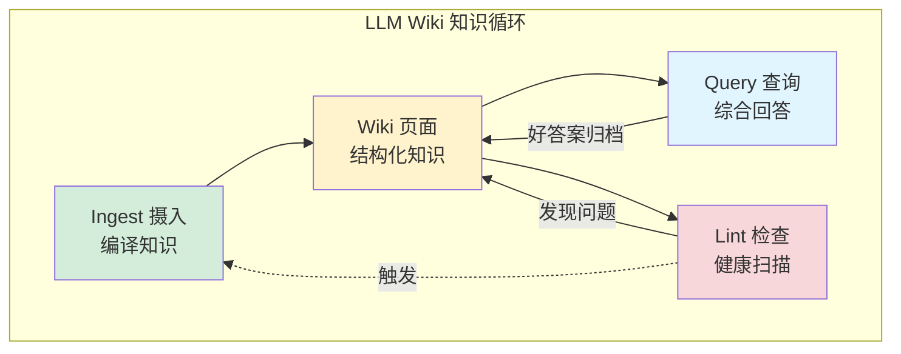
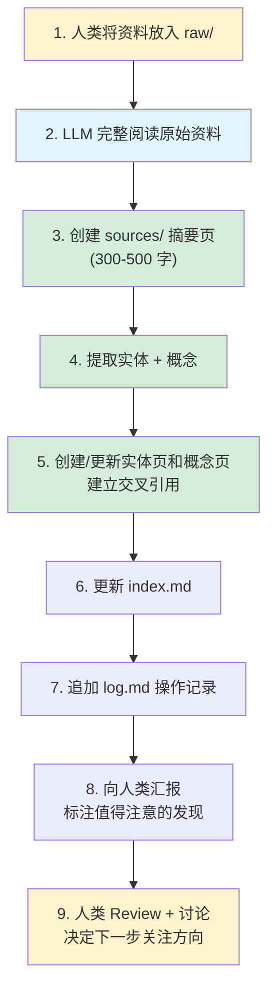
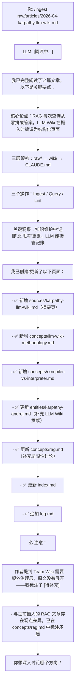
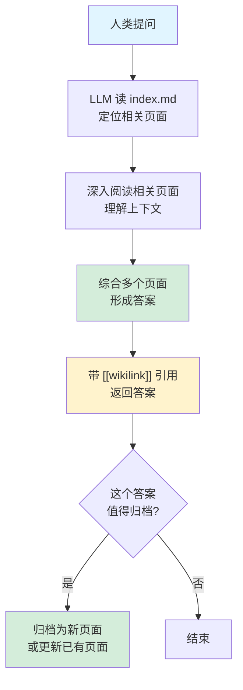
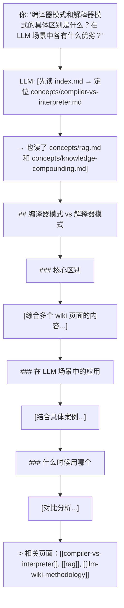
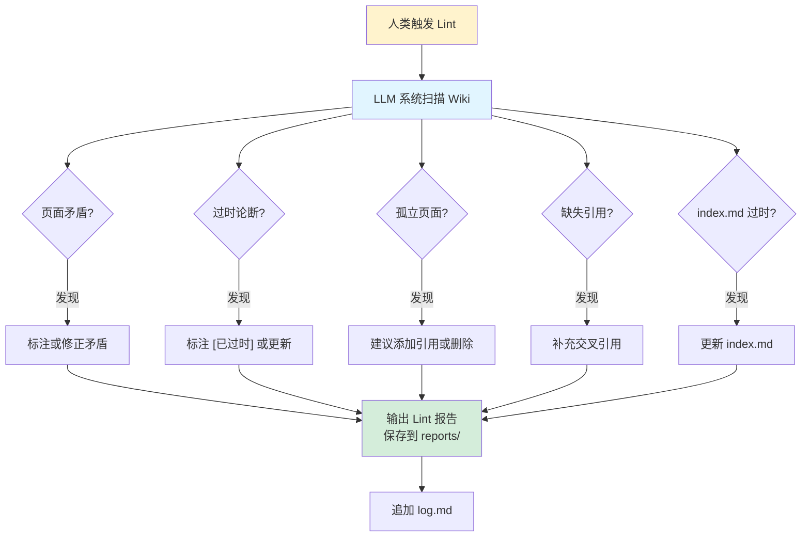
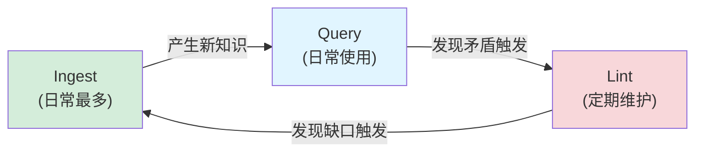

# 三个核心操作：Ingest / Query / Lint

## 提出问题

理解了 LLM Wiki 的三层架构后，下一步是掌握日常使用的三个核心操作。Karpathy 将 LLM Wiki 的工作流精炼为三个动词：**Ingest（摄入）、Query（查询）、Lint（检查）**。这三个操作构成了完整的知识循环。

## 操作全景



> **类比**：这三个操作对应的是**图书馆管理员的日常工作**——
> - **Ingest** = 新书入库：分类、编目、写摘要、更新索引、上架
> - **Query** = 读者咨询：根据目录定位相关书籍，综合信息给出答案
> - **Lint** = 年度盘点：检查是否有丢失的书籍、矛盾的信息、需要淘汰的旧书

## 操作 1: Ingest（摄入）

### 流程



### Ingest 的典型对话



### Ingest 的质量关键

| 好习惯 | 坏习惯 |
|--------|--------|
| 一次摄入一篇，深度处理 | 一次丢 20 篇，LLM 偷懒 |
| 摄入后人类 Review + 讨论 | 摄入后不管，积累错误 |
| 高质量的原始资料 | 低质量/重复的资料 |

### 如何触发 Ingest

在 Claude Code 中，可以用 Skill 体系：

```markdown
# .claude/skills/ingest.md 中的触发模式
当用户说"摄入 <文件路径>"时：
1. 完整阅读指定文件
2. 按 CLAUDE.md 中定义的 Ingest 规则执行
3. 创建/更新所有相关页面
4. 汇报发现和建议
```

## 操作 2: Query（查询）

### 流程



### Query vs 普通 LLM 对话

| | 普通 LLM 对话 | LLM Wiki Query |
|---|---|---|
| 信息来源 | 训练数据（可能过时）+ 临时上传 | Wiki 中已编译的结构化知识 |
| 引用 | 无 | `[[wikilink]]` 形式的精确引用 |
| 知识积累 | 无 | 好答案可归档回 Wiki |
| 一致性 | 每次可能不同 | 基于同一套 Wiki 内容，一致性好 |

### Query 的典型用法



### 关键洞察：归档好答案

这是 LLM Wiki 与普通 RAG 最大的区别之一——**好的查询答案可以作为新页面归档回 Wiki**：

```
你: "把刚才关于编译器vs解释器的分析归档，作为 comparisons/ 下的一个新页面"

LLM: 已创建 comparisons/compiler-vs-interpreter.md，并更新了相关交叉引用。
```

## 操作 3: Lint（检查）

### 流程



### Lint 检查清单

| 检查项 | 内容 | 严重程度 |
|--------|------|----------|
| 矛盾检测 | A 页面说 X=10，B 页面说 X=20 | ⚠ 高 |
| 过时论断 | 页面声称"当前最佳"，但引用的资料是一年前的 | ⚠ 中 |
| 孤立页面 | 页面存在但没有任何入站链接 | ⚡ 低 |
| 缺失引用 | 页面提到了 Y 概念但没链接到 Y 的页面 | ⚡ 低 |
| index 同步 | index.md 缺少新增页面的条目 | ⚠ 中 |
| 死链接 | 引用的 `[[页面名]]` 指向不存在的页面 | ⚡ 低 |

### 什么时候做 Lint

- **定期**：每摄入 10-20 份资料后做一次
- **事件驱动**：摄入了一份特别重要的资料后（可能推翻很多已有结论）
- **发现问题时**：查询时发现前后答案不一致，触发 Lint

## 三个操作的配合



**典型节奏**：
- 每天摄入 1-2 篇资料
- 随时 Query
- 每周或每摄入 15 篇做一次 Lint

## 常见陷阱

### 1. 把 Ingest 当成"自动摘要"

Ingest 不是让 LLM 写个 TL;DR 就完事。真正的 Ingest 是**编译**——把资料拆解、重组、链接到已有知识网络。如果 Ingest 后只产生了一个 sources/ 页面而没有更新任何 entity/concept，那说明入得不深。

### 2. 不做 Lint 导致熵增

没有 Lint 的 Wiki 会慢慢腐烂——矛盾积累、引用过时、孤立页面增多。维护任何知识库的敌人都是**熵增**，Lint 就是对抗熵增的工具。

### 3. 把好答案留在聊天记录里

这是最常见的浪费行为。每次 Query 后问自己："这个答案值得归档吗？"如果值得，立刻让 LLM 归档。

## 小结

- **Ingest** = 编译器：把原始资料拆解、重组、链接到知识网络
- **Query** = 知识消费：基于编译好的 Wiki 综合回答，带精确引用
- **Lint** = 质量保证：定期扫描矛盾、过时、孤立，防止知识腐烂
- 三个操作形成闭环：Ingest → Query → Lint → Ingest
- 核心习惯：每次 Query 后考虑归档，每 15 篇 Ingest 后跑一次 Lint
