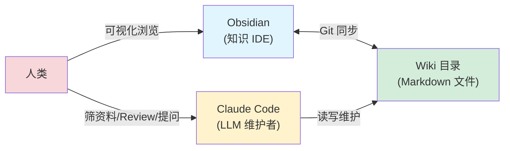
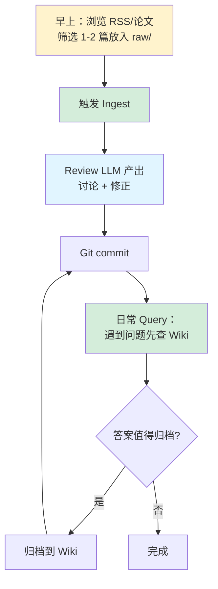

# 搭建实战指南

## 提出问题

理论听完了，怎么实际搭一个 LLM Wiki？需要哪些工具？第一步做什么？怎么从零开始？

这节是一份**从零搭建 LLM Wiki 的实操指南**，以 Claude Code + Obsidian 为工具链。

## 工具选型

### 核心工具链



| 工具 | 用途 | 必需? |
|------|------|-------|
| **Claude Code** | LLM 维护者，自动写页面、更新引用 | ✅ 必需 |
| **Obsidian** | 可视化浏览知识图谱、编辑 Markdown | 👍 推荐 |
| **Git** | 版本控制，每次摄入后提交 | ✅ 必需 |
| **QMD** (可选) | 本地 BM25 + 向量搜索（>100 页时需要） | ⚠️ 后期必需 |

> **类比**：这套工具链像是**软件开发栈**——
> - Obsidian = VS Code（IDE）
> - Markdown 文件 = 源代码
> - Claude Code = 程序员（写代码、维护、重构）
> - Git = 版本控制
> - 你 = Tech Lead（决定架构、Review 代码）

## Step 1: 创建项目目录

```bash
# 创建 LLM Wiki 项目
mkdir my-llm-wiki
cd my-llm-wiki
git init

# 创建三层目录
mkdir -p raw/articles raw/papers raw/notes
mkdir -p wiki/sources wiki/entities wiki/concepts wiki/comparisons wiki/reports
```

## Step 2: 创建 CLAUDE.md

在项目根目录创建 `CLAUDE.md`，这是整个 Wiki 的"宪法"：

```markdown
# CLAUDE.md — LLM Wiki 工作规则

## 项目概述
这是一个 LLM Wiki 知识库。你作为知识库维护者，
负责将 raw/ 中的原始资料编译为 wiki/ 中的结构化知识页。

## 核心原则
1. **只读 raw/**：绝不修改 raw/ 下任何文件
2. **Wiki 是你的领地**：你负责 wiki/ 所有文件的创建和更新
3. **交叉引用是灵魂**：每个新页面必须与已有页面建立双向链接
4. **不确定就标注**：对你的推断标注置信度，
   不确定的信息标注 [待验证]

## 目录结构
- raw/ — 原始资料（只读）
- wiki/sources/<slug>.md — 资料摘要页 (300-500 字)
- wiki/entities/<slug>.md — 人物/组织/产品
- wiki/concepts/<slug>.md — 概念/思想/方法
- wiki/comparisons/<slug>.md — 对比分析
- wiki/reports/lint-<date>.md — 健康检查报告
- wiki/index.md — 全局内容目录
- wiki/log.md — 追加式操作日志

## 页面格式要求
每个页面必须包含：
```yaml
---
type: concept | entity | source | comparison | report
title: "页面标题"
created: YYYY-MM-DD
updated: YYYY-MM-DD
links_from: [[page1]], [[page2]]
links_to: [[page3]]
---
```

## Ingest 工作流
当用户提供原始资料时：
1. 完整阅读资料
2. 与用户讨论关键要点
3. 创建 sources/<slug>.md 摘要页
4. 提取实体/概念，新建或更新对应页面
5. 建立交叉引用
6. 更新 wiki/index.md
7. 追加 wiki/log.md 记录

## Query 工作流
回答用户问题时：
1. 先读 wiki/index.md 定位相关页面
2. 深入阅读相关页面
3. 综合信息给出答案，带 [[page]] 引用
4. 如果答案值得保存，建议归档

## Lint 工作流
用户触发 lint 时，扫描：
- 矛盾：不同页面对同一事实的陈述不一致
- 过时：页面中的论断可能已被新资料推翻
- 孤立：页面存在但没有任何入站链接
- 缺失：index.md 遗漏了已有页面
```

## Step 3: 第一次 Ingest

### 3.1 放入第一份资料

```bash
# 把一份文章/论文放入 raw/
cp ~/Downloads/some-article.md raw/articles/2026-05-article-title.md
```

### 3.2 触发 Ingest

在 Claude Code 中：

```
请摄入 raw/articles/2026-05-article-title.md，按照 CLAUDE.md 中的规则执行。
```

### 3.3 Review 产出

LLM 完成后，你会看到：

```
已创建/更新以下文件：
✅ wiki/sources/article-title.md
✅ wiki/concepts/some-concept.md
✅ wiki/index.md
✅ wiki/log.md

人类，请 Review 以下内容：
[展示关键页面的摘要]
```

用 Obsidian 打开项目目录，浏览 LLM 生成的内容：
- 打开图谱视图，看到第一个知识节点和链接
- 点击 [[wikilink]] 跳转，验证引用是否正确
- 如有错误，直接告诉 LLM 修正

### 3.4 Git Commit

```bash
git add .
git commit -m "ingest: article-title (first ingest)"
```

> 每次摄入后立即提交。Git 历史就是你的知识演进史。

## Step 4: 日常使用循环



## Step 5: 规模化 — 引入搜索引擎

当 Wiki 超过 **100 页**时，`index.md` 会超过 LLM 上下文窗口。此时需要引入本地搜索引擎。

### 安装 QMD

```bash
# 安装 QMD（本地 Markdown 搜索引擎）
# 支持 BM25 + 向量混合搜索
# 具体安装方式请参考官方仓库
```

### 更新 CLAUDE.md

```markdown
## 检索规则（>100 页时启用）
查询时：
1. 先用 QMD 搜索相关页面（BM25 + 语义搜索）
2. 获取 Top 10 结果
3. 深入阅读这些页面
4. 不再依赖 index.md 做全文导航
```

## 完整项目示例目录

```mermaid
flowchart TD
  n0["my-llm-wiki/"]
  n1[".git/"]
  n2["CLAUDE.md                       # Schema 规则"]
  n3["raw/"]
  n4["articles/"]
  n5["2026-04-karpathy-llm-wiki.md"]
  n6["2026-05-deepseek-v3-report.md"]
  n7["papers/"]
  n8["2024-attention-is-all-you-need.pdf"]
  n9["wiki/"]
  n10["index.md                    # 全局目录"]
  n11["log.md                      # 操作日志"]
  n12["sources/"]
  n13["karpathy-llm-wiki.md"]
  n14["deepseek-v3-report.md"]
  n15["entities/"]
  n16["karpathy-andrej.md"]
  n17["openai.md"]
  n18["concepts/"]
  n19["llm-wiki-methodology.md"]
  n20["compiler-vs-interpreter.md"]
  n21["transformer-architecture.md"]
  n22["comparisons/"]
  n23["llm-wiki-vs-rag.md"]
  n24["reports/"]
  n25["lint-2026-05-13.md"]
  n0 --> n1
  n1 --> n2
  n2 --> n3
  n3 --> n4
  n4 --> n5
  n5 --> n6
  n6 --> n7
  n7 --> n8
  n8 --> n9
  n9 --> n10
  n10 --> n11
  n11 --> n12
  n12 --> n13
  n13 --> n14
  n14 --> n15
  n15 --> n16
  n16 --> n17
  n17 --> n18
  n18 --> n19
  n19 --> n20
  n20 --> n21
  n21 --> n22
  n22 --> n23
  n23 --> n24
  n24 --> n25
```



## 渐进式上路计划

| 阶段 | 规模 | 实践重点 |
|------|------|----------|
| **第 1 周** | 3-5 篇资料 | 熟悉 Ingest 流程，建立 Review 习惯 |
| **第 2 周** | 10-15 篇 | Schema 开始迭代，发现需要哪些规则 |
| **第 1 个月** | 30-50 篇 | 做第一次 Lint，感受知识网络的复利效应 |
| **第 3 个月** | 100+ 篇 | index.md 膨胀，引入搜索引擎 (QMD) |

## 常见陷阱

### 1. 起步阶段追求完美 Schema

第一版 `CLAUDE.md` 不需要完美。让它跑起来，遇到问题再改。Karpathy 的建议是："从一个小领域开始，先摄入 5-10 篇，再逐步完善规则。"

### 2. 不 Review 就 commit

LLM 会犯错——理解偏差、过度推断、幻觉。至少扫一眼关键页面的标题和结论。Review 不是逐字校对，而是**判断方向对不对**。

### 3. 只 Ingest 不 Query

如果你只摄入不查询，Wiki 就成了一个华丽的"资料坟场"。养成**遇事先查 Wiki** 的习惯——这会让你的知识真正产生价值。

### 4. 忘记 Lint

三个月不检查的 Wiki 和没有 Wiki 差不多。设置一个**日历提醒**，每两周做一次 Lint。

## 小结

- 工具链：**Claude Code + Obsidian + Git**，可选 QMD
- **CLAUDE.md** 是最关键的文件，先写一个够用的再迭代
- 从**第一篇资料开始**，不要等"一切准备好"
- 养成 **Ingest → Review → Commit → Query → Lint** 的日常节奏
- Wiki 超过 100 页时引入本地搜索引擎
- 核心习惯：**每次 Ingest 后 commit，每两周 Lint 一次**
