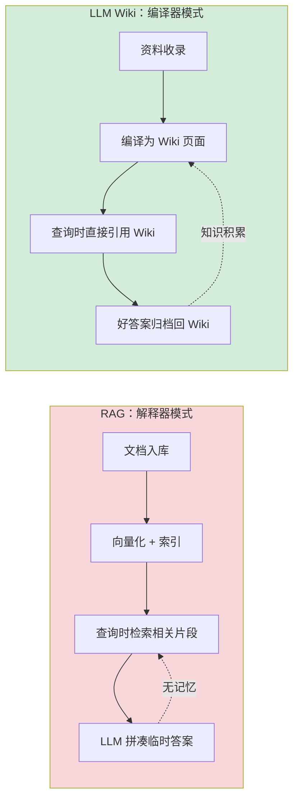
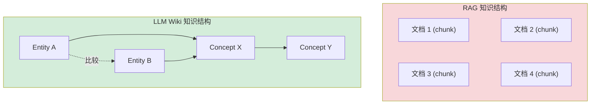
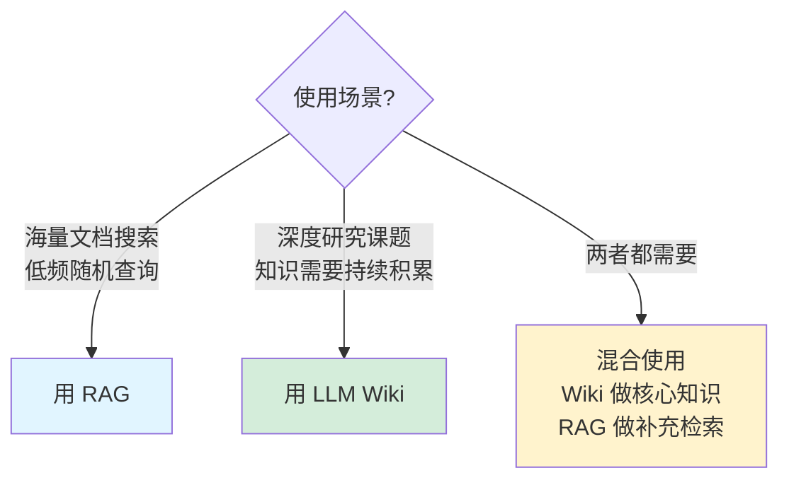
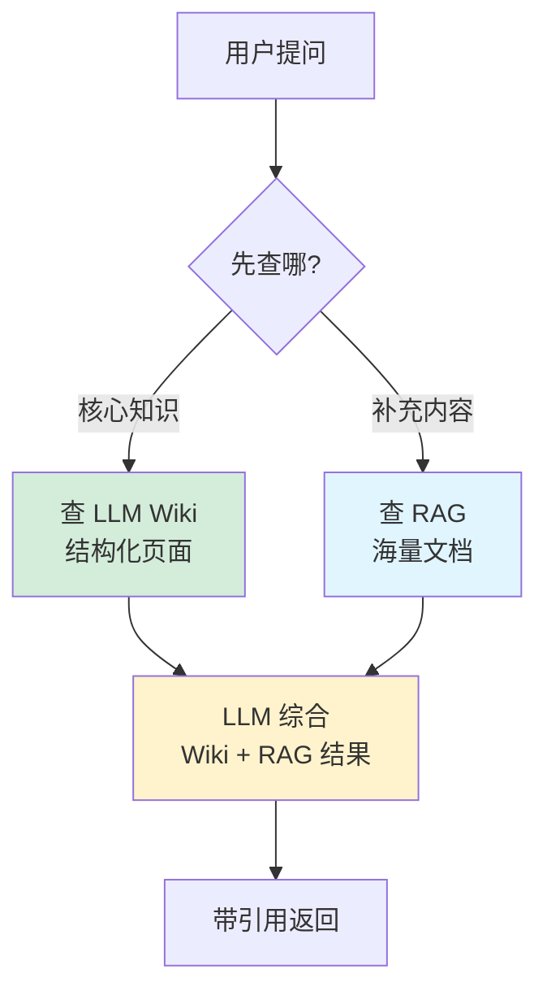

# 与传统 RAG 对比

## 提出问题

RAG（检索增强生成）是当前最主流的 LLM 知识管理范式——向量化文档 → 查询时检索 → LLM 回答问题。LLM Wiki 提出了完全不同的思路。这两者到底有什么区别？什么时候用哪个？能不能结合使用？

## 核心理念差异

> **类比**：RAG 像是每次要回答物理问题时**跑去图书馆现查书**——找到相关段落、拼凑答案、合上书就忘了。LLM Wiki 像是把物理教科书内容**编译成自己的知识体系**——力/热/电/光各章之间建立了联系，答完问题后知识还在。

## 多维度对比

### 知识处理时机

| | RAG | LLM Wiki |
|---|---|---|
| **处理时间** | 查询时（runtime） | 摄入时（compile time） |
| **每次重复工作** | 每次都重新检索、综合 | 编译一次，查询零成本 |
| **适合的节奏** | 低频、随机查询 | 高频、深度研究 |

### 知识结构

| | RAG | LLM Wiki |
|---|---|---|
| **知识形态** | 文档碎片 (chunks) | 结构化页面 (entities/concepts) |
| **知识关联** | 无显式关联 | `[[wikilink]]` 双向链接 |
| **一致性** | 无法保证（每次检索结果不同） | 内置矛盾检测和修复 |
| **可审计性** | 低（向量检索结果难解释） | 高（所有内容都是可读 Markdown） |

### 操作对比

| 维度 | RAG | LLM Wiki |
|---|---|---|
| **新增资料** | 上传 → 自动 chunk + embed | 放入 raw/ → LLM 阅读 → 编译为 Wiki 页 |
| **更新知识** | 需重新 chunk + embed | LLM 直接更新相关页面 |
| **删除/修正** | 删文档重新处理 | 直接修改 markdown |
| **交叉引用** | 不存在 | 自动建立和维护 |
| **矛盾检测** | 不存在 | Lint 扫描检测 |
| **版本管理** | 困难 | Git 原生支持 |

### 适用规模

| | RAG | LLM Wiki |
|---|---|---|
| **文档数** | 百万级 | 100-200 篇 |
| **每篇处理深度** | 浅（chunk 级） | 深（全文理解 + 结构化） |
| **更新频率** | 高（新文档即时可用） | 中（需要 Ingest 处理时间） |

### 成本与性能

| | RAG | LLM Wiki |
|---|---|---|
| **每次查询 Token 消耗** | 检索到的 chunks + LLM 综合 | Wiki 页面（通常更少 token，因为已结构化） |
| **摄入/更新 Token 消耗** | 低（embedding 廉价） | 高（每篇资料需要 LLM 深度处理） |
| **基础设施** | 向量数据库 + Embedding 模型 | 文件夹 + Git |
| **维护成本** | 中（向量索引维护） | 低（LLM 自动化维护） |

## 什么时候用哪个

### 典型 RAG 场景

- 公司内部文档问答（千级文档，偶尔查）
- 客服知识库（问答对多，标准答案明确）
- 法律/合规文档检索（需要精确原文引用）

### 典型 LLM Wiki 场景

- 个人研究课题（跟踪某个领域 1-2 年）
- 技术学习（系统掌握一个框架的原理）
- 论文综述（综合 50+ 篇论文形成自己的理解）
- 产品知识库（持续迭代的产品文档体系）

## 混合方案

LLM Wiki 和 RAG 不是互斥的——它们可以组合使用：

**混合策略**：
- **Wiki** 维护核心、经过验证的结构化知识
- **RAG** 覆盖长尾、低频访问的文档
- 查询时优先查 Wiki（更快、更准），Wiki 覆盖不到的再走 RAG

> **类比**：Wiki 是你的**长期记忆**（经过整理、结构化、随时可调用），RAG 是你的**外部硬盘**（存了大量东西，需要时才翻出来看）。

## 对比总结

| 维度 | RAG | LLM Wiki | 混合方案 |
|------|-----|----------|----------|
| 知识持久性 | 无 | 持续积累 | ✅ |
| 大规模文档 | ✅ | ❌ (>200 篇困难) | ✅ |
| 深度理解 | ❌ (片段级) | ✅ (全文理解) | ✅ |
| 交叉引用 | ❌ | ✅ | ✅ |
| 版本管理 | ❌ | ✅ | ✅ |
| 即时更新 | ✅ | ⚠️ (需要 Ingest 时间) | ✅ |
| 基础设施 | 向量数据库 | Markdown + Git | 两者 |

## 常见陷阱

### 1. 以为 LLM Wiki 替代 RAG

LLM Wiki 不是 RAG 的替代品，而是**不同场景的工具**。对于百万级文档、实时更新的场景，RAG 仍然是最佳选择。

### 2. 用 LLM Wiki 存一切

不是所有东西都值得编译到 Wiki。RSS 的日常新闻、随手的聊天记录——这些用传统 RAG 或简单搜索就够了。Wiki 应该存**值得反复引用的知识**。

### 3. 纠结选哪个，结果哪个都没用上

启动成本最低的是：**先用 RAG 工具（如 NotebookLM）快速上手，同时开始搭建一个小型 LLM Wiki**。在实践中感受两者的差异，而不是在理论上纠结。

## 小结

- RAG = **解释器模式**：查询时临时检索拼凑，知识不积累
- LLM Wiki = **编译器模式**：摄入时编译为结构化页面，知识持续增长
- RAG 适合**海量文档、低频查询**；LLM Wiki 适合**深度研究、长期积累**
- 两者可以**混合使用**：Wiki 做核心知识，RAG 做补充检索
- 关键区别：RAG 的产物是**瞬时答案**，LLM Wiki 的产物是**持续增长的知识网络**
