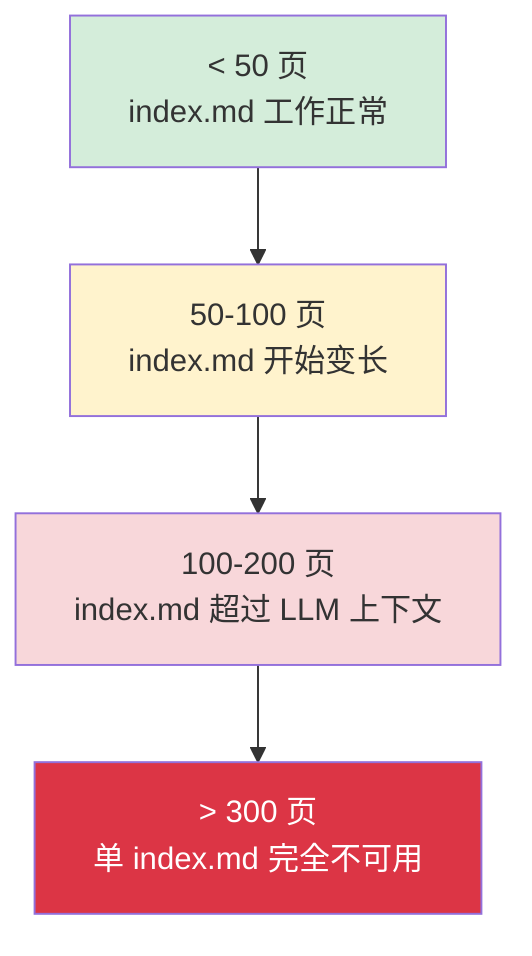
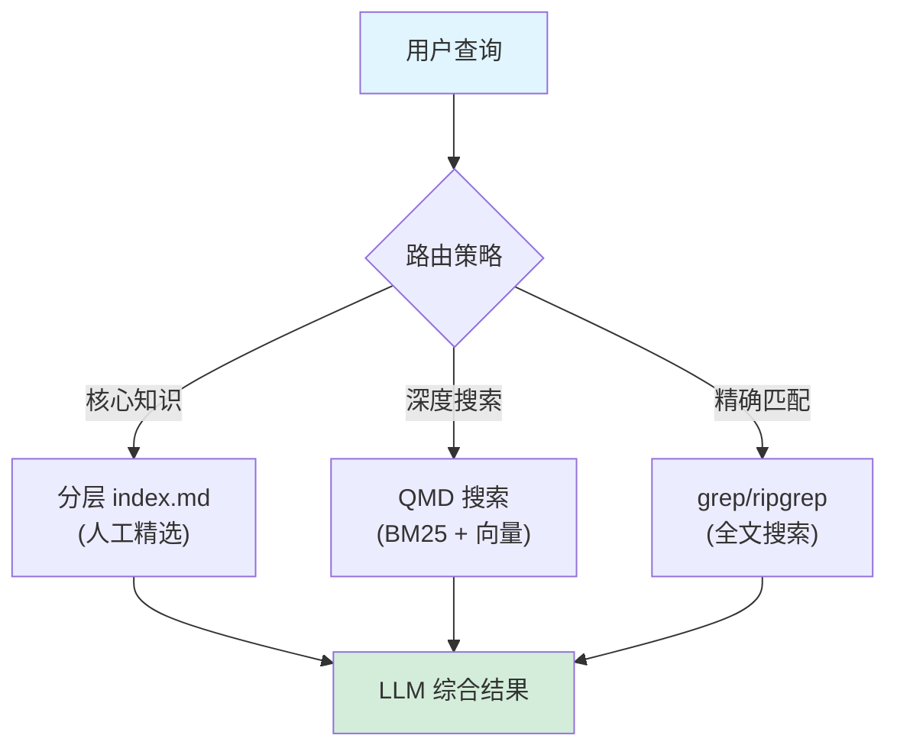
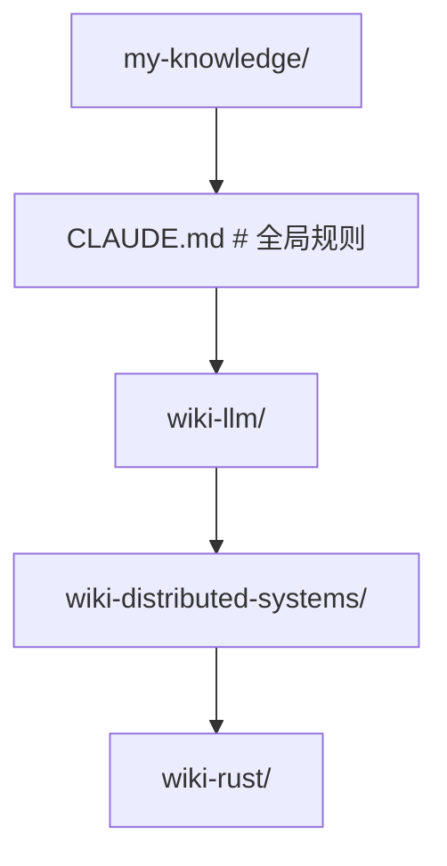
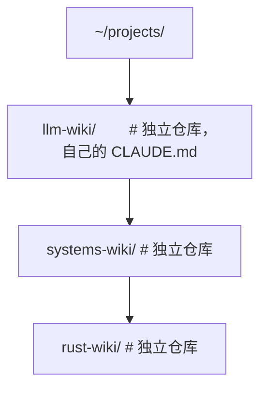
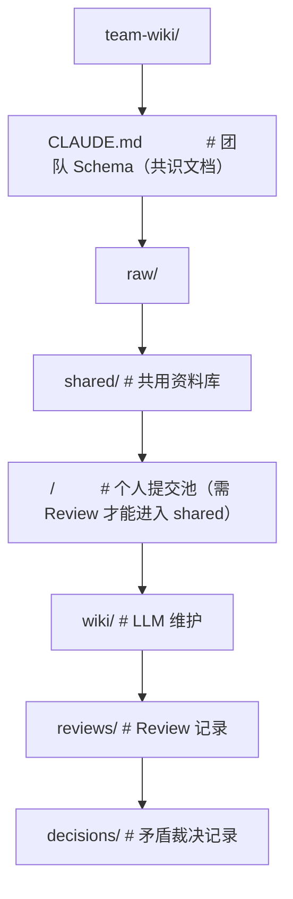
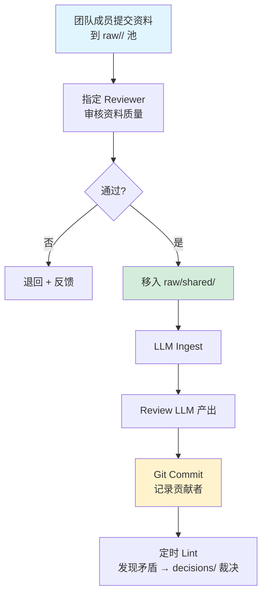
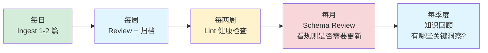

# 进阶主题

## 提出问题

当你实践 LLM Wiki 一段时间后（通常 1-2 个月），会遇到以下实际问题：

- Wiki 页数超过 100 页，`index.md` 超出了 LLM 上下文窗口，怎么解决？
- 多个项目/领域的 Wiki 怎么组织？是合并还是分开？
- 如何防止 LLM 幻觉污染知识库？
- 多人协作时怎么办？

这节讨论这些进阶主题。

## 规模扩展：超越 index.md

### 问题



### 解决方案 1: 分层的 index 结构

```markdown
# wiki/index.md（~200 行，只做目录的目录）
## 实体
- 人物 → [[index-entities-people]]
- 组织 → [[index-entities-orgs]]
- 产品 → [[index-entities-products]]

## 概念
- 基础概念 → [[index-concepts-basics]]
- 方法框架 → [[index-concepts-methods]]
- 前沿理论 → [[index-concepts-advanced]]

# wiki/index-concepts-basics.md（~100 行）
- [[transformer-architecture]] — Transformer 架构基础
- [[attention-mechanism]] — 注意力机制
...
```

### 解决方案 2: 引入本地搜索引擎

用 **QMD**（本地 BM25 + 向量混合搜索）替代 `index.md` 的导航功能：

```bash
# QMD 索引 Wiki 目录
qmd index wiki/

# 搜索
qmd search "transformer attention mechanism"

# 在 Claude Code 中集成
# CLAUDE.md 中增加规则：
# "查询时优先用 qmd search 定位相关页面，再深入阅读"
```

### 解决方案 3: 混合检索架构



## 多 Wiki 组织策略

当你维护多个课题时，有两种策略：

### 策略 A: Monorepo（单仓多 Wiki）



**优点**：统一管理，跨领域链接容易
**缺点**：index 更复杂，不同领域混在一起

### 策略 B: 多 Repo（每个课题独立）



**优点**：完全隔离，各自独立演化
**缺点**：跨领域引用需要手动协调

### 选择建议

| 场景 | 推荐策略 |
|------|----------|
| 课题之间关联紧密（如 LLM + ML + 推理） | Monorepo |
| 课题完全独立（如 LLM + 木工） | 多 Repo |
| 初期探索，不确定关联性 | Monorepo（后期可拆分） |

## 防幻觉策略

LLM 在维护 Wiki 时可能会"自信地编造"。以下是多层防幻觉策略：

### 策略 1: 来源追溯

每篇 Wiki 页面标注信息来源：

```markdown
---
sources:
  - raw/articles/karpathy-llm-wiki.md (primary)
  - raw/papers/llm-orbit-taxonomy.pdf (secondary)
confidence: high
---

# 编译器模式 vs 解释器模式

[内容...]

> 本文主要基于 Karpathy 的原始文章和 LLMOrbit 综述论文。
> 标注 [待验证] 的部分基于作者的推断。
```

### 策略 2: 置信度标注

```markdown
| 声明 | 置信度 |
|------|--------|
| LLM Wiki 概念由 Karpathy 在 2026/04 提出 | ✅ 高（有明确出处） |
| LLM Wiki 可管理 200+ 篇资料 | ⚠ 中（基于社区报告，非官方） |
| 未来 LLM Wiki 将自动化 Ingest | 🔮 推测（趋势判断） |
```

### 策略 3: 定期交叉验证

在 Lint 中增加一项检查：**随机抽取 5 条关键声明，回溯 raw/ 验证**。

```markdown
# CLAUDE.md Lint 规则扩展
## 防幻觉检查
1. 从实体页和概念页中随机抽取 10 条关键声明
2. 回溯对应的 raw/ 原始资料
3. 验证声明是否与来源一致
4. 标注任何不确定的推断
```

### 策略 4: 使用校验工具

开源的 `mnexa` 工具提供自动校验能力——检查 `⟦"..."⟧` 标记内的引用是否在来源文档中逐字出现。

## 多人协作

LLM Wiki 本质上是一个**个人工具**。Karpathy 明确指出，团队使用需要额外的治理层。

### 团队 Wiki 的挑战

| 挑战 | 说明 |
|------|------|
| 来源质量 | 不同人放入的 raw/ 资料质量不一 |
| Schema 分歧 | 不同人对"什么是好页面"的标准不同 |
| 编辑冲突 | 多人 + 多 LLM Agent 同时修改 |
| 幻觉审计 | 谁负责验证 LLM 的产出？ |
| 决策权 | 遇到矛盾时谁有最终决定权？ |

### 团队 Wiki 的最小可行架构



### 协作流程



### 团队工具建议

- **GitHub/GitLab PR**：用 PR 流程管理 raw/ 的提交和 Review
- **CODEOWNERS**：指定不同领域的负责人
- **CI Lint**：在 CI 中自动运行 Lint 检查

## Schema 演进策略

Schema（`CLAUDE.md`）本身需要持续迭代：

| 阶段 | Schema 重点 | 示例规则 |
|------|-------------|----------|
| **种子期** (< 20 页) | 基础结构 | "每个页面必须有 frontmatter" |
| **增长期** (20-80 页) | 一致性和质量 | "同一术语在所有页面用同一 slug" |
| **成熟期** (80-200 页) | 去重和合并 | "新页面创建前先搜索是否有类似页面" |
| **规模化** (200+ 页) | 检索和治理 | "不再依赖 index.md，使用搜索引擎" |

> **类比**：Schema 的演进像城市交通规则的演进——小镇不需要立交桥和红绿灯。但城市变大了，就需要交通标识、环岛、单行线。规则是为了让增长可持续，而不是一开始就限制灵活性。

## 长期维护的节奏



## 常见陷阱

### 1. 过早优化检索

在 Wiki 只有 30 页时就引入搜索引擎。index.md 在 100 页以内工作得很好，不要过度工程化。

### 2. 把 Wiki 当成"真理"而不是"当前最佳理解"

Wiki 的内容是**当前最佳理解**，不是终极真理。每篇页面应该标注时效性——今天看起来正确的东西，下个月可能被新资料推翻。这就是 Lint 存在的意义。

### 3. 团队 Wiki 没有明确 Owner

多人参与必须有一个明确的决策机制。遇到矛盾时谁来裁决？Schema 变更谁来批准？这些问题不解决，Wiki 会变成"众人的垃圾场"。

## 小结

- **规模扩展**：<100 页用 index.md，>100 页引入分层 index 或 QMD 搜索
- **多 Wiki 组织**：关联紧密用 Monorepo，独立课题用多 Repo
- **防幻觉**：来源追溯 + 置信度标注 + 定期交叉验证
- **多人协作**：需要 PR 流程 + Reviewer + 决策机制，本质上是团队治理问题
- **Schema 演进**：随着 Wiki 规模增长逐步收紧规则，不要一开始就过度设计
- **长期维护**：每日 Ingest → 每周 Review → 每两周 Lint → 每月 Schema Review
