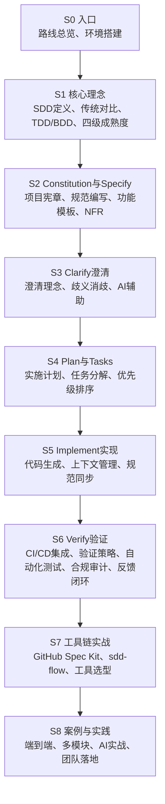
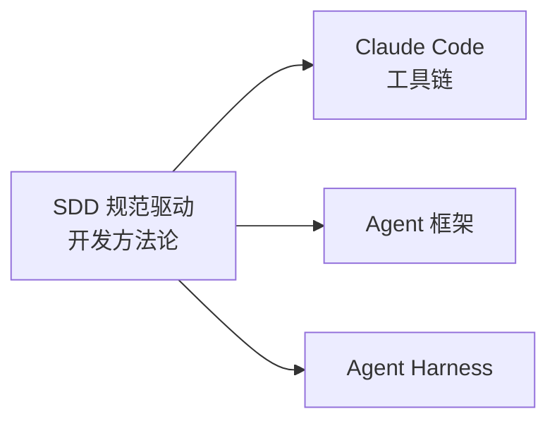

# 学习路线总览

## 目标

系统掌握 **Specification-Driven Development（SDD，规范驱动开发）** 的完整方法论——从核心理念、四级成熟度模型，到 Constitution → Specify → Clarify → Plan → Tasks → Implement → Verify 七步工作流，最终在 GitHub Spec Kit 和 sdd-flow 等主流工具链上完成从规范到代码的全流程实战。本路径共 9 阶段 31 篇文档（含 4 个完整案例）。

## 前置要求

| 要求 | 说明 |
|------|------|
| Git 基础 | commit、branch、PR 工作流 |
| Markdown 编写 | 规范文档使用 Markdown 格式 |
| 至少一种编程语言 | Python / TypeScript / Go 均可 |
| 项目开发经验 | 至少参与过 1 个完整项目开发周期 |
| AI 编码工具经验 | 使用过 Claude Code / Cursor / Copilot 任一即可 |

## 学习路线图



## 学习周期

| 阶段 | 内容 | 阅读 | 实践 | 小计 |
|------|------|------|------|------|
| 00 | 入口 — 路线总览、环境搭建 | 1h | 0.5h | 1.5h |
| 01 | 核心理念 — SDD 定义、传统对比、TDD/BDD、成熟度模型 | 3h | 1h | 4h |
| 02 | Constitution与Specify — 项目宪章、规范编写、功能模板、NFR | 4h | 2h | 6h |
| 03 | Clarify澄清 — 澄清理念、歧义消歧、AI 辅助 | 2h | 1h | 3h |
| 04 | Plan与Tasks — 实施计划、任务分解、优先级排序与风险 | 3h | 1.5h | 4.5h |
| 05 | Implement实现 — 代码生成、上下文窗口管理、规范同步 | 3h | 2h | 5h |
| 06 | Verify验证 — CI/CD 集成、验证策略、测试生成、合规审计、反馈闭环 | 4h | 2h | 6h |
| 07 | 工具链实战 — Spec Kit、sdd-flow、工具选型 | 3h | 3h | 6h |
| 08 | 案例与实践 — 端到端、多模块、AI 实战、团队落地（4 个案例） | 4h | 3h | 7h |
| **合计** | | **27h** | **16h** | **43h** |

> **推荐节奏**：每周 4-6h，8-10 周完成。S0-S2 为认知基础和方法论，S3-S4 为质量闸门（Clarify 和 Plan/Tasks 是 SDD 落地的关键差异化环节），S5-S6 为工程实践（重点），S7-S8 为实战收束。

## 学习建议

1. **对比学习**：SDD 不是孤立方法论，与 TDD/BDD 互补。边学边问"这和 TDD 有什么不同？"
2. **概念 + 实践**：每学完一个工作流步骤，立即用工具（Spec Kit 或 sdd-flow）在示例项目上执行一遍
3. **工具先行**：S0 环境搭建后，先跑通 `specify init` 感受工具链，再看理论章节会更有体感
4. **案例导向**：全程跟随 S7 的 Todo App 案例和 S8 的电商平台多模块案例，将方法论映射到实际场景
5. **刻意练习**：学完本路径后，在自己的实际项目中完整实践一次 SDD 工作流

## 核心环境

```bash
# GitHub Spec Kit（推荐主工具）
uvx --from git+https://github.com/github/spec-kit.git specify init <name>

# Claude Code + sdd-flow 插件（与 Claude Code 路径配合）
/plugin marketplace add nushey/sdd-flow

# 可选：LiorCohen/sdd
npm install -g sdd
```

> 详细安装步骤见 [02-环境搭建.md](02-环境搭建.md)

## 与本仓库其他路径的关系



- **Claude Code 路径**：sdd-flow 是 Claude Code 插件，两路径建议并行学习
- **Agent 路径**：SDD 的方法论提升 AI Agent 产出的可控性和可追溯性
- **Agent Harness 路径**：SDD 的规范思维与 Harness 的工程化兜底互相呼应
