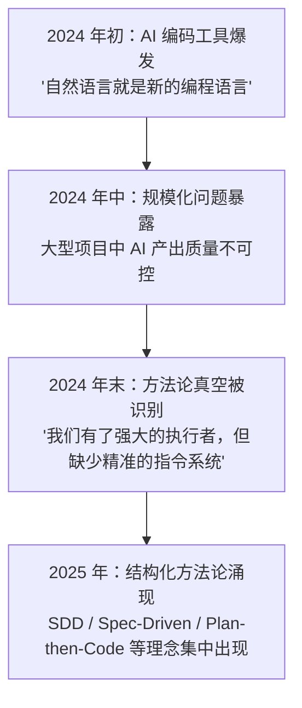
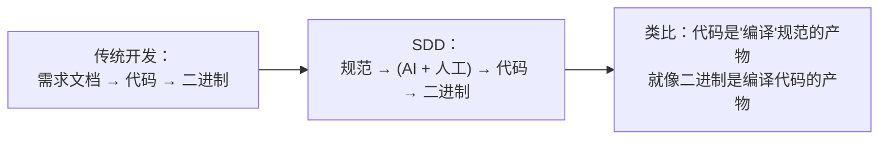
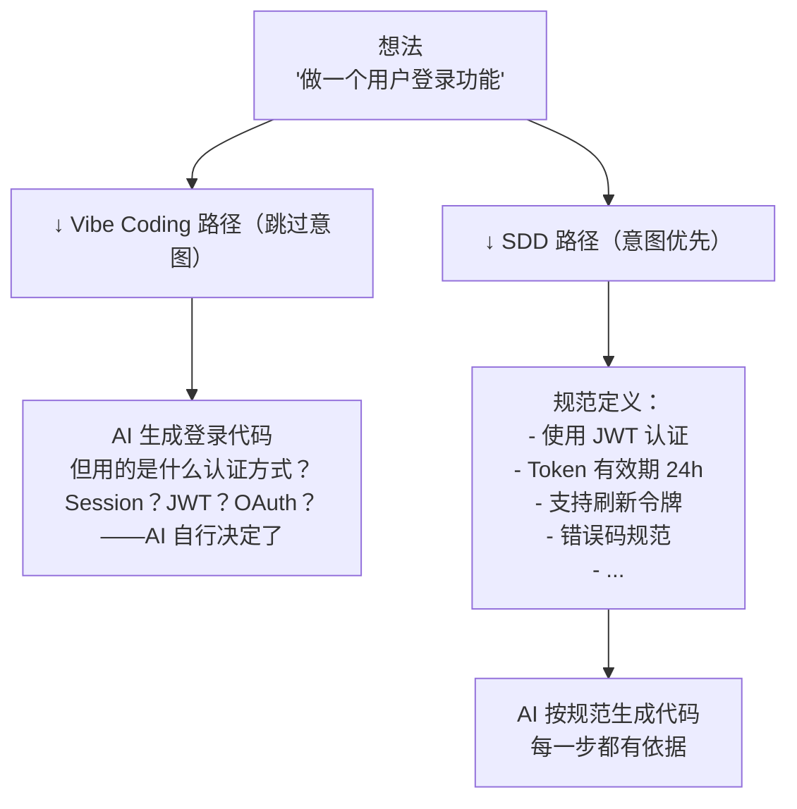
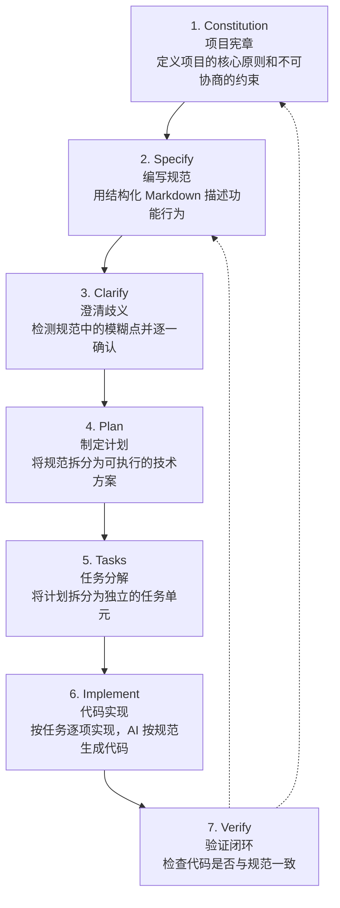
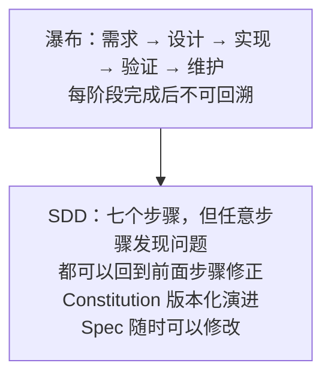
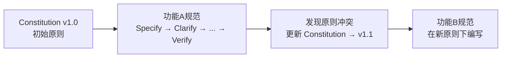
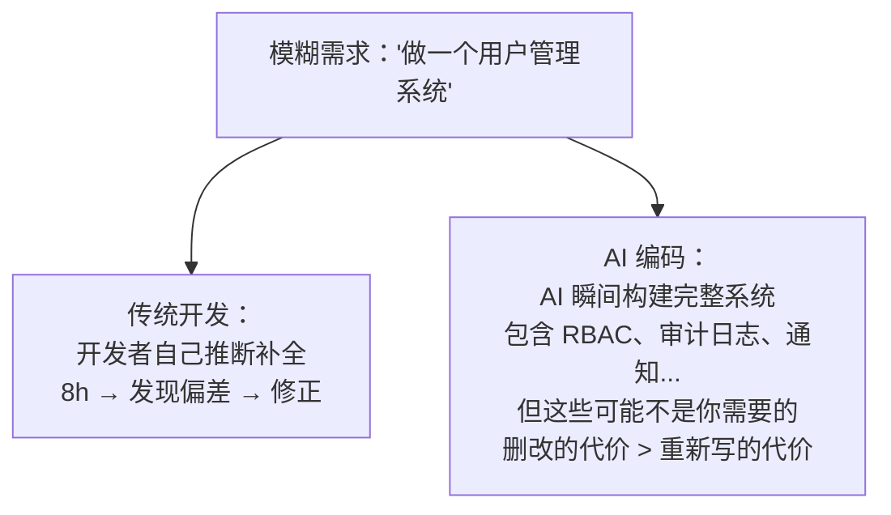
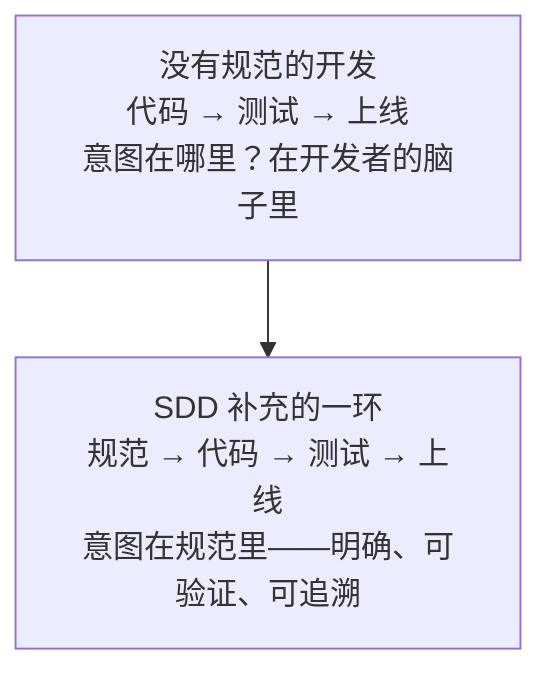

# 什么是规范驱动开发

理解 Specification-Driven Development（SDD）之前，必须先理解它要解决什么问题。SDD 不是凭空出现的理论创新——它是 AI 编码工具大规模普及之后，社区对"如何让 AI 写出正确代码"这一问题的系统性回答。

---

## 1. SDD 的起源与背景

### Vibe Coding 的兴起与困境

2024-2025 年，以 Claude Code、Cursor、GitHub Copilot 为代表的 AI 编码工具进入主流视野。开发者发现，只需用自然语言描述需求，AI 就能直接生成可运行的代码。这种开发方式被社区称为 **"Vibe Coding"（氛围编码）**——凭感觉描述、凭感觉生成、凭感觉接受。

Vibe Coding 在原型阶段效率惊人——一个周末就能跑通一个 MVP。但当项目规模增长，三个核心问题逐渐暴露：

| 问题 | 表现 | 根因 |
|------|------|------|
| **上下文丢失** | AI 在第 5 轮对话后"忘记"了第 1 轮确定的约束 | 对话历史作为唯一上下文源，不可靠 |
| **需求漂移** | 代码越写越多，但逐渐偏离最初的设计意图 | 没有锁定需求的机制，每次对话都可能引入偏差 |
| **质量不可控** | 生成的代码"看起来对"，但边界情况处理缺失 | AI 倾向于生成"最可能的代码"而非"最正确的代码" |

> **核心矛盾**：Vibe Coding 让"写代码"变快了 10 倍，但让"写对的代码"变得更难——因为需求没有被锁定，每一次 AI 调用都在引入微小的偏差，累积起来就是方向性错误。

### 2024-2025 年的社区反思

AI 编码工具的早期狂热过后，社区开始冷静反思：



核心共识：**AI 编码不是银弹，它需要一个结构化的方法论来约束和引导。** 就像编译器需要类型系统来保证正确性，AI 编码器需要规范来保证方向正确。

### GitHub Spec Kit 的里程碑

2025 年 9 月，GitHub 发布了 **Spec Kit**——一套专门为规范驱动开发设计的工具链。这标志着 SDD 从社区讨论正式进入主流工具层面。Spec Kit 的核心贡献不是技术上的，而是**将 SDD 的工作流固化为可执行的工具**——让"规范驱动"从理念变成每个团队都可以操作的标准化流程。

---

## 2. SDD 的定义

### 核心定义

> **Specification-Driven Development（SDD）是以规范（Specification）作为单一事实来源（Single Source of Truth）的软件开发方法论。**

这句话拆开来看：

- **规范（Specification）**：一份结构化的、可验证的文档，描述系统"应该做什么"，而不是"怎么做"
- **单一事实来源（Single Source of Truth）**：当代码和规范出现分歧时，规范为准，代码需要修改
- **方法论**：不是工具，不是框架，而是一套指导决策的原则和流程

### "规范是新的代码"

这是 SDD 最核心的理念转变：



在传统开发中，代码是最终产物，需求文档只是辅助。在 SDD 中，**规范本身成为一等公民**——代码只是将规范"翻译"为机器可执行形式的过程产物。这意味着：

- 修改应该从规范开始，而不是从代码开始
- 审查的重点是规范是否正确，而不是代码是否优雅
- 规范的版本管理比代码的版本管理更重要

### AI 角色的重定位

这个理念转变重新定义了 AI 在开发中的角色：

| 维度 | Vibe Coding 中的 AI | SDD 中的 AI |
|------|---------------------|-------------|
| 角色 | 写代码的人（"我模糊描述，你自由发挥"） | 技术写手（"我定义规范，你精准翻译"） |
| 输入 | 自然语言模糊描述 | 结构化规范文档 |
| 自由度 | 高——自行推断意图、补全细节 | 低——严格按规范执行，不越界 |
| 验证方式 | 人工看代码、跑一跑试试 | 自动对比代码与规范的符合程度 |
| 出错模式 | "AI 猜错了我的意思" | "规范描述不够精确" |

> **关键转变**：AI 从"猜测你的意图"变成"执行你的规范"。前者的出错率随项目复杂度指数增长，后者的出错率取决于规范质量——而规范质量是你可控的。

---

## 3. SDD 的核心命题

### 意图先于实现（Intent before Implementation）

这是 SDD 的第一原则：在动手写代码之前，先精确地定义"要做什么"。这听起来像是废话，但在 Vibe Coding 时代恰恰是最容易被跳过的步骤——因为 AI 可以瞬间给你结果，诱惑你跳过思考。



### 规范先于代码（Spec before Code）

这是第二原则：规范必须是**先于代码存在**的独立性文档，而不是写完代码后补的备注。

**为什么这个顺序重要？**

- **如果先写代码再补规范**，规范会不自觉地迁就已有代码的实现——即使实现是不合理的。规范失去了约束力。
- **如果先写规范再写代码**，规范是纯粹的意图表达，不受实现细节污染。代码必须向规范对齐。

### 三个关键转变

SDD 带来的不是增量改进，而是范式转变：

| 转变 | 旧范式 | 新范式 | 含义 |
|------|--------|--------|------|
| **1** | 想法 → 代码 | 想法 → 规范 → 代码 | 在想法和代码之间插入规范层，作为质量闸门 |
| **2** | 代码是真相 | 规范是真相 | 判断"做得对不对"不靠读代码，靠对规范 |
| **3** | AI 猜测你的意图 | AI 执行你的规范 | AI 从"创造性角色"变为"翻译性角色" |

---

## 4. 规范 vs 传统需求文档

很多人第一次听到 SDD 的反应是："这不就是写需求文档吗？"这是最大的误解。SDD 规范与传统需求文档有本质区别：

| 维度 | 传统需求文档 | SDD 规范 |
|------|-------------|---------|
| **定位** | 参考资料——写完后就很少再看 | 单一事实来源——开发全程持续参考 |
| **格式** | 自由文本 / PPT / Word | 结构化 Markdown（标题层级、代码块、检查清单） |
| **与代码关系** | 写完就过时——代码是独立演化的 | 持续同步——代码服务于规范，规范更新触发代码更新 |
| **可验证性** | 模糊，难以自动验证（"性能要好"） | 明确验收条件，可自动检查（"P99 延迟 < 200ms"） |
| **AI 可读性** | 难以解析——自由文本无结构 | 结构清晰——AI 可直接按章节提取约束和任务 |
| **粒度** | 粗粒度——描述大功能模块 | 细粒度——逐条定义行为约束和边界条件 |
| **生命周期** | 写完即归档 | 持续维护，与代码同步演化 |
| **受众** | 人（产品经理、开发者） | 人 + AI（AI 是规范的一等读者） |

### 一个对比示例

**传统需求文档**：
> 用户登录功能：用户可以用邮箱和密码登录系统，登录失败要有提示。

**SDD 规范**：
```markdown
## 用户登录

### 输入
- `email`: string, 符合 RFC 5322 的邮箱格式
- `password`: string, 长度 8-128 字符

### 行为
- 验证邮箱和密码是否匹配数据库记录
- 匹配成功：返回 JWT token，有效期 24 小时
- 匹配失败：返回错误码 `INVALID_CREDENTIALS`，HTTP 401
- 连续 5 次失败：锁定账户 15 分钟，返回错误码 `ACCOUNT_LOCKED`

### 约束
- 密码比对使用 bcrypt，cost factor >= 12
- JWT 签名使用 HS256，密钥从环境变量 `JWT_SECRET` 读取
- 登录接口 P99 延迟 < 200ms

### 验收条件
- [ ] 正确凭据登录成功，返回有效 token
- [ ] 错误凭据返回 401 + `INVALID_CREDENTIALS`
- [ ] 第 5 次失败后账户锁定，返回 `ACCOUNT_LOCKED`
- [ ] 15 分钟后自动解锁
```

传统需求文档给 AI，AI 需要自行推断（猜测）大量细节。SDD 规范给 AI，AI 只需逐条翻译为代码——不需要猜，不需要发挥，不需要自行决定。**这就是"可执行"与"可参考"的区别。**

---

## 5. SDD 工作流概览

SDD 定义了七步工作流，每一步解决一个特定的问题：



### 各步骤一句话说明

| 步骤 | 核心问题 | 产物 |
|------|---------|------|
| **Constitution** | 项目的不可妥协的原则是什么？ | 项目宪章（Constitution） |
| **Specify** | 这个功能到底要做什么？ | 功能规范（Spec） |
| **Clarify** | 规范里有哪些模糊不清的地方？ | 澄清后的规范（无歧义） |
| **Plan** | 怎么实现这个规范？ | 技术实施方案 |
| **Tasks** | 具体有哪些独立的开发任务？ | 任务列表（Task List） |
| **Implement** | 逐条实现每个任务 | 代码 + 测试 |
| **Verify** | 代码是否符合规范？ | 验证报告 |

### 这不是瀑布模型



SDD 的每一步都是**可回溯、可迭代的**。当 Verify 阶段发现规范有遗漏，你应该回去修改 Specify，而不是在代码里打补丁。这不是重复劳动——这是**在正确的层面解决问题**。规范层面改一行，比代码层面改一百行更可靠。

---

## 6. SDD 与敏捷/瀑布的关系

### 它不是"AI 时代的瀑布"

最常见的误解是："SDD 不就是让 AI 按瀑布模型干活吗？先写完整的需求文档再开发，这不是倒退吗？"

这个误解源于对 SDD 迭代机制的忽视。SDD 与瀑布模型有本质区别：

| 维度 | 瀑布模型 | SDD |
|------|---------|-----|
| **规范时机** | 所有需求在开发前完整定义 | 按需定义，逐功能推进 |
| **修改成本** | 高——阶段审查后才允许修改 | 低——规范是 Markdown，随时改 |
| **反馈循环** | 长——写完代码才能验证 | 短——规范审查即可发现问题 |
| **规范粒度** | 整个项目 | 单个功能/模块 |

### SDD 的迭代特性



Constitution 是版本化演进的——不会一次定义就锁死。功能规范是独立的——每个功能有自己的规范迭代周期。**SDD 不是"大设计先行"，而是"小设计不断"。**

### 与敏捷的互补关系

SDD 和敏捷不是替代关系，而是关注不同层面：

- **敏捷管理"怎么交付"**：迭代、Sprint、站会、回顾——关注流程效率
- **SDD 管理"交付什么"**：规范、验证、可追溯——关注内容正确性

> SDD 缩短了反馈循环。传统开发中，需求理解错误要到代码写完、测试阶段才能发现。SDD 中，规范审查阶段就能发现 80% 的问题——在规范文档上改一句话，比在 500 行代码里找 bug 快得多。

敏捷团队可以无缝引入 SDD：每个 Sprint 的 Backlog Item 都有对应的 Spec，Spec 是 Sprint Planning 的输入，Verify 是 Sprint Review 的依据。

---

## 7. 为什么现在需要 SDD

### AI 编码放大了"需求不明确"的代价

在传统开发中，需求不明确的代价是**人力浪费**——一个开发者花 3 天实现了一个错误的需求。在 AI 编码时代，同样的需求不明确代价是**AI 在 3 小时内构建了一个架构完整的错误系统**——修复成本远比重新实现更高，因为 AI 会"自信地构建错误的东西"。



### 多 Agent 协作需要共享锚点

当项目中使用多个 AI Agent 协作时（一个写后端、一个写前端、一个写测试），它们各自对需求的理解可能产生漂移。**规范是唯一的协作锚点**——所有 Agent 对齐到同一份规范，产出才能组装到一起。

### 企业治理需要审计追溯

在企业场景中，可追溯性不是可选项——是合规要求。SDD 的规范天然就是审计线索：

- 谁定义了这个功能的行为？（规范作者 + 时间戳）
- 谁批准了这个规范？（审查记录）
- 代码是否按规范实现？（验证报告）
- 修改历史是什么？（Git 版本历史）

> 规范即审计线索，这是 SDD 在企业市场的核心价值之一。

---

## 8. 小结

SDD 不是要推翻现有的开发实践——它不是替代敏捷、不是替代 TDD、不是替代 Code Review。SDD 是在 AI 编码时代补充了最关键的一环：



**明确**——不是"性能要好"，而是"P99 延迟 < 200ms"。

**可验证**——不是"用户应该能登录"，而是可以逐条检查的验收条件。

**可执行**——不是模糊的参考文档，而是 AI 可以直接按章翻译为代码的结构化指令。

这就是 Specification-Driven Development：**让规范成为新的代码，让开发从"猜测"走向"执行"。**

---

## 延伸阅读

- 下一章：[02-SDD与TDD-BDD的对比](02-SDD与TDD-BDD的对比.md) —— SDD 不是孤立方法论，了解它与 TDD/BDD 的互补关系
- 下一阶段：[02-Constitution与Specify](../02-Constitution与Specify/01-什么是Constitution.md) —— 深入 SDD 工作流的前两步
- 工具链：[GitHub Spec Kit](https://github.com/github/spec-kit) —— SDD 的官方工具链
