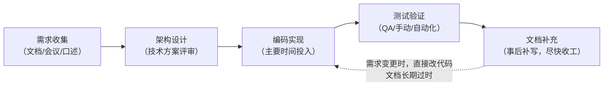
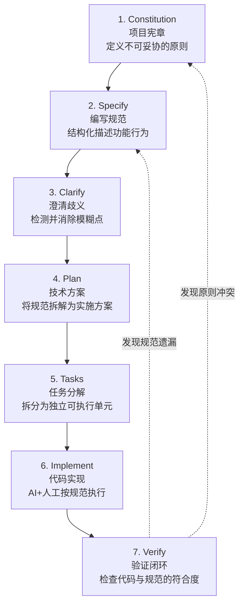
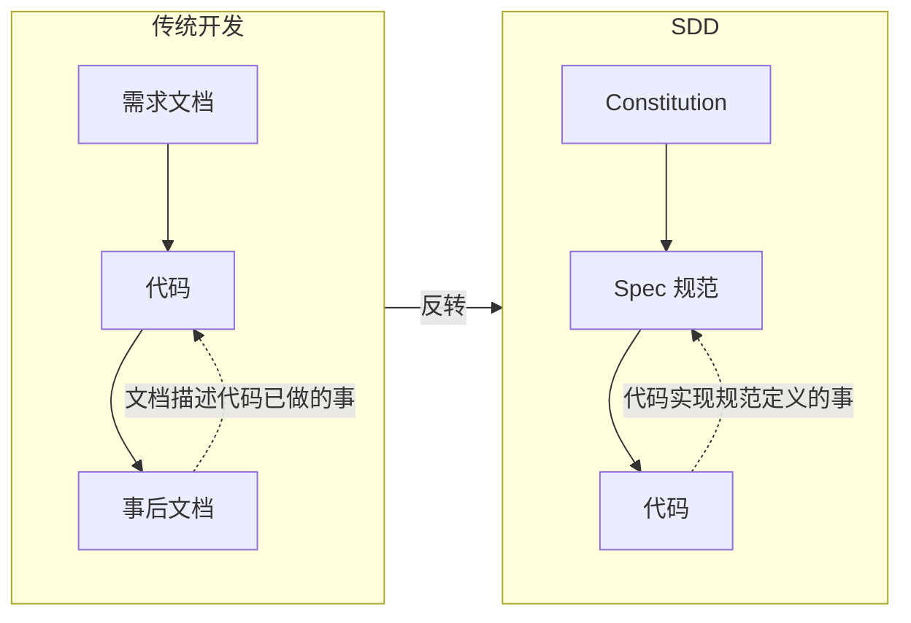
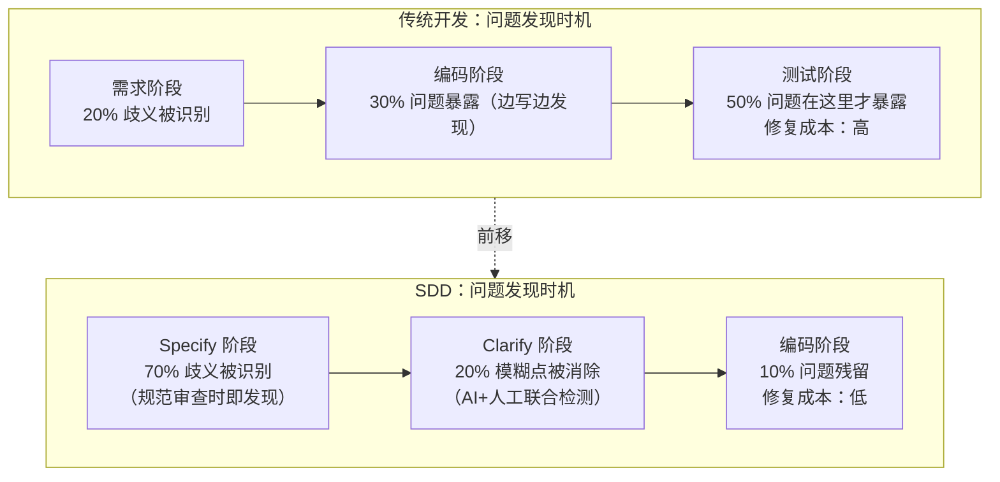
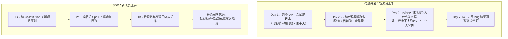
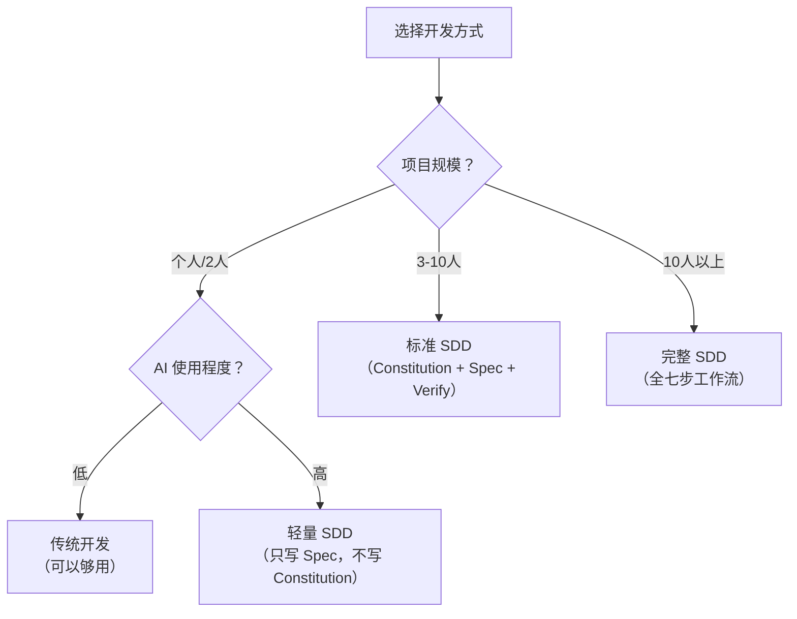

# SDD 与传统开发的对比

理解 SDD 的价值，最直观的方式就是把它和传统开发流程放在一起对比。传统开发不是"错的"——它在 AI 编码工具普及之前运行良好。但 AI 改变了开发的速度和规模，传统流程中的隐性假设在这个过程中被打破。本章从流程、质量、协作三个维度进行系统对比。

---

## 1. 流程对比

### 1.1 传统开发流程

传统开发的典型流程：需求收集 --> 架构设计 --> 编码实现 --> 测试验证 --> 文档（事后补）。



**核心特征**：代码是流程的中心。需求文档、设计文档只是阶段性产物，写完之后就进入"半遗忘"状态。文档服务于代码——代码怎么写，文档就怎么描述。

### 1.2 SDD 开发流程

SDD 的七步流程：



**核心特征**：规范是流程的中心。代码只是将规范"翻译"为可执行形式的过程产物——文档不再服务于代码，代码服务于规范。

### 1.3 关键反转



> **核心反转**：传统开发中，文档是代码的"事后描述"；SDD 中，代码是规范的"事中实现"。这个顺序的颠倒改变了一切——它把质量保证从"事后检查"变成了"事前约束"。

---

## 2. 质量保证的前移

### 2.1 问题发现的时机差异

传统开发中，大部分需求理解错误在编码完成后才发现——这时的修复成本是最高的。



> **关键数据**：传统开发中，80% 的需求歧义进入编码阶段后才暴露；SDD 通过规范审查和澄清环节，在编码前就消除 90% 的歧义。**在规范文档上改一句话的成本，远低于在 500 行代码中定位和修复同一个问题。**

### 2.2 质量保证机制对比

| 维度 | 传统开发 | SDD |
|------|---------|-----|
| **质量闸门位置** | 编码后（测试阶段） | 编码前（Specify + Clarify 阶段） |
| **问题发现方式** | 运行代码、用户反馈 | 规范审查、歧义检测 |
| **验证对象** | 代码是否正确运行 | 规范是否正确描述了需求 |
| **修复方式** | 改代码 + 可能改设计 | 改规范（一行 Markdown） |
| **同一问题的修复成本** | 高（代码 + 设计 + 测试联动修改） | 低（规范文本修改后，代码重新生成） |
| **AI 的作用** | 生成代码（可能生成错误的东西） | 审查规范 + 按规范生成代码 |

### 2.3 一个具体例子

**场景**：用户管理功能中，"删除用户"操作的级联规则。

**传统开发**：
```
需求文档："管理员可以删除用户"
↓
开发时发现疑问："用户的订单怎么办？"
↓
开发者自行决定："软删除，订单保留"（未记录）
↓
3 个月后，另一位开发者误以为"硬删除"，改了代码
↓
生产事故：删除用户后订单关联丢失
```

**SDD**：
```markdown
## 用户删除

### 行为
- 管理员执行删除操作时，对用户执行软删除（is_deleted=true）
- 用户的订单记录保留，外键 user_id 不受影响
- 用户的个人数据 30 天后由定时任务物理清除

### 验收
- [ ] 软删除后用户无法登录（返回 USER_DELETED 错误）
- [ ] 软删除后订单列表仍可查询到该用户的历史订单
- [ ] 30 天后用户数据被物理删除，订单中 user_id 设为 NULL
```

> **对比**：传统开发靠开发者的"当时判断"，SDD 靠规范的"事前约束"。前者的正确性依赖人，后者的正确性依赖文档——文档可以审查、可以追溯、可以自动验证。

---

## 3. 多维度对比表

### 3.1 综合对比

| 对比维度 | 传统开发 | SDD | 影响 |
|---------|---------|-----|------|
| **需求变更响应** | 改代码 -> 测试 -> 更新文档（文档常遗漏） | 改规范 -> 重新生成代码 -> 验证 | SDD 变更从源头开始，不会遗漏下游 |
| **新成员上手** | 读代码（大量时间）、问老人（隐性知识） | 读 Constitution + Spec（结构化知识） | SDD 上手时间缩短 50-70%（来自社区反馈） |
| **跨团队协作** | API 文档常与实现不一致 | Spec 是唯一真相来源，各团队对齐于 Spec | 减少集成阶段的"接口对不上"问题 |
| **审计可追溯性** | 需求->代码的追溯链断裂（文档过时） | 规范版本化，每一步都有追溯链路 | 满足合规审计要求，降低企业风险 |
| **AI 协作有效性** | AI 生成代码质量随机（依赖 prompt 质量） | AI 按规范生成，方向锁定、质量可控 | AI 从"猜测者"变为"执行者" |
| **知识留存** | 核心逻辑在开发者脑中，离职即流失 | 核心逻辑在规范中，Git 历史永留存 | 降低人员变动风险 |
| **Code Review 效率** | 审查代码逻辑是否合理（费脑、易遗漏） | 审查代码是否与规范一致（机械对照即可） | AI 可预审一致性，人工聚焦规范质量 |

### 3.2 需求变更响应流程对比

```mermaid
flowchart TD
    subgraph trad_change["传统开发：需求变更"]
        tc1["收到变更要求"] --> tc2["找代码中相关位置<br/>（可能遗漏影响范围）"]
        tc2 --> tc3["修改代码"]
        tc3 --> tc4["跑测试（如果记得写的话）"]
        tc4 --> tc5["忘记更新文档"]
        tc5 --> tc6["3 个月后：'这份文档是哪个版本的？'"]
    end
    
    subgraph sdd_change["SDD：需求变更"]
        sc1["收到变更要求"] --> sc2["修改对应 Spec 章节"]
        sc2 --> sc3["Clarify：检查新规范有无歧义"]
        sc3 --> sc4["Plan：评估影响范围"]
        sc4 --> sc5["AI 按新规范重新生成代码"]
        sc5 --> sc6["Verify：自动对比规范与代码"]
    end
```



### 3.3 新成员上手流程对比



---

## 4. 适用场景对比

并非所有项目都需要 SDD。以下是对比：

| 场景 | 传统开发更适合 | SDD 更适合 | 原因 |
|------|-------------|-----------|------|
| **个人小工具** | 是 | 否 | 规范成本 > 收益，一个人不需要文档对齐 |
| **原型验证** | 是 | 否 | 快速试错阶段，过度的规范性会降低迭代速度 |
| **中型团队项目**（3-10 人） | 部分 | 是 | 多人协作需要共享理解，SDD 提供对齐锚点 |
| **大型团队/多团队** | 否 | 是 | 跨团队协作必须有一个共享的真相来源 |
| **AI 重度使用** | 否 | 是 | AI 需要结构化规范才能产出一致的结果 |
| **合规/监管行业** | 否 | 是 | 审计追溯是硬性要求 |
| **长期维护项目** | 否 | 是 | 人员变动频繁，知识必须文档化留存 |

### 4.1 选择建议



---

## 5. 常见误区

### 误区 1："SDD 就是写文档，和传统需求文档一样"

**纠正**：传统需求文档是"参考材料"，SDD 规范是"单一事实来源"。前者写完就束之高阁，后者是开发全过程的核心参照物。参见第 1.3 节的关键反转。

### 误区 2："SDD 是瀑布模型的回归"

**纠正**：SDD 的每一步都是可回溯、可迭代的。规范是分功能编写的，每个功能有独立的规范迭代周期。参见 [01-什么是规范驱动开发](01-什么是规范驱动开发.md) 第 6 节。

### 误区 3："有了 SDD，AI 就能全自动开发了"

**纠正**：SDD 让 AI 的产出更可控，但规范的质量仍然是人在把关。Specify 和 Clarify 阶段尤其需要人的判断力——AI 可以检测歧义，但解决歧义依赖领域知识。

### 误区 4："传统开发已经过时了"

**纠正**：传统开发在小型项目、原型阶段仍然高效。SDD 不是替代，而是在特定场景下（大型项目、多人协作、AI 重度使用、合规要求）的更好选择。适用场景决定方法论。

---

## 6. 小结

SDD 与传统开发的核心区别不在于"写不写文档"，而在于**文档在流程中的位置和权重**：

| 传统开发 | SDD |
|---------|-----|
| 文档是代码的附属品 | 代码是规范的实现品 |
| 质量在测试阶段把关 | 质量在规范阶段把关 |
| 知识在人脑中 | 知识在规范中 |
| 变更从代码开始 | 变更从规范开始 |
| AI 猜测你的意图 | AI 执行你的指令 |

这个转变不是量的变化，而是质的飞跃——它把开发活动从"构建系统"重新定义为"翻译规范"。代码不再是你思考的终点，而是规范的可执行表达。

---

## 延伸阅读

- 上一章：[01-什么是规范驱动开发](01-什么是规范驱动开发.md) —— SDD 的定义与核心命题
- 下一章：[03-SDD与TDD-BDD的关系](03-SDD与TDD-BDD的关系.md) —— SDD 在方法论体系中的位置
- 下一阶段：[02-Constitution与Specify](../02-Constitution与Specify/01-Constitution项目宪章.md) —— 从 Constitution 开始实践 SDD
