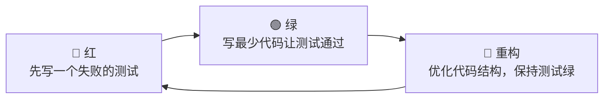
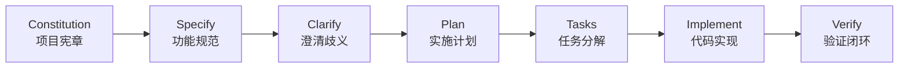
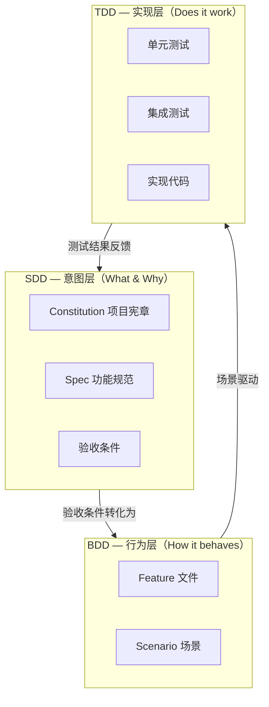
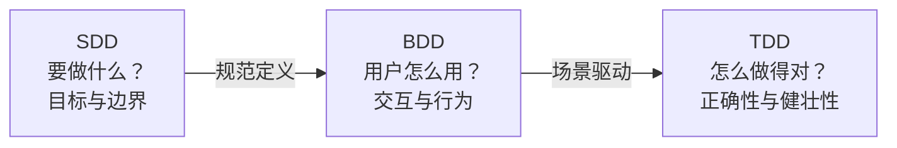
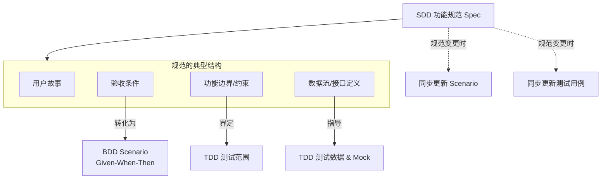
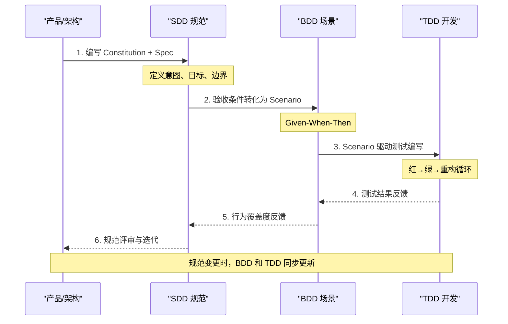
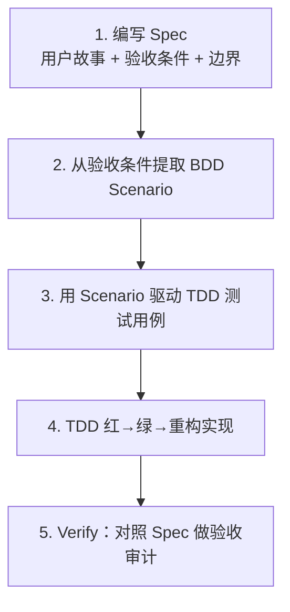
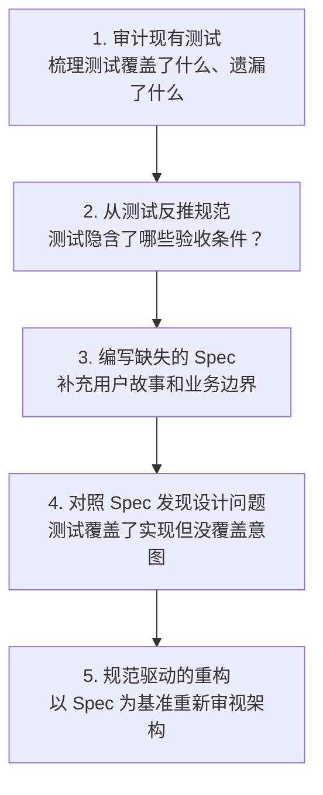
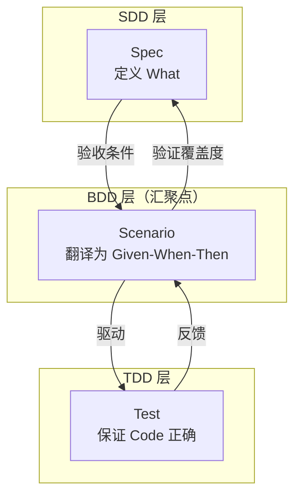
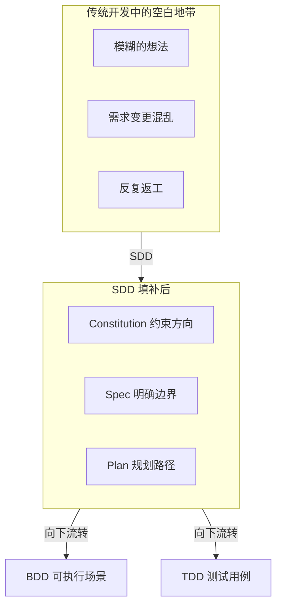

# SDD 与 TDD/BDD 的关系

理解 SDD（Specification-Driven Development，规范驱动开发）最直接的方式之一，就是把它放到大家已经熟悉的 TDD 和 BDD 旁边做对比。本章会回答三个核心问题：**三者分别解决什么问题？它们在什么层次协作？SDD 是替代还是补充？**

---

## 1. 三种方法论概述

### 1.1 TDD（Test-Driven Development，测试驱动开发）

TDD 的经典循环是 **红 → 绿 → 重构**：



**核心哲学**：测试不是验证手段，而是**设计工具**。你在写实现代码之前先定义"什么叫对"，这让接口设计先于实现细节浮现。

**典型实践**：

```python
# TDD 第一步：先写测试（红）
def test_transfer_money():
    account_a = BankAccount(balance=100)
    account_b = BankAccount(balance=0)
    account_a.transfer(50, account_b)
    assert account_a.balance == 50
    assert account_b.balance == 50  # 此时 transfer 还不存在，测试失败
```

```python
# TDD 第二步：最少代码让测试通过（绿）
class BankAccount:
    def __init__(self, balance=0):
        self.balance = balance
    
    def transfer(self, amount, target):
        self.balance -= amount
        target.balance += amount  # 刚好让测试通过
```

**TDD 的工作层次**：函数/模块级。它关心的是"这段代码对不对"。

---

### 1.2 BDD（Behavior-Driven Development，行为驱动开发）

BDD 将 TDD 从代码层面拉升到**行为层面**，使用自然语言描述用户可见的行为：

```
场景：用户转账成功
  Given 账户 A 余额为 100 元
    And 账户 B 余额为 0 元
   When 用户从 A 向 B 转账 50 元
   Then 账户 A 余额变为 50 元
    And 账户 B 余额变为 50 元
    And 转账记录被保存
```

**核心哲学**：用同一套语言让**开发者、QA、产品经理**都能理解和参与验证。Given-When-Then 模板建立了跨角色的沟通标准。

**典型工具**：Cucumber / Behave / SpecFlow，将自然语言场景映射到自动化测试步骤。

**BDD 的工作层次**：功能/场景级。它关心的是"这个功能的行为对不对"。

---

### 1.3 SDD（Specification-Driven Development，规范驱动开发）

SDD 将关注点继续上移，从"行为"上升到**意图与目标**：



**核心哲学**：在写任何代码和测试之前，先回答 **"我们到底要构建什么，以及为什么？"** 规范是唯一的真实来源（Single Source of Truth），代码只是规范的实现。

**典型工件**：

| 工件 | 形式 | 示例 |
|------|------|------|
| Constitution | 项目级 Markdown | 技术选型原则、代码风格约定、架构约束 |
| Spec | 功能级 Markdown | 用户故事、验收条件、边界定义、数据流 |
| Plan | 结构化的实施步骤 | 依赖分析、里程碑、风险标记 |
| Tasks | 可执行的子任务列表 | 每个任务对应一个可验证的交付 |

**SDD 的工作层次**：系统/项目级。它关心的是"我们为什么要构建这个？目标是什么？边界在哪里？"

---

## 2. 三者定位

三者不是竞争关系，而是**分层协作**关系：



决策流视角：



> **一句话定位**：SDD 定义"做什么"，BDD 定义"怎么交互"，TDD 保证"做得对"。三者覆盖了软件开发的三个决策层次。

---

## 3. 详细对比表

| 维度 | TDD | BDD | SDD |
|------|-----|-----|-----|
| **核心关注** | 代码正确性 | 用户行为 | 意图与目标 |
| **核心问题** | "这段代码对不对？" | "这个行为对不对？" | "我们到底要构建什么？" |
| **先行产出物** | 测试用例（先于实现代码） | 行为场景（Given-When-Then） | 功能规范 Spec（先于所有代码） |
| **典型工件** | 单元测试、集成测试 | Feature 文件、Scenario | Constitution、Spec、Plan、Tasks |
| **验证粒度** | 函数/模块级 | 功能/场景级 | 系统/项目级 |
| **参与角色** | 开发者 | 开发者 + QA + 产品经理 | 全团队（架构/产品/开发/QA） |
| **产出形式** | 代码（测试代码） | 半结构化自然语言 | 结构化 Markdown 文档 |
| **反馈周期** | 秒级（保存即运行） | 分钟级（场景执行） | 小时/天级（规范评审） |
| **前置条件** | 接口设计已明确 | 功能需求已明确 | 项目愿景和约束已明确 |
| **AI 协作方式** | AI 从测试生成实现代码 | AI 从场景生成步骤定义 | AI 从规范生成完整实现链路 |
| **代表工具** | JUnit, pytest, Jest | Cucumber, Behave, SpecFlow | Spec Kit, sdd-flow, sdd |
| **核心理念** | 测试是设计工具 | 统一语言沟通 | 规范是唯一真实源 |

---

## 4. 互补关系

### 4.1 SDD 的输出是 BDD 和 TDD 的输入

这是三者协作的最关键链路：



**具体转化示例**：

```markdown
<!-- SDD 规范中的验收条件 -->
## 验收条件
1. 转账金额不超过账户余额时，交易成功，余额正确扣减
2. 转账金额超过账户余额时，交易被拒绝，返回错误码 INSUFFICIENT_FUNDS
3. 单日累计转账超过 50,000 元时，触发风控审核
```

对应转化为 BDD 场景：

```gherkin
Feature: 转账
  用户可以将资金从一个账户转入另一个账户

  Scenario: 正常转账
    Given 账户 A 余额为 1000 元
    And 账户 B 余额为 500 元
    When 用户从 A 向 B 转账 300 元
    Then 账户 A 余额变为 700 元
    And 账户 B 余额变为 800 元
    And 返回交易成功

  Scenario: 余额不足
    Given 账户 A 余额为 100 元
    When 用户从 A 向 B 转账 200 元
    Then 交易被拒绝
    And 返回错误码 INSUFFICIENT_FUNDS
    And 账户余额不变
```

对应转化为 TDD 测试范围：

```python
# TDD 测试——对应规范中的每一条验收条件
class TestTransfer:
    def test_normal_transfer(self):
        """对应验收条件 1：正常转账"""
        ...
    
    def test_insufficient_funds(self):
        """对应验收条件 2：余额不足"""
        ...
    
    def test_daily_limit_exceeded(self):
        """对应验收条件 3：单日限额超限"""
        ...
```

---

### 4.2 三者协同的完整工作流



---

## 5. 实践中的协同模式

### 模式 1：SDD 先行（适合新项目/新功能）

适用于需求相对明确的新项目或大规模重构。



**实践节奏**：

```bash
# Step 1: 编写规范
# 在 specs/transfer-feature/spec.md 中完成规范文档

# Step 2-3: Spec Kit 或 AI 辅助生成 Scenario 和测试骨架
specify plan transfer-feature    # 生成实施计划
specify tasks transfer-feature   # 生成任务分解

# Step 4: 开发者 TDD 实现
# 已有 Scenario 做指引，单元测试明确边界
pytest tests/test_transfer.py --watch

# Step 5: 验证
specify verify transfer-feature  # 对照规范审计代码
```

> **适用场景**：新项目启动、大版本迭代、功能边界清晰的场景。优点是方向明确、不跑偏，代价是前期规范投入较大。

---

### 模式 2：TDD 驱动 SDD 反补（适合存量项目）

适用于已有大量代码和测试的存量系统，需要补齐规范债务。



**实践示例**：

```python
# 存量项目的现有测试
def test_deduct_balance():
    account = Account(100)
    account.deduct(30)
    assert account.balance == 70

def test_deduct_negative():
    account = Account(100)
    with pytest.raises(ValueError):
        account.deduct(-10)
```

从以上测试反推出的规范条目：

```markdown
## 反推规范：账户扣款

### 已覆盖（从测试反推）
- 扣款后余额 = 原余额 - 扣款金额
- 扣款金额不能为负数

### 可能遗漏（测试中未体现）
- 扣款金额超过余额时如何处理？→ 需补充验收条件
- 扣款操作的幂等性？→ 需补充边界定义
- 并发扣款的数据一致性？→ 需补充非功能约束
```

> **适用场景**：遗留系统改造、技术债务治理、"代码就是文档"项目的逆向工程。优点是投入可控、逐步完善，代价是容易遗漏系统性设计问题。

---

### 模式 3：BDD 中间汇聚（适合跨角色协作场景）

适用于产品、QA、开发三方需要频繁对齐的功能开发。



在这个模式中，BDD 的 Scenario 文件成为**全团队的可读锚点**：

- 产品通过 Scenario 确认"这就是我要的功能"
- QA 通过 Scenario 确认"这就是我要测的场景"
- 开发通过 Scenario 确认"这就是我要实现的范围"

```gherkin
# transfer.feature——三方评审的共同锚点
Feature: 转账功能

  Background:
    Given 系统已部署风控服务
    And 账户系统正常运行

  Scenario Outline: 转账金额校验
    When 用户发起转账金额为 <amount> 元
    Then 返回状态码 <status>
    And 提示信息为 <message>

    Examples:
      | amount | status | message              |
      | 100    | 200    | 转账成功             |
      | 0      | 400    | 金额必须大于零       |
      | -50    | 400    | 金额必须大于零       |
      | 100000 | 403    | 超过单日限额，需审核 |
```

---

## 6. 为什么 SDD 不是替代 TDD/BDD

一个常见的误解是"有了 SDD 就可以不用 TDD/BDD 了"。这是对三者定位的误读。

### 6.1 TDD 的"红绿重构"不可替代

TDD 解决的是**实现层面的正确性**——这段代码在各种输入下对不对？边界情况有没有覆盖？重构后有没有回归？

SDD 的规范说"转账金额不能超过余额"，但规范不会告诉你：

- 浮点数精度问题（`100.00 - 99.99 = 0.010000000000000009`？）
- 并发减扣的竞态条件
- 异常路径的调用链是否正确

**这些是 TDD 的主场**。SDD 回答"应该怎样"，TDD 回答"真的是这样吗"。

### 6.2 BDD 的 Given-When-Then 不可替代

BDD 解决的是**跨角色沟通的语言问题**。开发者说"异常处理"，产品说"出错了要提示"，BDD 用 Given-When-Then 把两套语言对齐。

SDD 的规范可以定义验收条件，但 BDD 的 Scenario 是**可执行的验收条件**——它既可以被人类阅读，也可以被自动化测试框架执行。这是 SDD 规范本身不具备的能力。

### 6.3 SDD 填补的是上游空白

TDD 和 BDD 的前提都是"你大致知道要做什么"。但很多项目最大的问题是：**在写代码之前，没人把"要做什么"想清楚**。

SDD 填补的正是这个空白。它在上游定义了意图、目标和边界，让 TDD 和 BDD 有据可依。



---

## 7. 小结

> **"SDD 管意图，BDD 管行为，TDD 管正确性"——三权分立，缺一不可。**

| 层次 | 方法论 | 核心命题 | 不可替代的价值 |
|------|--------|---------|---------------|
| 意图层 | SDD | 要构建什么？目标在哪？边界在哪？ | 让团队在编码前对齐方向，减少"做错了"的代价 |
| 行为层 | BDD | 用户怎么用？场景有哪些？异常怎么表现？ | 建立跨角色统一语言，让需求可执行、可验证 |
| 实现层 | TDD | 代码对不对？边界覆盖了没？重构安全吗？ | 以测试作为设计工具，保证实现的正确定和健壮性 |

三者的关系不是"哪个更好"，而是"各管一层"：

- 没有 SDD 的 TDD/BDD → 方向可能正确但意图模糊，容易"做对了事但做错了需求"
- 没有 BDD 的 SDD/TDD → 有规范和代码但缺乏跨角色沟通语言，产品和开发的认知鸿沟仍在
- 没有 TDD 的 SDD/BDD → 意图清晰、行为明确，但代码质量缺乏微观保障

**成熟的工程团队会将三者组合使用**：项目初期用 SDD 定义方向，功能设计时用 BDD 对齐场景，开发过程中用 TDD 保证质量。三者构成一个完整的"意图-行为-实现"验证链。

---

## 阅读进度

| 已完成 | 当前 | 下一步 |
|--------|------|--------|
| [01-什么是规范驱动开发](01-什么是规范驱动开发.md) | **03-SDD与TDD-BDD的关系** | [04-四级成熟度模型](04-四级成熟度模型.md) |
