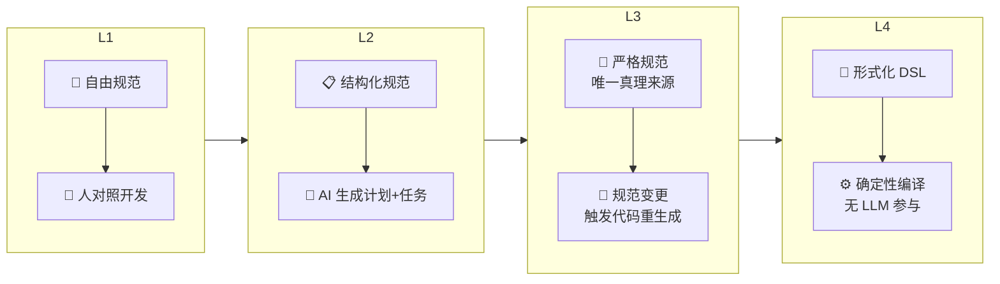
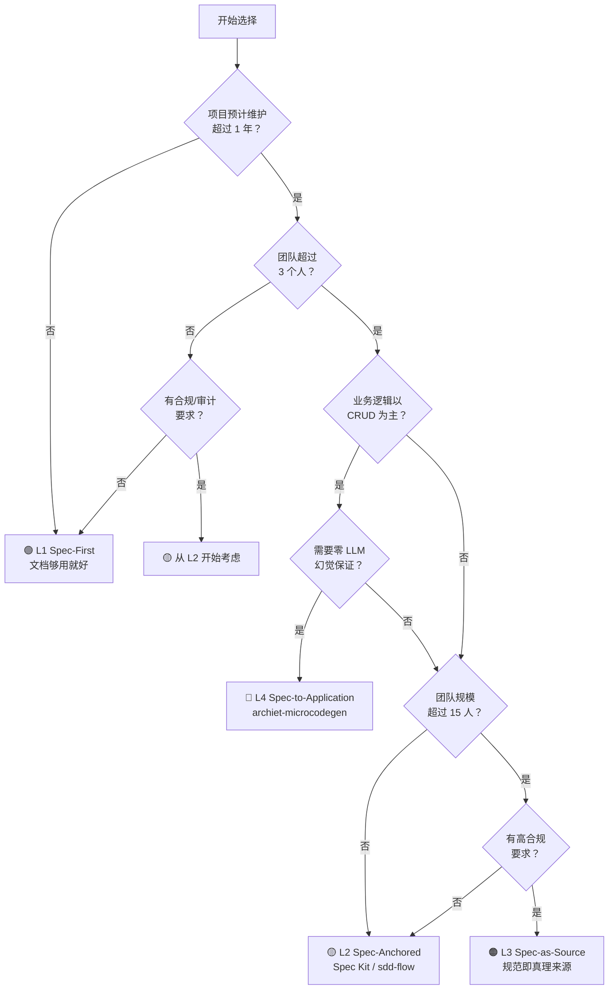

# 四级成熟度模型

Specification-Driven Development（SDD）不是"全有或全无"的方法论。本节介绍的**四级成熟度模型**帮助团队根据自己的项目规模、团队能力和业务需求，选择适合的 SDD 实践深度，并规划渐进式的演进路径。

---

## 1. 为什么需要成熟度模型

任何工程方法论在实践中都面临同样的难题：理论完美，落地困难。SDD 也不例外——如果要求团队第一天就做到"规范即源码"，大多数人会直接放弃。

成熟度模型解决三个核心问题：

**第一，SDD 不是"全有或全无"。** 团队可以根据实际情况选择适合的深度。一个内部工具项目不需要做到 L3 级别的规范门禁，一个金融核心系统也不应该停留在 L1 的手写 Markdown 阶段。

**第二，提供渐进式采用路径。** 今天从 L1 或 L2 开始，三个月后向上一级演进，半年后可能达到 L3。每一步都有明确的升级触发条件和需要的投入，团队不需要一次性承担所有成本。

**第三，不同项目类型适合不同级别。** 一个三人团队的内部运营后台、一个百人协作的核心产品、一个需要 SOC2 审计的合规系统——它们对规范的要求截然不同。成熟度模型帮助你在正确的场景选择正确的级别。

打个比方：如果你在做一个周末的 Hackathon 项目，L1（先写个 README 描述需求）就够了；如果你在和 20 个同事一起迭代一个用户量百万的产品，L2（AI 和开发者持续对照规范协作）是起点；如果你在给银行做核心账务系统，L3（规范即真理来源）甚至 L4（确定性规范编译）才配得上你的合规要求。

---

## 2. L1 — Spec-First（规范先行）

### 定义

**编码前先写规范文档**，但规范写完后的执行过程不做结构化管理。开发者（或 AI Agent）读完规范后手动对照开发，没有工具链强制执行"规范-实现"的一致性。

### 特征

- 有 PRD（产品需求文档）或技术设计文档，以 Markdown 形式存放在仓库中
- 规范与代码之间没有自动关联机制——靠开发者自觉对照
- 规范更新依赖人工流程（开会、PR Review 中提醒、Code Review Checklist）
- 规范写完后的生命周期管理几乎是空白的

### 优点

| 优点 | 说明 |
|------|------|
| **门槛最低** | 不需要学任何新工具，一小时就可以开始 |
| **零额外成本** | 只需要文本编辑器 + Git，团队现有工具链完全够用 |
| **立即受益** | 哪怕只是写一段清晰的需求描述，也能显著减少开发中的返工 |
| **灵活** | 规范格式、粒度、存放位置完全自定，没有工具约束 |

### 缺点

| 缺点 | 说明 |
|------|------|
| **规范与代码容易漂移** | 代码改了三轮，规范还是最初版本——时间越长漂移越严重 |
| **缺乏自动化** | 没有工具帮你检查"代码是否实现了规范中的所有需求" |
| **依赖个人纪律** | 效果好坏的方差极大，取决于开发者的习惯和经验 |
| **不可审计** | 无法追溯"这个功能对应规范的哪一条"，需要手动对照 |

L1 最大的风险是"写完即忘"——规范在项目初期认真写了，但随着迭代加速，规范更新的优先级永远排到最后，最终变成一份历史文档。

### 工具

任何文本编辑器 + Markdown + Git。不需要专用工具。

### 典型场景

- 个人项目或 Hackathon 原型
- 验证一个想法的可行性（Proof of Concept）
- 需求变化极快、生命周期可能不超过一个月的功能
- 小型内部工具，用户是组内的同事，出错了可以当面沟通

### 实践示例

```
project/
├── README.md
├── docs/
│   ├── prd.md            # "用户应该能够创建和编辑文章"
│   └── tech-design.md    # "使用 SQLite + Markdown 渲染"
└── src/
    └── ...
```

开发者打开 `prd.md`，阅读需求，然后开始写代码。PR Review 时对照规范检查。这就是 L1 的全部。

---

## 3. L2 — Spec-Anchored（规范锚定）

### 定义

**规范文件锚定开发全流程**，AI Agent 和开发者持续将规范作为唯一的参照源。使用专用工具管理规范生命周期——从编写、澄清、计划生成、任务分解到代码实现，每个阶段都与规范保持追溯关系。

### 特征

- 规范不再是一次性文档，而是**有生命周期的工程产物**
- AI Agent 从规范自动生成实施计划和任务列表
- 规范变更触发任务更新（而非手动对照）
- 有明确的分阶段流程：Constitution → Specify → Clarify → Plan → Tasks → Implement → Verify
- 代码实现可以追溯到具体规范条目

### L2 的关键进展

相比 L1，"锚定"二字是核心。L1 的规范和代码是两条平行线，偶尔交叉；L2 的规范像一根锚，代码始终被锚定在规范之上。当你修改代码时，你明确知道它在实现规范的哪一部分；当你修改规范时，工具会告诉你哪些代码和任务需要同步更新。

### 优点

| 优点 | 说明 |
|------|------|
| **规范-实现可追溯** | 每个代码变更可以追溯到规范条目，反之亦然 |
| **人机可读** | 规范的格式既适合人阅读（PR Review）也适合机器解析（AI 生成任务） |
| **减少沟通成本** | 规范本身就是"团队共识"，新人入职看规范就能理解项目全貌 |
| **AI 效率提升显著** | AI 从规范生成计划和代码的质量和一致性远高于从零生成 |

### 缺点

| 缺点 | 说明 |
|------|------|
| **需要学习工具链** | GitHub Spec Kit、sdd-flow 等工具需要投入时间学习 |
| **规范审查成为瓶颈** | 规范需要人工 Review 后才能进入实现阶段，对规范质量有一定要求 |
| **团队流程改造** | 从"直接写代码"到"先写规范再写代码"需要习惯转变 |
| **工具锁入风险** | 规范格式和工具绑定，切换工具链有迁移成本 |

### 工具

- **GitHub Spec Kit**：GitHub 开源的 SDD CLI 工具，提供 `specify init`、`/speckit.specify`、`/speckit.plan`、`/speckit.tasks` 等命令，配合 Claude Code 等 AI 编码助手使用
- **sdd-flow**：Claude Code 的多 Agent 阶段门控插件，强制规范流程顺序
- **Kiro**：端到端 SDD 平台，专注于规范到代码的完整生命周期
- **BMad Method**：以 Markdown 规范为核心的 SDD 方法，轻量但结构清晰

### 典型场景

- **团队协作的商业产品**：3-15 人的团队，产品有明确的长期迭代计划
- **AI 辅助开发**：使用 Claude Code、Cursor、Copilot 等 AI 工具辅助编码的团队
- **多模块项目**：需要跨模块保持接口一致性的项目
- **有新人入职的项目**：规范文档让新人快速理解系统设计

### 实践示例

```bash
# 初始化 SDD 项目结构
specify init my-product

# 1. 定义项目宪法
/speckit.constitution

# 2. 编写功能规范
/speckit.specify 用户文章管理功能

# 3. AI 澄清规范歧义
/speckit.clarify

# 4. 生成实施计划
/speckit.plan

# 5. 分解任务
/speckit.tasks

# 6. AI 按任务逐个实现
/speckit.implement
```

```text
项目结构（L2 典型）：
project/
├── .specify/
│   ├── memory/
│   │   └── constitution.md      # 项目宪法
│   ├── templates/               # plan/spec/tasks 模板
│   └── scripts/
├── specs/
│   └── 001-article-management/  # 一个功能一个目录
│       ├── spec.md              # 功能规范
│       ├── plan.md              # 实施计划
│       └── tasks.md             # 任务分解
└── src/
    └── ...
```

---

## 4. L3 — Spec-as-Source（规范即源码）

### 定义

**规范是唯一的真理来源（Single Source of Truth）**，代码可以被随时从规范重新生成。规范的变更自动触发代码变更。代码不直接手动编辑——或如果手动编辑了，必须将变更回写到规范中，保证规范始终领先于代码。

### 核心理念

L3 改变了"规范 vs 代码"的关系。在 L1 和 L2 中，规范是代码的"指导文档"——重要，但不决定性。在 L3 中，规范**就是**源码。代码是规范的"编译产物"。如果一个新员工入职，他应该读规范来理解系统，而不是读代码。

### 特征

- 规范是唯一的真理来源——代码的正确性由"是否与规范一致"来判断
- 规范变更自动触发代码重新生成（通过 AI Agent 或代码生成管道）
- 代码的手动修改是例外而非常态；如果手动修改了代码，必须同步回写规范
- 有严格的规范门禁——规范未通过 Review 和自动化检查前，代码不能进入主干
- "Code Review" 的语义从"审查代码质量"转变为"审查规范质量 + 验证代码与规范一致性"

### 优点

| 优点 | 说明 |
|------|------|
| **代码质量和一致性极高** | 同一规范生成的代码风格、错误处理模式、API 命名全部一致 |
| **新人入职成本极低** | 读规范即可理解系统全貌，不需要在代码的海洋里摸索 |
| **回归风险可控** | 任何时候都可以从规范完整重建代码，不怕"祖传代码没人敢动" |
| **审计友好** | 合规审查只需要审查规范质量，不需要逐行审查代码 |

### 缺点

| 缺点 | 说明 |
|------|------|
| **对规范质量要求极高** | 规范中的错误会被完整复制到代码中，放大幅度取决于规范粒度 |
| **工具链成熟度有限** | L3 级别的工具仍在实验中（如 Tessl、OpenSpec），尚未达到生产级稳定 |
| **团队需要极强的规范能力** | 写清楚规范比写清楚代码更难——团队需要培养"规范思维" |
| **灵活性降低** | 快速改一行临时修复 bug 变得沉重——需要先改规范再重新生成 |
| **适用范围有限** | 对 UI 密集、交互复杂的前端项目，L3 的收益可能不明显 |

### 工具

- **Tessl**：实验阶段的规范驱动开发平台，聚焦"规范即真理来源"
- **OpenSpec**：正在发展中的开放 SDD 规范格式，目标是跨工具的互操作性
- 大型科技公司的内部工具：Google 的部分项目使用 Protocol Buffers 作为 API 规范的唯一真理来源，代码从 `.proto` 文件自动生成（这是一种特定领域内的 L3 实践）

### 典型场景

- **高合规性系统**：金融、医疗、航空等受严格监管的行业，审计要求明确追溯
- **多团队协作的大型平台**：不同团队维护不同模块，规范作为团队间的接口契约
- **长寿命令系统**：预期维护周期超过 5 年，代码会经历多代开发者
- **API 密集型服务**：接口规范是价值最高的资产，实现细节相对标准化

### 实践示例

```text
L3 的工作流：

规范变更（source of truth）
    │
    ▼
规范 Review + 自动化验证
    │
    ▼
AI 代码生成管道
    │
    ▼
生成的代码（不可手动编辑）
    │
    ▼
自动化测试验证
    │
    ▼
部署

如果要修一个 bug：
  Option A: 修改规范 → 触发重新生成 → 自动修复
  Option B: 临时修改代码 → 必须回写规范 → Code Review 检查一致性
```

```text
文件结构（L3 典型）：
project/
├── specs/                      # 真理来源——唯一可手动编辑的部分
│   ├── domain/
│   │   ├── article.spec.md     # 文章领域规范
│   │   └── user.spec.md        # 用户领域规范
│   ├── api/
│   │   └── rest-api.spec.yaml  # API 规范（OpenAPI）
│   └── constitution.md         # 项目宪法
├── generated/                  # 生成产物——禁止手动编辑
│   ├── src/
│   └── tests/
└── custom/                     # 需要手写的补充代码
    └── ...
```

---

## 5. L4 — Spec-to-Application（规范到应用）

### 定义

**规范直接"编译"为可运行应用，中间不需要 LLM 参与代码生成。** 规范作为领域模型的形式化描述，通过**确定性**的 M2T（Model-to-Text，模型到文本）转换产出代码。整个路径中的每一步都是可重复、可验证、可审计的。

### 与 L3 的关键区别

L3 的代码生成依赖 LLM——每次生成可能有细微差异（即"LLM 幻觉"风险）。L4 使用**确定性编译器**——相同的规范输入，永远产出相同的代码输出。这就像 C 编译器：同一个 `.c` 文件，在任何机器上编译出的机器码在逻辑上等价。L4 追求的是这种确定性。

### 特征

- 规范是**形式化**的领域模型（结构化 YAML/JSON/DSL），而非自然语言的 Markdown
- 代码生成是**确定性**的——不依赖概率模型，不引入幻觉
- 完整的编译管道：规范 → 领域模型验证 → 代码模板引擎 → 可运行应用
- 规范格式严格，但因此可以做精确的静态分析
- 中间不经过 LLM——这意味着零 API 调用成本、零延迟波动

### 优点

| 优点 | 说明 |
|------|------|
| **完全确定性** | 相同输入永远得到相同输出，可以放进 CI/CD 做确定性构建 |
| **零 LLM 幻觉** | 不存在 AI 编造字段、误解需求、生成不一致代码的问题 |
| **可严格审计** | 编译器本身可以被审计，规范到代码的映射关系是明确的模板规则 |
| **速度快** | 一次编译通常在毫秒到秒级完成，不依赖外部 API |
| **成本低** | 没有 LLM token 消耗，纯本地计算 |

### 缺点

| 缺点 | 说明 |
|------|------|
| **适用范围有限** | 目前主要适用于 CRUD/API 类应用，复杂业务逻辑难以用 DSL 描述 |
| **规范格式严格** | 不像 L2/L3 可以用自然语言灵活描述，必须使用形式的、结构化的规范格式 |
| **工具极少** | L4 级别的工具屈指可数，生态系统几乎为零 |
| **灵活性最差** | 如果你的场景不被 DSL 覆盖，完全无法使用 |
| **学习曲线陡峭** | 团队需要学习形式化建模，而非"写好 Markdown 就行" |

### 工具

- **archiet-microcodegen**：目前极少数 L4 级别的开源工具之一，从形式化规范编译生成完整 Web 应用（后端 API + 前端页面）

### 典型场景

- **企业内部管理系统**：标准 CRUD 操作占据了 80% 以上的代码量
- **数据管理后台**：表单、列表、详情页的模式高度重复
- **API 服务**：接口的输入输出模型可以形式化描述，实现逻辑相对模板化
- **合规要求极致严格的系统**：需要证明"编译器本身没有引入缺陷"

### 实践示例

```yaml
# 形式化规范（archiet-microcodegen DSL 风格示例）
entities:
  Article:
    fields:
      - name: title
        type: string
        required: true
        max_length: 200
      - name: content
        type: text
        required: true
      - name: status
        type: enum
        values: [draft, published, archived]
        default: draft
    api:
      crud: true              # 自动生成 CRUD API
      pagination: true        # 列表接口自动分页
      search: [title]         # 搜索字段
    ui:
      list_page: true         # 自动生成列表页
      detail_page: true       # 自动生成详情页
      form_page: true         # 自动生成表单页
```

```bash
# 从规范编译生成完整应用
microcodegen compile --spec project.spec.yaml --output ./app/

# 输出（确定性，每次编译结果完全一致）：
# app/src/models/article.py          # 数据模型
# app/src/routes/article_api.py      # REST API
# app/src/pages/ArticleList.tsx      # 前端列表页
# app/src/pages/ArticleForm.tsx      # 前端表单页
# app/tests/test_article_api.py      # 自动化测试
# app/migrations/001_create_article.sql  # 数据库迁移
```

---

## 6. 四级对比总览表

| 级别 | 名称 | LLM 写代码？ | 规范即真相？ | 规范形式 | 典型工具 | 团队规模 | 适用场景 |
|------|------|:---------:|:---------:|------|---------|:------:|------|
| L1 | Spec-First | 是 | 否 | 自由 Markdown | Markdown + Git | 1-2人 | 个人项目、原型验证、小型内部工具 |
| L2 | Spec-Anchored | 是 | 部分 | 结构化 Markdown | Spec Kit, sdd-flow, Kiro, BMad Method | 3-15人 | 团队协作产品、AI 辅助开发、多模块项目 |
| L3 | Spec-as-Source | 是（可重置） | 是 | 严格的 Markdown/YAML | Tessl, OpenSpec | 15-100人 | 高合规系统、大平台、长生命周期项目 |
| L4 | Spec-to-Application | 否 | 是 | 形式化 DSL | archiet-microcodegen | 不限 | CRUD/API 应用、管理后台、确定性要求极高的系统 |

### 关键维度的逐级演进



从上图可以看出：**成熟度越高的级别，越不依赖"人"的执行纪律，而越依赖规范本身的质量和工具链的完备性。** L1 全靠人自律，L4 全靠编译器可靠。大多数团队处于 L1 和 L2 之间，在向 L2 迈进的过程中。

---

## 7. 升级路径与决策树

### 决策树：你该从哪一级开始？



### 升级路径与触发条件

**L1 → L2：引入工具链**

| 触发条件 | 说明 |
|------|------|
| 团队超过 3 人 | 口头沟通和手动对照规范的效率开始下降，需要工具辅助追溯 |
| 出现"规范和代码不一致"的线上事故 | 这是最硬的信号——规范写了但代码没跟上，说明靠人自律已经不够 |
| 开始使用 AI 编码助手 | AI 在有结构化规范的条件下产出的质量和一致性远高于从零生成 |
| 项目进入持续迭代阶段 | 版本从 v0.1 进入 v1.0，意味着"一次性规范"无法覆盖长期演进 |

**升级动作**：
1. 引入 GitHub Spec Kit 或 sdd-flow，规范项目结构
2. 编写项目宪法（Constitution），定义团队的代码规范和设计原则
3. 第一个功能从 L2 流程完整走一遍，团队体验"规范锚定"的工作方式
4. 建立规范 Review 流程：和 Code Review 平级，合入主干前必须通过

**L2 → L3：建立规范门禁**

| 触发条件 | 说明 |
|------|------|
| 团队超过 15 人或跨多团队协作 | 不同团队的代码风格和实现差异开始影响整体一致性 |
| 合规/审计要求明确 | 需要证明"代码正确实现了规范"，而不仅仅是"我们认为实现了" |
| 系统进入维护期 | 代码频繁改动但规范更新滞后，漂移加速 |
| 出现了"规范写了但 AI 理解错了"的问题 | 说明当前规范的自由度太高，需要更严格约束 |

**升级动作**：
1. 从最高价值、最稳定的模块开始试点（不要全量迁移）
2. 建立规范门禁：规范未通过 Review + 自动化验证，代码禁止合入主干
3. 引入规范质量指标：歧义检测率、规范覆盖率、规范-代码一致性得分
4. 配置"规范变更自动触发代码重生成"管道

**L3 → L4：形式化领域模型**

| 触发条件 | 说明 |
|------|------|
| 领域模型稳定且模式化 | 业务逻辑以 CRUD 为主，实体关系清晰，少特例 |
| 对确定性有极致要求 | 每次 LLM 生成的细微差异不可接受（如合规审计场景） |
| LLM 成本成为瓶颈 | 大团队的 token 消耗显著，确定性编译可以大幅降本 |

**升级动作**：
1. 将现有的自然语言规范逐步形式化（YAML/JSON Schema/DSL）
2. 引入 archiet-microcodegen 或自研代码生成器
3. 在非核心模块先验证编译效果，确认覆盖率和生成质量
4. 建立规范格式约定和静态分析工具

---

## 8. 大多数团队从 L2 开始

如果你读完前面对四个级别的描述，心里在想"L1 太弱，L3 门槛太高，我该怎么选"——你的直觉是对的。**L2 是当前 SDD 生态的"甜蜜点"。**

### 为什么 L2 是最佳起点

**L1 太弱。** 它只是"把想法写下来"，没有解决规范和代码的持续同步问题。在 AI 辅助编码越来越普及的今天，你需要一个结构化的规范让 AI 产出稳定可预期的结果。L1 的 Markdown 对 AI 来说信息密度太低——它不知道该在哪里找什么。

**L3 门槛太高。** "规范即真理来源"听起来很美，但要求团队对每一个规范条目深思熟虑——因为在 L3 中，规范中的模糊之处会被 AI 完整地放大到代码里。更重要的是，L3 需要一种"规范思维"：思考问题从写规范开始，而不是从写代码开始。这种思维转变不是一两周能完成的。

**L2 是恰到好处的平衡。** 它给了你结构化的规范和 AI 工具链（提升效率），但不强制代码必须完全从规范生成（保留灵活性）。GitHub Spec Kit 和 sdd-flow 都是 L2 级别的工具，开箱即用——克隆、初始化、写规范、跑工作流，一个下午就能把第一个功能从规范走到代码。

### L2 启动建议

```text
第一周：
  Day 1: 安装工具链（Spec Kit 或 sdd-flow），初始化项目结构
  Day 2: 为项目编写 Constitution（代码规范、设计原则、技术栈约束）
  Day 3: 选一个真实功能，从零走一遍 L2 流程
         （specify → clarify → plan → tasks → implement）
  Day 4: 复盘——哪些步骤顺手，哪些卡壳，调整规范模板
  Day 5: 第二个功能，尝试独立完成（减少 AI 辅助）

第一个月：
  - 所有新功能走 L2 流程
  - 建立规范 Review 习惯（和 Code Review 同等的严肃程度）
  - 积累可复用的规范模板和模式

第三个月：
  - 评估规范质量——有没有漂移？AI 产出一致性如何？
  - 如果效果好，考虑是否向 L3 演进
  - 如果效果一般，先加固 L2 的基础——工具链熟练度和规范写作能力
```

### 不建议一开始就追求 L3/L4

L3 和 L4 是目标，不是起点。就像你不会在第一周学编程时就追求写出一个操作系统——你需要先写好代码，再学架构，再学系统设计。SDD 同理：

1. **先让团队适应"规范先行"的工作节奏**（L2）：从"拿到需求就写代码"转变为"拿到需求先写规范、Review 规范、AI 生成计划、再开始写代码"
2. **培养规范写作能力**（L2 中积累）：写好规范比写好代码更难——你需要精确、无歧义、完整地描述需求，同时保持可读性
3. **当规范的投入产出比明确为正时，再考虑升级**（L3）：如果 L2 的规范已经在持续为团队节省时间、减少返工、提高一致性，那么 L3 的额外投入是值得的。如果 L2 还没跑顺，L3 只会放大问题。

---

## 9. 小结

四级成熟度模型不是衡量"谁的 SDD 做得更好"的竞赛排名，而是一张**地图**——它告诉你当前在哪里、下一步可以往哪走、走多远取决于你的需求而非你的 ambition。

**核心要点回顾：**

| 要点 | 说明 |
|------|------|
| **SDD 是渐进式的** | 不是全有或全无。从 L1 或 L2 开始，按需升级 |
| **L2 是甜蜜点** | 结构化规范 + AI 工具链，兼顾效率与灵活性 |
| **升级需要触发条件** | 不要为了升级而升级——等业务需求（团队规模、合规、成本）推着你走 |
| **规范能力是核心** | 无论哪一级，规范的质量决定了最终效果的上限 |
| **工具是辅助** | 工具链让规范管理更高效，但它们不能替代团队对"规范思维"的理解和认同 |

**下一步：** 理解了成熟度模型后，下一节将进入 SDD 七步工作流的第一步——[Constitution（项目宪章）](../02-Constitution与Specify/01-Constitution项目宪章.md)，学习如何为项目建立根本性的设计原则和编码规范。

---

> **一句话总结**：今天从 L2 开始，让团队适应"规范先行"的工作节奏，让 AI 在结构化规范的锚定下稳定产出。当业务的复杂度推着你走时，再从容地向 L3 甚至 L4 迈进。成熟度是演进的过程，不是跳跃的目标。
