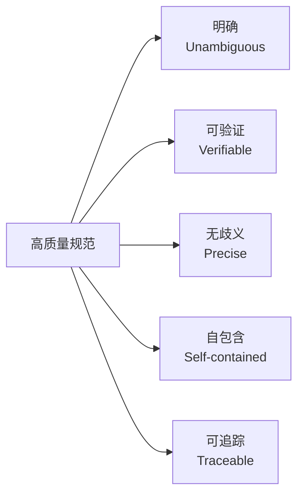
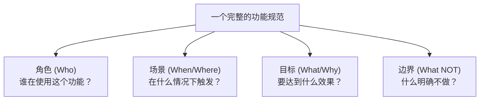
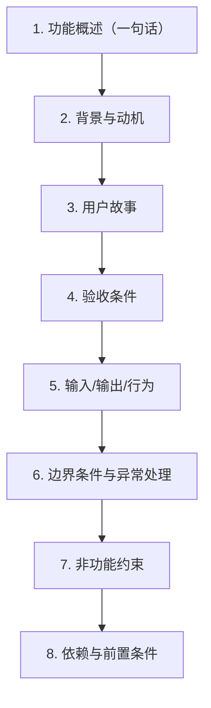
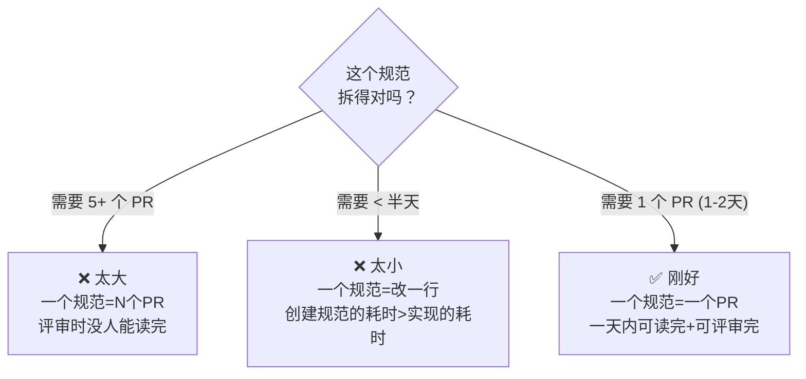

# 规范编写核心原则

规范（Specification）是 SDD 工作流的基石。一个糟糕的规范不仅无法指导开发，还会在后续的 Clarify、Plan、Implement 阶段引发连锁问题。本章系统阐述编写高质量规范的五大属性、结构层次、粒度控制与常见反模式。

---

## 1. 规范的五个属性

一个合格的规范必须具备以下五个属性。缺少任何一个，规范的质量都会打折扣。



### 1.1 明确（Unambiguous）

规范只有一个解释方式。任何人（开发者、测试、PM）读完规范后，对"要做什么"的理解必须一致。

| 属性 | 正例 | 反例 |
|------|------|------|
| 明确 | "登录失败超过 5 次后，账号锁定 30 分钟" | "多次登录失败后临时锁定账号" |

> 反例中的"多次"是多少次？"临时"是多久？答案因人而异——这就是歧义的来源。

### 1.2 可验证（Verifiable）

规范的每一条都对应一个可执行的测试。如果一条规范无法转化为测试用例，它就不是规范，而是愿望。

| 属性 | 正例 | 反例 |
|------|------|------|
| 可验证 | "搜索接口 P99 延迟 < 200ms（1000 QPS 负载下）" | "搜索要快" |

> **判断标准**：如果你无法写出一个 Given-When-Then 来验证它，那它就不够可验证。

### 1.3 无歧义（Precise）

用精确的数值、枚举值、边界条件替代模糊的自然语言描述。

| 属性 | 正例 | 反例 |
|------|------|------|
| 无歧义 | "密码长度 8-64 字符，必须包含大写字母、小写字母、数字各至少 1 个" | "密码要有一定复杂度" |
| 无歧义 | "支持的角色类型：`admin`、`editor`、`viewer`" | "支持常见角色" |

### 1.4 自包含（Self-contained）

规范中的每个概念都必须在本规范内定义，或通过明确引用指向外部定义。阅读者不应需要额外上下文来理解规范。

| 属性 | 正例 | 反例 |
|------|------|------|
| 自包含 | "用户的信用等级分为三级：L1（0-599分）、L2（600-799分）、L3（800-1000分）" | "根据现有信用体系划分等级" |

> "现有信用体系"是什么？去哪里查？规范不能依赖读者的隐含知识。

### 1.5 可追踪（Traceable）

规范的每一项要求都应能追溯到业务需求或用户故事。当实现完成后，可以反向验证"这条代码是服务于规范中的哪一条"。

| 属性 | 正例 | 反例 |
|------|------|------|
| 可追踪 | "REQ-AUTH-003：密码错误超过上限后锁定账号（源自 US-002 安全需求）" | 没有编号，无法追溯到来源 |

---

## 2. "一个规范 = 一个完整的故事"原则

一个高质量的功能规范，应该像故事一样完整。



### 四个核心要素

| 要素 | 要回答的问题 | 示例 |
|------|-------------|------|
| **角色** | 谁在使用？ | "普通注册用户"而非笼统的"用户" |
| **场景** | 什么情况下触发？ | "用户输入邮箱和密码点击登录按钮时" |
| **目标** | 要达到什么效果，为什么？ | "验证身份后跳转到个人首页，因为未登录用户无法访问个人数据" |
| **边界** | 什么明确不做？ | "不涉及第三方登录（微信/Google），不涉及记住密码功能" |

> **边界声明是规范中最容易被省略、却在后期引发最大争议的部分。** 没有边界声明的规范，PM 和开发对"什么不做"永远无法达成共识。

---

## 3. 规范的结构层次

一个完整的规范应遵循以下八层结构：



### 3.1 功能概述（一句话）

用一句话说清楚这个功能是什么。这是给所有人（包括非技术人员）看的"电梯演讲"。

```
功能概述：为注册用户提供基于邮箱+密码的登录能力，验证通过后返回会话令牌。
```

> 如果你的功能概述超过两句话，说明你还没想清楚这个功能到底是什么。

### 3.2 背景与动机

解释**为什么**需要这个功能，以及不做会有什么问题。这部分帮助评审者和后来的维护者理解上下文。

```markdown
## 背景与动机

当前系统的所有接口均为公开访问，未对用户身份进行区分。
这导致：
1. 任何知道 URL 的人都能访问所有数据（安全风险）
2. 无法提供个性化体验（如个人收藏、历史记录）
3. 无法进行操作审计（合规风险）

引入登录功能是构建用户体系的第一步。
```

### 3.3 用户故事

使用标准的 "As a... I want... So that..." 格式，每一个用户故事描述一个独立的用户价值。

```markdown
## 用户故事

**US-001**：作为注册用户，我希望通过邮箱和密码登录系统，以便访问我的个人数据。

**US-002**：作为安全管理员，我希望在用户连续登录失败后锁定其账号，以防止暴力破解攻击。

**US-003**：作为已登录用户，我希望在 30 分钟无操作后自动退出，以保护我的账号安全。
```

> 用户故事不是流水账。每个故事必须独立交付价值。如果两个故事拆不开，大概率是粒度出了问题。

### 3.4 验收条件

使用 Given-When-Then 格式，每个用户故事对应一组验收条件。

```markdown
## 验收条件（US-001：邮箱密码登录）

**AC-001-01 正常登录**
- Given：用户已注册，邮箱为 `user@example.com`，密码为 `P@ssw0rd123`
- When：用户输入正确的邮箱和密码，点击"登录"
- Then：系统返回 JWT 令牌，用户跳转到个人首页

**AC-001-02 密码错误**
- Given：用户已注册，邮箱为 `user@example.com`
- When：用户输入正确邮箱但错误密码
- Then：系统返回"邮箱或密码错误"，不区分是邮箱不存在还是密码错误

**AC-001-03 账号锁定**
- Given：用户已连续 5 次登录失败
- When：用户第 6 次尝试登录（即使密码正确）
- Then：系统返回"账号已被锁定，请 30 分钟后重试"
```

### 3.5 输入/输出/行为三元组

对每一个接口或交互，明确输入、输出和预期行为。

```markdown
## 接口定义

### POST /api/auth/login

| 维度 | 说明 |
|------|------|
| **输入** | `{ "email": string (必填, 邮箱格式), "password": string (必填, 8-64字符) }` |
| **输出（成功）** | `{ "token": string (JWT), "expires_in": 3600 }`，HTTP 200 |
| **输出（失败）** | `{ "error": "INVALID_CREDENTIALS" }`，HTTP 401 |
| **输出（锁定）** | `{ "error": "ACCOUNT_LOCKED", "retry_after": 1800 }`，HTTP 423 |
| **行为** | 验证凭据 → 检查锁定状态 → 生成令牌 → 重置失败计数 |
```

### 3.6 边界条件与异常处理

这是规范中最容易被忽略的部分，也是线上故障的最高发来源。

```markdown
## 边界条件与异常处理

| 场景 | 预期行为 |
|------|---------|
| 邮箱为空 | 返回 "请输入邮箱"，HTTP 400 |
| 密码为空 | 返回 "请输入密码"，HTTP 400 |
| 邮箱格式不合法 | 返回 "邮箱格式不正确"，HTTP 400 |
| 账号未激活（邮箱未验证） | 返回 "请先验证邮箱"，HTTP 403 |
| 账号已被禁用 | 返回 "账号已被禁用"，HTTP 403 |
| 并发登录请求（同一账号同时发送多个请求） | 每个请求独立验证，以最后成功的为准 |
| 数据库连接超时 | 返回 "服务暂时不可用"，HTTP 503，不泄露内部错误信息 |
| Session 存储（Redis）不可用 | 降级为无状态 JWT 模式，记录告警 |
```

> **规则**：Happy Path 只需要 3 条验收条件，但异常路径至少需要 Happy Path 的 2 倍。如果你没写异常处理，你的规范未完成。

### 3.7 非功能约束

性能、安全、可用性等跨切面的要求。

```markdown
## 非功能约束

| 约束 | 要求 |
|------|------|
| 性能 | 登录接口 P99 延迟 < 500ms（1000 QPS 下） |
| 安全 | 密码使用 bcrypt (cost=12) 哈希存储，禁止明文记录密码 |
| 安全 | JWT 使用 RS256 签名，有效期 1 小时 |
| 安全 | 登录失败次数基于 Redis 计数，不可被客户端绕过 |
| 可用性 | 登录服务不可用时，返回明确错误信息，不阻塞其他功能 |
```

### 3.8 依赖与前置条件

明确这个功能的实现依赖什么。

```markdown
## 依赖与前置条件

- **数据库**：User 表已包含 `email`、`password_hash`、`status`、`locked_until` 字段
- **缓存**：Redis 可用，用于登录失败计数和会话存储
- **邮件服务**：已完成注册功能，用户已通过邮箱验证
- **公钥基础设施**：JWT 签名所需的 RSA 密钥对已生成
```

---

## 4. 规范粒度控制

规范太大会失去可维护性，太小会失去价值。判断标准如下：



### 粒度判断标准

| 指标 | 合理范围 |
|------|---------|
| **用户故事数量** | 1-5 个（超过 5 个说明该拆了） |
| **验收条件数量** | 3-15 条（包括异常路径） |
| **预计实现工时** | 1-2 天（单人） |
| **PR 数量** | 1 个（特例下 2 个：前后端分离） |

> **经验法则**：如果你和同事描述这个功能时，一口气说不完，那就应该拆成两个规范。

### 拆分技巧

- **按用户角色拆**："管理员功能"和"普通用户功能"通常可以分拆
- **按输入/输出拆**：创建资源和展示资源是两个不同的规范
- **按 MVP 拆**：核心流程一个规范，优化和边缘功能用后续规范跟进

---

## 5. 常见反模式

以下是在实践中反复出现的四种坏味道。识别它们是写好规范的前提。

### 5.1 过早进入实现细节

**症状**：在规范中写了"用 Redis 做缓存"、"数据库加一个索引"、"前端用 React Hooks"。

```markdown
## ❌ 反例

用户登录时，先用 bcrypt 比较密码哈希，然后生成 JWT，
把 JWT 存到 Redis（key 格式：`session:{user_id}`），
设置 TTL 为 3600 秒。前端用 `localStorage.setItem('token', ...)` 存储。
```

```markdown
## ✅ 正例

系统验证用户凭据后，返回一个有效期 1 小时的会话令牌。
令牌的存储机制和实现技术栈不在本规范范围内，由技术方案决定。
```

> **规范回答"做什么"，技术方案回答"怎么做"。** 不要在规范中预设实现方式——这会限制工程师的技术选择，且让规范在技术栈变更时失效。

### 5.2 模糊的形容词

**症状**：使用了"快"、"稳定"、"友好"、"易用"、"灵活"、"高性能"等不可验证的词。

```markdown
## ❌ 反例

- 登录体验要流畅
- 系统要安全可靠
- 错误提示要友好
```

这些描述看似有要求，实则无人能验证。什么叫"流畅"？P99 < 500ms 和 P99 < 2000ms 都有人认为"流畅"。

```markdown
## ✅ 正例

- 登录请求 P99 延迟 < 500ms
- 密码使用 bcrypt (cost=12) 哈希存储
- 错误提示使用用户可理解的自然语言，不暴露技术细节（如堆栈信息、SQL 语句）
```

> **规则**：每写一个形容词，问自己"能写出对应的测试用例吗？"如果不能，替换为可度量的指标。

### 5.3 遗漏异常路径

**症状**：只写了正确的使用方式（Happy Path），未考虑任何异常情况。

这是最致命的反模式，因为 Bug 从来不出现在 Happy Path 上。

一个检查清单：

```markdown
## 异常路径检查清单

- [ ] 输入为空/格式错误时会怎样？
- [ ] 并发操作同一资源时会发生什么？
- [ ] 依赖服务（数据库、缓存、第三方API）不可用时怎么处理？
- [ ] 用户权限不足/状态异常（未激活、已禁用、已过期）时的行为？
- [ ] 资源耗尽（磁盘满、连接池满、内存不足）时的降级策略？
- [ ] 操作超时后的状态一致性？
```

### 5.4 忽视"什么不做"

**症状**：规范只描述了要做什么，但没有明确功能边界。

这导致开发过程中不断出现"要不要也支持一下 X？"的讨论，范围持续膨胀。

```markdown
## ❌ 反例（无边界声明）

登录功能规范，全文描述登录流程，未提及边界。
开发过程中：
- "要不要支持手机验证码登录？"
- "要不要做记住我 7 天？"
- "要不要支持企业 SSO？"
```

```markdown
## ✅ 正例（明确边界）

## 不在本规范范围内

- 第三方登录（微信、Google、GitHub）→ 参见 AUTH-004
- 两步验证（2FA）→ 后续迭代，不在 v1.0 范围内
- 记住密码/自动登录 → 暂不支持，用户需每次输入密码
- SSO 企业单点登录 → 企业版需求，不在本次迭代
```

---

## 6. 实战示例：坏规范 vs 好规范

以下是同一个功能需求（用户登录）的两种规范写法，直观展示差异。

### 6.1 坏规范（约 5 行）

```markdown
# 用户登录功能

用户可以通过邮箱和密码登录系统，登录后可以使用系统功能。
密码错误不能登录。要安全，体验要好。
做个登录页面，输入邮箱和密码，点登录按钮就行。
```

**诊断**：

| 问题 | 缺失的属性 |
|------|-----------|
| "要安全"是不可验证的形容词 | 可验证 |
| "不能登录"没有说具体的错误处理和锁定机制 | 无歧义 |
| 没有定义"登录后"的状态（token？session？） | 自包含 |
| 没有角色区分（普通用户 vs 管理员？） | 明确 |
| 没有任何编号，无法和需求文档对应 | 可追踪 |
| 没有异常路径（邮箱不存在、被锁定、服务挂了） | 边界条件 |
| "做个登录页面"过早进入 UI 实现细节 | 反模式 |

### 6.2 好规范（完整版）

```markdown
# SPEC-AUTH-001：用户邮箱密码登录

## 1. 功能概述

为注册用户提供基于邮箱+密码的身份验证能力，验证通过后签发 JWT 会话令牌。

## 2. 背景与动机

当前系统所有数据均为公开访问，无法区分用户身份。引入登录功能是构建用户体系、实现个性化服务和操作审计的基础。

## 3. 用户故事

**US-001**：作为注册用户，我希望用邮箱和密码登录系统，以便访问个人数据和进行授权操作。

**US-002**：作为系统安全管理员，我希望在连续登录失败达到阈值后锁定账号，以防范暴力破解。

**US-003**：作为已登录用户，我希望会话在 30 分钟无操作后自动失效，以保护账号安全。

## 4. 验收条件

### US-001：正常登录

**AC-001-01 登录成功**
- Given：已注册用户 user@example.com，密码 P@ssw0rd123，账号状态正常
- When：输入正确邮箱、正确密码，提交登录请求
- Then：返回 JWT 令牌（有效期 1 小时），HTTP 200，登录失败计数重置为 0

**AC-001-02 邮箱不存在**
- Given：邮箱 nonexist@example.com 未注册
- When：输入该邮箱和任意密码，提交登录请求
- Then：返回 "邮箱或密码错误"，HTTP 401（不泄露"邮箱不存在"信息）

**AC-001-03 密码错误**
- Given：已注册用户 user@example.com
- When：输入正确邮箱但错误密码
- Then：返回 "邮箱或密码错误"，HTTP 401，登录失败计数 +1

### US-002：账号锁定

**AC-002-01 达到阈值后锁定**
- Given：用户已连续 5 次登录失败
- When：第 6 次输入正确邮箱和密码
- Then：返回 "账号已锁定，请 30 分钟后重试"，HTTP 423

**AC-002-02 锁定到期后恢复**
- Given：账号处于锁定状态，锁定时间已过 30 分钟
- When：输入正确邮箱和密码
- Then：登录成功，失败计数重置为 0

**AC-002-03 锁定计数器独立**
- Given：用户 A 登录失败 5 次被锁定
- When：用户 B 正常登录
- Then：用户 B 不受影响，正常登录成功

### US-003：会话超时

**AC-003-01 30 分钟无操作后失效**
- Given：用户已登录，令牌签发时间为 T
- When：在 T + 31 分钟时使用该令牌访问受保护资源
- Then：返回 "会话已过期，请重新登录"，HTTP 401

## 5. 接口定义

### POST /api/auth/login

| 维度 | 说明 |
|------|------|
| 输入 | `{"email": "string (邮箱格式)", "password": "string (8-64字符)"}` |
| 成功 (200) | `{"token": "string", "expires_in": 3600, "user": {"id": 123, "email": "..."}}` |
| 凭据错误 (401) | `{"error": "INVALID_CREDENTIALS"}` |
| 账号锁定 (423) | `{"error": "ACCOUNT_LOCKED", "retry_after": 1800}` |
| 账号禁用 (403) | `{"error": "ACCOUNT_DISABLED"}` |
| 邮箱未验证 (403) | `{"error": "EMAIL_NOT_VERIFIED"}` |
| 参数错误 (400) | `{"error": "VALIDATION_ERROR", "details": [...]}` |
| 服务不可用 (503) | `{"error": "SERVICE_UNAVAILABLE"}` |

## 6. 边界条件与异常处理

| 场景 | 预期行为 |
|------|---------|
| 邮箱为空字符串 | 返回 "请输入邮箱"，HTTP 400 |
| 密码为空字符串 | 返回 "请输入密码"，HTTP 400 |
| 邮箱格式不合法（不含 @） | 返回 "邮箱格式不正确"，HTTP 400 |
| 密码长度 < 8 或 > 64 | 返回 "密码长度应为 8-64 字符"，HTTP 400 |
| 同一账号并发登录请求 | 每个请求独立处理，以最后成功签发的令牌为准 |
| 登录失败计数存储（Redis）不可用 | 降级：不限制登录尝试次数，记录 P0 告警 |
| 数据库连接超时 | 返回 "服务暂时不可用，请稍后重试"，HTTP 503 |

## 7. 非功能约束

| 约束 | 要求 |
|------|------|
| 延迟 | P50 < 200ms, P99 < 500ms（1000 QPS 负载下） |
| 吞吐量 | 单实例 ≥ 500 QPS |
| 安全 | 密码使用 bcrypt (cost=12) 哈希，禁止明文记录密码 |
| 安全 | 错误返回不区分"邮箱不存在"和"密码错误"（防枚举攻击） |
| 安全 | 登录失败计数基于服务端计数器，不可被客户端绕过 |
| 安全 | JWT 签名算法 RS256，私钥存储在密钥管理服务中 |
| 可用性 | 身份验证服务不可用时，已登录用户的令牌验证降级为本地验证 |

## 8. 依赖与前置条件

- User 表已包含字段：`email`、`password_hash`、`status`（active/disabled/unverified）、`locked_until`
- Redis 可用，用于登录失败计数
- RSA 密钥对已生成，私钥安全存储

## 9. 不在本规范范围内

- 用户注册（参见 SPEC-AUTH-000）
- 第三方登录：微信、Google、GitHub（v2.0 迭代）
- 两步验证 / MFA（v2.1 迭代）
- 记住密码 / 自动登录（暂不规划）
- 企业 SSO（企业版独立规范）
- 密码重置（参见 SPEC-AUTH-002）
```

### 6.3 对比总结

| 维度 | 坏规范 | 好规范 |
|------|--------|--------|
| 行数 | ~5 行 | ~120 行 |
| 角色 | 未定义 | 3 个用户故事，角色明确 |
| Happy Path | 模糊提及 | 3 条 Given-When-Then |
| 异常路径 | 无 | 7+ 种异常场景 |
| 可验证性 | 不可测试 | 每条 AC 可转化为自动化测试 |
| 功能边界 | 无 | 明确列出 6 项不做 |
| 非功能约束 | 无 | 延迟、吞吐、安全、可用性全覆盖 |
| 可追踪 | 无编号 | 全量编号（SPEC/AC/US） |

> 坏规范不是"写错了"，而是**没写完**。好规范的核心差异不在于文字量，而在于覆盖了异常路径、功能边界和非功能约束这三个坏规范永远缺失的维度。

---

## 7. 小结

编写高质量规范的核心原则可以总结为以下几点：

1. **五属性检验**：每写完一条规范，用"明确、可验证、无歧义、自包含、可追踪"五个属性逐条审查。缺任一个，打回修改。

2. **故事完整性**：规范不是需求列表，而是完整的故事——有人、有场景、有目标、有边界。

3. **结构标准化**：遵循八层结构模板，重点补齐 Happy Path 之外的内容——异常处理、非功能约束、依赖与边界。

4. **粒度适中**：一个规范 = 一个 PR。太大拆，太小合。

5. **反模式警醒**：识别并避免四种典型坏味道——过早实现细节、模糊形容词、遗漏异常、边界不清。

6. **Bad → Good 差距不在字数，在维度**：坏规范和好规范的核心差距是异常处理、边界声明和非功能约束三个维度。补齐这三个维度，规范质量提升一个量级。

> **最终检验**：把规范交给一个完全不了解背景的同事。如果他读完能准确描述要做什么、不做什么、异常情况怎么处理，那你的规范就是合格的。

---

## 下一步

掌握规范编写原则后，进入 [03-功能规范文档模板](03-功能规范文档模板.md)，使用本章的原则和模板，在 Spec Kit 工具链中完成第一个规范的编写。
