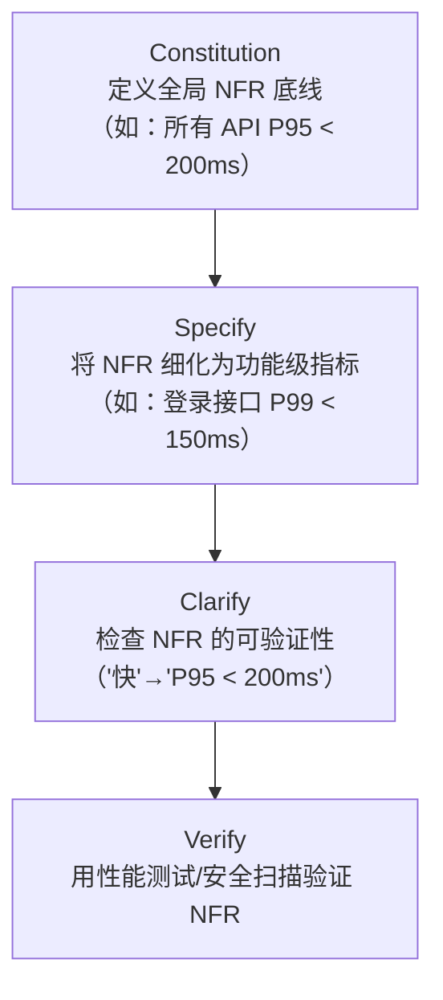
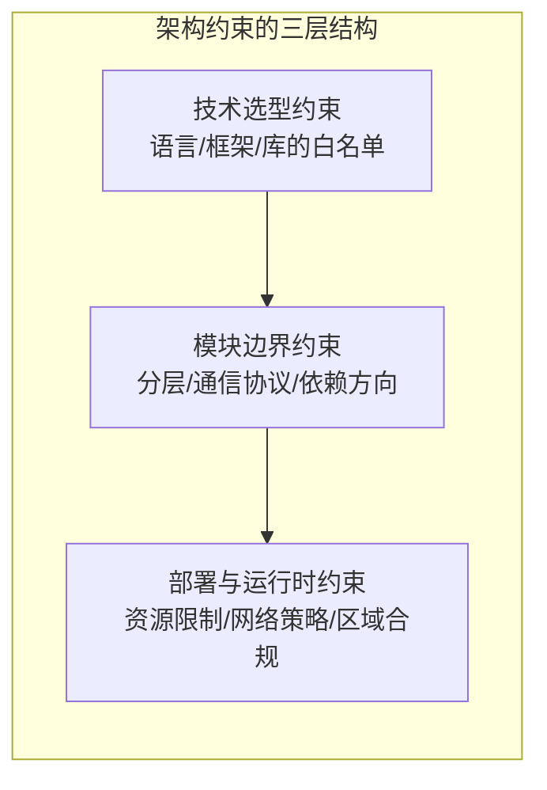
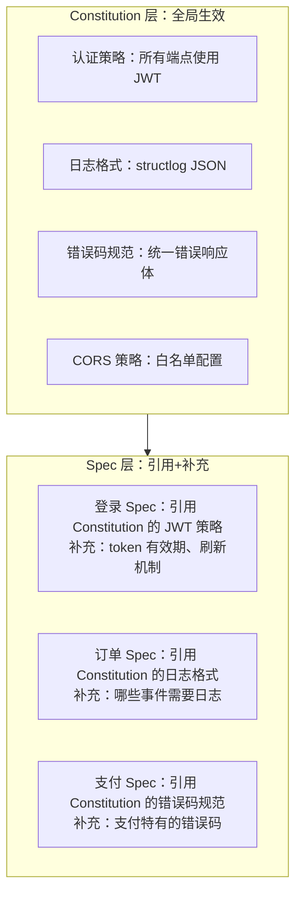
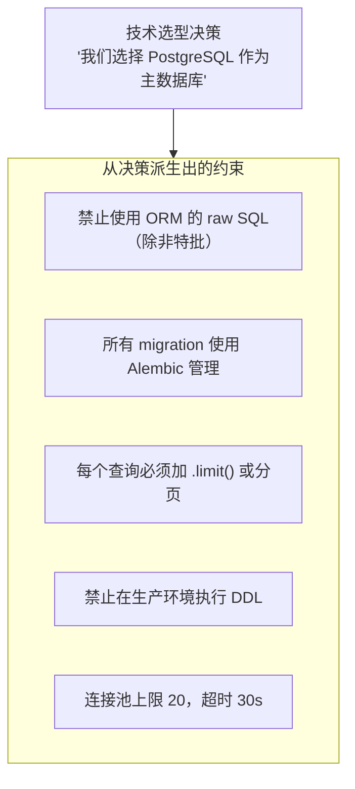

# 非功能需求与架构约束

功能需求回答"系统做什么"，非功能需求（NFR）回答"系统做得怎么样"。在 SDD 中，NFR 和架构约束不是"额外的备注"，而是规范的有机组成部分——它们决定了系统在真实环境中能否可靠运行。本章讲解 NFR 的分类、表示方法和在规范中的落地方式。

---

## 1. NFR 分类体系

### 1.1 五大分类

| 类别 | 核心问题 | 典型关注点 |
|------|---------|-----------|
| **性能**（Performance） | 系统有多快？ | 响应延迟（P50/P95/P99）、吞吐量（QPS/TPS）、并发连接数 |
| **安全**（Security） | 系统有多安全？ | 认证（AuthN）、授权（AuthZ）、数据加密、输入校验、CORS 策略 |
| **可用性**（Availability） | 系统有多可靠？ | 正常运行时间（SLA）、故障恢复时间（RTO）、数据恢复点（RPO） |
| **可维护性**（Maintainability） | 系统有多容易改？ | 代码复杂度、模块耦合度、测试覆盖率、文档完备性 |
| **可观测性**（Observability） | 系统有多透明？ | 日志、指标（Metrics）、链路追踪（Tracing）、健康检查、告警规则 |

### 1.2 NFR 在 SDD 工作流中的位置



> **原则**：Constitution 给出 NFR 的下限（"绝对不能低于这个标准"），Spec 给出具体功能的 NFR 目标（"这个功能要做到什么程度"）。

---

## 2. 架构约束的表示

### 2.1 什么是架构约束

架构约束是在规范层面表达的"技术边界条件"——它们限制了解空间，确保实现不会偏离架构意图。



### 2.2 在规范中表达架构约束

架构约束必须使用可验证的陈述句，而非模糊的建议。以下是各类约束的表达方式：

| 约束类型 | 模糊表达（不可用） | 可验证表达（可用） |
|---------|-----------------|------------------|
| 分层约束 | "业务逻辑应该放在 Service 层" | "Router 层禁止直接调用 Repository 层，必须通过 Service 层" |
| 通信约束 | "服务间通过 API 通信" | "服务间通信仅允许 REST（同步）和 RabbitMQ（异步），禁止 gRPC" |
| 数据隔离 | "不要跨服务访问数据库" | "每个微服务拥有独立 PostgreSQL Schema，禁止跨 Schema JOIN 或外键" |
| 异步要求 | "尽量用异步" | "所有 IO 操作使用 async/await，禁止在 async 上下文中调用同步 IO" |
| 依赖方向 | "避免循环依赖" | "依赖方向：Router → Service → Repository，反向导入在 CI 中阻止" |

### 2.3 一个完整的架构约束示例

```markdown
## 架构约束

### 分层约束
- Router 层：仅负责请求解析、参数校验、响应序列化
- Service 层：包含所有业务逻辑，禁止直接操作 ORM Session
- Repository 层：仅负责数据持久化，禁止包含业务判断

### 依赖方向
- Router → Service → Repository（单向依赖）
- 禁止 Repository 导入 Service 或 Router
- 禁止 Service 导入 Router

### 通信约束
- 同步通信：REST API（JSON），超时 30s
- 异步通信：RabbitMQ，消息体使用 JSON 格式
- 禁止服务间直接调用数据库

### 数据约束
- 每个微服务独立数据库 Schema
- 禁止跨 Schema 的外键约束
- 数据同步通过事件消息实现最终一致性
```

---

## 3. 横切关注点在规范中的表达

横切关注点（Cross-Cutting Concerns）是一类特殊的 NFR——它们横跨多个功能，不应在每个 Spec 中重复定义。在 SDD 中，横切关注点通常在 Constitution 中定义，在 Spec 中引用。

### 3.1 横切关注点的分层定义



### 3.2 引用语法示例

在 Spec 中引用 Constitution 定义的横切关注点：

```markdown
## 横切关注点（引自 Constitution v1.2.0）

| 关注点 | 引用来源 | 本功能补充 |
|--------|---------|-----------|
| 认证 | Constitution 原则2：所有端点 JWT 认证 | 本接口使用 access_token，有效期 15min |
| 日志 | Constitution 原则4：structlog JSON 格式 | 关键事件：登录成功、登录失败、token 刷新 |
| 错误码 | Constitution 安全规则第3条 | 新增错误码：INVALID_CREDENTIALS、ACCOUNT_LOCKED |
| 限流 | Constitution 性能基准 | 登录接口限流：10 次/分钟/IP |
```

> **原则**：Constitution 定义"怎么做"的全局规则，Spec 定义"这个功能怎么做"的具体参数。两者配合，既不重复定义，又不遗漏细节。

---

## 4. 让 NFR 可验证：量化指标

NFR 最常见的失败模式是**模糊**。"系统要快""系统要安全""系统要可靠"——这些不是 NFR，是愿望。NFR 必须在规范层面就被量化为可测量、可验证的指标。

### 4.1 性能指标的量化和验证

```markdown
## 性能指标

| 指标 | 目标值 | 测量条件 | 验证方式 |
|------|--------|---------|---------|
| 登录接口延迟 | P50 < 50ms, P95 < 200ms, P99 < 500ms | 1000 QPS 并发 | k6 压测脚本：`tests/perf/login_load.js` |
| 搜索接口吞吐 | ≥ 500 QPS | 单实例 2 CPU/4GB | `wrk -t4 -c100 -d60s` |
| 数据库查询 | 单次 < 50ms | ORM 查询日志 | 慢查询日志告警阈值 |
| 缓存命中率 | ≥ 95% | Redis INFO stats | Prometheus 指标 `cache_hit_ratio` |
| 内存使用 | ≤ 512MB/实例 | 正常运行 24h 后 | `container_memory_usage_bytes` |
```

### 4.2 安全指标的量化和验证

```markdown
## 安全指标

| 指标 | 目标值 | 验证方式 |
|------|--------|---------|
| 依赖漏洞 | 0 个 Critical / High | `pip-audit` 在 CI 中运行，有告警则阻止合并 |
| 密钥泄露检测 | 0 次 | `trufflehog` 或 `git-secrets` pre-commit hook |
| API 认证覆盖 | 100% 端点（除显式声明的公开端点） | 自动化测试遍历所有路由，验证 401 响应 |
| 密码存储 | bcrypt cost ≥ 12 | 单元测试验证 User 模型的密码哈希算法 |
| HTTPS 强制 | 生产环境 100% | 部署配置审查 + 自动化检测 |
```

### 4.3 可用性指标的量化和验证

```markdown
## 可用性指标

| 指标 | 目标值 | 验证方式 |
|------|--------|---------|
| 服务正常运行时间 | 99.9%（月度允许宕机 ≤ 43min） | Prometheus + Grafana 告警 |
| 故障恢复时间（RTO） | ≤ 5 分钟 | 故障演练（Chaos Engineering） |
| 数据恢复点（RPO） | ≤ 1 分钟 | 数据库实时备份 + 恢复演练 |
| 健康检查响应 | /health 端点 < 1s 返回 | Kubernetes liveness probe |
| 优雅关闭 | 所有进行中请求完成后再终止 | 集成测试验证 shutdown 流程 |
```

---

## 5. 技术选型决策在规范层的体现

技术选型不是在写代码的那一刻才决定的——它在 Constitution 中就应该被锁定。规范层需要反映的不是"为什么选这个技术"，而是"选了之后有什么约束"。

### 5.1 技术选型决策的约束转译



### 5.2 选型约束在 Constitution 中的表达

```markdown
## 技术选型约束

### 数据库：PostgreSQL 15+
- 必须使用 SQLAlchemy 2.0+ async 模式
- Migration 使用 Alembic，纳入版本控制
- 禁止在应用代码中执行 DDL（CREATE/ALTER/DROP）
- 每个查询必须有明确的行数限制（.limit() 或分页）
- 连接池上限 20 连接/实例，连接超时 30s
- 索引必须有命名规范：`idx_{table}_{column}`

### 缓存：Redis 7+
- 仅用于缓存，不作为持久化存储
- Key 命名规范：`{service}:{entity}:{id}`
- TTL 必须显式设置，禁止永久 Key
- 禁止 KEYS 命令（使用 SCAN 替代）

### 消息队列：RabbitMQ 3.12+
- 交换机命名：`{service}.{event_type}`
- 消息体统一使用 JSON 格式
- 消费者必须实现幂等性（消息可能重复投递）
- 死信队列（DLQ）必须配置，异常消息不能静默丢弃
```

---

## 6. 实践示例

### 6.1 示例：写一条"P95 < 200ms"的可验证规范

**模糊版本**（不可用）：
> 接口要快。

**改进版本 1**（仍不够）：
> 接口响应时间不超过 200ms。

**可验证版本**（可用）：
```markdown
## 性能约束：用户列表查询接口

### 延迟指标
| 指标 | 目标值 | 测量条件 |
|------|--------|---------|
| P50 | < 80ms | 1000 QPS 并发，数据量 10 万条用户 |
| P95 | < 200ms | 同上 |
| P99 | < 500ms | 同上 |

### 实现约束
- 查询必须使用数据库索引，禁止全表扫描
- 结果集自动分页，单页 ≤ 100 条
- 查询字段禁止使用 `SELECT *`，明确定义返回列

### 验收条件
- [ ] k6 压测脚本 `tests/perf/user_list.js` 通过（P95 < 200ms）
- [ ] EXPLAIN 分析确认查询使用索引
- [ ] Prometheus 指标 `http_request_duration_seconds` 的 P95 < 200ms
```

**为什么这个版本可验证**：
1. 明确了 P50/P95/P99 三级指标，而非单一数值
2. 给出了测量条件（并发数、数据量）
3. 关联了具体的验证手段（k6 脚本、EXPLAIN、Prometheus）
4. 追加了实现约束，从源头保证性能达标

### 6.2 示例：写一条"JWT 认证"的可验证规范

**模糊版本**（不可用）：
> 接口需要登录。

**可验证版本**（可用）：
```markdown
## 安全约束：JWT 认证

### 认证方案
- 认证方式：JWT Bearer Token（`Authorization: Bearer <token>`）
- 签名算法：HS256
- 密钥来源：环境变量 `JWT_SECRET`（禁止硬编码）
- access_token 有效期：15 分钟
- refresh_token 有效期：7 天

### 行为约束
- 未携带 token 的请求：返回 HTTP 401 + 错误码 `TOKEN_MISSING`
- token 过期：返回 HTTP 401 + 错误码 `TOKEN_EXPIRED`
- token 签名无效：返回 HTTP 401 + 错误码 `TOKEN_INVALID`
- refresh_token 刷新：access_token 过期后，使用 refresh_token 换取新的 token 对

### 错误响应体格式
```json
{
    "error": {
        "code": "TOKEN_EXPIRED",
        "message": "Access token has expired",
        "timestamp": "2026-08-11T10:30:00Z"
    }
}
```

### 验收条件
- [ ] 无 token 请求 `/api/users` 返回 401 + TOKEN_MISSING
- [ ] 过期 token 请求 `/api/users` 返回 401 + TOKEN_EXPIRED
- [ ] 伪造 token 请求 `/api/users` 返回 401 + TOKEN_INVALID
- [ ] 正确 token 请求 `/api/users` 返回 200 + 用户数据
- [ ] refresh_token 可成功换取新的 token 对
- [ ] 硬编码密钥扫描（trufflehog）在 CI 中通过
```

**为什么这个版本可验证**：
1. 每种失败场景都定义了确切的 HTTP 状态码和错误码
2. 错误响应体格式是确定的 JSON Schema
3. 验收条件每一条都是可直接编写自动化测试的 Given-When-Then

---

## 7. 常见反模式

| 反模式 | 表现 | 纠正方式 |
|--------|------|---------|
| **NFR 后补** | 功能 Spec 写完后才想起补 NFR | NFR 应与功能行为同步定义，作为 Spec 章节之一 |
| **NFR 模糊化** | "系统要高性能""要保证数据安全" | 每个 NFR 必须有数字指标或布尔条件（参见第 4 节） |
| **NFR 过度约束** | 一个简单的内部工具也要求 99.99% 可用性 | 根据项目阶段和重要性分级定标（参见第 1 节的 Constitution 层与 Spec 层） |
| **约束无法验证** | "代码应该优雅"——无法测试 | 约束必须可自动化检查：lint 规则、架构测试、性能测试 |
| **架构约束与代码脱节** | Constitution 规定了分层，但代码中随意跨层调用 | 使用架构测试工具（如 ArchUnit/pytest-arch）在 CI 中强制执行 |
| **横切关注点在每个 Spec 中重复定义** | 每个功能的 Spec 都抄一遍 JWT 策略 | 在 Constitution 中定义一次，Spec 中引用+补充 |

---

## 8. 小结

NFR 和架构约束不是规范的"附件"，而是让规范从"能跑"到"能上线"的关键补充。

**三个核心要点**：

1. **量化一切**：每个 NFR 都必须有数字指标或布尔条件。"系统要快"不是规范，"P95 < 200ms"才是。
2. **分层定义**：Constitution 定义全局底线，Spec 定义功能级目标，两者配合，既不遗漏也不重复。
3. **可验证是底线**：如果你无法写出一个自动化测试来验证这个 NFR，那它就不是一条合格的规范——它只是一个愿望。

---

## 延伸阅读

- 上一章：[03-功能规范文档模板](03-功能规范文档模板.md) —— 将本章学到的 NFR 表达方式整合进完整的规范模板
- 上一章：[02-规范编写核心原则](02-规范编写核心原则.md) —— 规范的五大属性（明确、可验证、无歧义、自包含、可追踪）
- 下一阶段：[03-Clarify 澄清](../03-Clarify澄清/01-规范澄清的核心理念.md) —— 规范写好后，如何系统地消除歧义
