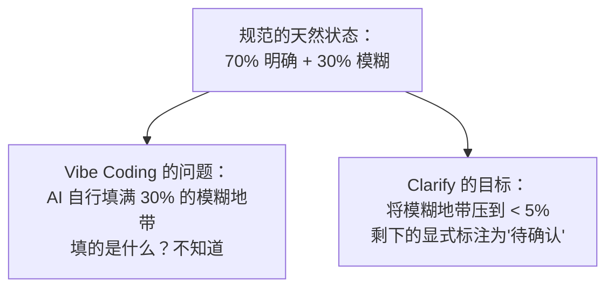
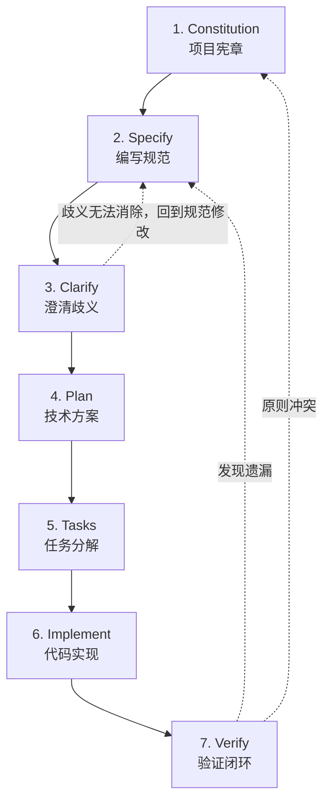
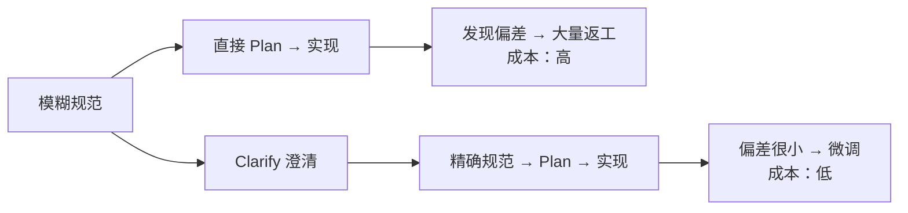
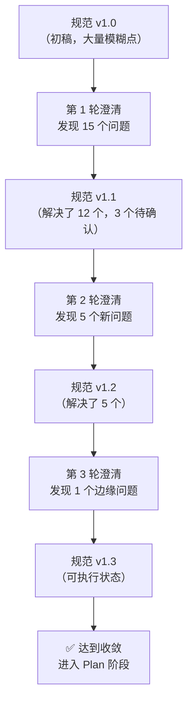
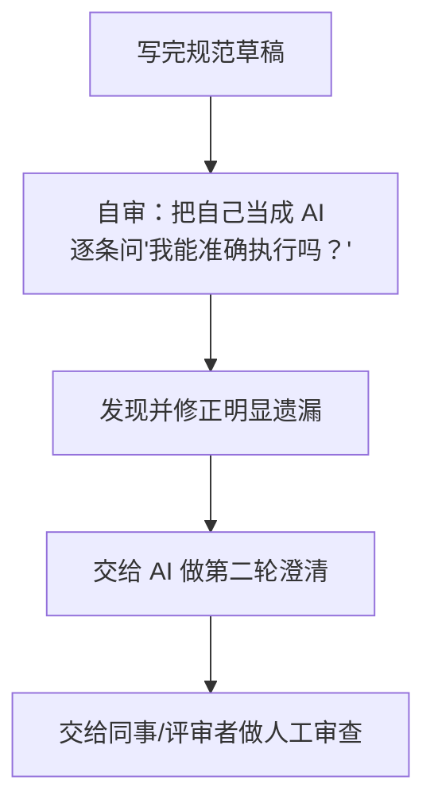
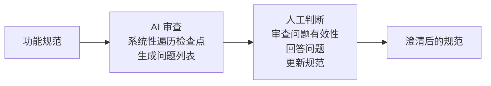

# 规范澄清的核心理念

规范（Specification）写完之后，最危险的错觉是"这样就够了"。但实际上，任何一份未经澄清的规范都包含大量隐含假设和模糊地带——这些模糊地带在人类阅读时会被自动"脑补"，但在 AI 执行时会被逐字解释，产出偏离预期的代码。本章阐述 Clarify 阶段的核心理念：为什么澄清是必须的，它在 SDD 工作流中扮演什么角色，以及澄清的正确心态。

---

## 1. 为什么规范需要澄清

### 1.1 人类写规范：知识诅咒与隐含假设

"知识诅咒"（Curse of Knowledge）是一个认知科学概念：当你掌握某个领域的知识后，就很难想象不知道这些知识的人会如何理解同一段文字。规范作者天然处于知识诅咒之中——你知道"登录失败"包含"密码错误、邮箱未注册、账号被锁定、验证码过期"等所有情况，但你写下来的时候可能只写了"登录失败时返回错误"。

| 问题 | 表现 | 示例 |
|------|------|------|
| **隐含假设** | 作者认为"不言自明"的信息，读者实际不知道 | "用户登录"——用什么认证方式？Session？JWT？ |
| **术语惯性** | 团队内部术语未定义，外人看不懂 | "走风控通道"——什么是风控通道？ |
| **场景遗漏** | 只写了主流程，遗漏了边缘场景 | 写了正常登录，没写并发登录、密码过期、账号未激活 |
| **粒度不均** | 有些部分极度详细，有些部分一笔带过 | 接口格式写得很细，权限模型只说"按角色控制" |

> **核心认知**：规范中的歧义不是作者的失误，而是人类认知的固有局限。澄清不是为了"找错"，而是为了"补全"——把隐含的知识变成显式的约束。

### 1.2 AI 生成规范也有歧义

在 SDD 实践中，规范可以由 AI 辅助生成（通过 Spec Kit 的 `specify` 命令或其他工具）。AI 生成的规范同样需要澄清：

| AI 生成规范的歧义来源 | 示例 |
|----------------------|------|
| **过度推断** | AI 在没有明确指令时"揣测"用户意图，添加了用户实际不需要的功能 |
| **上下文缺失** | AI 不了解团队的基础设施、已有的数据库 Schema、历史技术决策 |
| **模式匹配偏差** | AI 基于训练数据中的"常见做法"生成规范，但你的项目可能有特殊约束 |
| **范围膨胀** | AI 倾向于生成"完整"的解决方案，包含了你未要求的功能 |

### 1.3 歧义是规范的固有属性，不是 bug



> **关键认知转变**：不要因为规范有歧义而沮丧。歧义是规范的出厂状态。澄清就是把规范从"出厂状态"升级到"可执行状态"的过程。

---

## 2. Clarify 在 SDD 工作流中的位置

### 2.1 工作流全景中的 Clarify



### 2.2 Clarify 是 Specify 和 Plan 之间的"质量闸门"

Clarify 位于 Specify 之后、Plan 之前。这个位置不是随意的：

| 如果跳过 Clarify 直接进入 Plan | 后果 |
|-------------------------------|------|
| Plan 基于模糊规范做技术决策 | 技术方案可能偏离真实需求 |
| AI 自行"补全"模糊部分 | 不同 Agent 的"补全"可能相互矛盾 |
| 返工发生在代码层面 | 修改成本是指数级的——改规范 10 分钟，改代码 2 小时 |



> **经验数据**：在实践中，Clarify 阶段发现的每个歧义问题，如果在 Plan/Implement 阶段才被发现，修复成本大约放大 5-10 倍。

---

## 3. 澄清的本质：让规范更精确，不是吹毛求疵

### 3.1 吹毛求疵 vs 规范澄清

很多人对"澄清"的误解是：这是在挑刺、咬文嚼字、追求完美。实际上，澄清的关注点非常具体且务实。

| 维度 | 吹毛求疵 | 规范澄清 |
|------|---------|---------|
| **关注点** | 措辞是否优美、格式是否统一 | 行为定义是否精确、边界是否覆盖 |
| **判断标准** | "这样写是不是更好看" | "AI 读完后能否准确实现" |
| **产出** | 措辞微调，对实现无影响 | 边界条件、异常路径、约束补充 |
| **价值** | 边际收益低，甚至负收益 | 直接影响代码正确性 |
| **典型问题** | "这个词用'必须'还是'应当'" | "并发场景下这个操作需要加锁吗" |

### 3.2 什么样的问题值得澄清

```markdown
## ✅ 值得澄清的问题

- "用户输入非法数据时，应该返回什么错误码？" → 影响接口设计
- "这个上限 1000 条是基于单次请求还是用户总量？" → 影响数据库设计
- "数据删除是逻辑删除还是物理删除？" → 影响数据恢复策略
- "两个操作非原子，第一个成功第二个失败时如何回滚？" → 影响事务设计

## ❌ 不值得澄清的问题

- "这句话能不能换个说法更通顺一些？" → 不影响执行
- "这个例子用的是 30 分钟，是不是换成 60 分钟更好？" → 产品决策，非澄清范畴
- "这段描述能不能拆成两个段落？" → 格式问题，不影响实现
```

> **核心标准**：如果一个问题的回答会影响 AI 生成的代码，这个问题就值得澄清。如果回答不会改变任何代码，那就不是澄清问题——是编辑偏好。

---

## 4. 迭代澄清循环

### 4.1 澄清不是一次性活动



### 4.2 收敛曲线

澄清问题的数量随轮次递减，这是一个健康的信号：

| 澄清轮次 | 典型问题数量 | 问题类别 |
|---------|-------------|---------|
| 第 1 轮 | 10-20 个 | 明显的遗漏：边界条件、异常路径、约束缺失 |
| 第 2 轮 | 3-8 个 | 解决第一轮问题后暴露的新矛盾、细节确认 |
| 第 3 轮 | 1-3 个 | 极端边缘场景、跨模块交互的隐式假设 |
| 第 4 轮 | 0-1 个（如有） | 通常是过度澄清——可以停止了 |

### 4.3 收敛判断标准

当你满足以下条件时，可以认为澄清已收敛，进入 Plan 阶段：

- [ ] 连续两轮澄清未发现新的**实质性**问题（措辞修改不算）
- [ ] 每个验收条件都可以写出 Given-When-Then 测试用例
- [ ] 每个输入参数都有明确的格式、范围、必填/选填标注
- [ ] 每种可预见的异常情况都有预期行为描述
- [ ] 所有模糊形容词（"快"、"稳定"、"安全"）被替换为可度量指标

> **停止法则**：如果你连续提三个问题，回答都是"按默认处理就好"，说明你已经过度澄清了。规范不是法律条文——不需要穷举宇宙中所有可能性。

---

## 5. 规范作者是第一澄清者

### 5.1 写完不等于写完

写完规范草稿后的第一个澄清者，不是 AI，不是同事，而是**你自己**。作者自审是澄清流程中最容易被跳过的步骤——但它也是回报率最高的步骤。



### 5.2 作者自审查清单

在交给 AI 或同事之前，规范作者应逐项检查：

```markdown
## 规范作者自审查清单

### 输入
- [ ] 每个输入参数的类型是否明确？（string / int / enum / ...）
- [ ] 每个输入参数的合法范围是否定义？（长度、格式、取值范围）
- [ ] 每个输入参数是否标注了必填/选填/条件必填？

### 行为
- [ ] 每个操作的成功路径是否清晰？
- [ ] 每个操作的失败路径是否覆盖？（至少 3 种失败场景）
- [ ] 并发/重入场景是否有说明？

### 输出
- [ ] 每种输出的结构是否定义？
- [ ] 每种错误响应的错误码和含义是否明确？
- [ ] 错误响应是否避免了信息泄露？（不暴露堆栈、SQL、内部路径）

### 边界
- [ ] 有没有写"不在本规范范围内"的章节？
- [ ] 空值/null/0/空数组等特殊值的行为是否明确？

### 非功能
- [ ] 性能要求是否用数字描述？（P99 < Xms，QPS > X）
- [ ] 安全约束是否具体？（加密算法、密钥长度、哈希轮次）
```

### 5.3 换位思考法

一个有效的自审技巧：假设你是一个刚入职的同事，完全不熟悉这个项目。读这份规范时：

- 哪些地方你会停下来问"这是什么意思？"
- 哪些地方你需要找别人确认才能继续？
- 哪些地方你会做出和作者意图不同的理解？

> **换位思考是成本最低的澄清手段。** 你花 10 分钟换位思考，可能省下后续 2 小时的往返沟通。

---

## 6. AI 作为澄清助手

### 6.1 AI 在澄清中的角色

在 SDD 的 Clarify 阶段，AI 的角色是**系统性审查者**——不是最终的裁决者，而是提出问题的人。



### 6.2 AI 澄清的优势

| 优势 | 说明 |
|------|------|
| **系统性** | AI 可以按照预定义的检查清单逐维度审查，不会遗漏 |
| **不疲劳** | 人类审查第 50 个验收条件时可能注意力下降，AI 不会 |
| **广度** | AI 能联想出人类可能忽略的边界场景（训练数据中的各种 bug 报告） |
| **速度** | AI 几分钟内完成首轮审查，生成 10-20 个澄清问题 |

### 6.3 AI 澄清的局限

| 局限 | 说明 | 应对策略 |
|------|------|---------|
| **过度提问** | AI 可能问出"极端罕见"的场景，实际不需要处理 | 人工过滤：删除概率 < 0.1% 的问题 |
| **缺少业务上下文** | AI 不了解行业规则、合规要求、用户习惯 | 人工补充领域知识 |
| **无法判断优先级** | AI 把所有问题平铺，不分主次 | 人工标注优先级：P0 必须澄清 / P1 建议澄清 / P2 可选 |
| **重复提问** | 规范中已隐含回答的问题，AI 可能重复问 | 先自审再交给 AI，减少"无效问题" |

### 6.4 人机协作模式

| 步骤 | 谁来做 | 做什么 |
|------|-------|--------|
| 1. 自审 | 人（规范作者） | 按自审查清单逐项检查，修复明显遗漏 |
| 2. AI 审查 | AI | 读取规范，系统性生成澄清问题列表 |
| 3. 问题过滤 | 人 | 删除无关/重复/过度的问题，标注优先级 |
| 4. 回答问题 | 人 | 逐条回答有效问题，做出决策 |
| 5. 更新规范 | 人 + AI | 将澄清结果整合到规范中，AI 辅助更新文档 |
| 6. 复核 | 人 | 确认更新后的规范无新增歧义，收敛达标 |

> **最佳实践**：不要让 AI 直接修改规范——让 AI 提问，你来决策。规范的"最终解释权"永远在人手里。AI 是探测器，人是决策者。

---

## 7. 小结

规范澄清（Clarify）是 SDD 工作流中连接"意图"与"执行"的关键环节：

1. **歧义是规范的出厂状态**——人类的知识诅咒和 AI 的上下文缺失都导致规范天然包含模糊地带。澄清不是挑错，是把隐含知识显式化。

2. **Clarify 是质量闸门**——位于 Specify 和 Plan 之间，在这里发现的问题修复成本最低。跳过 Clarify 直接进入 Plan，返工成本放大 5-10 倍。

3. **澄清的本质是让规范可执行**——判断标准不是"文字漂不漂亮"，而是"交给 AI 能不能准确实现"。凡是回答会影响代码的问题，都值得澄清。

4. **迭代收敛是正常的**——澄清问题的数量随轮次递减（15 → 5 → 1 → 0），连续两轮无实质性新问题即可停止。

5. **人是最终决策者**——规范作者先自审，AI 辅助提问，人工判断和决策。AI 是探测器，人是决策者。

---

## 下一步

掌握 Clarify 的核心理念后，进入下一章 [02-歧义检测与消歧策略](02-歧义检测与消歧策略.md)，学习具体的歧义类型识别和消歧技术。
