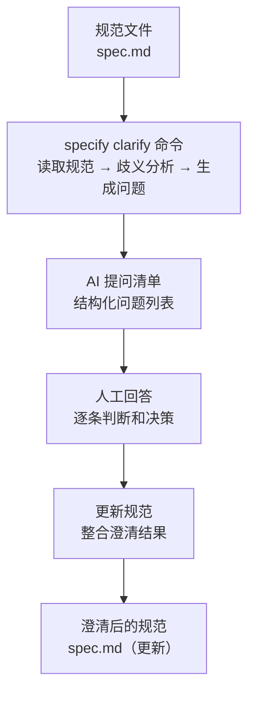
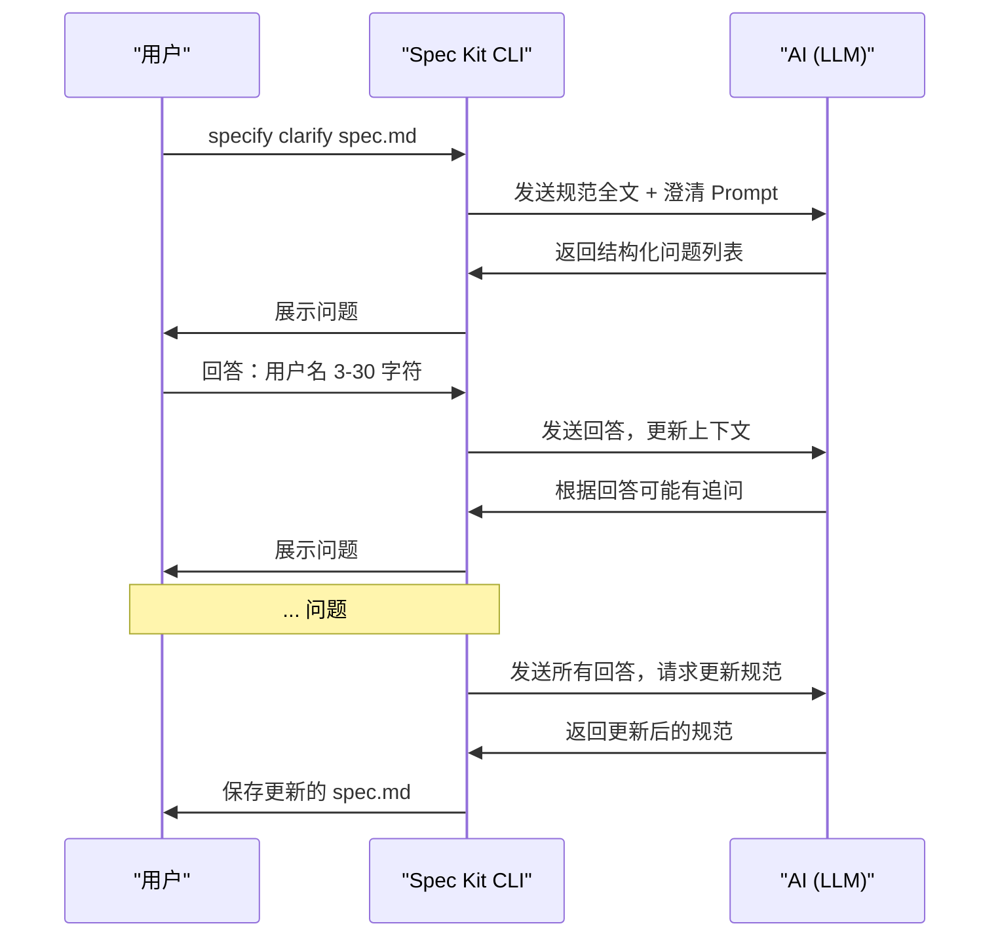
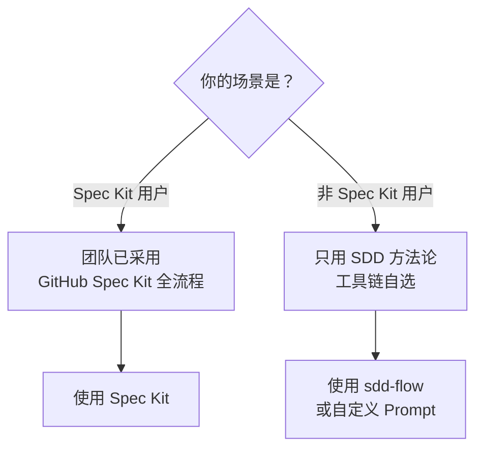
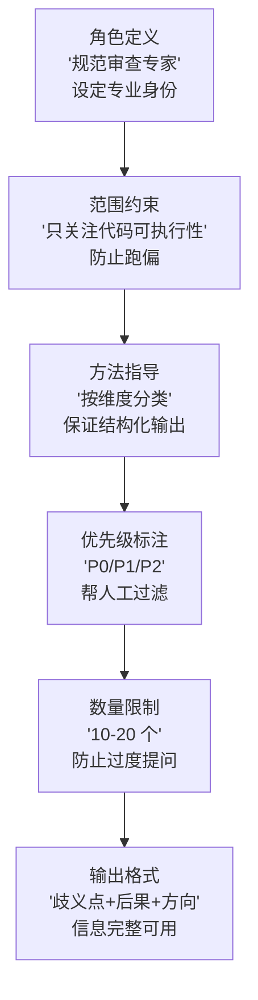
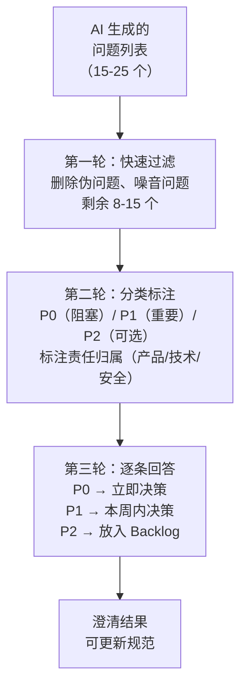
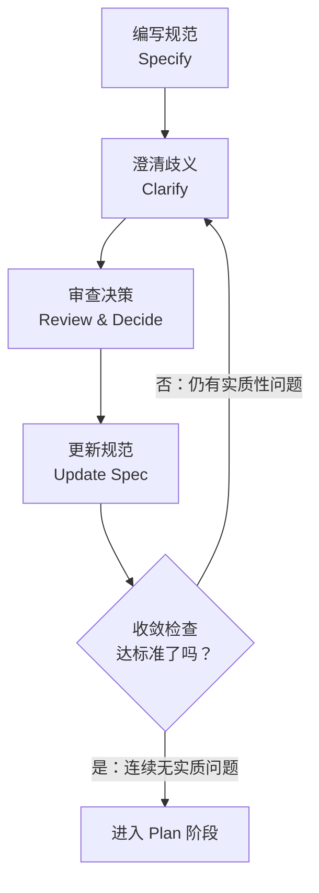

# AI 辅助澄清流程

前两章讨论了规范澄清的核心理念和手工歧义检测技术。但在实践中，完全手工澄清一份规范耗时耗力，且容易遗漏——这正是 AI 可以发挥巨大价值的场景。本章介绍如何使用 AI 工具（GitHub Spec Kit、sdd-flow）将澄清流程系统化，涵盖 Prompt 设计、结果审查、版本管理和迭代闭环的完整实践。

---

## 1. GitHub Spec Kit 的 clarify 命令

### 1.1 概述

GitHub Spec Kit 是 SDD 的官方工具链，其中 `specify clarify` 命令专门用于规范的歧义检测和澄清。它的核心价值在于：**将上一章的手工歧义检测技术固化为一条命令**。



### 1.2 命令基本用法

```bash
# 对指定的规范文件执行澄清
specify clarify path/to/spec.md

# 交互模式——AI 逐条提问，你逐条回答
specify clarify path/to/spec.md --interactive

# 输出模式——AI 生成完整问题列表，你一次性回答
specify clarify path/to/spec.md --output questions.md
```

### 1.3 工作流详解



### 1.4 Spec Kit clarify vs 手工澄清

| 维度 | 手工澄清 | Spec Kit clarify |
|------|---------|-----------------|
| **覆盖率** | 取决于审查者的经验和注意力 | 系统性遍历，覆盖率高 |
| **速度** | 30-60 分钟/规范 | 3-5 分钟生成问题列表 |
| **遗漏风险** | 高——人的注意力有限 | 低——AI 不会"看漏" |
| **过度提问** | 不会 | 有——需要人工过滤 |
| **业务理解** | 好——审查者了解领域 | 差——可能问出不合格的问题 |
| **最佳场景** | 小规范、快速检查 | 中大型规范、正式审查 |

> **最佳实践**：Spec Kit clarify 不是手工澄清的替代品，而是增强器。理想的流程是：作者自审 → AI 澄清（Spec Kit）→ 人工过滤 AI 问题 → 回答决策 → AI 更新规范。

---

## 2. sdd-flow 的 clarify 模式

### 2.1 设计理念

sdd-flow 是一个轻量级的 SDD 工作流工具。它的 clarify 模式与 Spec Kit 的核心差异在于设计理念：

| 维度 | Spec Kit | sdd-flow |
|------|----------|----------|
| **定位** | 全流程工具（覆盖 Specify → Verify） | 专注工作流编排 |
| **Clarify 方式** | AI 生成问题 → 交互式回答 | 调用 AI 分析歧义 → 生成报告 → 人工统一处理 |
| **输出格式** | 交互式对话 + 规范更新 | Markdown 澄清报告 + 修改建议 |
| **适用场景** | 有 Spec Kit 完整工具链的团队 | 已有其他工具，只需澄清能力的团队 |
| **配置复杂度** | 开箱即用 | 需配置 AI Provider |

### 2.2 使用方式

```bash
# sdd-flow 的 clarify 模式
sdd-flow clarify --spec spec.md --output clarify-report.md

# 指定 AI 后端
sdd-flow clarify --spec spec.md --provider deepseek --model deepseek-v4
```

### 2.3 何时选择哪个工具



---

## 3. AI 澄清问题的 Prompt 设计

### 3.1 核心设计原则

一个好的澄清 Prompt 需要遵循四个原则：

| 原则 | 说明 | 违反后果 |
|------|------|---------|
| **结构化** | 要求 AI 按维度分类输出问题 | AI 的输出变成一锅粥，人工难以审查 |
| **聚焦可执行性** | 引导 AI 关注"代码能否准确实现" | AI 提出大量措辞优化建议，与澄清目标无关 |
| **禁止假设** | 要求 AI 不要自行补全规范 | AI "认为没问题"就跳过，漏掉真正的歧义 |
| **限制数量** | 要求 AI 优选出最关键的 N 个问题 | AI 提出 50+ 个问题，大部分是噪音 |

### 3.2 完整 Prompt 模板

以下 Prompt 可直接用于 ChatGPT、Claude、或其他 LLM：

```markdown
## 角色与任务

你是一位规范审查专家。你的任务是阅读以下功能规范，发现其中的歧义、遗漏和模糊点，
以帮助规范作者将规范打磨到"AI 可准确执行"的精确度。

## 审查原则

1. **聚焦可执行性**：只关注会影响代码实现的问题。措辞美化、格式调整不在审查范围。
2. **不自行补全**：如果规范中没有明确说明，不要假设"应该是这样"——把缺失标记为问题。
3. **按维度组织**：将发现的问题按以下维度分类输出：
   - 输入定义：参数类型、范围、格式、必填/选填
   - 行为逻辑：正常路径、边界条件、状态转换
   - 异常处理：依赖故障、输入错误、并发冲突
   - 输出定义：数据结构、错误码、异常响应
   - 非功能约束：性能、安全、可用性、合规
4. **问题优先排序**：每个维度内，按影响程度排序——P0（必须解决）→ P1（建议解决）→ P2（可选）。
5. **控制数量**：优选最关键的问题，总数控制在 10-20 个。不要为凑数而提问。

## 输出格式

对于每个问题，使用以下格式：

```
### [P0/P1/P2] [维度] 问题标题

**歧义点**：引用规范原文（摘录相关句子），标注具体哪里模糊。

**为什么需要澄清**：说明这个问题不澄清会导致什么后果（代码偏差、线上故障等）。

**建议的澄清方向**：给出 1-2 种可能的澄清方案（不要替作者做决定）。
```

## 规范原文

[在此粘贴规范全文]
```

### 3.3 Prompt 关键要素拆解



### 3.4 不同场景的 Prompt 变体

| 场景 | Prompt 调整 |
|------|------------|
| **API 规范澄清** | 增加"接口契约一致性"维度——请求/响应格式、HTTP 状态码、版本兼容性 |
| **前端组件规范澄清** | 增加"交互行为"维度——加载态、空态、错误态、边界数据的 UI 表现 |
| **数据模型规范澄清** | 增加"数据一致性"维度——事务边界、级联操作、并发冲突解决策略 |
| **安全功能规范澄清** | 增加"威胁建模"视角——OWASP Top 10 检查、权限模型完整性 |

> **Prompt 不是一成不变的**。根据规范的类型调整维度和关注点，是 Prompt 工程的基本功。

---

## 4. AI 澄清结果的审查原则

### 4.1 为什么要审查 AI 的澄清结果

AI 生成的澄清问题不是"正确答案"，而是"候选问题"。审查是必需的，因为 AI 会犯三类典型错误：

- **伪问题**：规范中其实已经隐含回答了，AI 没理解上下文
- **噪音问题**：过度追究极端罕见的边界场景，实际概率 < 0.01%
- **漏报**：需要领域知识才能发现的问题，AI 完全没有提

### 4.2 审查四原则

| 原则 | 审查问题 | 处理方式 |
|------|---------|---------|
| **相关性** | 这个问题的回答会改变 AI 生成的代码吗？ | 不会 → 删除（非澄清问题） |
| **必要性** | 这个问题不澄清会导致上线后的功能缺陷吗？ | 不会 → 降级为 P2 或删除 |
| **准确性** | AI 对规范原文的引用和解读正确吗？ | 不正确 → 修正问题表述后保留 |
| **非引导性** | AI 的"建议澄清方向"是否在暗示某种特定答案？ | 有引导 → 改为开放式提问 |

### 4.3 审查流程



### 4.4 常见需要人工干预的情况

| AI 行为 | 示例 | 应对 |
|--------|------|------|
| **过度分解** | AI 把"用户权限控制"拆成 8 个问题，每个问一种权限 | 合并为 1 个问题："请定义完整的权限矩阵" |
| **缺乏上下文** | AI 问"数据要备份吗"，但你的项目已有备份策略 | 在 Prompt 中增加 Constitution 引用，减少这类问题 |
| **纠结措辞** | AI 问"'必须'和'应当'哪个更合适" | 直接删除，这不是澄清问题 |
| **业务盲区** | 规范写了"VIP 用户免审核"，AI 不会问"VIP 的定义是什么" | 人工补充——这类问题 AI 很难发现 |

---

## 5. 澄清结果的版本管理

### 5.1 为什么需要版本化

澄清不是一次性事件——它会产生持续演进的决策记录。版本化的价值：

- **可追溯**：3 个月后有人问"为什么登录锁定时间选 30 分钟？"——查澄清记录
- **可回退**：澄清决策后来证明有误，知道从哪个版本开始改
- **可审计**：合规场景下，澄清记录是"为什么这样做"的证据链

### 5.2 推荐方案：Git + 澄清记录文件

```markdown
## 项目目录结构

project/
├── specs/
│   ├── auth/
│   │   ├── spec.md              # 功能规范
│   │   ├── clarify-v1.0.md      # v1.0 澄清记录
│   │   ├── clarify-v1.1.md      # v1.1 澄清记录
│   │   └── decisions.md         # 关键决策记录（从各版本合并）
```

### 5.3 澄清记录模板

```markdown
# 澄清记录：SPEC-AUTH-001 用户登录

## 元信息

| 字段 | 值 |
|------|-----|
| 规范 | SPEC-AUTH-001 用户邮箱密码登录 |
| 规范版本 | v1.2 |
| 澄清轮次 | 第 2 轮 |
| 审查方式 | Spec Kit clarify + 人工审查 |
| 审查者 | 张三（作者自审）+ AI（Spec Kit） |
| 日期 | 2026-08-11 |

## 澄清决策

### P0-001：账号锁定时机

- **歧义点**："连续 5 次登录失败后锁定账号 30 分钟"
- **AI 提问**：是第 5 次失败后立即锁定，还是第 6 次尝试时锁定？锁定期间接受正确密码吗？
- **决策**：第 5 次登录失败后**立即锁定**，不等待下一次尝试。锁定期间即使输入正确密码也返回锁定错误——防范暴力破解的有效性优先于用户体验。
- **决策者**：李四（安全负责人）
- **更新**：已更新规范 2.2 节

### P0-002：密码加密算法

- **歧义点**："密码应安全存储"
- **AI 提问**：使用哪种哈希算法？cost factor 是多少？
- **决策**：bcrypt, cost factor = 12（参考 OWASP 2025 建议，平衡安全性和延迟）。
- **决策者**：王五（技术负责人）
- **更新**：已更新规范 7.3 节

### P1-003：并发登录行为

- **歧义点**：规范未提并发登录场景
- **AI 提问**：同一账号能否在多个设备同时登录？后登录的会踢掉前面的吗？
- **决策**：允许多设备同时登录，不做互踢。如果需要互踢，作为 v2.0 的可选功能。
- **决策者**：赵六（产品经理）
- **更新**：已更新规范 6.4 节，并在第 9 节标注"设备互踢 → v2.0"

## 未解决的问题

- `P2-001`：是否需要支持无密码登录（Passkey / WebAuthn）→ 放入 Backlog，暂不决策
```

---

## 6. Clarify-Spec 迭代闭环

### 6.1 完整的迭代闭环



### 6.2 每次迭代的输入与输出

| 迭代轮次 | 输入 | 活动 | 输出 |
|---------|------|------|------|
| 第 1 轮 | 规范 v1.0（初稿） | AI 提问 → 人工过滤 → 决策 | 规范 v1.1 + 澄清记录 |
| 第 2 轮 | 规范 v1.1 | 基于更新后的规范做第二轮 AI 审查 | 规范 v1.2 + 新增澄清记录 |
| 第 3 轮 | 规范 v1.2 | 收敛检查——通常无实质性问题 | 确认"可进入 Plan"或发现最后 1-2 个问题 |

### 6.3 收敛判断标准

当以下条件全部满足时，Clarify 阶段完成：

- [ ] 连续两轮 AI 审查未发现新的 P0 或 P1 问题
- [ ] 所有 P0 问题已决策并更新到规范中
- [ ] 所有 P1 问题已决策（至少标注了"暂不处理"或"放入 Backlog"）
- [ ] 规范中的每条验收条件都可以写出 Given-When-Then 测试
- [ ] 规范中的每种异常场景都有预期行为描述

### 6.4 何时停止：过度澄清也是反模式

```markdown
## ⚠️ 过度澄清的警告信号

- 你在讨论"如果数据库和缓存同时故障，且消息队列也挂了"的场景
- 你的澄清问题数量在第 4 轮之后仍然 > 5 个
- 你在纠结"HTTP 204 还是 200 带空 body"这种差异（对客户端完全透明）
- 你的规范已经超过 200 行，但功能只是一个简单的 CRUD
```

> **停止法则**：当你从"解决不确定性"变为"消除理论上的所有可能性"时，你就越界了。规范的精确度应该是"足够让团队和 AI 正确实现"，而不是"覆盖宇宙中的所有边缘情况"。后者没必要，也做不到。

---

## 7. 实战示例：一个完整的 AI 辅助澄清会话

### 7.1 输入规范（含歧义）

以下是一份"看起来能跑"但实际包含多处歧义的规范片段：

```markdown
# 文件上传功能

用户可以上传文件到服务器，支持图片和文档。
上传成功后在页面显示文件列表。
文件大小不要太大，上传要有进度条。
重复上传同一个文件要去重。
```

### 7.2 AI 生成的澄清问题

使用第 3 节的 Prompt 模板，AI 生成以下问题列表：

```markdown
### P0 输入定义：文件类型未穷举

**歧义点**："支持图片和文档"

**为什么需要澄清**：开发需要知道具体的 MIME 类型白名单，否则可能接受可执行文件导致安全风险，或者拒绝了合法的文件类型导致用户投诉。

**建议的澄清方向**：
- 方案 A：定义具体的扩展名列表（如 .jpg, .png, .gif, .pdf, .docx）
- 方案 B：定义 MIME 类型白名单（如 image/jpeg, image/png, application/pdf）

---

### P0 输入定义：文件大小上限未定义

**歧义点**："文件大小不要太大"

**为什么需要澄清**：需要同时定义前端验证阈值、后端接收上限、Nginx 的 `client_max_body_size`。三者不一致会导致诡异的"前端通过了但上传失败"的问题。

**建议的澄清方向**：定义每个文件的大小上限（如 10MB）和每次上传的文件数量上限（如 5 个）。

---

### P0 行为逻辑：上传进度条的行为未定义

**歧义点**："上传要有进度条"

**为什么需要澄清**：进度条是"实时百分比"还是"分阶段状态指示"？上传中断后进度条如何表现？这些直接影响前端实现。

**建议的澄清方向**：明确是实时百分比进度条，使用 XMLHttpRequest.upload.onprogress 事件。

---

### P1 行为逻辑："去重"逻辑未定义

**歧义点**："重复上传同一个文件要去重"

**为什么需要澄清**：
- "同一个文件"的判断标准是什么？文件名相同？文件内容 MD5 相同？
- "去重"是提示用户还是自动跳过？如果是自动跳过，是否静默？
- 去重的范围是"本次会话"还是"该用户的所有上传"？

**建议的澄清方向**：
- 基于文件内容的 SHA-256 哈希判断是否重复
- 重复上传时提示"该文件已上传"，返回已有文件的 URL
- 去重范围为全局（所有用户的所有上传）

---

### P1 异常处理：文件上传失败的行为未定义

**歧义点**：规范只描述了上传成功后的行为

**为什么需要澄清**：网络中断、服务器返回 5xx、文件类型被后端拦截——这些场景的处理直接影响用户体验。

**建议的澄清方向**：
- 网络中断：前端自动重试 3 次，间隔 2 秒
- 服务器错误：提示"服务器繁忙，请稍后重试"
- 格式拦截：前端预检 + 后端拦截双重校验，前端提前阻止非法格式
```

### 7.3 人工审查和回答

审查者对 AI 问题逐条审查后，做出决策：

| 问题 | 审查结论 | 决策 | 责任 |
|------|---------|------|------|
| P0 文件类型 | ✅ 有效，保留 | JPG/PNG/WebP/GIF + PDF/DOCX/XLSX（共 7 种） | 产品 |
| P0 文件大小 | ✅ 有效，保留 | 单文件 ≤ 10MB，每次最多 5 个文件 | 技术 |
| P0 进度条 | ✅ 有效，保留 | 实时百分比进度条，中断时显示已上传百分比并支持断点续传 → v2.0 | 产品 |
| P1 去重逻辑 | ✅ 有效，保留 | SHA-256 去重，全局范围，自动返回已有 URL + "文件已存在" 提示 | 技术 |
| P1 上传失败 | ✅ 有效，保留 | 3 次自动重试，最终失败显示错误信息，保留用户已选文件不清空 | 产品+技术 |

### 7.4 更新后的精确规范（关键更新摘录）

```markdown
## 文件上传规范（更新后关键变更）

### 输入定义（新增）

| 参数 | 约束 |
|------|------|
| 文件类型 | JPG, PNG, WebP, GIF, PDF, DOCX, XLSX（MIME 白名单校验） |
| 单文件大小 | ≤ 10MB（前端预检 + 后端校验双重保障） |
| 单次数量 | 1-5 个文件 |
| 文件名长度 | 原始文件名 ≤ 255 字符，超过自动截断并保留扩展名 |

### 去重规则（新增）

- 基于文件内容的 SHA-256 哈希判断是否重复
- 全局去重（跨用户），避免文件存储膨胀
- 重复上传时：HTTP 200，返回已有文件的 URL，附带 `"duplicate": true` 字段
- 前端在上传前计算 SHA-256，与后端比对（可选优化，v2.0）

### 异常处理（新增）

| 场景 | 行为 |
|------|------|
| 网络中断 | 自动重试 3 次，间隔 2 秒。3 次均失败后提示"网络不稳定，请稍后重试" |
| 服务器错误（5xx） | 提示"服务器繁忙，请稍后重试"，不清空用户已选文件 |
| 格式不合法 | 前端拦截（基于扩展名）+ 后端拦截（基于 MIME 类型），双重校验 |
| 并发上传超限 | 单个用户同时最多 2 个并发上传，超出排队 |

### 不在本规范范围（新增）

- 断点续传 → v2.0
- 前端 SHA-256 预计算去重 → v2.0
- 视频文件上传 → 独立规范 SPEC-MEDIA-001
```

### 7.5 关键要点总结

从这个实战案例中，可以提炼出 AI 辅助澄清的几条关键经验：

1. **AI 在系统性覆盖上有显著优势**：5 个 P0/P1 问题涵盖了输入验证、去重逻辑、异常处理——这些维度在手工审查中最容易遗漏。

2. **AI 不会替代人的判断**：每个问题的最终决策是人做的（文件类型选哪几种、去重范围多大）。AI 只负责提问，不负责决策。

3. **Prompt 质量直接影响 AI 输出质量**：如果不限制"只关注可执行性"，AI 可能会对"上传要有进度条"这类需求问"进度条用什么颜色？"——这不是澄清问题，是设计问题。

4. **澄清的 ROI 是显著的**：这 5 个 P0/P1 问题如果在实现阶段才发现，每个至少需要 1-2 小时的返工。在 Clarify 阶段，每个问题的决策只需要 2-5 分钟。

---

## 8. 小结

AI 辅助澄清流程是 SDD 方法论在 Clarify 阶段的具体落地。核心要点：

1. **工具不替代人，工具放大人**：Spec Kit clarify 和 sdd-flow 不是来替代你的判断的，而是帮你在 5 分钟内完成一个人需要 60 分钟才能做完的系统性审查。

2. **Prompt 是关键杠杆**：一个好的澄清 Prompt 设计（结构化、聚焦可执行性、禁止假设、限制数量）直接决定了 AI 输出的质量。花 10 分钟调 Prompt，省下的是后续数小时的过滤噪音工作。

3. **审查四原则是安全网**：相关性、必要性、准确性、非引导性——逐条审查 AI 问题，确保你不会被 AI 的错误引导到错误的方向。

4. **版本化不是锦上添花，是必选项**：澄清决策记录了"为什么这样做"。3 个月后当新同事问"为什么锁定时长是 30 分钟不是 15 分钟"时，澄清记录就是答案——不需要靠记忆或重新讨论。

5. **收敛有标准，停止有信号**：连续两轮无实质性问题、所有 P0 P1 已决策——满足就停止。如果你在纠结 HTTP 204 vs 200 的区别，你已经过度澄清了。

> **最终心法**：AI 辅助澄清的本质是"用机器的系统性弥补人类直觉的盲区"。机器负责广度，人负责深度。二者结合，才能在效率和精确度之间找到最优平衡点。

---

## 下一步

Clarify 阶段完成后，规范已经达到了"可执行"的精确度。接下来进入下一阶段：阅读 [04-Plan与Tasks](../04-Plan与Tasks/01-从规范到实施计划.md)，学习如何将精确规范拆分为技术实施方案和开发任务。
