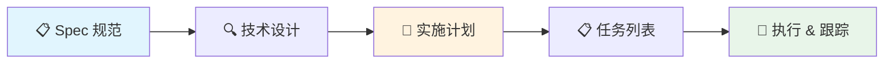
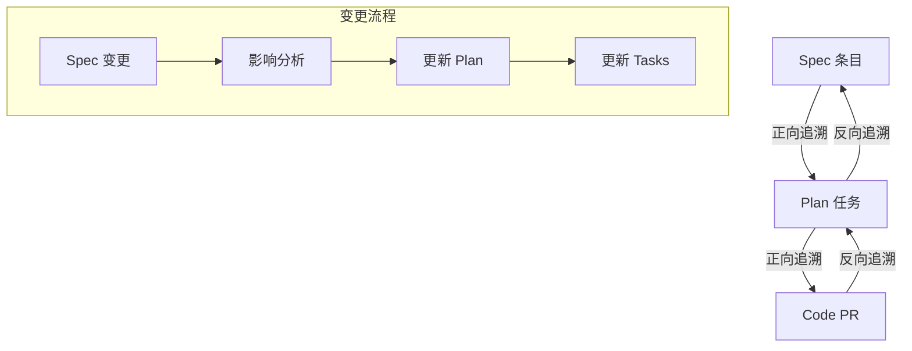

# 01-从规范到实施计划

## 1. 概述

规范文档（Spec）交付后，下一步是将"要做什么"转化为"怎么做、谁做、何时做"。这一转化过程的核心产物是**实施计划（Implementation Plan）**。规范描述的是"What"，计划描述的是"How + When + Who"。



> **核心理念**：规范是需求方与工程团队之间的**契约**；实施计划是工程团队内部的**作战地图**。二者不应混为一谈，但必须可追溯。

## 2. 从 Spec 到 Plan 的转化流程

### 2.1 转化的输入与输出

| 阶段 | 输入 | 输出 | 负责人 |
|------|------|------|--------|
| Spec 评审 | 规范文档 | 评审通过的 Spec | 产品 + 技术负责人 |
| 技术设计 | 评审通过的 Spec | 技术方案文档 | 技术负责人 / 架构师 |
| 计划编制 | Spec + 技术方案 | 实施计划 | 技术负责人 + PM |
| 任务拆分 | 实施计划 | 可执行任务列表 | 技术负责人 |

### 2.2 四个核心问题

制定实施计划时需要回答以下四个问题：

1. **范围**：本次迭代/版本包含哪些 Spec 条目？哪些延后？
2. **顺序**：各功能模块的开发顺序是什么？依赖关系如何？
3. **资源**：需要哪些人？每个人的时间分配如何？
4. **风险**：哪些环节最可能出问题？预案是什么？

## 3. 实施计划文档模板

一份完整的实施计划文档建议包含以下章节：

```markdown
# 实施计划：[功能/版本名称]

## 1. 概述
- 计划目标（1-2 段）
- 关联 Spec 文档链接
- 版本号 / 里程碑名称

## 2. 范围定义
- 包含的功能（In Scope）
- 排除的功能（Out of Scope）
- 与 Spec 的差异说明（如有）

## 3. 技术方案概要
- 架构决策记录（ADR）链接
- 关键技术选型及理由
- 对外部系统的依赖

## 4. 任务分解
- 任务列表（含优先级、预估工时、负责人）
- 依赖关系图
- 里程碑节点

## 5. 时间线
- 甘特图或时间轴
- 关键日期（提测、上线、回顾）

## 6. 风险与假设
- 假设清单
- 风险矩阵（概率 × 影响）
- 缓解措施

## 7. 验收标准
- 功能验收清单
- 非功能验收清单（性能、安全、兼容性）

## 8. 可追溯性矩阵
- Spec 条目 → Plan 任务 → 代码 PR 的映射

## 9. 审批记录
- 评审参与人
- 审批日期
- 修订历史
```

> **模板使用建议**：不是每个章节都必须写满。小型功能可以合并"技术方案概要"和"任务分解"；大型系统则需要每个章节独立成文。

## 4. 技术设计在计划中的角色

### 4.1 技术设计是计划的"骨架"

技术设计（Technical Design）回答的是**架构层面的 How**，它决定了：

- 模块如何划分 → 直接影响任务如何拆分
- 接口如何定义 → 决定了哪些任务可以并行
- 数据如何流转 → 影响测试策略和集成顺序

### 4.2 技术设计的关键输出

| 设计产物 | 对计划的影响 |
|----------|-------------|
| 系统架构图 | 确定模块边界，指导团队分工 |
| API 契约（OpenAPI/Protobuf） | 前后端可并行开发 |
| 数据模型（ER 图） | 数据库迁移任务列入计划 |
| 部署拓扑图 | 运维任务和灰度策略 |
| ADR（架构决策记录） | 记录关键决策及其上下文 |

### 4.3 技术设计中常见的问题

- **过度设计**：为不确定的未来需求预留了大量扩展点，拖慢交付
- **设计不足**：没有考虑边界情况，导致开发中频繁返工
- **设计文档滞后**：代码先行、设计后补，计划失去指导意义

> **经验法则**：技术设计的粒度应做到——一个中级工程师拿到设计文档后，能够独立开始编码，且不需要反复确认接口定义。

## 5. 假设与风险标记

### 5.1 假设管理

计划中的所有关键决策都建立在一组**假设**之上。显式记录假设的目的是：
- 当假设不成立时，快速定位受影响的任务
- 避免团队基于不同假设各自为战

**假设记录格式**：

```
[ASM-001] 第三方支付接口 v3 版本将在 9 月上线
  影响任务：T-012, T-013, T-015
  验证方式：与支付团队确认排期（需在 10 月 1 日前确认）
  如果失效：降级使用 v2 接口，增加兼容层开发（+3 天）
```

### 5.2 风险标记

使用**概率 × 影响**矩阵对风险分级：

| 风险等级 | 概率高 | 概率中 | 概率低 |
|----------|--------|--------|--------|
| **影响大** | 🔴 红色：必须有预案 | 🟠 橙色：需要监控 | 🟡 黄色：定期回顾 |
| **影响中** | 🟠 橙色：需要监控 | 🟡 黄色：定期回顾 | 🟢 绿色：记录即可 |
| **影响小** | 🟡 黄色：定期回顾 | 🟢 绿色：记录即可 | ⚪ 灰色：忽略 |

```mermaid
quadrantChart
    title 风险矩阵示例
    x-axis "概率低" --> "概率高"
    y-axis "影响小" --> "影响大"
    quadrant "密切监控"
    quadrant "必须有预案"
    quadrant "定期回顾"
    quadrant "记录即可"
    "第三方接口延期": [0.7, 0.85]
    "核心人员离职": [0.15, 0.9]
    "需求变更": [0.6, 0.5]
    "文档格式兼容": [0.3, 0.25]
    "CI 环境不稳定": [0.5, 0.3]
```

## 6. 计划评审清单

在计划最终确定前，建议逐项检查以下内容：

### 6.1 完整性检查

- [ ] 每个 Spec 条目都有对应的计划任务（覆盖率 100%）
- [ ] 所有外部依赖都已明确并确认可行
- [ ] 跨团队协作的任务有明确的接口人和 SLA
- [ ] 非功能需求（性能、安全、可观测性）已纳入计划

### 6.2 合理性检查

- [ ] 单个任务预估工时不超过 8 小时（否则需进一步拆分）
- [ ] 关键路径上的任务有缓冲时间（建议 20%~30%）
- [ ] 没有一个人在并行负责超过 3 个任务
- [ ] 里程碑节点之间的间隔合理（1~2 周为宜）

### 6.3 风险管理检查

- [ ] 前三大风险都有具体的缓解措施
- [ ] 有明确的升级路径（问题发生后找谁决策）
- [ ] 已预留应对突发情况的缓冲期

### 6.4 沟通计划检查

- [ ] 干系人已被告知计划并达成一致
- [ ] 计划变更的流程已定义（谁可以批准变更）
- [ ] 进度同步机制已约定（站会、周报、Dashboard）

## 7. 可追溯性矩阵

可追溯性矩阵（Traceability Matrix）是连接 Spec 和 Plan 的桥梁，确保不遗漏需求、不产生范围蔓延。

### 7.1 矩阵结构

| Spec ID | Spec 描述 | Plan 任务 | 负责人 | 状态 | PR/Commit |
|---------|----------|-----------|--------|------|-----------|
| REQ-001 | 用户登录 | T-003 登录接口 | 张三 | ✅ 完成 | #142 |
| REQ-001 | 用户登录 | T-004 登录页面 | 李四 | ✅ 完成 | #145 |
| REQ-002 | 权限校验 | T-008 角色模型 | 张三 | 🔄 进行中 | #150 |
| REQ-002 | 权限校验 | T-009 中间件 | 王五 | ⏳ 待开始 | — |
| REQ-003 | 数据导出 | T-015 导出服务 | 李四 | ⏳ 待开始 | — |

### 7.2 矩阵的价值

1. **防止遗漏**：每个 Spec 至少对应一个任务，如发现空行则说明有遗漏
2. **控制范围**：每个任务必须追溯到 Spec，如发现"孤儿任务"则说明有范围蔓延
3. **变更影响分析**：当某个 Spec 变更时，通过矩阵快速定位受影响的所有任务
4. **测试覆盖依据**：测试用例也可以纳入矩阵，形成 Spec → Code → Test 的完整链路

### 7.3 矩阵维护



> **工具建议**：小型项目可使用 Google Sheets 或 Notion Database 维护矩阵；大型项目建议将矩阵集成到需求管理工具（Jira、Linear）中，通过自定义字段实现自动关联。

## 8. 常见反模式

| 反模式 | 表现 | 改进方法 |
|--------|------|----------|
| **瀑布式计划** | 试图一次性规划所有细节到项目结束 | 只详细规划当前迭代，后续迭代保持粗粒度 |
| **无缓冲计划** | 时间排满，没有任何弹性空间 | 每个里程碑预留 20%~30% 缓冲 |
| **幽灵依赖** | 依赖了未确认的外部系统但计划中未体现 | 所有外部依赖必须显式记录并确认排期 |
| **计划与 Spec 脱节** | 计划中的任务在 Spec 中找不到依据 | 强制维护可追溯性矩阵 |
| **评审走过场** | 计划写完直接执行，无人认真审阅 | 计划评审必须有跨角色人员参与 |

## 9. 小结

从规范到实施计划的转化不是简单的"翻译"过程，而是一次**工程化的再创作**。一份好的实施计划应当：

- **可执行**：团队成员能够直接按计划开展工作
- **可追溯**：每个任务都能回溯到规范条目
- **可验证**：有明确的验收标准和里程碑
- **可适应**：预留了应对变更的缓冲和机制

下一节将进入计划的细化阶段——**任务分解与依赖管理**。
