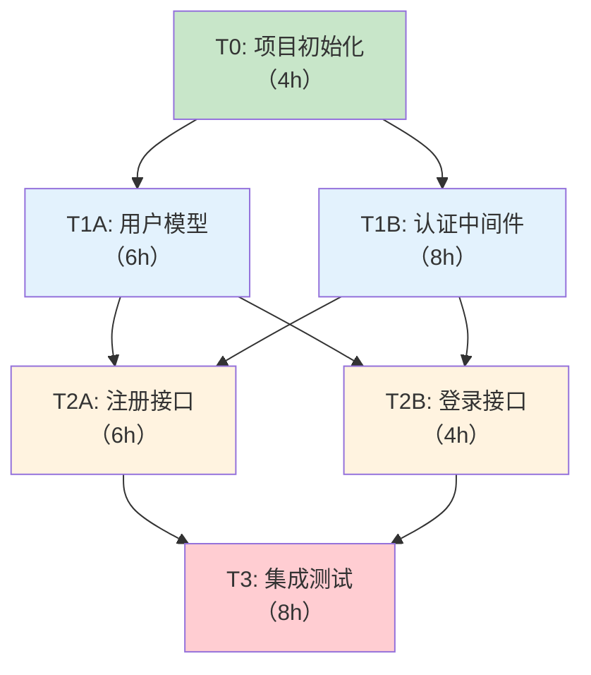
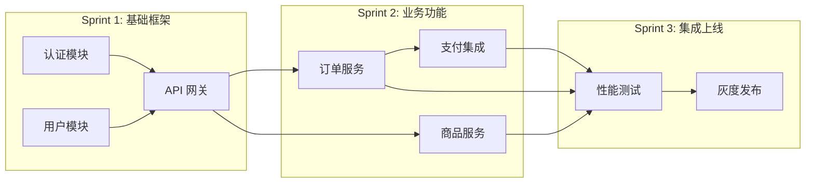
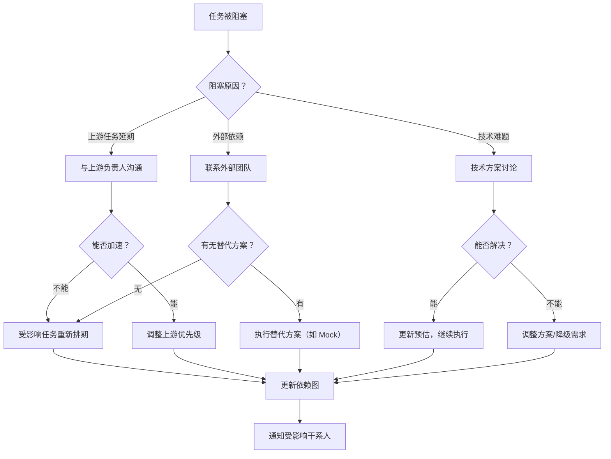

# 02-任务分解与依赖管理

## 1. 概述

实施计划确定后，下一步是将粗粒度的计划条目拆分为**可执行、可估算、可分配**的具体任务。任务分解的质量直接影响团队的交付效率——拆分过粗则难以追踪进度，拆分过细则管理成本过高。

> **核心原则**：一个好的任务应当是"一个人可以在一天内完成、且完成后可以独立验证"的工作单元。

## 2. 任务粒度原则

### 2.1 4-8 小时可完成

业界实践表明，单个任务的理想粒度为 **4 到 8 小时**（即半个到一个人天）。这个粒度在"足够小以追踪进度"和"足够大以降低管理开销"之间取得了平衡。

| 粒度 | 示例（过粗） | 示例（合适） | 示例（过细） |
|------|-------------|-------------|-------------|
| 功能开发 | "实现用户管理模块"（40h） | "实现用户注册接口"（6h） | "创建 User 模型文件"（0.5h） |
| Bug 修复 | "修复报表导出问题"（16h） | "修复 CSV 导出时中文乱码"（4h） | "添加 encoding 参数"（0.5h） |
| 技术优化 | "提升系统性能"（80h） | "为列表查询添加 Redis 缓存"（6h） | "安装 Redis 客户端库"（0.5h） |

### 2.2 拆分的最佳实践

**如何判断任务粒度是否合适**：

```
如果一个任务无法在站会上用一句话说清楚当前进度 → 太粗
如果一个任务的验收需要依赖另一个任务的结果 → 可能需要合并或重新划分
如果一个任务的 commit message 需要超过 3 行 body → 考虑是否拆分
```

**INVEST 原则（改编自 User Story 实践）**：

| 字母 | 含义 | 任务适配 |
|------|------|----------|
| **I** | Independent | 任务应尽量独立，减少与其他任务的耦合 |
| **N** | Negotiable | 实现细节可协商，但目标必须明确 |
| **V** | Valuable | 每个任务都应对最终交付有直接贡献 |
| **E** | Estimable | 能够合理估算工时 |
| **S** | Small | 足够小，可在 1 天内完成 |
| **T** | Testable | 完成后可以被独立验证（测试、演示） |

> **经验法则**：如果一个任务预估超过 12 小时，先不要急着拆分——先确认是否因为需求不够清晰导致估算偏大。需求清晰后再拆。

## 3. 任务依赖建模（DAG 思维）

### 3.1 什么是 DAG 思维

任务之间的依赖关系天然形成一个 **有向无环图（DAG，Directed Acyclic Graph）**：

- **有向**：依赖是有方向的（A 依赖 B，B 完成后 A 才能开始）
- **无环**：不能出现循环依赖（A 依赖 B，B 依赖 C，C 依赖 A 是不可行的）



在上图中：
- T0 是关键前置任务，所有后续任务都依赖它
- T1A 和 T1B 可以**并行**开发（如果由不同人负责）
- T2A 和 T2B 均依赖 T1A 和 T1B，但彼此独立，也可并行
- T3 是集成点，依赖所有开发任务完成

### 3.2 依赖类型

| 依赖类型 | 说明 | 示例 |
|----------|------|------|
| **完成-开始（FS）** | A 完成后 B 才能开始 | 数据库迁移完成 → 数据访问层开发 |
| **开始-开始（SS）** | A 开始后 B 才能开始 | 接口定义开始 → 前后端可以同时开始 |
| **完成-完成（FF）** | A 完成后 B 才能完成 | 代码完成 → Code Review 完成 |
| **外部依赖** | 依赖团队外部的交付 | 第三方 API 审核通过 → 集成开发 |
| **资源依赖** | 依赖特定人员可用 | 架构师评审通过 → 进入开发阶段 |

> **关键区分**：**逻辑依赖**（技术上的先后顺序）是刚性约束，不可绕过；**资源依赖**（人等资源不够）可以通过调整资源分配解决。

## 4. 用 Mermaid 和 YAML 表达任务依赖

### 4.1 Mermaid 图表方式

适合可视化展示和文档呈现：



### 4.2 YAML 结构化方式

适合工具解析和自动化处理：

```yaml
tasks:
  - id: T-001
    title: "用户注册接口"
    spec_ref: "REQ-001"
    estimated_hours: 6
    assignee: "张三"
    depends_on: []                    # 无依赖，可立即开始
    acceptance_criteria:
      - "支持邮箱+密码注册"
      - "密码强度校验（最少8位，含大小写+数字）"
      - "邮箱唯一性校验"
      - "返回标准 JWT Token"

  - id: T-002
    title: "用户登录接口"
    spec_ref: "REQ-001"
    estimated_hours: 4
    assignee: "李四"
    depends_on: ["T-001"]             # 依赖注册接口（共享认证逻辑）
    acceptance_criteria:
      - "支持邮箱+密码登录"
      - "连续5次失败后锁定30分钟"
      - "返回标准 JWT Token"

  - id: T-003
    title: "权限中间件"
    spec_ref: "REQ-002"
    estimated_hours: 8
    assignee: "王五"
    depends_on: ["T-001"]             # 依赖用户模型
    acceptance_criteria:
      - "基于角色的权限校验（RBAC）"
      - "支持接口级别的权限配置"
      - "未授权请求返回 403"

  - id: T-004
    title: "集成测试-认证流程"
    spec_ref: "REQ-001, REQ-002"
    estimated_hours: 6
    assignee: "赵六"
    depends_on: ["T-002", "T-003"]    # 依赖登录接口和权限中间件都完成
    acceptance_criteria:
      - "覆盖注册→登录→鉴权→访问资源的完整流程"
      - "覆盖异常场景（错误密码、过期Token、无权限）"
```

### 4.3 依赖图验证

```python
# 伪代码：检测循环依赖和孤立任务

def validate_task_graph(tasks: list[Task]) -> ValidationResult:
    """验证任务依赖图的有效性"""
    
    # 1. 检测循环依赖（拓扑排序）
    sorted_tasks = topological_sort(tasks)
    if len(sorted_tasks) < len(tasks):
        cycle = find_cycle(tasks)
        return ValidationResult(
            valid=False,
            error=f"发现循环依赖: {' → '.join(cycle)}"
        )
    
    # 2. 检测孤立任务（没有入边也没有出边）
    for task in tasks:
        has_dependents = any(task.id in t.depends_on for t in tasks)
        has_dependencies = len(task.depends_on) > 0
        if not has_dependents and not has_dependencies:
            warn(f"任务 {task.id} 是孤立任务，请确认是否需要纳入计划")
    
    # 3. 检测幽灵依赖（依赖了不存在的任务）
    all_ids = {t.id for t in tasks}
    for task in tasks:
        missing = set(task.depends_on) - all_ids
        if missing:
            return ValidationResult(
                valid=False,
                error=f"任务 {task.id} 依赖了不存在的任务: {missing}"
            )
    
    return ValidationResult(valid=True)
```

## 5. 任务描述标准

每个任务应包含以下信息以确保可执行性：

```yaml
# 任务描述模板
- id: "T-XXX"                          # 唯一标识
  title: "简洁描述（< 80 字符）"        # 一句话说明
  spec_ref: "REQ-XXX"                  # 关联的 Spec 条目
  type: "feature|bugfix|tech-debt|docs"# 任务类型
  priority: "P0|P1|P2|P3"             # 优先级
  estimated_hours: 4                   # 预估工时
  assignee: "姓名"                     # 负责人
  depends_on: ["T-XXX"]               # 前置依赖
  description: |                       # 详细描述
    做什么、为什么这么做、不做什么（明确边界）
  acceptance_criteria:                 # 验收标准（必须可测试）
    - "条件 1"
    - "条件 2"
  technical_notes:                     # 技术备忘（可选）
    - "参考文件路径"
    - "需要注意的边界情况"
  labels: ["api", "auth"]             # 标签，用于分类和筛选
```

> **验收标准三要素**：一个合格的验收标准应包含①**触发条件**（在什么场景下）、②**操作**（执行什么动作）、③**预期结果**（系统应如何响应）。

## 6. GitHub Issues / Project 任务管理实践

### 6.1 Issue 模板

在 `.github/ISSUE_TEMPLATE/task.md` 中定义：

```markdown
---
name: 开发任务
about: 标准的开发任务
title: "[T-XXX] 任务标题"
labels: task
assignees: ''
---

## Spec 关联
- Spec 条目: <!-- REQ-XXX -->
- Spec 文档链接: <!-- URL -->

## 任务描述
<!-- 做什么、为什么、不做什么 -->

## 验收标准
- [ ] 标准 1
- [ ] 标准 2
- [ ] 标准 3

## 技术备忘
<!-- 参考文件、边界情况、注意事项 -->

## 依赖
<!-- 列出依赖的其他 Issue -->
- 依赖 #123
- 依赖 #124

## 预估
- 工时: X 小时
- 截止: YYYY-MM-DD
```

### 6.2 GitHub Project 看板配置

| 列名 | 含义 | 进入条件 |
|------|------|----------|
| **Backlog** | 已创建但未排期 | 任务已创建 |
| **Ready** | 已排期，等待开始 | 所有依赖已满足 |
| **In Progress** | 正在开发 | 开发者开始工作 |
| **In Review** | Code Review 中 | PR 已提交 |
| **Testing** | 测试中 | Review 通过，部署到测试环境 |
| **Done** | 已完成 | 验收通过，合并到主分支 |

### 6.3 自动化规则

```yaml
# .github/workflows/task-automation.yml 伪配置
automations:
  - trigger: "PR 提交"
    condition: "PR 描述中包含 'Closes #issue_id'"
    action: "将对应 Issue 移动到 In Review"
  
  - trigger: "PR 合并到 main"
    condition: "所有 CI 检查通过"
    action: "将对应 Issue 移动到 Done"
  
  - trigger: "Issue 的依赖全部关闭"
    action: "将 Issue 从 Backlog 移动到 Ready"
    notify: "assignee"
```

## 7. 依赖阻塞风险应对策略

### 7.1 常见阻塞场景

| 场景 | 影响 | 应对策略 |
|------|------|----------|
| 上游任务延期 | 连锁延迟后续任务 | 为上游任务分配最有经验的开发者；设置硬性截止日期 |
| 外部 API 变更 | 依赖方被迫返工 | 使用 Adapter 模式隔离外部依赖；约定 API 版本锁定 |
| 关键人员不可用 | 特定任务无人可做 | 任务知识共享（结对编程、文档）；避免单点知识依赖 |
| 技术难题卡点 | 单任务耗时远超预估 | 设置"时间盒"（timebox）：超过预估 1.5 倍时升级并寻求帮助 |
| 需求变更冲击 | 已完成任务可能需要返工 | 高不确定性任务后置；模块化设计降低变更影响面 |

### 7.2 阻塞处理流程



### 7.3 预防性措施

1. **提前解除依赖**：对于高不确定性任务，尽早安排 Spike（技术调研），降低后续开发风险
2. **接口先行**：模块间依赖通过接口契约解耦，先定义接口，再并行开发实现
3. **预留缓冲**：关键路径上的任务预留 20%~30% 的缓冲时间
4. **每日依赖巡检**：在站会上显式检查每个阻塞任务的依赖状态变化

## 8. 小结

任务分解与依赖管理是计划落地的核心环节。关键要点：

- **粒度**：4~8 小时可完成，符合 INVEST 原则
- **建模**：用 DAG 思维理解依赖关系，识别并行机会
- **表达**：Mermaid 用于可视化、YAML 用于结构化工具解析
- **标准**：每个任务必须关联 Spec、明确验收标准、合理预估
- **工具**：GitHub Issues + Project 提供轻量级管理能力
- **风险**：提前识别阻塞风险，建立应对流程和预防机制

下一节将讨论如何对任务进行**优先级排序与风险评估**。
