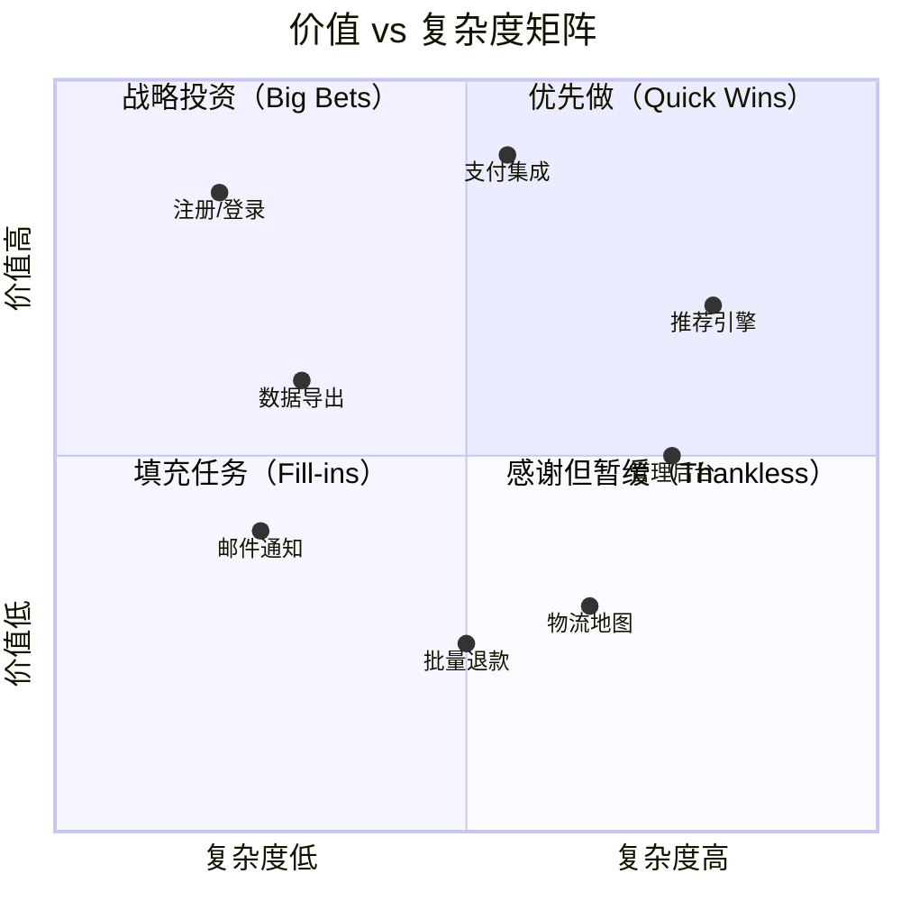
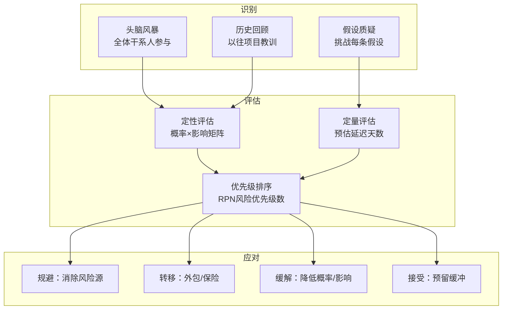
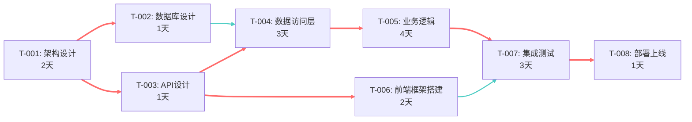
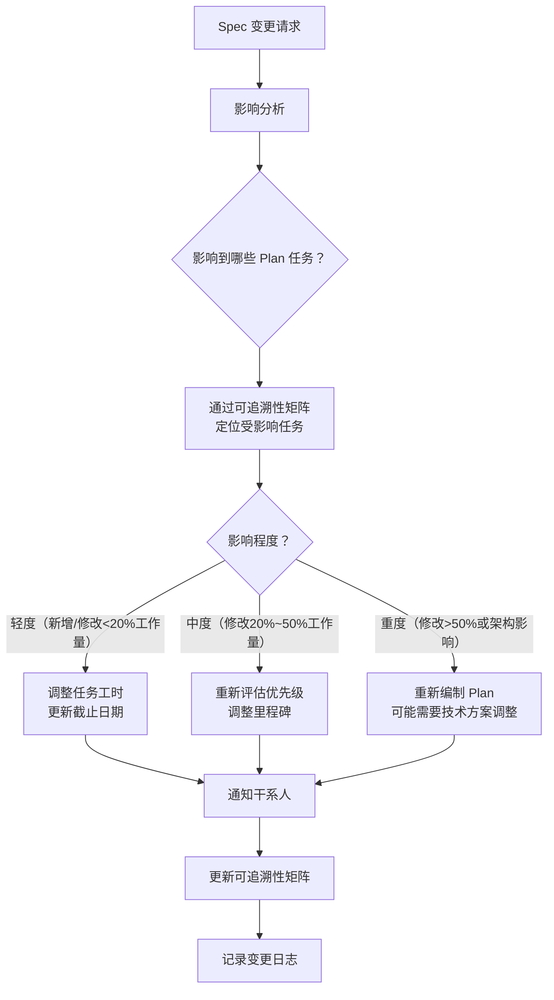

# 03-优先级排序与风险评估

## 1. 概述

任务分解完成后，团队面对一个待办列表。问题随之而来：**先做哪个？哪些可以并行？哪些风险最大？** 优先级排序和风险评估正是回答这两个问题的核心工具。

> **核心理念**：优先级不是"重要性"的排序，而是"投资回报率"的排序——用最小的投入、最低的风险，交付最大的价值。

## 2. MoSCoW 优先级方法

MoSCoW 是 SDD 中最常用的优先级框架，将需求分为四个等级：

| 优先级 | 含义 | 占总量 | 违反后果 |
|--------|------|--------|----------|
| **M**ust Have | 必须有，否则版本不可交付 | ~60% | 版本无法上线 |
| **S**hould Have | 应该有，很重要但可临时替代 | ~20% | 用变通方案可上线 |
| **C**ould Have | 可以有，加分项 | ~15% | 不影响上线决策 |
| **W**on't Have | 本次不做 | ~5% | 明确排除，避免范围蔓延 |

### 2.1 实际示例

```yaml
# 电商平台订单系统的 MoSCoW 分类
must_have:
  - "用户下单并生成订单号"         # 核心业务流程
  - "订单状态流转（待支付→已支付→已发货）"
  - "支付接口集成（微信+支付宝）"
  - "库存扣减与回滚"

should_have:
  - "订单列表筛选与搜索"
  - "订单导出（CSV）"
  - "发货通知（短信）"

could_have:
  - "订单详情页中的物流地图"
  - "批量退款"
  - "智能推荐关联商品"

wont_have_this_version:
  - "多语言订单邮件"
  - "订单语音通知"
```

### 2.2 MoSCoW 使用注意事项

> **常见误区**：团队倾向于把所有需求都标为 Must Have，导致 MoSCoW 失效。
> **正确做法**：对每个 Must Have，追问"如果没有这个功能，系统是否绝对无法上线？"——如果答案是否定的，它就不应该是 Must Have。

- **Must Have 必须小而精**：Must 太多 = 没有优先级。如果 60% 装不下，说明前面分解不够细，需要继续拆分
- **Should Have 是"延时器"**：时间充裕时做，时间紧张时降级，给计划提供了弹性
- **Won't Have 不是"不做"**：是"本次迭代不做"，明确记录到 Backlog 中供后续迭代参考

## 3. 价值 vs 复杂度二维排序

当同一优先级内的任务仍需排序时，使用**价值 vs 复杂度**二维矩阵。

### 3.1 四象限模型



### 3.2 排序策略

| 象限 | 策略 | 典型比例 |
|------|------|----------|
| **高价值 + 低复杂度**（Quick Wins） | **最优先**：快速交付验证，建立信心，获取反馈 | 40% |
| **高价值 + 高复杂度**（Big Bets） | **次优先**：需要充分的技术准备，分阶段交付 | 35% |
| **低价值 + 低复杂度**（Fill-ins） | **填充位**：在主要任务卡住时穿插做 | 15% |
| **低价值 + 高复杂度**（Thankless） | **最低优先级**：除非有战略必要性，否则不做 | 10% |

> **"Quick Wins 先行"策略**：每个迭代中至少安排 30%~40% 的 Quick Wins。这些任务能快速产出可见成果，对于维持团队士气和干系人信心至关重要。

## 4. 风险识别矩阵

### 4.1 风险评估框架

在 SDD 中，风险不是"可能出错的事"，而是"可能偏离计划的事"。风险评估的目的是**提前发现这些偏差并准备预案**。

| 风险类别 | 检查要点 |
|----------|----------|
| **技术风险** | 新技术成熟度、团队成员技能匹配度、技术债积累 |
| **依赖风险** | 外部 API 稳定性、第三方服务 SLA、跨团队协作瓶颈 |
| **需求风险** | 需求模糊度、变更频率、干系人共识程度 |
| **资源风险** | 关键人员可用性、预算限制、时间压力 |
| **合规风险** | 安全审计、数据隐私、行业法规要求 |

### 4.2 风险登记表模板

```markdown
| ID | 风险描述 | 类别 | 概率 | 影响 | 等级 | 触发条件 | 缓解措施 | 负责人 |
|----|---------|------|------|------|------|---------|---------|--------|
| R-01 | 第三方支付API升级导致接口不兼容 | 依赖 | 中 | 大 | 🟠 | 支付平台发布新版本 | Adapter 层封装，锁定API版本 | 张三 |
| R-02 | 数据库迁移脚本在预发布环境失败 | 技术 | 低 | 大 | 🟡 | 预发布部署时 | 生产级备份+回滚方案演练 | 李四 |
| R-03 | 性能测试未通过QPS指标 | 技术 | 中 | 中 | 🟡 | 集成测试阶段 | 提前做压测摸底，预留优化时间 | 王五 |
| R-04 | 跨时区团队沟通延迟 | 资源 | 高 | 中 | 🟠 | 关键决策需等待 | 异步决策为主，同步对齐为辅 | PM |
```

### 4.3 风险评估的三层视角



## 5. 里程碑与发布节奏规划

### 5.1 里程碑设计原则

```yaml
milestones:
  - name: "M1: 核心流程可跑通"
    target_date: "Week 2"
    criteria:
      - "用户可以注册、登录"
      - "用户可以浏览商品"
      - "系统可通过自动化测试部署到测试环境"
    purpose: "验证技术架构可行性"

  - name: "M2: 核心交易闭环"
    target_date: "Week 4"
    criteria:
      - "用户可以下单并支付"
      - "订单状态可正常流转"
      - "Demo 可以演示给干系人看"
    purpose: "第一个可演示的 E2E 流程"

  - name: "M3: 功能冻结"
    target_date: "Week 6"
    criteria:
      - "所有 Must Have 功能开发完成"
      - "通过冒烟测试"
      - "进入 Code Freeze"
    purpose: "功能层面不再新增，进入稳定期"

  - name: "M4: 正式发布"
    target_date: "Week 8"
    criteria:
      - "所有测试通过（单元/集成/E2E）"
      - "性能测试达标"
      - "安全审计通过"
      - "灰度发布验证完成"
    purpose: "生产环境上线"
```

### 5.2 发布节奏

| 节奏模式 | 频率 | 适用场景 |
|----------|------|----------|
| **持续部署** | 每天多次 | 成熟产品、高自动化、强大的可观测性 |
| **周发布** | 每周 1~2 次 | SaaS 产品、快速迭代团队 |
| **双周 Sprint** | 每两周 1 次 | 多数 Scrum 团队、前端/后端项目 |
| **月发布** | 每月 1 次 | 移动端 App（受应用商店审核限制）、硬件相关 |
| **季度大版本** | 每季度 1 次 | 平台级产品、需要大规模迁移窗口 |

> **发布节奏选择**：不是越快越好。综合考虑用户的接受能力（变更疲劳）、团队的能力成熟度（自动化程度）、以及监管要求来确定合适的节奏。

## 6. SDD 中的关键路径分析

### 6.1 什么是关键路径

关键路径（Critical Path）是项目网络图中**最长的依赖链**——这条路径上的任何延迟都会直接导致整体进度的延迟。



在上图中，红色路径为关键路径：**A → B → D → E → G → H**（总耗时 14 天）。蓝色路径 A → C → F → G → H（总耗时 9 天）有 5 天的浮动时间。

### 6.2 关键路径的应用

| 应用场景 | 做法 |
|----------|------|
| **资源调配** | 将最有经验的开发者安排在关键路径任务上 |
| **风险管理** | 关键路径上的任务应获得最多缓冲和保护 |
| **进度跟踪** | 每日关注关键路径上的任务是否偏离预估 |
| **压缩工期** | 如需加速，优先压缩关键路径（加人、降范围） |
| **并行化机会** | 检查关键路径上的任务是否可以进一步拆分以增加并行度 |

### 6.3 关键路径计算（伪代码）

```python
def find_critical_path(tasks: list[Task]) -> list[str]:
    """
    计算关键路径（最长路径）
    使用拓扑排序 + 动态规划
    """
    # 1. 拓扑排序
    sorted_ids = topological_sort(tasks)
    task_map = {t.id: t for t in tasks}
    
    # 2. 前向计算最早完成时间
    earliest_finish = {}
    for tid in sorted_ids:
        task = task_map[tid]
        if not task.depends_on:
            earliest_finish[tid] = task.duration
        else:
            earliest_finish[tid] = task.duration + max(
                earliest_finish[dep] for dep in task.depends_on
            )
    
    # 3. 后向计算最晚完成时间
    total_duration = max(earliest_finish.values())
    latest_finish = {}
    for tid in reversed(sorted_ids):
        task = task_map[tid]
        dependents = [t.id for t in tasks if tid in t.depends_on]
        if not dependents:
            latest_finish[tid] = total_duration
        else:
            latest_finish[tid] = min(
                latest_finish[dep] - task_map[dep].duration 
                for dep in dependents
            )
    
    # 4. 浮动时间为0的任务构成关键路径
    critical_tasks = [
        tid for tid in sorted_ids 
        if earliest_finish[tid] == latest_finish[tid]
    ]
    return critical_tasks
```

## 7. 变更管理：Spec 变更如何影响 Plan

### 7.1 变更的不可避免性

在 SDD 中，Spec 变更不是例外而是常态。但规范驱动的优势恰恰在于：**变更的影响是可追踪、可量化的**。



### 7.2 变更影响量化

```
变更影响 = 受影响任务数 × 平均任务工时调整比例 + 新增任务工时
       + 已完成任务的返工成本（如有）
       + 依赖关系调整成本（重新编排）
```

### 7.3 变更管理检查清单

- [ ] 变更是否影响 Must Have 功能的交付？
- [ ] 变更是否需要调整里程碑日期？
- [ ] 变更是否引入了新的外部依赖？
- [ ] 变更是否会导致已完成任务的返工？
- [ ] 变更是否影响其他并行开发的模块？
- [ ] 变更是否需要重新审批（合规/安全）？
- [ ] 变更的成本是否已被告知干系人并获批准？

### 7.4 变更日志模板

```markdown
## 变更记录

| 日期 | 变更 ID | Spec 条目 | 描述 | 影响 | 决策 | 审批人 |
|------|---------|----------|------|------|------|--------|
| 08-15 | CR-001 | REQ-005 | 支付接口从 v2 升级到 v3 | +2天（T-012,T-013） | 批准 | 技术负责人 |
| 08-18 | CR-002 | REQ-008 | 取消实时物流追踪 | -3天（T-020移除） | 批准 | 产品经理 |
| 08-20 | CR-003 | REQ-003 | 权限模型从 RBAC 改为 ABAC | +6天（架构调整） | 延期评审 | — |
```

> **变更管理的黄金法则**：不是阻止变更，而是让变更的成本和影响**可见**。当干系人看到"这个改动会让上线推迟一周"时，许多非必要的变更会自行消失。

## 8. 小结

优先级排序与风险评估是保证计划可执行性的最后一道防线：

- **MoSCoW**：强制区分需求等级，防止"所有都重要 = 都不重要"
- **二维排序**：价值/复杂度矩阵提供了同一优先级内的客观排序依据
- **风险矩阵**：系统化识别、评估和应对项目风险
- **里程碑**：为长期计划提供明确的检查和调整节点
- **关键路径**：识别瓶颈，集中资源保护最脆弱的依赖链
- **变更管理**：让变更的成本可见，用数据而非直觉做决策

至此，从 Spec → Plan → Tasks → 优先级排序的完整链路已经建立。这套方法论的目标不是消除不确定性，而是**在不确定性中建立结构化的决策框架**。
