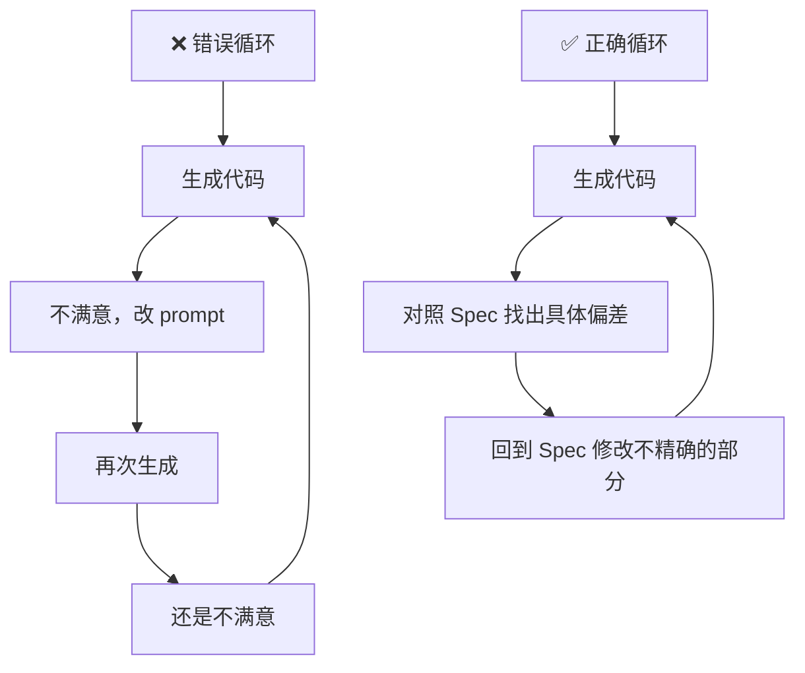
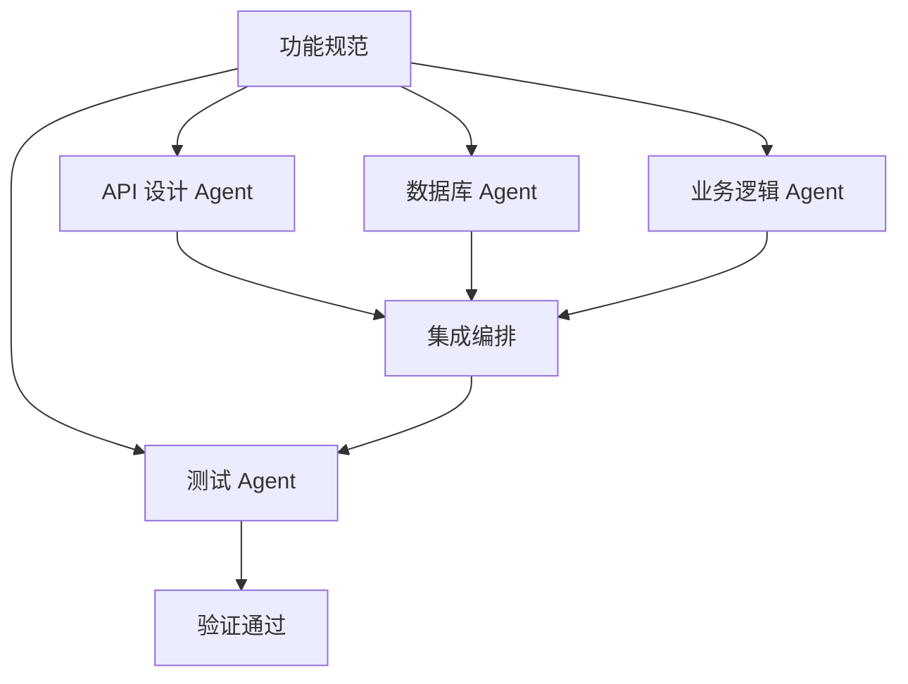

# 规范驱动的代码生成

Implement 是 SDD 工作流中"从纸面到代码"的关键步骤——AI Agent 从规范生成可工作的代码。本章讲解生成策略、质量控制和最佳实践。

---

## 1. AI 如何从规范生成代码

### 核心流程


关键原则：**AI 不是从零"创造"，而是从规范"翻译"**。规范越精确，代码生成的可靠性和一致性越高。

### 分层输入策略

AI 代码生成时，一次性注入太多上下文会导致质量下降。SDD 采用分层注入：

```
第 1 层（始终注入）：Constitution 中的核心原则
第 2 层（功能注入）：当前功能的 Spec 文档
第 3 层（任务注入）：当前 Task 的描述和验收条件
第 4 层（上下文注入）：相关的代码文件、API 文档
```

---

## 2. 生成代码的质量控制

### 2.1 审查清单

AI 生成的代码需要对照以下清单逐项检查：

| 检查项 | 验证方法 | 失败处理 |
|--------|----------|----------|
| 功能完整性 | 逐条对照 Spec 验收条件 | 回退重新生成 |
| 异常处理覆盖 | 检查 Spec 中的异常场景是否都有对应代码 | 补充异常处理 |
| Constitution 合规 | 检查技术原则/安全规则是否遵守 | 修正或更新 Constitution |
| 代码风格一致 | 与项目现有代码比较 | 统一格式化 |
| 过度实现 | 检查是否实现了 Spec 中没有的功能 | 删除多余代码 |
| 性能达标 | 对照 Spec 中的 NFR 性能要求 | 优化或降低目标 |

### 2.2 常见生成模式

**CRUD 接口生成**（最常见的 SDD 使用场景）：

从规范中的"输入/输出/异常"三元组，AI 可以可靠地生成：
- 路由定义 + 请求验证
- 业务逻辑层
- 数据库操作层
- 错误响应格式化

示例 —— 从规范字段到代码的映射：

```markdown
规范片段：
### POST /api/users/register
- 输入：{email: string, password: string, name: string}
- 输出成功 201：{id: uuid, email: string, name: string, created_at: datetime}
- 异常：
  - 400：邮箱格式错误
  - 409：邮箱已存在
  - 422：密码长度 < 8
```

对应生成的 FastAPI 代码结构：

```python
# 由规范自动生成的路由定义
from pydantic import BaseModel, EmailStr, Field

class RegisterRequest(BaseModel):
    email: EmailStr
    password: str = Field(min_length=8)
    name: str = Field(min_length=1, max_length=100)

class RegisterResponse(BaseModel):
    id: str
    email: str
    name: str
    created_at: str

@router.post("/register", status_code=201)
async def register_user(req: RegisterRequest) -> RegisterResponse:
    # 1. 检查邮箱唯一性 → 409
    if await user_exists(req.email):
        raise HTTPException(409, "邮箱已存在")
    # 2. 创建用户
    user = await create_user(req)
    # 3. 返回结果
    return RegisterResponse(...)
```

> **关键**：代码结构与规范的结构一一对应——这是可追溯性的基础。

---

## 3. 当生成结果不理想时

### 3.1 三种回退策略

| 策略 | 做法 | 适用场景 |
|------|------|----------|
| **补充规范** | 规范不够精确 → 回到 Specify/Clarify 补充 → 重新生成 | 概念性错误 |
| **拆分任务** | 一次性给了太多 → 拆成 2-3 个小任务分别生成 | 上下文过载 |
| **人工修正** | 小错误直接修，大问题回退 | 常规开发节奏 |

### 3.2 反模式：无限重新生成



> **原则**：如果 AI 三次生成都不满意，问题不在 AI——在规范不够精确。回到 Specify 步骤修改规范。

---

## 4. 规范-代码映射策略

### 4.1 规范章节与代码模块的映射

| 规范章节 | 代码模块 | 示例 |
|----------|----------|------|
| 验收条件 | 测试文件 | `test_register_user.py` |
| 输入/输出规范 | Pydantic/DTO 定义 | `schemas/user.py` |
| 核心流程 | Service/业务逻辑 | `services/user_service.py` |
| API 端点 | 路由定义 | `api/v1/users.py` |
| 异常处理 | 异常处理中间件 | `exceptions/handlers.py` |
| 非功能需求 | 中间件/配置 | `middleware/rate_limit.py` |

### 4.2 使用注释标注规范追溯

```python
# @spec: SPEC-001 §3.2 — 用户注册成功返回 201
# @spec: SPEC-001 §3.3 — 邮箱重复返回 409
# @spec: SPEC-001 §3.4 — 密码过短返回 422
@router.post("/register", status_code=201)
async def register_user(req: RegisterRequest):
    ...
```

这种方式让任何人（包括未来的 AI Agent）都能快速定位到对应规范。

---

## 5. 多 Agent 协作实现模式

SDD 中的 Implement 阶段可以分解为多个专门的 Agent：



各 Agent 并行工作，最后统一集成。每个 Agent 只需要看到自己相关的规范段落，避免上下文污染。

---

## 6. 小结

- 规范驱动生成的核心是 **"翻译"而不是"创造"**
- 分层注入上下文是控制 AI 生成质量的关键手段
- 规范-代码可追溯性是长期维护的保障
- 当生成不理想时，**回到规范而非反复修改 prompt**
- 对关键系统，AI 生成的代码只是起点——人工审查和测试覆盖不能少

---

## 下一步

阅读 [02-上下文窗口管理策略](02-上下文窗口管理策略.md) 了解如何在 AI 有限的上下文窗口中高效传递规范信息。
