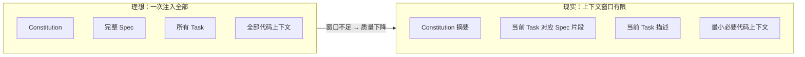
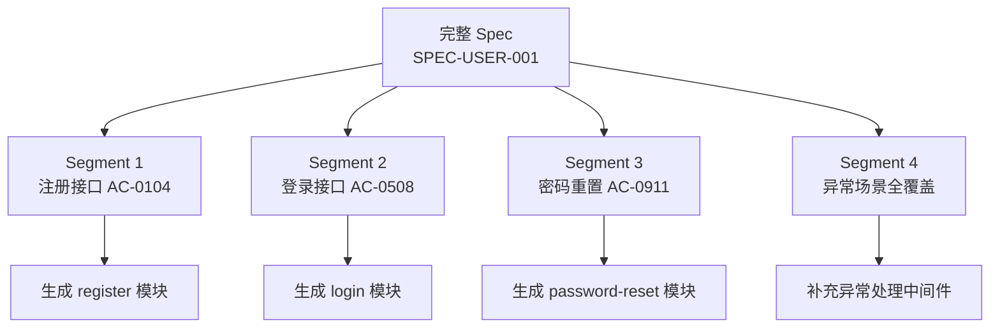
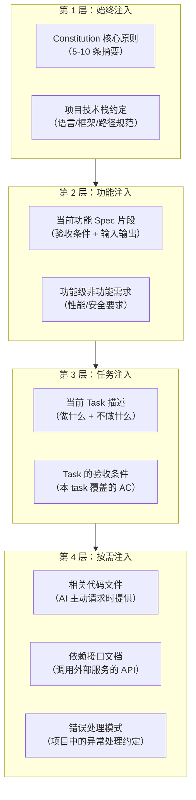
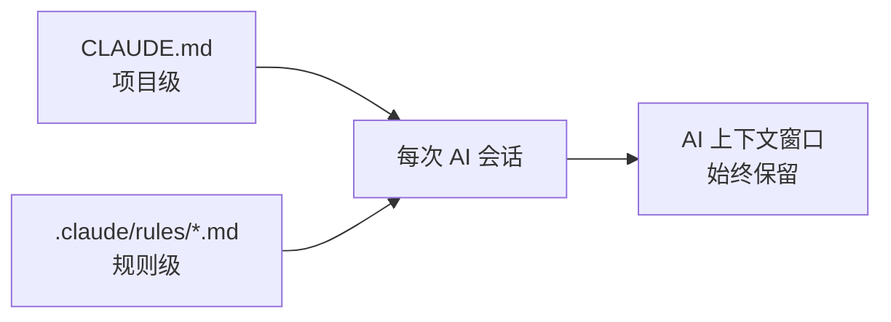
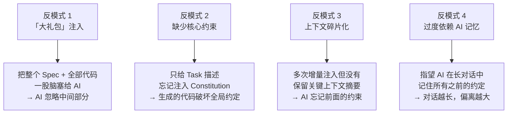
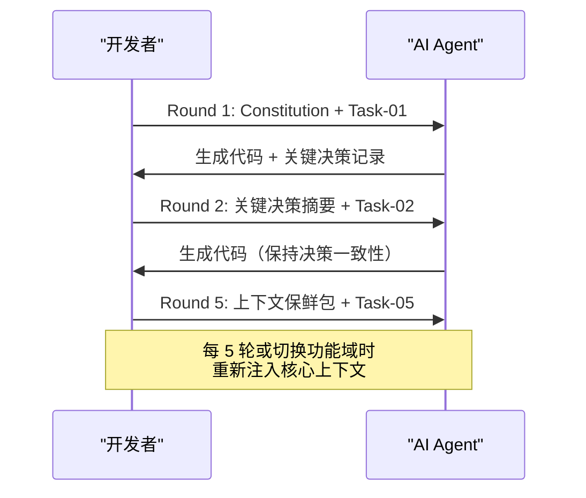

# 上下文窗口管理策略

在 AI Coding 场景下，LLM 的上下文窗口是稀缺资源。SDD 能否成功实施，很大程度上取决于能否在有限的上下文中高效传递"对的信息"。本章讲解上下文窗口的管理策略、常见反模式和实操技巧。

---

## 1. LLM 上下文窗口的本质限制

### 1.1 为什么上下文管理是 SDD 的核心挑战



关键认知：
- 上下文窗口不是"越大越好"——LLM 在长上下文中的注意力会稀释，"中间信息丢失"是已知问题
- 一次性注入 2 万 tokens 的规范文档，AI 可能只"记住"开头和结尾，中间部分被忽略
- **SDD 的解法不是给 AI 塞更多信息，而是给 AI 正好需要的信息**

### 1.2 各主流模型的上下文窗口参考

| 模型 | 最大上下文 | 有效注意力窗口（经验值） | 建议单次注入上限 |
|------|-----------|------------------------|----------------|
| Claude 3.5 Sonnet | 200K | ~100K | 15K-20K tokens |
| Claude 3 Opus | 200K | ~120K | 20K-30K tokens |
| GPT-4 Turbo | 128K | ~80K | 15K-25K tokens |
| DeepSeek-V3 | 128K | ~90K | 20K-30K tokens |
| Gemini 1.5 Pro | 1M+ | ~200K | 30K-50K tokens |

> **经验法则**：单次注入控制在模型最大上下文的 15%-20% 以内，为推理和输出预留空间。

---

## 2. 规范分段策略：一次只处理一个子集

### 2.1 为什么需要分段

SDD 中一个完整的功能 Spec 可能包含 10+ 个验收条件、5+ 个异常场景、完整的 API Schema 定义。全部注入会超出有效注意力窗口。

分段的核心思想：**让 AI 一次只看到和处理规范的一个子集，但通过有序编排覆盖全部规范**。

### 2.2 分段方法



**分段原则**：

| 分段维度 | 适用场景 | 示例 |
|----------|----------|------|
| 按 API 端点 | RESTful 服务 | `/register`、`/login`、`/profile` 分别处理 |
| 按验收条件组 | 复杂业务流程 | AC-0105 为一段，AC-0610 为一段 |
| 按领域实体 | DDD 项目 | User 聚合根一段，Order 聚合根一段 |
| 按技术层次 | 全栈功能 | API 层一段，Service 层一段，数据层一段 |

### 2.3 分段注入模板

```markdown
## 当前任务上下文

### Constitution 摘要（始终注入）
- CONST-01：所有 API 必须返回统一格式 {code, data, message}
- CONST-02：使用 Pydantic v2 进行输入校验
- CONST-05：测试覆盖率 ≥ 80%

### 当前 Spec 片段（SPEC-USER-001 §3.1 ~ §3.4）
（只包含与当前任务相关的验收条件）

### 关联 Spec 摘要（快速参考）
- §2.1 用户模型定义：id(uuid), email(string), name(string), status(enum)
- §4.1 错误码约定：400 参数错误, 409 冲突, 422 校验失败

### 当前 Task
Task-03: 实现用户注册接口
- 验收条件：AC-0104
- 输入：见 §3.1
- 输出：见 §3.2

### 相关代码上下文（仅必要文件）
- src/models/user.py（数据模型定义）
- src/schemas/common.py（统一响应格式）
- src/exceptions/handlers.py（现有错误处理模式）
```

> **关键**：每个 Segment 之间保留 Constitution 摘要和关联 Spec 摘要，确保 AI 不会"忘记"全局约束。

---

## 3. 分层注入策略

### 3.1 四层注入模型



### 3.2 各层的 Token 预算分配

| 层次 | 内容 | 建议 Token 预算 | 占比 |
|------|------|----------------|------|
| L1 始终注入 | Constitution + 技术栈 | 500-1000 | 5%-8% |
| L2 功能注入 | Spec 片段 + NFR | 1500-3000 | 15%-25% |
| L3 任务注入 | Task 描述 + AC | 500-1500 | 5%-12% |
| L4 按需注入 | 代码上下文 + 依赖文档 | 5000-8000 | 40%-60% |
| **预留** | AI 推理和输出空间 | 5000+ | 30%+ |

> **核心原则**：L4 按需注入是最大的变量。不要让 AI 猜需要什么文件——让 AI 通过工具调用自己获取，或者通过 Task 描述精确指定需要的文件路径。

---

## 4. Claude Code /init 与 CLAUDE.md

### 4.1 CLAUDE.md 的定位

在 Claude Code 项目中，`CLAUDE.md` 是项目的"始终注入上下文"。它存在于项目根目录，每次 AI 会话启动时自动加载。



### 4.2 CLAUDE.md 应该包含什么（SDD 视角）

```markdown
# CLAUDE.md（SDD 项目模板）

## Constitution 摘要
- 统一响应格式：{code: int, data: any, message: str}
- 所有 API 输入使用 Pydantic v2 校验
- 错误使用 HTTPException，禁止返回裸 dict
- 测试覆盖率门禁 80%

## 项目结构约定
- src/api/      — 路由定义
- src/services/ — 业务逻辑
- src/models/   — 数据模型
- src/schemas/  — Pydantic Schema
- specs/        — 功能规范（按 SPEC-XXX 编号）
- tests/        — 测试（与 src/ 镜像结构）

## Spec 工作流
- 实现前必须阅读对应的 specs/ 下的规范文件
- 代码中标注 @spec: SPEC-XXX §X.Y 注释追溯规范
- 异常场景必须在代码中有对应的错误处理

## 禁止事项
- 禁止使用 print() — 使用 logging
- 禁止 hardcode 配置 — 使用环境变量
- 禁止在没有对应 Spec 的情况下新增 API 端点
```

### 4.3 CLAUDE.md 的大小控制

| 项目规模 | CLAUDE.md 建议大小 | 包含内容 |
|----------|-------------------|----------|
| 小型（< 5K 行代码） | 500-800 tokens | Constitution 摘要 + 结构约定 + 禁止事项 |
| 中型（5K-50K 行） | 800-1500 tokens | 以上 + 核心模块索引 + API 约定 |
| 大型（> 50K 行） | 1500-3000 tokens | 以上 + Spec 索引 + 关键架构决策记录 |

> **反模式**：不要把 CLAUDE.md 写成项目 Wiki。它是对 AI 的"速记卡"，不是给人读的文档。信息密度 > 完整性。

### 4.4 补充：.claude/rules/ 动态规则

当项目有多个领域时，可以按场景拆分规则：

```
.claude/rules/
├── api-conventions.md     # 仅 API 开发时加载
├── database-conventions.md # 仅数据库操作时加载
└── testing-conventions.md  # 仅测试开发时加载
```

配合 Claude Code 的 Hook 机制实现按需加载，避免不必要的上下文占用。

---

## 5. 反模式：上下文管理的常见错误

### 5.1 四种典型反模式



### 5.2 反模式对照表

| 反模式 | 表现 | 后果 | 修复方法 |
|--------|------|------|----------|
| 大礼包注入 | 一次性粘贴 500+ 行 Spec + 300+ 行代码 | AI 生成的代码遗漏 30% 的验收条件 | 拆分为 3-5 个 Segment 分别处理 |
| 缺少核心约束 | Task 描述只有"实现 XX 功能" | 生成的响应格式、错误处理与项目不一致 | 每个 Task 前都注入 Constitution 摘要 |
| 上下文碎片化 | 对话轮次超过 20 轮，各轮上下文不关联 | AI 在第 10 轮后开始"编造"规范中没有的内容 | 每 5 轮重新注入摘要，必要时开启新会话 |
| 过度依赖记忆 | 在一个会话中连续实现 8 个 Task | 第 8 个 Task 完全忽略了第 1 个 Task 中定义的共享 Schema | 每个 Task 都提供相关的 Schema 定义 |

### 5.3 实战：如何判断上下文过载

当 AI 出现以下行为时，大概率是上下文过载：

- 生成的代码忽略了 Spec 中明确列出的验收条件
- 开始"编造"规范中没有的 API 端点或数据库字段
- 多次生成的结果不一致（同样的 Task 两次生成差异很大）
- 响应速度明显变慢，输出中出现不连贯的逻辑跳跃

**应对**：立即停止当前会话，拆分 Task，开启新会话重新开始。

---

## 6. 实操技巧：渐进式上下文注入

### 6.1 多轮对话中的上下文保鲜



**上下文保鲜包模板**：

```markdown
## 上下文保鲜（每 N 轮重新注入）

### 已做出的关键决策
- 决策 1：用户 ID 使用 UUID v4（Task-01 中确定）
- 决策 2：密码使用 bcrypt 哈希，cost factor = 12（Task-02 中确定）
- 决策 3：JWT Token 过期时间 30 分钟（Task-03 中确定）

### 当前进度
- ✅ Task-0104 已完成（注册、登录、Token 刷新、权限中间件）
- 🔄 Task-05 进行中（密码重置）
- ⬜ Task-0608 待处理

### 当前 Task 的 Spec 片段
（见下方）
```

### 6.2 上下文压缩技巧

| 技巧 | 做法 | Token 节省 |
|------|------|-----------|
| Constitution 摘要化 | 5 条核心原则压缩为 5 个短语 | 500 → 80 tokens |
| Spec 片段化 | 只注入当前 Task 需要的验收条件 | 3000 → 500 tokens |
| 代码索引化 | 提供文件路径 + 关键函数签名，不贴完整代码 | 按需节省 50%+ |
| 决策日志化 | 用列表记录已做出的关键决策，替代完整对话历史 | 持续节省 |

### 6.3 工具辅助：使用 Claude Code 的 /init 管理项目上下文

```bash
# 初始化项目级 CLAUDE.md
claude /init

# 在 CLAUDE.md 中添加项目核心约束（Constitution 摘要）
# 这些内容会在每次对话中自动注入
```

> **实践建议**：对于大型 SDD 项目，建议在 `CLAUDE.md` 中只放 Constitution 摘要和项目结构约定（~500 tokens），具体 Spec 片段在 Task 描述中注入。

---

## 7. 小结

- 上下文窗口是 SDD 实施中的硬约束，**策略是"精准注入"而非"全量注入"**
- 规范分段策略是核心手段——一次只让 AI 处理一个 Spec 子集
- 四层注入模型（Constitution → Spec 片段 → Task → 代码上下文）确保 AI 既有全局约束又有局部精度
- CLAUDE.md 是"始终注入"的最佳载体，控制在 500-1500 tokens 以内
- 识别上下文过载信号（遗漏 AC、编造内容、不一致输出）并及时中断重新开始
- 多轮对话中通过"上下文保鲜包"保持 AI 对关键决策的记忆

---

## 下一步

阅读 [03-代码与规范的同步维护](03-代码与规范的同步维护.md) 了解如何在开发过程中保持代码与规范的双向同步。
