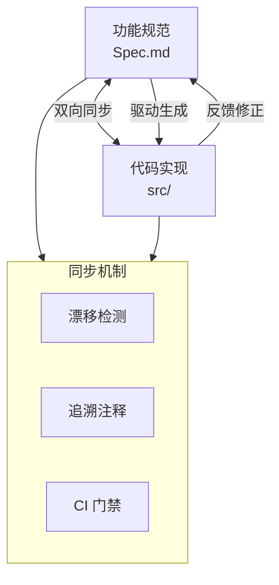
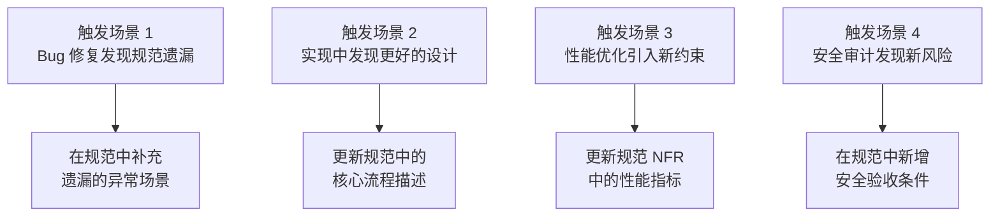
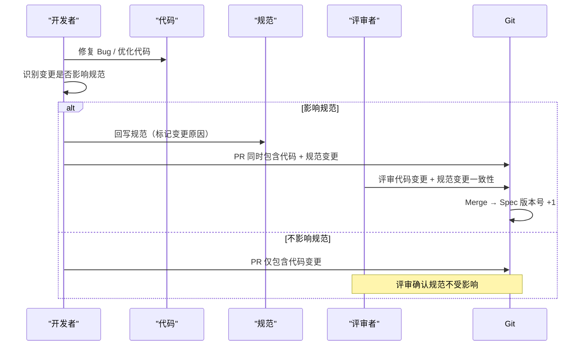
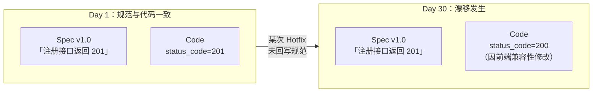
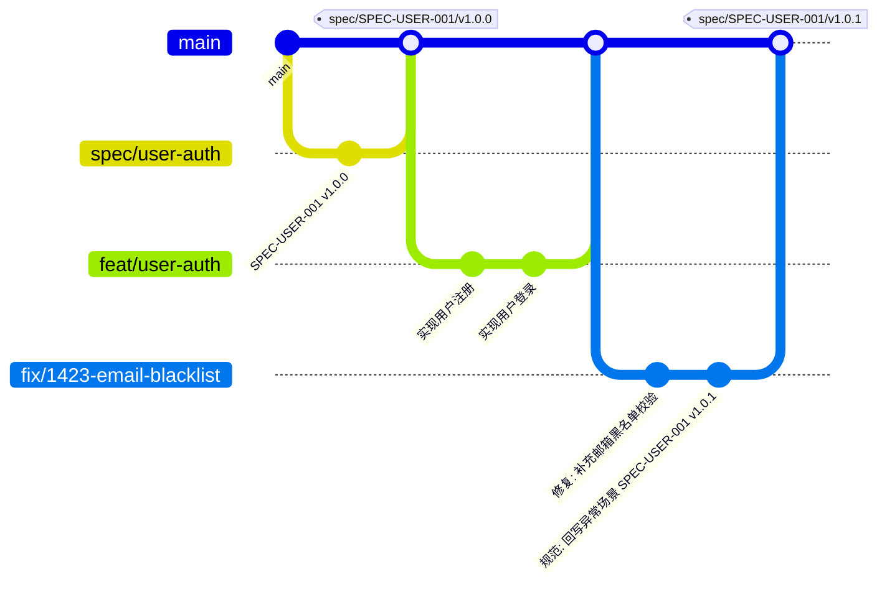
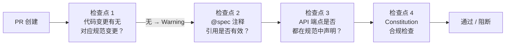
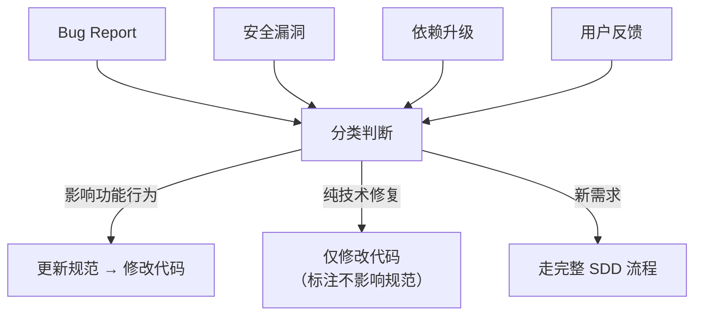

# 代码与规范的同步维护

规范和代码不是"一次生成，永远不变"的关系。业务会演化，需求会变更，Bug 会浮现——这些变化必须同时反映在规范和代码中。本章讲解规范与代码的终身关系、漂移检测和同步维护策略。

---

## 1. 规范与代码的终身关系

### 1.1 双生子模型

在 SDD 中，规范和代码是一对"双生子"——它们描述同一个系统的两个视图，必须始终保持一致。



**核心信念**：

> 规范不是写一次就扔掉的文档，而是代码的"另一个真值源"。当代码和规范冲突时，必须有一方是错的——找到它，修复它。

### 1.2 规范-代码关系的生命周期

| 阶段 | 规范状态 | 代码状态 | 关系 |
|------|----------|----------|------|
| 初始开发 | 已完成并批准 | 从规范生成 | 规范 → 代码（单向） |
| 功能增强 | 先更新规范，再改代码 | 依据新规范修改 | 规范 → 代码（单向） |
| Bug 修复 | 发现规范遗漏 | 代码修正后回写规范 | 代码 → 规范（反向） |
| 重构 | 不变 | 内部结构调整 | 规范验证代码行为不变 |
| 维护期 | 持续微调 | 持续微调 | 双向同步 |

> **关键**：并不是所有变更都从规范开始。Bug 修复时，代码先变，然后规范回写——这同样是合法的 SDD 流程，只要最终两者保持一致。

---

## 2. 代码变更如何回写规范

### 2.1 回写触发场景



### 2.2 回写流程



### 2.3 回写模板

在规范末尾添加变更记录：

```markdown
## 变更记录

| 版本 | 日期 | 变更类型 | 变更内容 | 触发来源 |
|------|------|----------|----------|----------|
| v1.0.0 | 2026-01-15 | 初始 | 用户注册规范初版 | SPEC-USER-001 |
| v1.0.1 | 2026-01-20 | 修正 | 补充邮箱域名黑名单异常场景 | Bug #1423 |
| v1.1.0 | 2026-02-03 | 增强 | 新增 OAuth 第三方登录验收条件 | Feature #1501 |
| v1.1.1 | 2026-02-10 | 修正 | 更新密码强度要求：8位→12位 | 安全审计 AUD-006 |
```

> **规范**：每次回写必须记录触发来源（Bug ID、Feature ID、审计编号），确保完整的可追溯链。

---

## 3. Spec Drift 识别与预防

### 3.1 什么是 Spec Drift

**Spec Drift（规范漂移）** 是指代码实现与规范描述之间出现不一致的现象。



### 3.2 漂移的四种类型

| 漂移类型 | 描述 | 示例 | 严重程度 |
|----------|------|------|----------|
| **实现缺失** | Spec 中有，代码中没有 | Spec 要求密码 ≥ 12 位，代码只校验了 ≥ 8 位 | 🔴 高 |
| **过度实现** | 代码中有，Spec 中没有 | 代码实现了限流，但 Spec 中未定义限流规则 | 🟡 中 |
| **行为偏离** | 两者都有，但行为不一致 | Spec 说返回 201，代码返回 200 | 🔴 高 |
| **注释过时** | @spec 注释引用了不存在的版本或段落 | `@spec: SPEC-001 §3.5` 但 §3.5 已被删除 | 🟢 低 |

### 3.3 漂移检测：自动化脚本

```python
# scripts/check_spec_drift.py
"""规范漂移自动检测。"""
import re
import subprocess
from pathlib import Path
from typing import NamedTuple

class DriftIssue(NamedTuple):
    severity: str  # high, medium, low
    file: str
    line: int
    message: str

def check_spec_annotations(src_dir: str = "src") -> list[DriftIssue]:
    """检查代码中的 @spec 注释是否引用了有效的规范段落。"""
    issues = []
    spec_refs = {}  # 收集所有有效的规范段落

    # 1. 收集规范中所有有效的段落编号
    for spec_file in Path("specs").glob("*/spec.md"):
        content = spec_file.read_text()
        # 提取所有 §X.Y 段落编号
        sections = re.findall(r'§(\d+\.\d+)', content)
        spec_name = spec_file.parent.name
        spec_refs[spec_name] = set(sections)

    # 2. 检查代码中的 @spec 注释
    for py_file in Path(src_dir).glob("**/*.py"):
        for i, line in enumerate(py_file.read_text().split('\n'), 1):
            match = re.search(r'@spec:\s*([\w-]+)\s+§(\d+\.\d+)', line)
            if match:
                ref_spec, ref_section = match.groups()
                if ref_spec in spec_refs:
                    if ref_section not in spec_refs[ref_spec]:
                        issues.append(DriftIssue(
                            "medium", str(py_file), i,
                            f"@spec 引用 {ref_spec} §{ref_section} 在规范中不存在"
                        ))
                else:
                    issues.append(DriftIssue(
                        "high", str(py_file), i,
                        f"@spec 引用了不存在的规范 {ref_spec}"
                    ))
    return issues

def check_api_consistency() -> list[DriftIssue]:
    """检查 API 端点是否与规范一致。"""
    # 此处可以集成 OpenAPI/Swagger 规范对比
    # 简化示例：检查是否存在代码中定义但规范中未声明的端点
    issues = []
    # ... 实际实现需要解析路由和规范
    return issues

def main():
    all_issues = []
    all_issues.extend(check_spec_annotations())
    all_issues.extend(check_api_consistency())

    if not all_issues:
        print("✅ 未检测到规范漂移")
        return 0

    print(f"⚠️  检测到 {len(all_issues)} 个漂移问题：\n")
    for issue in sorted(all_issues, key=lambda x: x.severity):
        print(f"  [{issue.severity.upper()}] {issue.file}:{issue.line}")
        print(f"    {issue.message}\n")

    high_issues = [i for i in all_issues if i.severity == "high"]
    return 1 if high_issues else 0  # 仅 high 级别阻断 CI

if __name__ == "__main__":
    exit(main())
```

### 3.4 预防措施

| 措施 | 实现方式 | 效果 |
|------|----------|------|
| CI 漂移检测 | 每次 PR 运行 `check_spec_drift.py` | 阻止漂移进入 main 分支 |
| @spec 注释强制 | ESLint/Pylint 自定义规则检查 @spec 注释完整性 | 代码与规范的可追溯性 |
| Spec-First PR 模板 | PR 模板要求说明"关联规范及版本" | 开发者自我检查 |
| 定期漂移审计 | 每 Sprint 结束运行全量漂移检测 | 发现累积性漂移 |

---

## 4. 规范版本化与 Git 协同

### 4.1 规范的语义化版本

规范采用与代码发布解耦的独立版本号：

```
SPEC-USER-001 v1.2.3

MAJOR（主版本）：向后不兼容的变更（重写用户模型、删除端点）
MINOR（次版本）：向后兼容的新增（增加 OAuth 登录、新增字段）
PATCH（修订版本）：澄清和修正（补充异常场景、修正描述）
```

### 4.2 Git Tag 绑定策略

```bash
# 规范批准时打 tag
git tag -a spec/SPEC-USER-001/v1.0.0 -m "用户注册规范 v1.0.0，已批准"

# 规范修订时打 tag
git tag -a spec/SPEC-USER-001/v1.0.1 -m "补充邮箱黑名单异常场景（Bug #1423）"

# 代码发布时引用规范版本
git tag -a release/v2.3.0 -m "Release v2.3.0, 包含 SPEC-USER-001@v1.0.1"
```

### 4.3 规范与代码的 Git 关联



> **规则**：任何修改功能的 commit，如果影响了规范，必须在同一个 PR 中包含规范更新。

---

## 5. CI 规范合规检查

### 5.1 CI Pipeline 中的规范检查点



### 5.2 GitHub Actions 实现

```yaml
# .github/workflows/spec-compliance.yml
name: Spec Compliance Check

on:
  pull_request:
    branches: [main]

jobs:
  spec-compliance:
    runs-on: ubuntu-latest
    steps:
      - uses: actions/checkout@v4
        with:
          fetch-depth: 0  # 需要完整 git 历史做 diff

      - name: Check Spec-Code Co-change
        run: |
          #! /bin/bash
          CHANGED=$(git diff --name-only origin/main...HEAD)

          HAS_CODE=$(echo "$CHANGED" | grep -E "^src/" || true)
          HAS_SPEC=$(echo "$CHANGED" | grep -E "^specs/" || true)

          if [ -n "$HAS_CODE" ] && [ -z "$HAS_SPEC" ]; then
            echo "::warning::代码变更未伴随规范变更。请确认：（1）这是纯重构/Bug修复不改变行为；（2）或补充规范更新。"
            echo "如果是 Bug 修复但规范有遗漏，请在 PR 描述中说明并回写规范。"
          elif [ -n "$HAS_SPEC" ] && [ -z "$HAS_CODE" ]; then
            echo "📝 仅规范变更，无代码变更——可能是规范评审或文档更新。"
          elif [ -n "$HAS_CODE" ] && [ -n "$HAS_SPEC" ]; then
            echo "✅ 代码与规范同步变更"
          fi

      - name: Run Spec Drift Detection
        run: python3 scripts/check_spec_drift.py

      - name: Check @spec Annotations
        run: |
          #! /bin/bash
          # 确保所有 public API 函数都有 @spec 注释
          MISSING=$(grep -rn "^def \|^async def \|^class " src/api/ \
            --include="*.py" \
            | grep -v "@spec:" || true)

          # 这里只做采样检查，全量检查应该在 lint 规则中配置
          echo "📋 @spec 注释检查完成"
```

---

## 6. 维护阶段的规范更新流程

### 6.1 维护期规范管理

项目进入维护期后，规范更新通常由以下事件触发：



### 6.2 维护期规范变更的最小流程

```markdown
## 维护期规范变更流程（轻量版）

1. **识别触发源**：Bug Report / Security Advisory / 用户反馈
2. **评估影响范围**：是否改变功能行为？
   - 是 → 更新规范（PATCH 版本号 +1）
   - 否 → 仅修改代码，在 commit message 中标注「不影响规范」
3. **回写规范**（如需要）：
   - 在规范中补充遗漏的异常场景
   - 更新受影响验收条件的 Then 部分
   - 在变更记录中添加条目
4. **PR 评审**：
   - 代码变更 + 规范变更（如有）必须同 PR
   - Reviewer 检查规范变更与代码变更的一致性
5. **合并与 Tag**：打 spec tag 记录版本
```

### 6.3 维护期规范检查节奏

| 频率 | 检查内容 | 负责人 |
|------|----------|--------|
| 每次 PR | 代码-规范同步变更检查 | CI 自动 |
| 每周 | @spec 注释有效性全量扫描 | CI 自动 |
| 每 Sprint | 规范完整性审计（是否有未文档化的端点） | Tech Lead |
| 每季度 | Constitution 是否仍然适用 | 全队评审 |

---

## 7. 小结

- 规范和代码是"双生子"关系，必须终身同步维护
- 代码变更回写规范是合法的 SDD 流程，关键是记录触发来源
- Spec Drift 有四种类型，严重程度不同，CI 仅阻断高严重度漂移
- 规范采用独立的语义化版本，通过 Git tag 与代码版本绑定
- CI Pipeline 中的规范合规检查是预防漂移的最后一道防线
- 维护期的规范管理可以轻量化，但不能没有

---

## 下一步

进入 Verify 阶段，阅读 [01-基于规范的验证策略](../06-Verify验证/02-基于规范的验证策略.md) 了解如何基于规范进行系统化验证。
