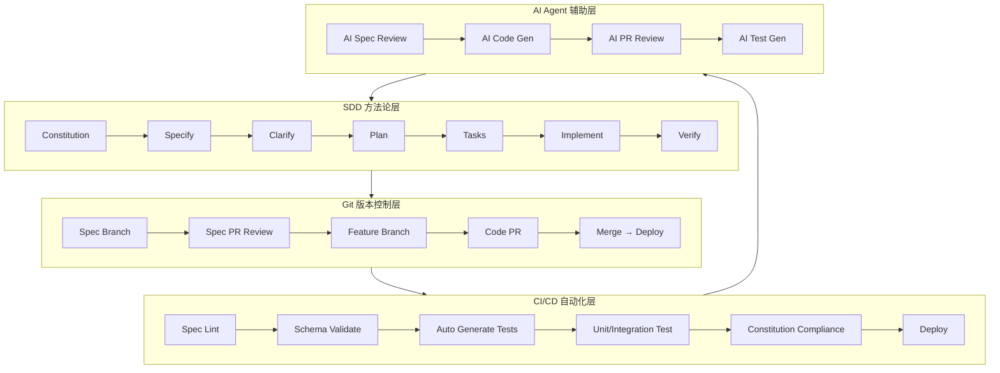
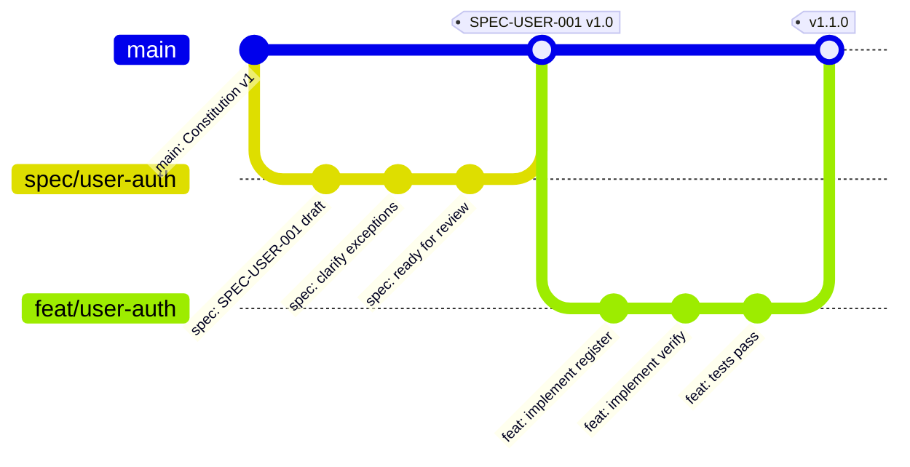
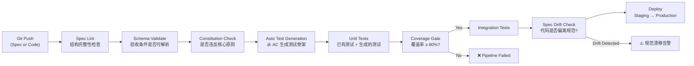
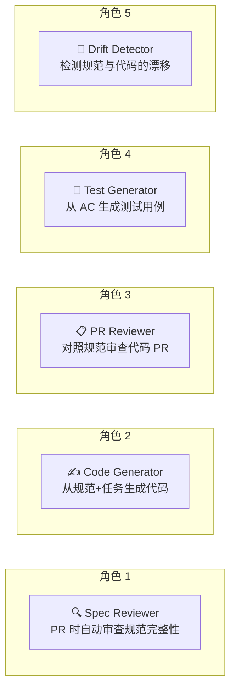
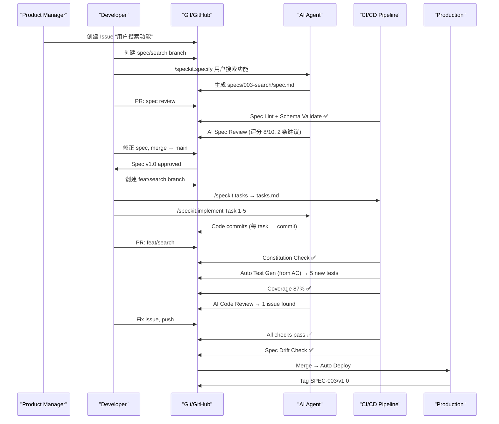

# SDD + Git + CI/CD + AI 四位一体工作流

本教程讲解如何将 SDD 方法论嵌入 Git 工作流，通过 CI/CD 自动化验证，并由 AI Agent 在关键节点辅助——形成规范驱动的全自动研发流水线。

---

## 1. 四位一体全景



> 四个层次环环相扣：SDD 产出规范，Git 管理规范的版本和协作，CI/CD 自动化规范的验证和部署，AI 在关键节点提效。

---

## 2. Git 工作流：规范的版本管理

### 2.1 Spec Branch 策略

SDD 项目中的 Git 分支模型：



**核心规则**：

| 分支类型 | 命名规范 | 生命周期 | 产物 |
|----------|----------|----------|------|
| Spec Branch | `spec/<feature-slug>` | 规范草稿 → 评审 → 批准 → 合并后删除 | spec.md |
| Feature Branch | `feat/<feature-slug>` | 规范批准后才创建 | 代码实现 |
| Fix Branch | `fix/<issue-id>` | 发现 spec 漂移时创建 | 规范修正 + 代码修正 |

> **关键约束**：Feature Branch 必须在 Spec Branch 合并后才能创建。实现之前，规范必须先落地。这是 SDD 的硬门禁。

### 2.2 Spec PR 评审

规范评审 PR 的模板（`.github/PULL_REQUEST_TEMPLATE/spec-review.md`）：

```markdown
## 规范评审清单

### 完整性
- [ ] 用户故事覆盖所有功能入口
- [ ] 验收条件可被自动化测试
- [ ] 异常场景 ≥ 5 个
- [ ] 非功能需求明确（性能/安全/可用性）

### 清晰性
- [ ] 无模糊形容词（"快" → 具体数字）
- [ ] 输入/输出有精确 Schema
- [ ] "不做什么"明确标注

### 合规性
- [ ] 符合 Constitution 核心原则
- [ ] 依赖的前置规范已完成
- [ ] 无安全红线违规

### AI 辅助审查
- [ ] AI Review 已通过（见下方 bot comment）
- [ ] AI 提出的澄清问题已在 spec 中修正
```

### 2.3 规范版本化

采用语义化版本管理规范：

```
SPEC-USER-001 v1.0.0  →  初始版本
SPEC-USER-001 v1.1.0  →  新增 OAuth 登录验收条件（MINOR）
SPEC-USER-001 v2.0.0  →  重写用户模型，不向后兼容（MAJOR）
```

```bash
# Git tag 与 Spec 版本对应
git tag -a spec/SPEC-USER-001/v1.0.0 -m "用户注册规范 v1.0，已批准"
git tag -a spec/SPEC-USER-001/v1.1.0 -m "新增 OAuth 支持"
```

---

## 3. CI/CD 自动化：从规范到部署

### 3.1 完整的 SDD CI/CD Pipeline



### 3.2 GitHub Actions 实现

````yaml
# .github/workflows/sdd-pipeline.yml
name: SDD Pipeline

on:
  push:
    branches: [main, "spec/**", "feat/**"]
  pull_request:
    branches: [main]

jobs:
  # ========== Stage 1: 规范校验 ==========
  spec-lint:
    name: "Spec Lint & Validate"
    runs-on: ubuntu-latest
    steps:
      - uses: actions/checkout@v4

      - name: Check Spec Structure
        run: |
          #! /bin/bash
          # 检查 specs/ 下的规范文件结构完整性
          for spec in specs/*/spec.md; do
            echo "🔍 检查 $spec"

            # 必须有"用户故事"章节
            grep -q "## 用户故事" "$spec" || {
              echo "❌ $spec: 缺少「用户故事」章节"
              exit 1
            }

            # 必须有验收条件（Given-When-Then）
            grep -qE "Given.*When.*Then" "$spec" || {
              echo "❌ $spec: 缺少 Given-When-Then 验收条件"
              exit 1
            }

            # 必须有异常场景
            grep -q "异常场景\|边界条件" "$spec" || {
              echo "⚠️  $spec: 建议添加异常场景章节"
            }

            echo "✅ $spec 结构检查通过"
          done

      - name: Validate Acceptance Criteria
        run: |
          #! /bin/bash
          # 验证验收条件是否可以被解析为测试（检查 Given-When-Then 格式）
          python3 .github/scripts/validate_ac.py specs/

  # ========== Stage 2: Constitution 合规检查 ==========
  constitution-check:
    name: "Constitution Compliance"
    runs-on: ubuntu-latest
    needs: spec-lint
    steps:
      - uses: actions/checkout@v4

      - name: Check Against Constitution
        run: |
          #! /bin/bash
          # 从 .specify/memory/constitution.md 提取核心原则
          # 检查代码中是否有违规模式

          # 示例：检查是否使用了被禁止的 print() 调试
          if grep -rn "print(" --include="*.py" src/ | grep -v "#.*print"; then
            echo "❌ 违反 Constitution: 禁止使用 print()，请使用 logging"
            exit 1
          fi

          # 示例：检查是否 hardcode 了配置
          if grep -rn "http://\|https://" --include="*.py" src/ | grep -v "CONFIG\|config\|\.env"; then
            echo "⚠️  可能存在 hardcode URL，请确认是否应使用环境变量"
          fi

          echo "✅ Constitution 合规检查通过"

  # ========== Stage 3: AI 辅助代码审查 ==========
  ai-code-review:
    name: "AI Code Review"
    runs-on: ubuntu-latest
    needs: constitution-check
    if: github.event_name == 'pull_request'
    steps:
      - uses: actions/checkout@v4

      - name: AI Spec-Code Diff Review
        uses: anthropics/claude-code-action@v1
        with:
          prompt: |
            你是一个 SDD 代码审查 Agent。请完成以下任务：

            1. 根据当前 PR 关联的 Spec（见 specs/ 目录），逐条对照验收条件检查实现
            2. 列出：已实现的验收条件、未实现的验收条件、超出规范范围的额外实现
            3. 检查异常场景是否全部有对应的错误处理代码
            4. 检查 Constitution 合规性

            输出格式：
            ```markdown
            ## SDD Review Report

            ### ✅ 已满足的验收条件 (3/5)
            - AC-01: 用户注册成功 — 已实现
            - AC-02: 邮箱已存在处理 — 已实现
            - AC-03: 密码强度校验 — 已实现

            ### ❌ 未满足的验收条件 (2/5)
            - AC-04: 验证码过期处理 — 缺少 TTL 检查逻辑
            - AC-05: 用户名重复处理 — 仅在 client 侧校验，server 侧缺失

            ### ⚠️ 超出规范范围的实现
            - src/middleware/rate_limit.py — 规范中未要求限流，考虑更新 SPEC-USER-001

            ### 📋 Constitution 合规性
            - ✅ Type Hints 完整
            - ✅ 使用 logging 而非 print
            - ❌ src/api/users.py:42 — hardcode 了 SMTP 服务器地址
            ```

      - name: Post Review Comment
        uses: actions/github-script@v7
        with:
          script: |
            const fs = require('fs');
            const report = fs.readFileSync('sdd-review.md', 'utf8');
            github.rest.issues.createComment({
              issue_number: context.issue.number,
              owner: context.repo.owner,
              repo: context.repo.repo,
              body: report
            });

  # ========== Stage 4: 自动化测试生成 ==========
  auto-test-gen:
    name: "Auto Generate Tests from Spec"
    runs-on: ubuntu-latest
    needs: ai-code-review
    steps:
      - uses: actions/checkout@v4

      - name: Generate Test Skeletons
        run: |
          #! /bin/bash
          # 从规范中的验收条件自动生成测试骨架
          python3 .github/scripts/gen_tests_from_spec.py \
            --spec-dir specs/ \
            --output tests/generated/

      - name: Run Generated Tests
        run: |
          pytest tests/generated/ -v --tb=short

  # ========== Stage 5: 规范漂移检测 ==========
  spec-drift-check:
    name: "Spec Drift Detection"
    runs-on: ubuntu-latest
    needs: auto-test-gen
    steps:
      - uses: actions/checkout@v4

      - name: Detect Spec Drift
        run: |
          #! /bin/bash
          # 规范漂移检测：
          # 1. 检查代码中 @spec 注释引用的规范版本是否最新
          # 2. 检查是否有代码变更但没有对应规范变更

          # 提取代码中的 @spec 引用
          echo "📋 代码中的规范引用:"
          grep -rn "@spec:" --include="*.py" src/ || echo "  (无 @spec 注释)"

          # 检查是否在 feat branch 中有代码变更但没有对应的 spec 变更
          if [ "${{ github.ref_name }}" != "main" ]; then
            CHANGED_FILES=$(git diff --name-only origin/main...HEAD)
            HAS_CODE_CHANGE=$(echo "$CHANGED_FILES" | grep -E "^src/" || true)
            HAS_SPEC_CHANGE=$(echo "$CHANGED_FILES" | grep -E "^specs/" || true)

            if [ -n "$HAS_CODE_CHANGE" ] && [ -z "$HAS_SPEC_CHANGE" ]; then
              echo "⚠️  检测到代码变更但无对应规范变更"
              echo "   请确认：代码变更是否由规范驱动？如果是，请同步更新规范。"
            else
              echo "✅ 规范与代码同步变更"
            fi
          fi

  # ========== Stage 6: 部署 ==========
  deploy:
    name: "Deploy"
    runs-on: ubuntu-latest
    needs: spec-drift-check
    if: github.ref == 'refs/heads/main'
    steps:
      - name: Deploy to Staging
        run: echo "🚀 Deploying to staging..."

      - name: Smoke Test
        run: echo "🔍 Running smoke tests..."

      - name: Deploy to Production
        run: echo "🚀 Deploying to production..."

      - name: Tag Spec Version
        run: |
          SPEC_VERSION=$(cat specs/current-version.txt)
          git tag -a "release/$SPEC_VERSION" -m "Release $SPEC_VERSION"
          git push origin "release/$SPEC_VERSION"
````

### 3.3 关键脚本

**验收条件解析与测试生成**（`.github/scripts/gen_tests_from_spec.py`）：

```python
"""从规范中的 Given-When-Then 验收条件自动生成 pytest 测试骨架。"""
import re
import sys
from pathlib import Path

def parse_ac_from_spec(spec_path: str) -> list[dict]:
    """解析规范文件中的验收条件。"""
    content = Path(spec_path).read_text()

    # 匹配 Given-When-Then 模式
    pattern = r'### AC-\d+：(.+?)\n- \*\*Given\*\* (.+?)\n- \*\*When\*\* (.+?)\n- \*\*Then\*\* (.+?)(?=\n\n|\n###|\Z)'
    matches = re.findall(pattern, content, re.DOTALL)

    ac_list = []
    for title, given, when, then_ in matches:
        ac_list.append({
            "title": title.strip(),
            "given": given.strip(),
            "when": when.strip(),
            "then": then_.strip(),
        })
    return ac_list


def gen_test_template(ac: dict, index: int) -> str:
    """从验收条件生成 pytest 测试函数。"""
    func_name = f'test_ac{index:02d}_{ac["title"].replace(" ", "_").replace("：", "")}'

    return f'''
def {func_name}(client, db_session):
    """AC-{index:02d}: {ac["title"]}"""
    # Given: {ac["given"]}
    # TODO: 设置前置条件
    # setup_test_data(db_session, ...)

    # When: {ac["when"]}
    # TODO: 触发测试动作
    # response = client.post("/api/...", json={{...}})

    # Then: {ac["then"]}
    # TODO: 验证预期结果
    # assert response.status_code == 200
    # assert response.json()["message"] == "..."

    pass  # TODO: 根据验收条件实现测试
'''


def main():
    spec_dir = Path(sys.argv[1]) if len(sys.argv) > 1 else Path("specs")
    output_dir = Path(sys.argv[2]) if len(sys.argv) > 2 else Path("tests/generated")

    output_dir.mkdir(parents=True, exist_ok=True)

    for spec_file in spec_dir.glob("*/spec.md"):
        ac_list = parse_ac_from_spec(str(spec_file))
        if not ac_list:
            print(f"⚠️  {spec_file}: 未找到 Given-When-Then 验收条件")
            continue

        # 生成测试文件
        test_content = [
            '"""自动生成的测试——来源规范，待人工补充实现。"""',
            'import pytest',
            '',
        ]

        for i, ac in enumerate(ac_list, 1):
            test_content.append(gen_test_template(ac, i))

        test_file = output_dir / f"test_{spec_file.parent.name}.py"
        test_file.write_text("\n".join(test_content))
        print(f"✅ 已生成 {len(ac_list)} 个测试骨架 → {test_file}")


if __name__ == "__main__":
    main()
```

---

## 4. AI Agent 集成点

### 4.1 AI 在 SDD 流水线中的五个角色



### 4.2 Claude Code 集成示例

在 Claude Code 项目中配置 Hooks 实现 AI 辅助 SDD 流水线：

```json
{
  "hooks": {
    "PreCommit": [
      {
        "matcher": "specs/**/*.md",
        "command": "claude -p '检查这个 Spec 文件的结构完整性。必须包含：用户故事、Given-When-Then 验收条件、异常场景 ≥ 3 个。输出 PASS 或 FAIL + 缺失项列表。' {files}"
      }
    ],
    "PostPRCreate": [
      {
        "matcher": "feat/**",
        "command": "claude -p '你是 SDD 审查员。对照 specs/ 中的关联规范审查这个 PR。列出：已满足的 AC、未满足的 AC、规范外实现。输出审查报告。'"
      }
    ]
  }
}
```

### 4.3 GitHub Actions 中的 AI 工作流

```yaml
# .github/workflows/ai-sdd-assist.yml
name: AI SDD Assistant

on:
  pull_request:
    types: [opened, synchronize]
  issues:
    types: [opened, labeled]

jobs:
  ai-spec-review:
    name: "AI Spec Review"
    if: contains(github.event.pull_request.labels.*.name, 'spec-review')
    runs-on: ubuntu-latest
    steps:
      - uses: actions/checkout@v4

      - name: Claude Spec Review
        uses: anthropics/claude-code-action@v1
        env:
          ANTHROPIC_API_KEY: ${{ secrets.ANTHROPIC_API_KEY }}
        with:
          prompt: |
            审查以下规范文件的质量：

            1. 用户故事是否清晰（角色+动作+价值）？
            2. 验收条件是否有 Given-When-Then 且可被测试？
            3. 异常场景覆盖是否充分（至少 5 个）？
            4. 是否存在模糊描述（"快"、"稳定"等不可验证的词）？
            5. 是否与 Constitution 冲突？

            输出量化评分（1-10）和改进建议。

      - name: Post Review
        uses: actions/github-script@v7
        with:
          script: |
            const report = require('fs').readFileSync('spec-review-report.md', 'utf8');
            await github.rest.issues.createComment({
              issue_number: context.issue.number,
              owner: context.repo.owner,
              repo: context.repo.repo,
              body: `## 🤖 AI Spec Review\n\n${report}`
            });
```

---

## 5. 规范漂移管理

### 5.1 什么是规范漂移

规范漂移（Spec Drift）是指代码实现逐渐偏离规范的现象。典型信号：

- 代码中有 `@spec:` 注释但引用的规范版本已过期
- Feature Branch 中有代码变更但没有对应的 Spec 变更
- PR Review 发现"超出规范范围的实现"
- 测试用例与验收条件不一一对应

### 5.2 漂移检测脚本

```python
# .github/scripts/detect_spec_drift.py
"""检测规范漂移。"""
import subprocess
import sys
from pathlib import Path

def get_changed_files(base_branch: str = "origin/main") -> set:
    """获取相对于 base 的变更文件。"""
    result = subprocess.run(
        ["git", "diff", "--name-only", f"{base_branch}...HEAD"],
        capture_output=True, text=True
    )
    return set(result.stdout.strip().split("\n"))

def check_spec_drift():
    changed = get_changed_files()

    code_changes = {f for f in changed if f.startswith("src/")}
    spec_changes = {f for f in changed if f.startswith("specs/")}

    issues = []

    # 规则 1：代码变更必须有对应规范变更
    if code_changes and not spec_changes:
        issues.append(
            "❌ 检测到代码变更但无规范变更。\n"
            f"   代码变更: {len(code_changes)} 个文件\n"
            "   请确认这些变更是否由规范驱动？如果是，请同步更新规范。"
        )

    # 规则 2：检查 @spec 注释引用的规范版本
    for py_file in Path("src").glob("**/*.py"):
        content = py_file.read_text()
        for line in content.split("\n"):
            if "@spec:" in line:
                # 提取规范引用
                ref = line.split("@spec:")[1].strip()
                if "v" not in ref:
                    issues.append(
                        f"⚠️  {py_file}:{line[:50]}... — "
                        f"@spec 引用缺少版本号 ({ref})"
                    )

    if issues:
        print("\n\n".join(issues))
        return 1
    else:
        print("✅ 未检测到规范漂移")
        return 0

if __name__ == "__main__":
    sys.exit(check_spec_drift())
```

### 5.3 漂移处理策略

| 漂移类型 | 处理方式 | 由谁处理 |
|----------|----------|----------|
| 规范不完整（实现中发现遗漏） | 回写规范 → 增量 PR | 开发者 + AI Assist |
| 过度实现（超出规范范围） | 删除多余代码 OR 扩展规范 | Tech Lead 决策 |
| 规范过期（业务需求变更后规范未更新） | 以代码为准先上线，Sprint 结束前回写规范 | 开发者 |
| Constitution 冲突 | 立即修复，不允许合并 | CI 门禁阻断 |

---

## 6. 端到端流程：一个功能的全生命周期

以"用户搜索"功能为例，展示 SDD + Git + CI/CD + AI 的完整协作：



---

## 7. 最佳实践清单

### Git 层面
- [ ] Spec Branch 先于 Feature Branch 创建
- [ ] Feature Branch 合并前必须有对应的 Spec merge
- [ ] 使用 Git tag 绑定 Spec 版本与 Release 版本
- [ ] PR 模板区分 Spec PR 和 Code PR

### CI/CD 层面
- [ ] Spec Lint 作为第一道门禁（检查结构完整性）
- [ ] Constitution Compliance 在每次 Push 时自动运行
- [ ] 规范漂移检测在每次 PR 时执行
- [ ] 从 AC 自动生成测试骨架，人工补充实现
- [ ] 覆盖率门禁 ≥ 80%（按 Constitution 定义）

### AI 层面
- [ ] AI Spec Review 在 Spec PR 时自动触发
- [ ] AI Code Review 对照规范逐 AC 检查
- [ ] AI 生成的审查报告标注"AI Generated"，人工最终确认
- [ ] AI 不自动修改 Spec（只提建议），人工审批决定

### 团队层面
- [ ] 每 Sprint 结束时做一次全量 Spec Drift Audit
- [ ] 规范质量纳入 Code Review 的评价维度
- [ ] 新人入职第一周：读 Constitution → 读 Spec → 读代码（这个顺序）
- [ ] 定期回顾 Constitution 是否仍然适用（每季度一次）

---

## 8. 故障演练

模拟常见故障场景及其自动恢复：

| 故障场景 | CI/CD 行为 | 恢复方式 |
|----------|-----------|----------|
| Spec 缺少异常场景 | Spec Lint ⚠️ Warning | 补充异常场景后 re-push |
| 代码中 hardcode 了 URL | Constitution Check ❌ Fail | 改为环境变量后 re-push |
| Feature 变更无对应 Spec 变更 | Drift Check ❌ Fail | 回写 Spec 或补充 Spec PR |
| AI Review 发现未实现的 AC | PR Blocked ⚠️ | 补充实现或在 Spec 中标记为下阶段 |
| 测试覆盖率不足 | Coverage Gate ❌ Fail | 补充测试后 re-push |

---

## 9. 小结

SDD + Git + CI/CD + AI 四位一体的核心价值：

1. **可追溯**：从 Git commit → Spec 章节 → 验收条件 → 测试用例，完整追溯链
2. **自动化**：Spec 合规则性检查、Constitution 合规、测试生成、漂移检测全部自动化
3. **AI 增强**：AI 在审查、生成、检测三个环节提效，但人工始终掌握最终决策权
4. **门禁式质量**：每一步都有明确的门禁规则，不符合规范的代码无法合并

> 这套工作流的最终目标不是"更快的交付"，而是**"信得过的交付"**——每次合并到 main 的代码，都有完整的规范、自动化验证和 AI 审查作为支撑。

---

## 相关资源

- [GitHub Spec Kit](https://github.com/github/spec-kit) — 规范管理 CLI 工具
- [sdd-flow](https://github.com/nushey/sdd-flow) — Claude Code SDD 插件
- [Conventional Commits](https://www.conventionalcommits.org/) — Git commit 规范
- [Claude Code Hooks](https://docs.anthropic.com/en/docs/claude-code/hooks) — AI 流水线集成
