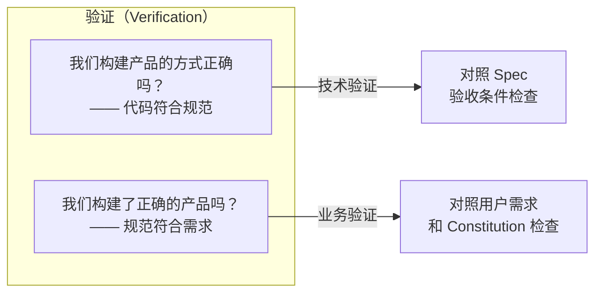
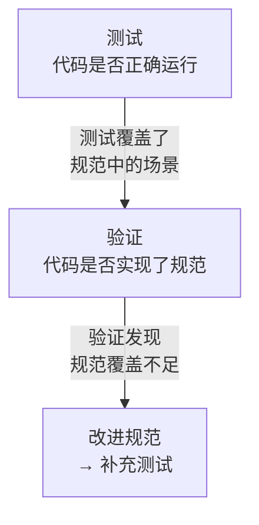
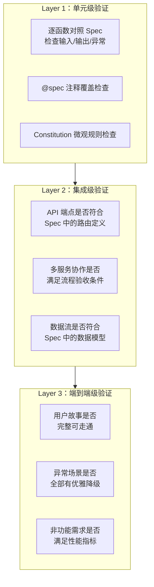
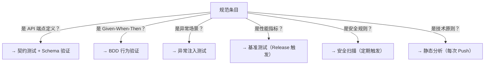
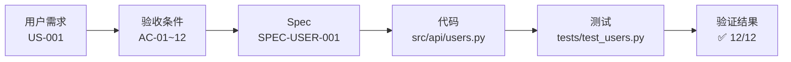
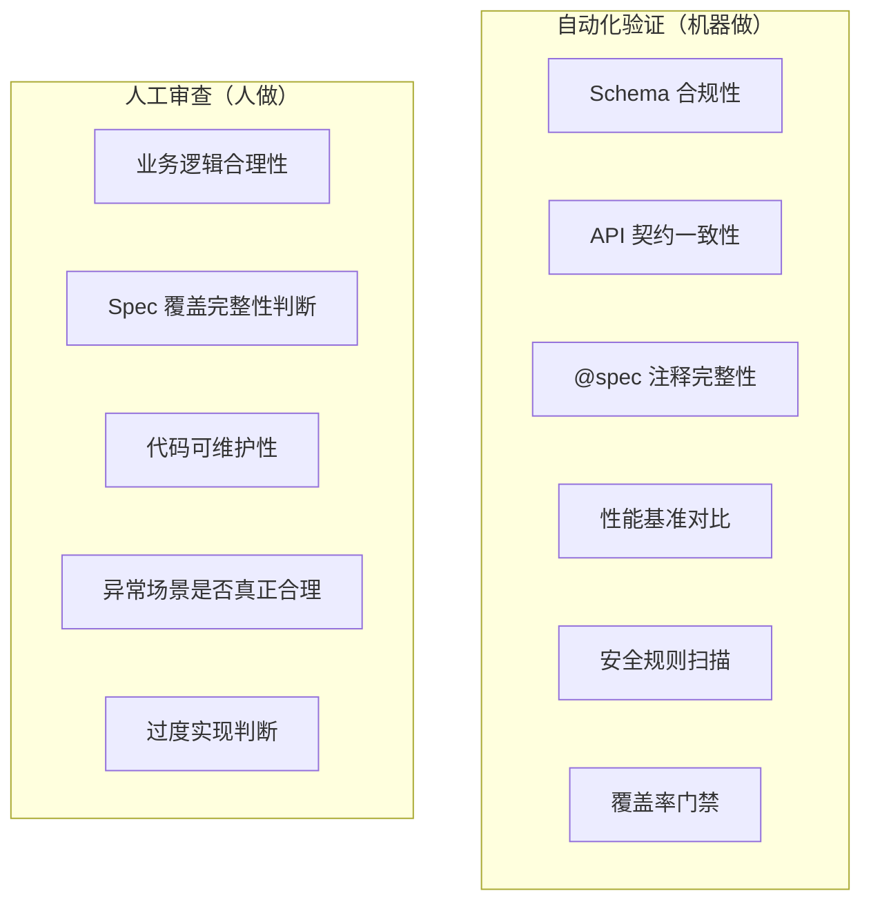
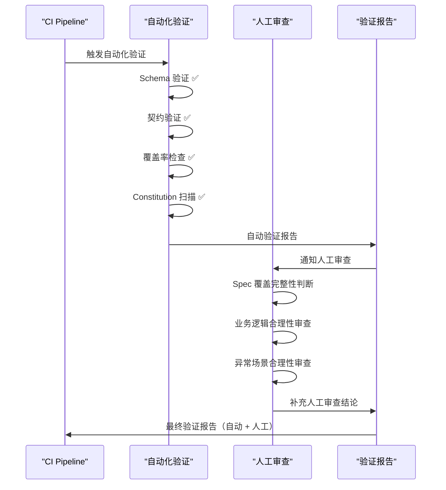
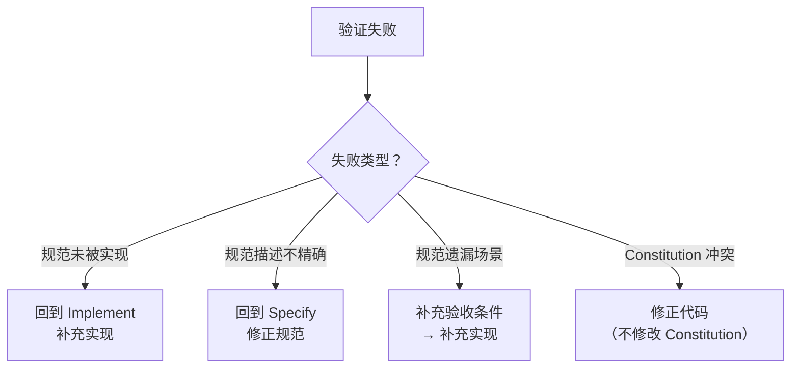

# 基于规范的验证策略

Verify 是 SDD 工作流的最后一道关卡——确保"我们构建了正确的产品，并且构建正确"。本章讲解 SDD 中验证的含义、验证层次、验证与测试的区别，以及如何构建基于规范的验证策略。

---

## 1. SDD 中的验证是什么

### 1.1 验证的双重含义

SDD 中"验证"包含两个维度的检查：



> **SDD 的验证重心在技术验证**——即代码是否与规范一致。业务验证通常发生在 Specify 和 Clarify 阶段（通过 Spec Review 完成），Verify 阶段做最终确认。

### 1.2 验证 vs 测试

这是 SDD 中最容易被混淆的两个概念：

| 维度 | 测试（Testing） | 验证（Verification） |
|------|----------------|---------------------|
| 核心问题 | 代码有 Bug 吗？ | 代码按规范实现了吗？ |
| 参照物 | 测试用例 | 规范文档（Spec.md） |
| 覆盖范围 | 技术正确性 | 功能完整性 + 行为一致性 |
| 执行方式 | 运行测试套件 | 对照规范逐条审查 |
| 失败含义 | 代码逻辑错误 | 实现偏离规范 |
| 工具 | pytest / JUnit / Postman | 人工审查 / Spec 对照脚本 / CI 合规检查 |

**两者关系**：



> 测试和验证是互补的，不是替代关系。测试通过不代表验证通过——代码可能"正确运行"但没有实现规范要求的全部行为。

---

## 2. 验证层次

### 2.1 三层验证模型



### 2.2 各层验证的具体方法

| 验证层次 | 验证方法 | 验证对象 | 自动化程度 |
|----------|----------|----------|-----------|
| **单元级** | 代码审查 + @spec 注释扫描 | 单个函数/类 | 半自动（扫描自动，审查人工） |
| **集成级** | API 契约测试 + 行为一致性检查 | API 端点/模块交互 | 高度自动化 |
| **端到端级** | 用户故事走查 + NFR 验证 | 完整功能流程 | 混合（走查人工，指标自动） |

### 2.3 单元级验证示例

从 Spec 验收条件到代码验证：

```markdown
Spec 原文（SPEC-USER-001 §3.2）：
### AC-02：邮箱重复注册处理
- Given 邮箱 user@example.com 已注册
- When 使用相同邮箱调用 POST /register
- Then 返回 409 {code: 409, data: null, message: "邮箱已注册"}
```

对应验证脚本：

```python
# tests/verification/test_spec_compliance.py
"""规范合规性验证——确认代码行为与规范一致。"""
import pytest
from httpx import AsyncClient

@pytest.mark.spec("SPEC-USER-001", "AC-02")
async def test_AC02_duplicate_email_returns_409(
    client: AsyncClient, registered_user
):
    """验证 AC-02：邮件重复注册返回 409 及规范定义的错误格式。"""
    # Given：已通过 fixture 创建注册用户
    duplicate_payload = {
        "email": registered_user["email"],
        "password": "ValidPass123!",
        "name": "Another User"
    }

    # When：使用相同邮箱再次注册
    response = await client.post("/api/register", json=duplicate_payload)

    # Then：验证返回结果完全符合 Spec 定义
    assert response.status_code == 409
    body = response.json()
    assert body["code"] == 409
    assert body["data"] is None
    assert "邮箱已注册" in body["message"]
```

> 注意：这既是测试，也是验证。区别在于——它的预期值直接来源于 Spec 原文，而非开发者猜测。**每个断言都可以在 Spec 中找到对应描述**。

---

## 3. 按规范类型构建验证策略矩阵

### 3.1 策略矩阵

不同规范内容需要不同的验证策略：

| 规范内容类型 | 验证策略 | 自动化工具 | 验证频率 |
|-------------|----------|-----------|----------|
| API 输入/输出 Schema | 契约测试 + JSON Schema 验证 | Schemathesis / Dredd | 每次 PR |
| 验收条件（Given-When-Then） | BDD 行为验证 | pytest-bdd / Behave | 每次 PR |
| 异常场景 | 异常注入测试 | pytest + 自定义 fixtures | 每次 PR |
| 非功能需求（性能） | 基准测试 + 负载测试 | Locust / k6 | 每次 Release |
| 非功能需求（安全） | 安全扫描 + 渗透测试 | Bandit / OWASP ZAP | 每周 |
| Constitution 合规 | 静态分析 + 自定义规则 | Pylint / ESLint / 自研 | 每次 Push |
| 数据模型 | Schema 对比 | Alembic autogenerate diff | 每次 PR |

### 3.2 策略选择决策树



---

## 4. 验证结果的记录与可追溯性

### 4.1 验证记录模板

每次验证完成后，应在规范文件中记录验证结果：

```markdown
## 验证记录

| 版本 | 验证日期 | 验证范围 | 结果 | 验证人 | 备注 |
|------|----------|----------|------|--------|------|
| v1.0.0 | 2026-01-20 | 全部 AC (01-12) | ✅ 12/12 通过 | 张三 | 首次实现验证 |
| v1.0.1 | 2026-02-01 | AC-03, AC-07 (受影响) | ✅ 2/2 通过 | 李四 | Bug #1423 修复后回验 |
| v1.1.0 | 2026-02-15 | AC-13~16 (新增) | ⚠️ 3/4 通过 | 张三 | AC-16 需补充测试 |

### AC 验证状态矩阵

| AC 编号 | 单元验证 | 集成验证 | E2E 验证 | 总体状态 |
|---------|---------|---------|---------|---------|
| AC-01 | ✅ | ✅ | ✅ | 🟢 通过 |
| AC-02 | ✅ | ✅ | ✅ | 🟢 通过 |
| AC-03 | ✅ | ✅ | ⚠️ 未覆盖 | 🟡 部分通过 |
```

### 4.2 可追溯链

从需求到验证结果的完整追溯链：



每个节点都可以独立定位和更新。

---

## 5. 自动化验证 vs 人工审查的边界

### 5.1 分工原则



### 5.2 边界判定标准

| 验证内容 | 自动化？ | 理由 |
|----------|---------|------|
| API 返回的 JSON 字段是否与 Spec 一致 | ✅ 自动化 | 结构化对比，规则明确 |
| 异常场景的错误码是否正确 | ✅ 自动化 | 可穷举的状态码校验 |
| 性能是否满足 P95 < 200ms | ✅ 自动化 | 可量化指标 |
| "过度实现"是否合理 | ❌ 人工 | 需要业务判断 |
| 代码架构是否清晰 | ❌ 人工 | 质量标准主观 |
| Spec 是否遗漏了重要场景 | ❌ 人工 | 需要领域知识 |
| 生成的错误消息是否对用户友好 | ❌ 人工 | 语言质量主观 |

> **规则**：可量化、可穷举、规则明确的 → 自动化。需要判断、需要领域知识、主观性的 → 人工审查。

### 5.3 混合验证流程



---

## 6. 验证失败的处理流程

### 6.1 分类处理



### 6.2 验证阻断规则

| 验证失败类型 | 是否阻断合并 | 谁决定 |
|-------------|------------|--------|
| Constitution 违反 | 🔴 阻断 | CI 自动阻断 |
| 验收条件未实现 | 🔴 阻断 | CI 自动阻断 |
| 覆盖率不足 | 🔴 阻断 | CI 自动阻断（门禁值） |
| 性能退化 | 🟡 警告 | Tech Lead 决策 |
| @spec 注释缺失 | 🟡 警告 | 开发者自行补充 |

---

## 7. 小结

- SDD 的验证重在对规范的一致性检查，测试重在技术正确性——两者互补
- 三层验证模型（单元 → 集成 → E2E）覆盖从微观到宏观的规范一致性
- 验证策略按规范内容类型差异化选择，API Schema 用契约测试，AC 用 BDD，NFR 用基准测试
- 验证结果必须记录在规范文件中，形成从需求→Spec→代码→验证结果的完整追溯链
- 自动化验证覆盖可量化、可穷举的检查项，人工审查处理需要判断的领域
- 验证失败时，修复方向可能是补充实现、修正规范或两者兼有

---

## 下一步

阅读 [03-自动化测试生成](03-自动化测试生成.md) 了解如何从规范的验收条件中自动生成测试用例。
