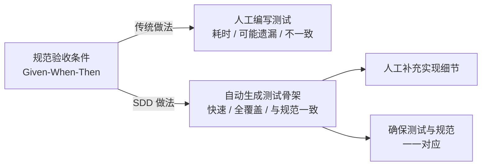
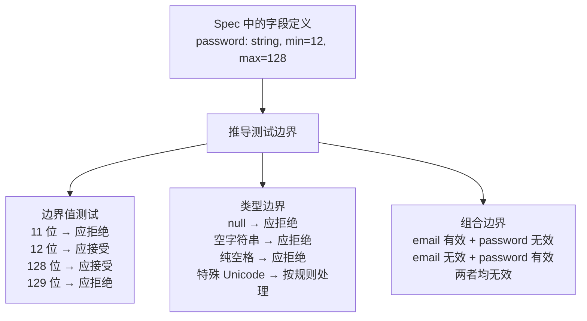
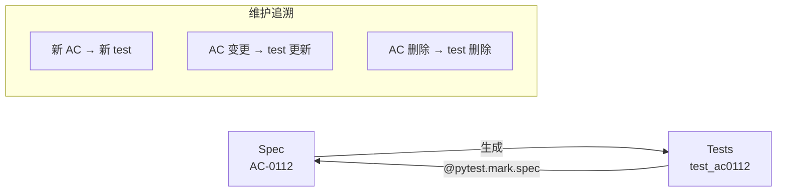

# 自动化测试生成

SDD 的核心优势之一是规范的验收条件（AC）可以直接转换为测试用例。本章讲解如何从规范自动生成测试骨架、覆盖边界条件与异常场景，以及 AI 生成测试的审查要点。

---

## 1. 从规范到测试：自动化生成的价值

### 1.1 为什么自动化



核心价值：
- **一致性**：测试结构直接来源于规范，消除了"测试与需求不一致"的问题
- **完整性**：规范的每个 AC 都有对应测试，不遗漏
- **效率**：测试骨架自动生成，开发者只需补充具体的测试实现逻辑

### 1.2 生成能力矩阵

| 规范内容 | 可自动生成 | 需人工补充 |
|----------|-----------|-----------|
| AC 的 Given 部分（前置条件） | ✅ fixture 骨架 | 具体的数据准备逻辑 |
| AC 的 When 部分（触发动作） | ✅ API 调用骨架 | 请求参数构造 |
| AC 的 Then 部分（预期结果） | ✅ 断言骨架 | 精确的断言值 |
| API 输入/输出 Schema | ✅ Pydantic 校验 | 自定义校验规则 |
| 正常流程 | ✅ | — |
| 异常场景 | ✅ 异常测试骨架 | 异常触发条件构造 |
| 边界条件 | ⚠️ 需手动标注 | 边界值选择 |

---

## 2. 从验收条件生成测试骨架

### 2.1 解析 AC 结构

SDD 规范中的验收条件采用 Given-When-Then 格式，天然适合转换为测试：

```markdown
规范中的验收条件：
### AC-03：密码强度校验
- **Given** 系统密码策略要求最少 12 位，包含大小写字母、数字和特殊字符
- **When** 用户提交密码 "weak"
- **Then** 返回 422 {code: 422, message: "密码不符合安全要求"}
```

对应的生成模板：

```python
# 自动生成 + 人工补充的测试
@pytest.mark.spec("SPEC-USER-001", "AC-03")
class TestAC03PasswordStrengthValidation:
    """AC-03：密码强度校验"""

    def test_password_too_short(self, client):
        """Given 密码策略要求 ≥ 12 位
           When 提交 8 位密码
           Then 返回 422"""
        payload = {"email": "test@example.com", "password": "Short1!", "name": "Test"}
        response = client.post("/api/register", json=payload)
        assert response.status_code == 422
        body = response.json()
        assert body["code"] == 422
        assert "密码" in body["message"]

    def test_password_missing_uppercase(self, client):
        """Given 密码策略要求包含大写字母
           When 提交全小写密码
           Then 返回 422"""
        payload = {"email": "test@example.com", "password": "nouppercase1!", "name": "Test"}
        response = client.post("/api/register", json=payload)
        assert response.status_code == 422

    def test_password_meets_all_requirements(self, client, db_session):
        """Given 密码满足所有策略要求
           When 提交符合要求的密码
           Then 返回 201 注册成功"""
        payload = {"email": "new@example.com", "password": "ValidPass123!", "name": "Test"}
        response = client.post("/api/register", json=payload)
        assert response.status_code == 201
```

### 2.2 生成脚本实现

```python
# scripts/gen_tests_from_spec.py
"""从规范文件中的 Given-When-Then 验收条件生成 pytest 测试骨架。"""
import re
from pathlib import Path
from typing import NamedTuple

class AcceptanceCriteria(NamedTuple):
    ac_id: str
    title: str
    given: str
    when: str
    then: str

def parse_ac_from_spec(spec_content: str) -> list[AcceptanceCriteria]:
    """从规范 Markdown 中解析所有验收条件。"""
    pattern = (
        r'###\s+(AC-\d+)[：:]\s*(.+?)\n'
        r'-\s*\*\*Given\*\*\s*(.+?)\n'
        r'-\s*\*\*When\*\*\s*(.+?)\n'
        r'-\s*\*\*Then\*\*\s*(.+?)(?=\n\n|\n###|\Z)'
    )
    matches = re.findall(pattern, spec_content, re.DOTALL)
    return [
        AcceptanceCriteria(
            ac_id=m[0].strip(),
            title=m[1].strip(),
            given=m[2].strip(),
            when=m[3].strip(),
            then=m[4].strip(),
        )
        for m in matches
    ]

def generate_test_function(ac: AcceptanceCriteria, spec_name: str) -> str:
    """为单个验收条件生成测试函数。"""
    func_suffix = re.sub(r'[^\w]', '_', ac.title)[:50]
    test_name = f"test_{ac.ac_id.replace('-', '').lower()}_{func_suffix}"

    return f'''
    @pytest.mark.spec("{spec_name}", "{ac.ac_id}")
    def {test_name}(self, client, db_session):
        """{ac.ac_id}: {ac.title}

        Given: {ac.given}
        When:  {ac.when}
        Then:  {ac.then}
        """
        # TODO: 实现 Given 前置条件
        # setup_fixture(db_session, ...)

        # TODO: 实现 When 触发动作
        # response = client.post("/api/...", json={{...}})

        # TODO: 实现 Then 断言验证
        # assert response.status_code == XXX
        # assert response.json()["field"] == "expected_value"

        pass  # TODO: 实现测试
'''

def generate_test_file(spec_path: str, output_dir: str) -> str:
    """为一个规范文件生成完整的测试文件。"""
    content = Path(spec_path).read_text(encoding="utf-8")
    ac_list = parse_ac_from_spec(content)

    if not ac_list:
        return f"⚠️  未在 {spec_path} 中找到 Given-When-Then 验收条件"

    spec_name = Path(spec_path).parent.name

    lines = [
        '"""自动生成的测试文件——来源规范，待人工补充实现。"""',
        'import pytest',
        '',
        f'# 来源规范: {spec_name}',
        f'# 生成时间: 自动生成',
        f'# 状态: 骨架代码，需人工补充 TODO 部分',
        '',
        f'class Test{spec_name.replace("-", "").replace("_", "")}:',
        f'    """规范 {spec_name} 的验收条件测试。"""',
        '',
    ]

    for ac in ac_list:
        lines.append(generate_test_function(ac, spec_name))

    test_content = "\n".join(lines)
    output_path = Path(output_dir) / f"test_{spec_name.lower()}.py"
    output_path.parent.mkdir(parents=True, exist_ok=True)
    output_path.write_text(test_content, encoding="utf-8")

    return f"✅ 已生成 {len(ac_list)} 个测试骨架 → {output_path}"


if __name__ == "__main__":
    import sys
    spec_dir = sys.argv[1] if len(sys.argv) > 1 else "specs"
    output_dir = sys.argv[2] if len(sys.argv) > 2 else "tests/generated"

    for spec_file in Path(spec_dir).glob("*/spec.md"):
        result = generate_test_file(str(spec_file), output_dir)
        print(result)
```

---

## 3. 边界条件与异常场景的测试覆盖

### 3.1 SDD 中边界条件的来源

边界条件不总是写在规范中——它们往往需要从规范推导：



### 3.2 边界条件测试生成策略

| 边界类型 | 生成规则 | 示例 |
|----------|----------|------|
| **数值边界** | min-1, min, max, max+1 | 密码长度 11, 12, 128, 129 |
| **空值边界** | null, "", [], {} | email 为空时拒绝 |
| **类型边界** | 错误类型注入 | email 传 int 类型 |
| **集合边界** | 空集, 单元素, 大集合 | 批量注册：0个, 1个, 1000个 |
| **时间边界** | 过去, 现在, 未来 | Token 已过期, 即将过期, 有效期中间 |
| **状态边界** | 所有枚举值 + 无效值 | status=active, inactive, deleted, invalid_status |

### 3.3 异常场景的测试生成

```python
# 从 Spec 异常场景章节自动生成的异常测试
class TestRegistrationExceptionScenarios:
    """SPEC-USER-001 §4 异常场景测试"""

    # 自动从 §4.1 生成
    @pytest.mark.spec("SPEC-USER-001", "EXC-01")
    def test_missing_required_fields(self, client):
        """异常场景：缺少必填字段"""
        # 测试三个必填字段分别缺失
        for missing in ["email", "password", "name"]:
            payload = {"email": "test@test.com", "password": "Valid1!", "name": "Test"}
            del payload[missing]
            response = client.post("/api/register", json=payload)
            assert response.status_code == 422

    # 自动从 §4.2 生成
    @pytest.mark.spec("SPEC-USER-001", "EXC-02")
    def test_sql_injection_in_email(self, client):
        """异常场景：SQL 注入尝试"""
        payload = {
            "email": "test@test.com' OR '1'='1",
            "password": "ValidPass123!",
            "name": "Test"
        }
        response = client.post("/api/register", json=payload)
        assert response.status_code == 422  # 应被 Pydantic 拒绝
```

---

## 4. GitHub Spec Kit 测试生成能力

### 4.1 Spec Kit 简介

[GitHub Spec Kit](https://github.com/github/spec-kit) 是 GitHub 推出的 SDD 规范管理工具，支持从规范自动生成测试。

```bash
# 安装
npm install -g @github/spec-kit

# 从规范生成测试
spec-kit generate tests \
  --spec specs/user-auth/spec.md \
  --output tests/generated/ \
  --framework pytest \
  --language python
```

### 4.2 Spec Kit 生成示例

```yaml
# .speckit/config.yml
test_generation:
  framework: pytest
  language: python
  templates:
    unit: tests/templates/unit_test.j2
    integration: tests/templates/integration_test.j2
  naming:
    prefix: test_
    suffix: _spec_compliance
  markers:
    - spec_id
    - ac_id
    - priority
```

生成的测试标注了与规范的关联：

```python
# 由 Spec Kit 自动生成
@pytest.mark.spec_id("SPEC-USER-001")
@pytest.mark.ac_id("AC-03")
@pytest.mark.priority("high")
def test_AC03_password_strength_validation_spec_compliance():
    ...
```

### 4.3 与 Claude Code 的集成

```bash
# Claude Code 中使用 SDD 工作流
# /speckit.tests 命令从当前规范生成测试
claude /speckit.tests --spec specs/user-auth/spec.md --output tests/
```

---

## 5. AI 生成测试的审查要点

### 5.1 六个审查维度

```mermaid
flowchart TD
  review["AI 生成的测试"] --> d1["维度 1<br/>AC 覆盖完整性"]
  review --> d2["维度 2<br/>断言精确性"]
  review --> d3["维度 3<br/>边界覆盖"]
  review --> d4["维度 4<br/>Fixture 合理性"]
  review --> d5["维度 5<br/>测试独立性"]
  review --> d6["维度 6<br/>可维护性"]

  d1 --> d1d["每个 AC 都有对应测试？<br/>测试确实验证了 AC 的场景？"]
  d2 --> d2d["断言值与 Spec 一致？<br/>没有"弱断言"（只检查 status_code）"]
  d3 --> d3d["包含了边界值和异常场景？<br/>null/空值/超长值被覆盖？"]
  d4 --> d4d["Fixture 名称清晰？<br/>没有隐式依赖？"]
  d5 --> d5d["测试可以独立运行？<br/>没有测试间的数据污染？"]
  d6 --> d6d["规范变更后测试易于更新？<br/>@spec 标记清晰？"]
```

### 5.2 审查清单

| 检查项 | 标准 | 不通过的修复 |
|--------|------|-------------|
| AC 覆盖率 | 100% AC 有对应测试 | 补充缺失的测试 |
| 断言质量 | 每个 Then 至少有 1 个具体断言 | 补充断言（不只有 `assert True`） |
| 边界值 | 每个有约束的字段至少测 2 个边界 | 补充边界值测试 |
| 异常覆盖 | Spec 中的异常场景都有测试 | 补充异常测试 |
| 命名规范 | `test_AC{编号}_{场景描述}` | 重命名 |
| @spec 标记 | 每个测试函数都有 `@pytest.mark.spec` | 补充标记 |
| Fixture 使用 | fixture 在 conftest.py 中定义 | 提取公共 fixture |

### 5.3 AI 生成测试的常见缺陷

| 缺陷 | 表现 | 修复 |
|------|------|------|
| **弱断言** | 只检查 `status_code == 200`，不检查响应体 | 对照 Spec 补充完整的 Then 断言 |
| **假阳性** | 测试通过但不代表功能正确（如 mock 过度） | 减少 mock 层次，增加集成测试 |
| **遗漏异常** | 只生成正常流程测试，忽略异常场景 | 从 Spec 异常章节补充测试 |
| **硬编码环境** | 测试依赖特定的数据库状态 | 使用 fixture 管理测试数据 |
| **重复代码** | 多个测试的 Given 部分重复 | 提取公共 fixture 和 helper 函数 |

---

## 6. 测试与规范的对应关系维护

### 6.1 双向追溯



### 6.2 测试覆盖报告

```python
# scripts/spec_coverage_report.py
"""生成规范-测试覆盖报告。"""
import re
from pathlib import Path

def generate_coverage_report(spec_dir: str = "specs", test_dir: str = "tests"):
    """对比规范中的 AC 与测试中的 @spec 标记，生成覆盖报告。"""
    # 收集规范中的所有 AC
    spec_ac = {}
    for spec_file in Path(spec_dir).glob("*/spec.md"):
        content = spec_file.read_text()
        ac_ids = re.findall(r'###\s+(AC-\d+)', content)
        spec_name = spec_file.parent.name
        spec_ac[spec_name] = set(ac_ids)

    # 收集测试中的 @spec 标记
    test_ac = {}
    for test_file in Path(test_dir).glob("**/*.py"):
        content = test_file.read_text()
        markers = re.findall(r'@pytest\.mark\.spec\("([^"]+)",\s*"([^"]+)"\)', content)
        for spec_name, ac_id in markers:
            if spec_name not in test_ac:
                test_ac[spec_name] = set()
            test_ac[spec_name].add(ac_id)

    # 生成报告
    print("=" * 60)
    print("规范-测试覆盖报告")
    print("=" * 60)

    for spec_name, ac_set in spec_ac.items():
        covered = test_ac.get(spec_name, set())
        uncovered = ac_set - covered
        extra = covered - ac_set  # 测试中多了但规范中没有的 AC

        coverage = len(covered & ac_set) / len(ac_set) * 100 if ac_set else 100

        print(f"\n📋 {spec_name}: {coverage:.0f}% ({len(covered & ac_set)}/{len(ac_set)})")
        if uncovered:
            for ac in sorted(uncovered):
                print(f"  ❌ {ac} — 缺少测试覆盖")
        if extra:
            for ac in sorted(extra):
                print(f"  ⚠️  {ac} — 测试存在但规范中未找到（可能是规范已更新）")

    total_ac = sum(len(s) for s in spec_ac.values())
    total_covered = sum(len(test_ac.get(name, set()) & ac_set) for name, ac_set in spec_ac.items())
    print(f"\n{'=' * 60}")
    print(f"总体覆盖率: {total_covered}/{total_ac} ({total_covered/total_ac*100:.0f}%)" if total_ac else "无验收条件")
```

---

## 7. 小结

- SDD 的验收条件采用 Given-When-Then 格式，天然适合自动转换为测试骨架
- 测试生成覆盖：正常流程（全自动骨架）+ 边界条件（从字段约束推导）+ 异常场景（从 Spec 异常章节提取）
- GitHub Spec Kit 和 Claude Code 提供了开箱即用的测试生成工具
- AI 生成的测试需要通过六维审查（覆盖完整性、断言精确性、边界覆盖、Fixture 合理性、独立性、可维护性）
- 通过 @pytest.mark.spec 标记维护测试与规范的双向追溯关系，用覆盖率脚本确保不遗漏
- 关键原则：**测试骨架自动生成，测试实现人工补充**——AI 搭框架，人写关键逻辑

---

## 下一步

阅读 [04-合规性审计](04-合规性审计.md) 了解如何对规范合规性进行系统性审计。
